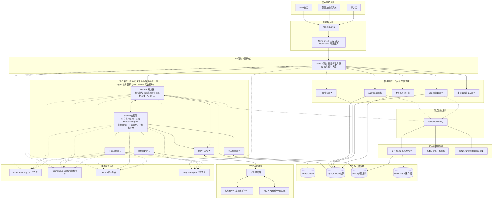

# Sunshine AI Platform

企业级 AI 中台 — 基于 AgentScope-Java + Spring Cloud Alibaba 的私有化智能体平台。

## 架构概览

```
Browser (Vue3 + Naive UI :5173)
  │
  ▼
Gateway (:8000, JWT + Sentinel) ──▶ BFF (:8001, SSE) ──▶ Orchestrator (:8200)
                                                          │
                    ┌─────────────────────────────────────┼─────────────────────┐
                    │                                     │                     │
              workflow / react / plan-workflow / peer-collab                    │
                    │                                     │                     │
                    ▼                                     ▼                     ▼
            LLM Gateway (:8300)                    RAG (:8400)           tool-manager (:8210)
            DeepSeek / Qwen                        Milvus + ES           skill-manager (:8225)
                                                                         expert-manager (:8235)
                    │                                     │               prompt-manager (:8500)
                    │                                     │
               Auth Center (:8100)                  finance / oa 模拟服务
               Sa-Token JWT
```

**执行模式**（`IntentRouter` → `ExecutionDispatcher`）：`auto` · `react` · `workflow` · `plan-workflow` · `peer-collab`（多专家协作）。Workflow Studio 见 `/workflows`，Prompt 运营见 `/prompts`；`simple-llm` 已移除。

## 技术栈

| 层 | 组件 | 版本 |
|---|------|------|
| **JDK** | OpenJDK | 21 LTS |
| **框架** | Spring Boot + Spring Cloud + Spring Cloud Alibaba | 3.2.9 / 2023.0.3 / 2023.0.3.4 |
| **Agent** | AgentScope-Java | 2.0（native-first，P0–P3 完成）|
| **认证** | Sa-Token（JWT + Redis） | 1.45.0 |
| **向量库** | Milvus + Elasticsearch | 2.6.16 |
| **消息队列** | Apache RocketMQ | 5.3.2 |
| **可观测** | SkyWalking · Micrometer · Prometheus · Grafana · Sentinel | 9.7.0 |
| **前端** | Vue 3 + TypeScript + Naive UI + Vite | — |

## 项目结构

```
my-sunshine-agent/
├── pom.xml                     # 父 POM（版本管控）
├── common/sunshine-common/     # 公共模块（R<T>、BizException、GlobalExceptionHandler）
├── gateway/         :8000      # Spring Cloud Gateway + Sentinel
├── bff/             :8001      # WebFlux + SSE 流式转发
├── auth-center/     :8100      # Sa-Token 认证中心
├── orchestrator/    :8200      # 核心编排（workflow / react / plan-workflow / peer-collab）+ Timeline + AgentRuntime
├── tool-manager/    :8210      # 业务 API → Agent Tool（Catalog 驱动）
├── skill-manager/   :8225      # Skills 上传 / 版本 / Catalog
├── expert-manager/  :8235      # Expert CRUD / Catalog（多专家协作）
├── llm-gateway/     :8300      # LLM 网关（多厂商路由 / 缓存 / 熔断）
├── rag-service/     :8400      # RAG 检索（Milvus + Hybrid + Rerank）
├── prompt-manager/  :8500      # 提示词管理
├── desensitize/     :8600      # 数据脱敏
├── oa-service/      :8700      # OA 模拟（用户隔离待办）
├── finance-service/ :8710      # 财务模拟（用户隔离报销）
├── hr-biz-service/  :8720      # 人事模拟（假期/考勤，app-id sunshine-hr）
├── sunshine-ui/     :5173      # 前端 WebUI（含 /biz-data 业务数据）
├── docker/                     # Docker Compose（中间件 + Prometheus/Grafana）
├── scripts/                    # Python 运维脚本（SSOT：scripts/*.py）
└── docs/                       # 设计文档（Nacos SSOT：docs/nacos/）
```

## 快速开始

### 1. 环境要求

- JDK 21、Maven 3.9+、Node.js 22+、Python 3.10+（运维脚本）
- 中间件已部署在 **ecs4c16g**（见下表）；业务配置 SSOT 在 `docs/nacos/`

**首次部署**：MySQL 执行 `CREATE DATABASE sunshine_auth;`，再同步 Nacos 并启动服务。

### 2. 编译

```bash
mvn clean package -DskipTests
cd sunshine-ui && npm install && npm run build
```

### 3. 配置与启动

```bash
pip install -r scripts/requirements.txt

# 同步 Nacos（改 docs/nacos/*.yaml 后必做）
python scripts/sync_nacos.py

# 按依赖顺序启动全链路（可选 SkyWalking agent）
python scripts/download_skywalking_agent.py   # 首次可选
python scripts/start.py

# 清会话（MySQL + Redis 生成流；可选重启 orchestrator）
python scripts/clear_session_cache.py --force --restart-orchestrator
```

### 4. 启动前端

```bash
cd sunshine-ui && npm run dev    # http://localhost:5173
```

SSE 默认经 Gateway `:8000`（`sunshine-ui` 环境变量 `VITE_BFF_STREAM_BASE`）。

### 5. 验收

```bash
# Workflow Studio + 动态 DAG + Prompt Catalog
python scripts/verify_workflow_studio_live.py
python scripts/verify_plan_dag_live.py
python scripts/verify_prompt_catalog_live.py

# RAG 评测（需先 MySQL 种子 + ingest）
python scripts/rag_reset.py
python scripts/rag_ingest_bulk.py
python scripts/rag_eval.py --ci   # corpus-50：sync 评测集 + sunshine-regression 门禁

# Orchestrator 关键单测
mvn test -pl orchestrator -Dtest=ExecutionPlanRouterTest,RoutingGoldenSetTest,WorkflowExecutorTest,ReactExecutorTest
```

#### 集成测试（Orchestrator）

默认 `mvn test` **排除** `@Tag("integration")`（无需外部中间件）：

```bash
mvn test -pl orchestrator -am "-Dtest=ConversationIntegrationTest,GenerationReconnectIntegrationTest" -q
mvn test -pl orchestrator -am "-Dgroups=integration" "-Dtest=ChatIntegrationTest" -q   # 需 :8300 live
```

## 前端页面

| 路由 | 功能 |
|------|------|
| `/chat` | 流式对话；底栏执行路径选择；静态 / Plan workflow 共用 Plan DAG 面板 |
| `/plans/:planId` | Plan 详情与节点 trace |
| `/knowledge` | 知识库工作台（文档/检索调试/参数/评测） |
| `/skills` | Skill 管理；版本 diff → `/skills/:skillId/diff` |
| `/experts` | Expert 管理；Chat `$` 补全 |
| `/tools` | 工具集成管理（SDK / MCP / 工具集 / 执行策略） |
| `/workflows` | Workflow Studio 可视化编辑 |
| `/prompts` | Prompt Catalog 运营（Catalog / dry-run / priority / rollback） |
| `/status` | 12 微服务 + 12 中间件状态矩阵 |

## 服务器中间件（ecs4c16g）

| 组件 | 端口 | 凭据 |
|------|------|------|
| Nacos | 8848/9848 | nacos / nacos |
| MySQL | 3306 | root / root123 |
| Redis | 6379 | redis123 |
| Milvus | 19530 | — |
| RocketMQ | 9876 | — |
| Elasticsearch | 9200 | — |
| SkyWalking OAP / UI | 11800 / 8084 | — |
| Prometheus | 9090 | — |
| Grafana | 3000 | admin / admin123 |
| Sentinel Dashboard | 8858 | sentinel / sentinel123 |

## 可观测

| 组件 | 访问地址 | 用途 |
|------|----------|------|
| Grafana | `http://ecs4c16g:3000` | RAG 指标面板 + 告警（admin / admin123） |
| Sentinel Dashboard | `http://ecs4c16g:8858` | 租户 QPS 限流（sentinel / sentinel123） |
| SkyWalking UI | `http://ecs4c16g:8084` | 全链路 trace |
| Prometheus | `http://ecs4c16g:9090` | 应用指标采集 |

## 环境变量

```bash
export DEEPSEEK_API_KEY=sk-xxx    # DeepSeek API Key
export QWEN_API_KEY=sk-xxx        # 通义千问（Embedding 复用）
```

## 实施阶段

| 阶段 | 状态 | 内容 |
|------|:--:|------|
| 阶段〇 | ✅ | 中间件 + 项目骨架 |
| 阶段一 | ✅ | LLM Gateway · ReActAgent · RAG · SSE · SkyWalking 探针 |
| 阶段二 | ✅ | 认证 · 财务/OA 工具链 · Workflow · Timeline V2 · 会话断点续传 |
| 阶段三 | ✅ | 多租户 · HITL · PLAN_WORKFLOW · AgentRuntime · Skill · 审计 · 可观测 |
| 阶段四 | ✅ 收口 | 动态 DAG · 多专家协作 · TaskBoard · Spawn · 沙箱 · Workflow Studio · 工具集成 · Prompt Catalog · **4.11 实施中** · 缺口见实现计划 |

进度 SSOT：[docs/implementation-plan.md](./docs/implementation-plan.md)

## 文档

| 文档 | 说明 |
|------|------|
| [implementation-plan.md](./docs/implementation-plan.md) | 分阶段任务卡与检查门 |
| [superpowers/specs/README.md](./docs/superpowers/specs/README.md) | 阶段一～五设计 SSOT 索引 |
| [tech-solution.md](./docs/tech-solution.md) | 架构设计与技术选型 |
| [CLAUDE.md](./CLAUDE.md) | 服务端口、扩展点、时间线约定 |
| [architecture/README.md](./docs/architecture/README.md) | 架构决策（ADR） |
| [routing/routing-golden-set.md](./docs/routing/routing-golden-set.md) | 意图路由验收集 |
| [sandbox/README.md](./docs/sandbox/README.md) | Skills 沙箱设计与验收索引 |
| [rag/README.md](./docs/rag/README.md) | RAG 知识库设计与评测索引 |
| [workflow/README.md](./docs/workflow/README.md) | Workflow 标杆维护 |
| [tech-debt-register.md](./docs/tech-debt-register.md) | 技术债 / 文档债 backlog |

