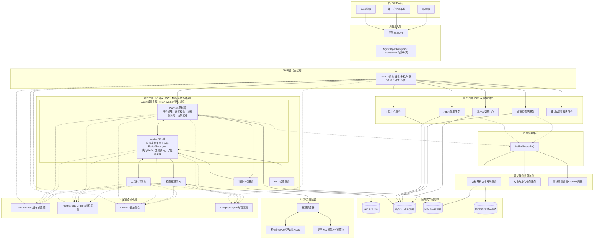

# Sunshine AI Platform

企业级 AI 中台 — 基于 AgentScope-Java + Spring Cloud Alibaba 的私有化智能体平台。

## 能力亮点

| 域 | 能力 |
|------|------|
| **执行路径** | 统一路由 `executionMode=fast\|pro\|workflow`：`fast` 单轮 ReAct（原生任务清单 + 跨轮任务板恢复）· `pro` Planner-Executor · `workflow` 静态 DAG 工作流；Chat 底栏显式选路 |
| **Planner-Executor** | Planner 以单一 ReAct 循环边规划边执行；Worker 并行派发（独立 sessionId 流式、失败分类 + 重试上限），PlanNotebook + Redis 单写 + 显式触发重规划；`await_tool_run` 异步工具批量收集 |
| **多智能体协作** | `spawn_subagent` 上下文隔离子 Agent（支持单独取消）；指定 `agentId` 复用预定义智能体，INTERNAL/EXTERNAL（A2A）经 `AgentExecutorRouter` 统一分派；`request_decision` 交互式决策卡（暂停/续跑同问卷 re-await） |
| **软规划** | ReAct 原生 TaskBoard（`todo_write`），终态落 MySQL 审计；pro 终态导出 KV Memory，任务清单跨轮/跨会话恢复 |
| **上下文工程** | L1/L2/L3 五层渐进压缩 + 压缩点模式（Tier 前缀稳定、按 kind 分化）· KV Memory（user/workspace 双 scope）· `session_search`（session\|workspace）· 业务上下文权威层（Policy / 业务任务 / 场景偏好 + 冲突仲裁）· 账本→视图重建校验 |
| **Skill 体系** | 可发现 ≠ 触发：目录名+描述常驻，触发集正文经尾部 USER 信封注入（守前缀稳定）；跨轮 sticky、`sunshine_search_skills` 运行中动态加载、沙箱物料挂载；子 agent（spawn / workflow 节点 / worker）统一「加载技能」时间线步骤 + 完整正文 |
| **Workflow Studio** | 可视化编辑/发布（`/workflows`）：并行 · exclusive 条件边 · loop · 结构化 I/O（变量赋值 + 参数提取 TypedValue）· 版本 diff；定义唯一存于 workflow-manager MySQL |
| **工具体系** | `@SunshineTool` SDK + MCP 双通道注册，Catalog ID 统一寻址；工具语义检索（Milvus 索引每轮 Top-K 注入）；HITL 二次确认；沙箱工具（exec/grep/glob）取消语义 + 同命令重试禁绝 |
| **RAG** | Milvus + ES 混合检索 + Rerank，Query 改写收敛于 rag-service 检索管道；`(tenant,kb)` 配置版本生命周期（draft→评测→active）；corpus-50 评测集 + CI 门禁 |
| **模型层** | 模型注册表（MySQL SSOT，API Key AES 加密）· `call_site` 多模型场景路由（`model=auto` 按调用点选路）· 语义缓存 + 熔断 · 用量计量（token 落库 + 日聚合 + 成本估算）+ 租户配额 429 |
| **平台工程** | 多租户隔离 · Sa-Token 统一认证 · SSE 断点续传（Redis 缓冲 + seq）· 审计链路（RocketMQ → MySQL/ES）· SkyWalking + Prometheus + Grafana + Sentinel 全栈可观测 · orchestrator 物理无状态 |
| **过程时间线** | SSE 流式时间线（intent → think → tasks → tool → generate）：子 Agent/Worker 抽屉、TaskBoard 面板、决策卡、加载技能步骤、Usage 状态栏（轮次/输入输出/上下文），前端零话术硬编码 |

## 架构概览

```
Browser (Vue3 + Naive UI :5173)
   │
   ▼
Gateway (:8000, Sa-Token JWT + Sentinel) ──▶ BFF (:8001, SSE 透传) ──▶ Orchestrator (:8200)
                                                                        │
        ┌──────────────┬────────────────┬────────────────┬──────────────┼───────────────┐
        ▼              ▼                ▼                ▼              ▼               ▼
  LLM Gateway      RAG (:8400)     Tool Service     Workflow Mgr     Sandbox        Resource Manager
   (:8300)         Milvus + ES       (:8210)         (:8230)        (:8226)             (:8240)
 多厂商路由/       Hybrid+Rerank   SDK + MCP       DAG 定义/版本   沙箱执行        Skill/Agent/Prompt
 缓存/熔断                                           执行           工具取消        Catalog 统一托管

        Auth Center (:8100, Sa-Token)  ·  Biz Simulator (:8700, OA / Finance / HR 业务模拟)
```

**编排链路**：`ChatController` → `IntentRouter` → `ExecutionDispatcher`（`fast` ReAct / `pro` Planner-Executor / `workflow` 静态 DAG）→ `AgentRuntime.run(AgentRunRequest)` → `GenerationJob`（Redis 缓冲 + seq）→ BFF/Gateway SSE 透传 → 前端时间线。多智能体协作（spawn / decision / A2A）是 ReAct 内的元工具能力；提示词与路由规则统一由 Catalog（resource-manager `/prompts`）驱动，orchestrator/前端不硬编码。

## 技术栈

| 层 | 组件 | 版本 |
|---|------|------|
| **JDK** | OpenJDK | 21 LTS |
| **框架** | Spring Boot + Spring Cloud + Spring Cloud Alibaba | 3.2.9 / 2023.0.3 / 2023.0.3.4 |
| **Agent** | AgentScope-Java | 2.0（native-first）|
| **认证** | Sa-Token（JWT + Redis） | 1.45.0 |
| **向量库** | Milvus + Elasticsearch | 2.6.x / 7.17 |
| **消息队列** | Apache RocketMQ | 5.3.2 |
| **可观测** | SkyWalking · Micrometer · Prometheus · Grafana · Sentinel | 9.7.0 |
| **前端** | Vue 3 + TypeScript + Naive UI + Vite | — |

## 项目结构

```
my-sunshine-agent/
├── pom.xml                       # 父 POM（版本管控）
├── common/sunshine-common/       # 公共模块（R<T>、BizException、GlobalExceptionHandler）
├── common/sunshine-tool-sdk/     # 工具 SDK（@SunshineTool 声明 → Nacos 注册）
├── common/sunshine-routing/      # 路由共享组件
├── gateway/           :8000      # Spring Cloud Gateway + Sentinel
├── bff/               :8001      # WebFlux + SSE 流式转发
├── auth-center/       :8100      # Sa-Token 认证中心
├── orchestrator/      :8200      # 核心编排（react / planner-executor / workflow / 多智能体）+ Timeline + AgentRuntime
├── tool-service/      :8210      # 工具注册与调用（SDK + MCP，Catalog 驱动）
├── sandbox-service/   :8226      # 沙箱执行环境（Codex 工作区）
├── workflow-manager/  :8230      # Workflow 定义 / 版本 / 执行（DB SSOT）
├── resource-manager/  :8240      # 聚合管理（Skill / Agent / Prompt / Desensitize Catalog）
├── llm-gateway/       :8300      # LLM 网关（多厂商路由 / 缓存 / 熔断 / 用量采集）
├── rag-service/       :8400      # RAG 检索（Milvus + Hybrid + Rerank + Query 改写）
├── biz-simulator/     :8700      # 业务模拟聚合（OA / Finance / HR）
├── sunshine-ui/       :5173      # 前端 WebUI
├── docker/                       # Docker Compose（中间件 + Prometheus/Grafana/SkyWalking）
├── scripts/                      # Python 运维脚本（SSOT：scripts/*.py）
└── docs/                         # 设计文档（Nacos SSOT：docs/nacos/）
```

## 快速开始

### 1. 环境要求

- JDK 21、Maven 3.9+、Node.js 22+、Python 3.10+（运维脚本）
- 中间件已部署在 **ecs4c16g**（见下表）；业务配置 SSOT 在 `docs/nacos/`

**首次部署**：MySQL 执行 `CREATE DATABASE sunshine_auth;`，再同步 Nacos 并启动服务。

### 2. 编译

```bash
mvn clean package -DskipTests
cd sunshine-ui && npm install && npm run build   # 生产构建设 VITE_BFF_STREAM_BASE
```

### 3. 配置与启动

```bash
pip install -r scripts/requirements.txt

# 同步 Nacos（改 docs/nacos/*.yaml 后必做）
python scripts/sync_nacos.py

# 按依赖顺序启动全链路（可选 SkyWalking agent）
python scripts/download_skywalking_agent.py   # 首次可选
python scripts/start.py

# 服务为独立进程（setsid 守护），脚本启动即退出，不随脚本/终端关闭；停服用 --stop
python scripts/start.py --restart             # 打包并重启全链路
python scripts/start.py --restart bff         # 打包并重启指定服务
python scripts/start.py --stop                # 停止全链路

# 凭据 env 经项目根 .env 注入（gitignore 忽略）：MODEL_AES_KEY 缺失时 llm-gateway/resource-manager 启动 fail-fast

# 清会话（MySQL + Redis 生成流；可选重启 orchestrator）
python scripts/clear_session_cache.py --force --restart-orchestrator
```

### 4. 启动前端

```bash
cd sunshine-ui && npm run dev    # http://localhost:5173
```

SSE 默认经 Gateway `:8000`（`sunshine-ui` 环境变量 `VITE_BFF_STREAM_BASE`）。

### 5. 验收

`scripts/verify_*_live.py` 为各能力的 live 验收脚本（SSOT 清单见 [CLAUDE.md](./CLAUDE.md) §运维脚本），代表：

```bash
# 路由 / Planner-Executor / Skill
python scripts/verify_routing_v6_smoke.py
python scripts/verify_planner_executor_live.py --suite all
python scripts/verify_skill_sticky_live.py

# Workflow Studio + 动态 DAG + Prompt Catalog
python scripts/verify_workflow_studio_live.py
python scripts/verify_plan_dag_live.py
python scripts/verify_prompt_catalog_live.py

# 上下文压缩 / 记忆
python scripts/verify_context_rebuild.py
python scripts/verify_l3_enhancement_live.py

# RAG 评测（需先 MySQL 种子 + ingest）
python scripts/rag_reset.py
python scripts/rag_ingest_bulk.py
python scripts/rag_eval.py --ci   # corpus-50：sync 评测集 + sunshine-regression 门禁

# 模型路由 / 工具检索 / 用量
python scripts/verify_model_route_live.py
python scripts/verify_tool_retrieval_live.py
```

#### 集成测试（Orchestrator）

默认 `mvn test` **排除** `@Tag("integration")`（无需外部中间件）：

```bash
mvn test -pl orchestrator -am "-Dtest=ConversationIntegrationTest,GenerationReconnectIntegrationTest" -q
mvn test -pl orchestrator -am "-Dgroups=integration" "-Dtest=ChatIntegrationTest" -q   # 需 :8300 live
```

## 前端页面

| 路由 | 功能 |
|------|------|
| `/chat` | 流式对话；执行路径选择（fast/pro/workflow）；时间线 + 子 Agent/Worker 抽屉 + TaskBoard + 决策卡 + Usage 状态栏 |
| `/knowledge` | 知识库工作台（文档/检索调试/参数/评测） |
| `/skills` | Skill 管理；版本 diff → `/skills/:skillId/diff` |
| `/agents` | Agent 管理（含 A2A 外部智能体）；Chat `$` 补全 |
| `/tools` | 工具集成管理（SDK / MCP / 工具集 / 执行策略） |
| `/workflows` | Workflow Studio 可视化编辑；版本 diff |
| `/prompts` | Prompt Catalog 运营（Catalog / dry-run / priority / rollback） |
| `/models` | 模型注册表（供应商 / 模型 / 路由策略） |
| `/context` | 上下文与记忆观测 |
| `/biz-scenes` | 业务场景 Lab（Policy / 偏好 / 场景双轨） |
| `/workspaces` | 工作区管理（沙箱 Codex 工作区） |
| `/biz-data` | 业务数据（OA / Finance / HR 模拟） |
| `/ops` | 用量与配额（token 日聚合 / 成本估算 / 租户配额） |
| `/status` | 微服务 + 中间件状态矩阵 |

## 服务器中间件（ecs4c16g）

| 组件 | 端口 | 凭据 |
|------|------|------|
| Nacos | 8848/9848 | nacos / nacos |
| MySQL | 3306 | root / root123 |
| Redis | 6379 | redis123 |
| Milvus | 19530 | — |
| RocketMQ | 9876 | — |
| Elasticsearch | 9200 | — |
| SkyWalking OAP / UI | 11800 / 8084 | — |
| Prometheus | 9090 | — |
| Grafana | 3000 | admin / admin123 |
| Sentinel Dashboard | 8858 | sentinel / sentinel123 |

## 可观测

| 组件 | 访问地址 | 用途 |
|------|----------|------|
| Grafana | `http://ecs4c16g:3000` | RAG 指标面板 + 告警（admin / admin123） |
| Sentinel Dashboard | `http://ecs4c16g:8858` | 租户 QPS 限流（sentinel / sentinel123） |
| SkyWalking UI | `http://ecs4c16g:8084` | 全链路 trace（traceId 贯穿网关→编排→模型） |
| Prometheus | `http://ecs4c16g:9090` | 应用指标采集 |

## 环境变量

```bash
export DEEPSEEK_API_KEY=sk-xxx    # DeepSeek API Key
export QWEN_API_KEY=sk-xxx        # 通义千问（Embedding 复用）
```

分阶段实施计划与验收门：[docs/implementation-plan.md](./docs/implementation-plan.md)

## 文档

| 文档 | 说明 |
|------|------|
| [implementation-plan.md](./docs/implementation-plan.md) | 分阶段任务卡与检查门 |
| [superpowers/specs/README.md](./docs/superpowers/specs/README.md) | 阶段一～五设计 SSOT 索引 |
| [tech-solution.md](./docs/tech-solution.md) | 架构设计与技术选型 |
| [CLAUDE.md](./CLAUDE.md) | 服务端口、扩展点、时间线约定 |
| [architecture/README.md](./docs/architecture/README.md) | 架构决策（ADR） |
| [routing/routing-golden-set.md](./docs/routing/routing-golden-set.md) | 意图路由验收集 |
| [sandbox/README.md](./docs/sandbox/README.md) | Skills 沙箱设计与验收索引 |
| [rag/README.md](./docs/rag/README.md) | RAG 知识库设计与评测索引 |
| [workflow/README.md](./docs/workflow/README.md) | Workflow 标杆维护 |
| [tech-debt-register.md](./docs/tech-debt-register.md) | 技术债 / 文档债 backlog |

## 架构蓝图（目标态）


