# 阶段三：多 Agent / Skills — 实施计划

> **SSOT 设计：** [phase3-production-hardening-design.md](../specs/phase3-production-hardening-design.md)  
> **历史详设：** [2026-06-19-multi-agent-architecture-design.md](../specs/2026-06-19-multi-agent-architecture-design.md)  
> **总排期：** 见 [phase3-production-hardening.md](./2026-06-19-phase3-production-hardening.md)（与 3.4 RAG 周级并行）

> **For agentic workers:** REQUIRED SUB-SKILL: Use superpowers:subagent-driven-development（推荐）或 superpowers:executing-plans。  
> **覆盖度：** 见 [2026-06-20-phased-implementation-coverage.md](./2026-06-20-phased-implementation-coverage.md)

**Goal:** L1 增强（skill 子集）→ L3 主轴（PLAN_WORKFLOW + 多子 Agent）。

**实现状态（2026-06-24）：** **3.10.1–3.10.7 ✅** · **3.11.1–3.11.7 ✅** · **3.12.1–3.12.4 ✅** · **Skill 六种触发 ✅**（Live 点验 ⬜）· **3.9.1–3.9.4 ✅** · **静态 workflow → Plan DAG ✅** · **3.8.7 ✅** · **3.6 tool.call ✅**。下一迭代：**3.7 Grounding** / **3.2–3.5 平台化**。

---

## 子 Agent 实现目标（SSOT）

> 详设 §7 / §13 决策 #7；与 [locked-architecture-decisions](../specs/2026-06-19-locked-architecture-decisions.md) 一致。  
> **模式**：编排器-Worker（Orchestrator-Worker），非 MsgHub 自由对话式多 Agent。

### 定位

子 Agent 是 **受界委派单元（Worker）**：在单一 workflow `agent` 节点 / skill 范围内完成 ReAct，产出中间结论；**默认不面向用户**。调度权在 **Workflow / Planner 引擎**，不在子 Agent LLM。

### 输入（由编排层显式传入，非子 Agent 自取）

| 字段 | 来源 | 说明 |
|------|------|------|
| `query` | 节点 `params.query` 或 `{{start.userQuery}}` | 本子任务要问什么 |
| `context` → `injectedBlocks` | 上游节点模板，如 `{{finance-list.output}}` | 本子任务所需材料（**唯一默认上下文**） |
| `skill` | 节点 params / 3.11 Catalog | skill overlay（正文） |
| `tools` | 节点 params | 工具白名单（**仅编排层**，与 Skill 包无关） |
| `systemOverlay` | 节点 params | 本节点任务约束（叠加在 base + skill 之上） |
| `maxIters` | 节点 params，默认 **4** | 子任务迭代上限 |

**记忆（目标态，3.10.7）**：子 Agent **不**注入完整 LTM/MTM/STM；仅 `injectedBlocks` + 节点 `query`。编排层（`AgentNodeHandler`）传 `MemoryContext.injectedOnly(...)`，**禁止**默认传 `streamCtx.memory()` 全量会话。

### 系统提示词（分层叠加，非独立人格）

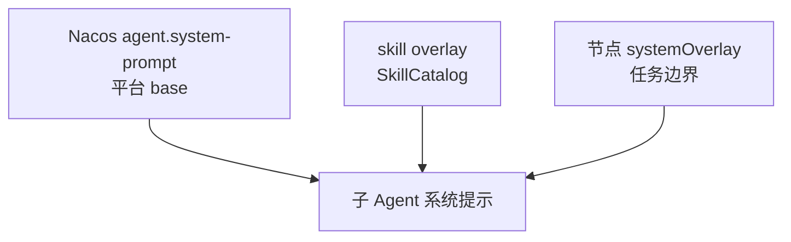

用户可见话术与礼貌用语由下游 **`answer` 节点** 的 `params.prompt` 负责，**不**放在子 Agent system prompt。

### 输出与 Timeline

| 维度 | 目标 |
|------|------|
| 结构化输出 | `AgentNodeOutput.answer` → `WorkflowContext`，供 `{{node-id.answer}}` |
| 主 Timeline SSE | 仅 `node-{id}` 一步 + `summary.after`；内部 think/tool **不上主 SSE** |
| Hook / Bridge | SUB 用 `sub-{runId}`，不绑定 `assistantMsgId` |
| reasoning | **不写回**主 `chat_message.reasoning`；不污染 STM（3.10.6 审计落 ES） |
| 用户正文 | 由下游 **answer** 节点流式合成（reasoning → 步骤 detail；content → 消息区） |

### 实现状态对照（2026-06-22）

| 目标项 | 状态 | 代码 / 任务 |
|--------|:----:|-------------|
| `AgentRuntime` MAIN/SUB | ✅ | 3.10.1 |
| 工具白名单 + `systemOverlay` | ✅ | 3.10.2；`ReActAgentFactory` |
| 节点 params 解析 | ✅ | 3.10.3；`AgentNodeHandler` + `finance-smart` |
| Timeline / Bridge 隔离 | ✅ | `WorkflowExecutor` 仅发 `node-{id}`；`sub-{runId}` bridge |
| skill overlay 进 PromptComposer | ✅ | 3.10.7c；SkillCatalog + `ReActAgentRuntime` |
| 记忆裁剪（无 STM/LTM） | ✅ | 3.10.7；`MemoryContext.forSubAgent()` + Handler/Runtime 双保险 |
| `sub_agent_run` 审计 | ✅ | 3.10.6 |

---

## Skills 最终方案（SSOT）

> **原则**：Skill 不做类型分类；**目录只给摘要，正文按需加载**；由**编排层**决定用哪个 skill，Agent 不会自己从 Catalog 里乱选。

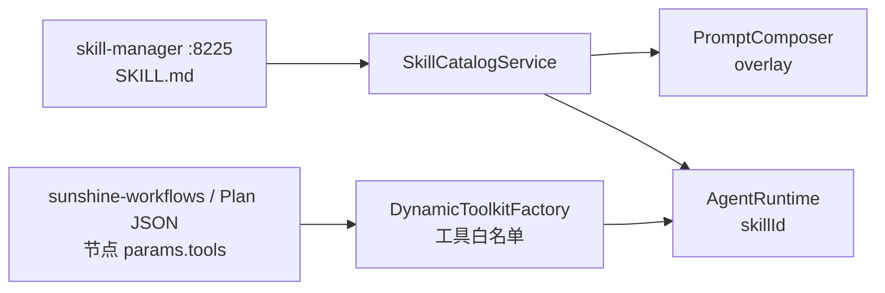

---

### 一、Skill 是什么

标准 **Agent Skills**（Cursor 兼容）：每个 Skill 一个 `SKILL.md`。

| 部分 | 内容 |
|------|------|
| **头部元数据** | `name`、`description`（Cursor 官方标准） |
| **正文** | 领域指令、**操作步骤**、约束（流程说明写在这里） |
| **编排层** | 工具白名单、`maxIters` 等由 workflow 节点 params 配置，**不写入 SKILL.md** |

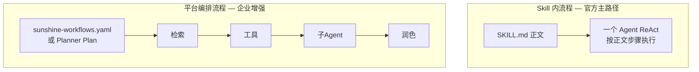

官方 **「动态工作流」** = 平时只见 Skill **描述** → 任务相关时 **加载正文** → Agent **按正文执行**（左图）。**不是**把 Skill 自动展开成右图的多节点 DAG。

---

### 二、Skill 怎么加载（动态披露）

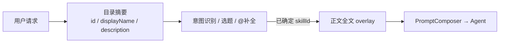

| 阶段 | 加载什么 | 禁止 |
|------|----------|------|
| **目录摘要** | id、displayName（DB）、一行 description | 正文全文 |
| **正文全文** | `SKILL.md` 正文 | 在意图识别前批量加载 |

**3.11.6 ✅**：`GET /api/skills/catalog/index`（摘要）+ `GET /api/skills/{id}/catalog`（含 overlay 正文）。

---

### 三、六种 Skill 触发流程

按 **优先级从高到低**。六种流程关系：

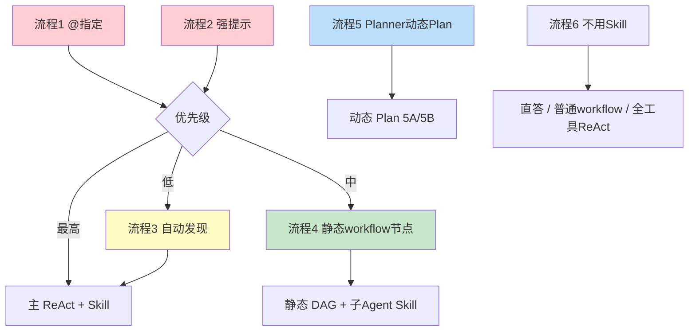

---

#### 流程 1：用户 `@` 指定 Skill（优先级最高）✅ 3.11.7

**示例**：`@finance-analysis 这笔报销是否合规？`

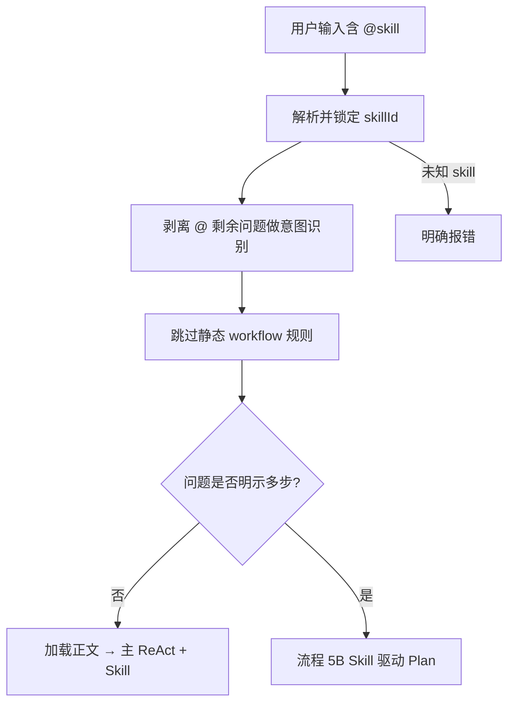

---

#### 流程 2：强提示「请使用 xxx skill 处理」✅ 3.11.7

**示例**：`请使用 finance-analysis skill 处理待审批单据`

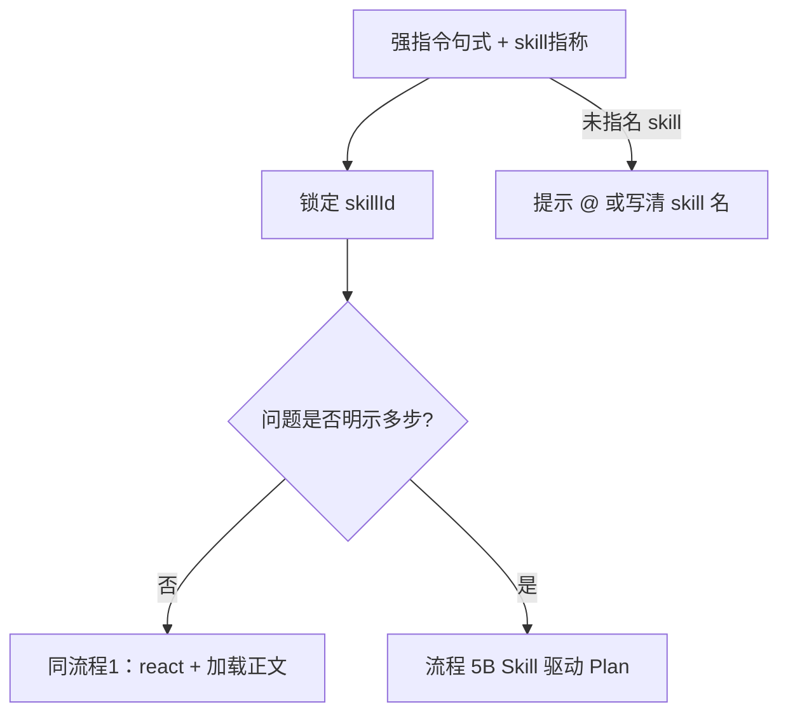

---

#### 流程 3：系统自动发现 Skill ✅ 3.10.4 / SkillDiscoveryService

**示例**：`帮我做一笔报销的合规分析`（无 @）

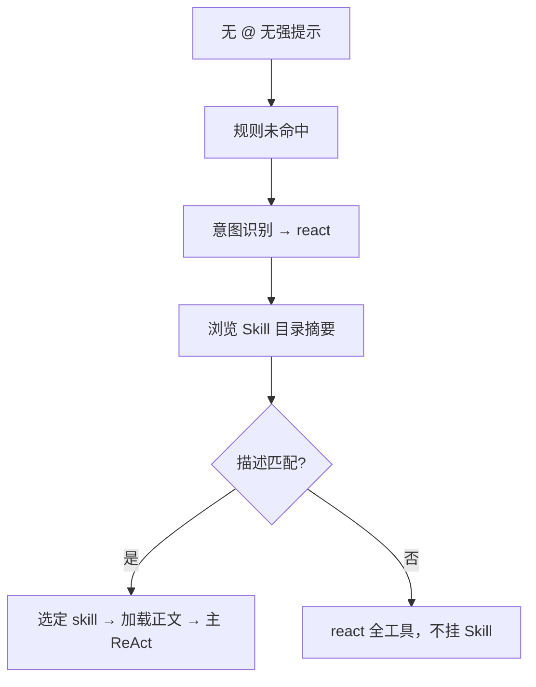

---

#### 流程 4：静态 workflow 节点已绑 Skill ✅

**示例**：`这笔报销是否合规` → finance-smart

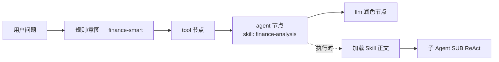

---

#### 流程 5：动态 Plan 与 Skill（两种子模式）⬜ 3.9

动态 Plan **分两种**，都产出 Plan JSON，但 **Skill 参与方式不同**：

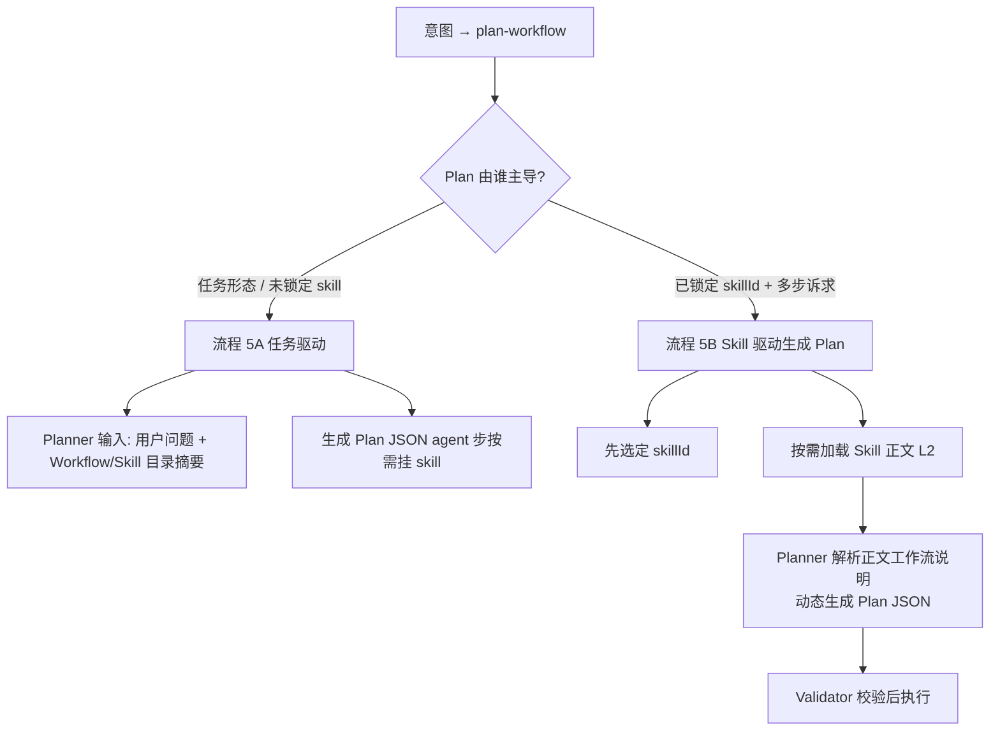

---

##### 流程 5A：任务驱动 Plan（Planner 拼 DAG，Skill 仅挂步）✅ 3.9

**示例**：`对照制度、拉待办、做合规分析，最后友好答复`（无 @）

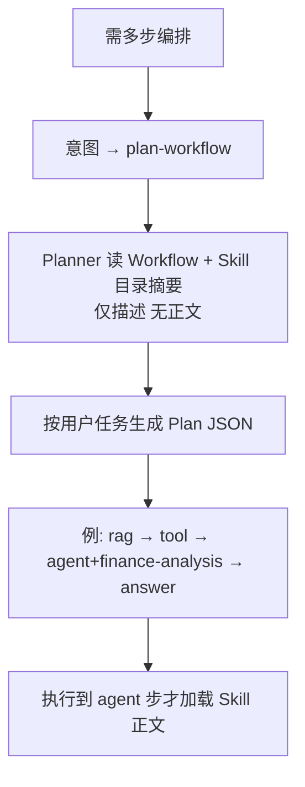

**要点**：DAG **形状由用户问题决定**；Skill 只是 Planner 在 agent 步上 **选配** 的能力包。

---

##### 流程 5B：Skill 驱动生成 Plan JSON ✅ 3.10.4b（L0 多步 + Planner 读 L2）

**有这条流程**，但 **尚未实现**。适用于：用户已锁定 skillId，且 **Skill 正文（标准 SKILL.md）** 描述了跨节点的平台编排步骤（如「先检索制度 → 拉待办 → 子 Agent 分析 → 润色答复」）。

**原则（与标准 Skills 解耦）**：

- **不修改** skill-manager / SKILL.md 标准实现（仍仅 `name` + `description` + 正文）。
- **不在 Skill 包内** 增加 `plan-template.json`、frontmatter 工作流字段等扩展。
- Plan 由 **编排层 Planner** 读取正文后 **语义理解 + 动态生成** Plan JSON，而非对 Markdown 做机械 DAG 解析。

**触发条件**（满足其一）：

| 条件 | 示例 |
|------|------|
| `@skill` + 问题 **明示多步** | `@finance-analysis 先查制度再拉待办再分析再润色` |
| 意图已为 plan-workflow 且 **已选定主 skill** | 自动发现/强提示锁定 skill + 多步诉求 |

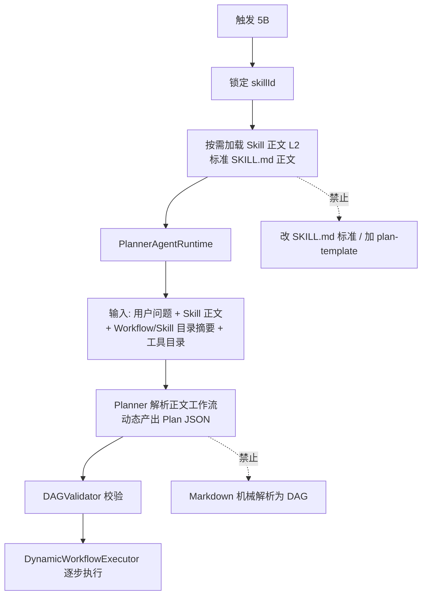

**与 5A 的区别**：

| | **5A 任务驱动** | **5B Skill 驱动** |
|--|----------------|-------------------|
| Plan 主输入 | **用户问题** + 目录摘要 | **用户问题** + **Skill 正文（L2）** |
| Skill 角色 | 拼完 Plan 后挂到 agent 步 | 正文中的步骤说明 **引导** Planner 生成节点与顺序 |
| 何时加载正文 | agent 步 **执行前** | 生成 Plan **之前**（仅 L2 正文） |
| 与 `@skill` | 无 @ 时典型 | `@skill` + 多步诉求时典型 |
| 标准 Skills | 不变 | **不变**（Planner 在编排层解析） |

**边界（SSOT）**：

- ✅ **标准 Skill 包不动**；Planner **读 L2 正文** → **理解工作流** → **生成** Plan JSON → Validator 执行  
- ❌ 为 Plan 扩展 SKILL.md frontmatter、skill 包内模板文件、或 Markdown **直接机械解析** 成 DAG  
- 单 Agent 能完成的 Skill 内流程 → 仍走 **流程 1～3**，**不** 生成 Plan JSON

**与流程 1 的 `@` 规则**：

```mermaid
flowchart TD
  AT[@ 指定 skill] --> Q{用户问题是否明示多步?}
  Q -->|否| F1[流程 1 主 ReAct + Skill]
  Q -->|是| F5B[流程 5B Skill 驱动 Plan]
```

---

#### 流程 6：不使用 Skill ✅

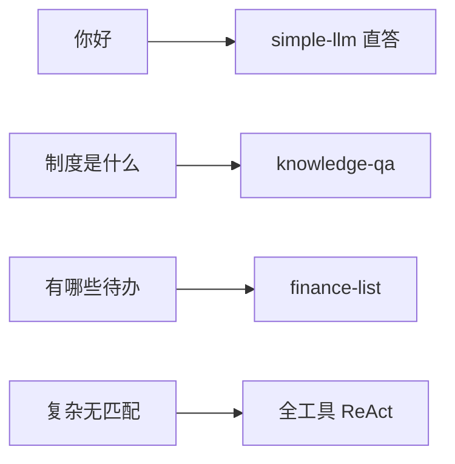

---

### 四、总决策流程

```mermaid
flowchart TD
  START[用户输入] --> AT{@ 或强提示<br/>指定 skill?}
  AT -->|是| MULTI{@ + 明示多步?}
  MULTI -->|是| F5B
  MULTI -->|否| F12[流程 1 或 2<br/>主 ReAct + Skill]
  AT -->|否| WF{命中静态 workflow?}
  WF -->|是| F4[流程 4<br/>静态 DAG 节点绑 Skill]
  WF -->|否| PLAN{需要多步平台编排?}
  PLAN -->|是| F5{Skill 驱动<br/>还是任务驱动?}
  F5 -->|任务主导| F5A[流程 5A]
  F5 -->|@skill+多步<br/>或已锁定主 skill| F5B[流程 5B Skill 正文→Plan JSON]
  F5 -->|默认| F5A
  PLAN -->|否| F36[流程 3 自动发现<br/>或 流程 6 不用 Skill]
  F12 --> LOAD[加载 Skill 正文 overlay]
  F4 --> EXEC4[静态 DAG<br/>agent 步执行时再加载正文]
  F5A --> PLAN5A[Planner 5A 生成 Plan<br/>agent 步执行时再加载正文]
  F5B --> LOAD5B[加载 L2 正文] --> PLAN5B[Planner 5B 解析→Plan]
  PLAN5A --> EXEC5[DynamicWorkflowExecutor]
  PLAN5B --> EXEC5
  F36 --> LOAD2{本路径需要 Skill?}
  LOAD2 -->|是| LOAD
  LOAD2 -->|否| RUN[Agent / 直答 执行]
  LOAD --> RUN
  EXEC4 --> RUN
  EXEC5 --> RUN
```

---

### 五、三种执行方式与 Skill 的关系

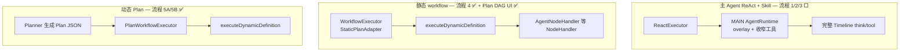

| | 主 ReAct + Skill | 5A 任务驱动 Plan | 5B Skill 驱动 Plan |
|--|-----------------|-------------------|-------------------|
| 适用 | 单 Agent + Skill 正文能做完 | 多步，由**问题**定 DAG | 多步，Planner **解析 Skill 正文** 引导 DAG |
| Skill 个数 | 通常 1 个 | agent 步可挂 0~N 个 | 通常 1 个主 skill 驱动 |
| 谁选/生成 Plan | — | Planner 看任务 + 摘要 | Planner **解析 Skill 正文** 动态生成 |

---

### 六、场景速查表

| 用户怎么说 | 触发流程 | 最终执行 |
|------------|----------|----------|
| `@finance-analysis 是否合规` | **1** | 主 ReAct + Skill |
| `请使用 finance-analysis skill 处理…` | **2** | 主 ReAct + Skill |
| `@finance-analysis …`（否则走 finance-smart） | **1** 压过静态 | 主 ReAct，**不走** finance-smart |
| `是否合规`（无 @，命中规则） | **4** | finance-smart 静态 DAG |
| `帮我做合规分析` | **3** | 主 ReAct + Skill（若匹配） |
| `先查制度再拉待办再分析再润色` | **5A** | Planner 按任务拼 Plan |
| `@finance-analysis 先查制度再…再润色` | **5B** | Planner 读 Skill 正文，解析工作流后生成 Plan JSON |
| `请使用 skill 处理`（未指名） | **失败** | 提示 @ 或写清 skill 名 |
| `你好` / `制度是什么` / `有哪些待办` | **6** | 无 Skill |

---

### 七、Skill 加载后运行时做什么

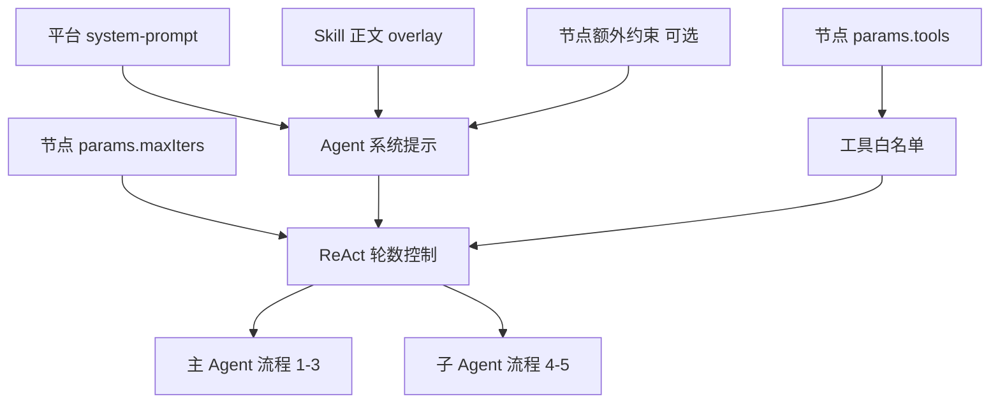

| 运行角色 | 入口 | 状态 |
|----------|------|:----:|
| **主 Agent** | `ReactExecutor` | ✅ skillId 贯通（含自动发现） |
| **子 Agent** | `AgentNodeHandler` | ✅ 不传完整会话记忆 |

---

### 八、产品原则与演进

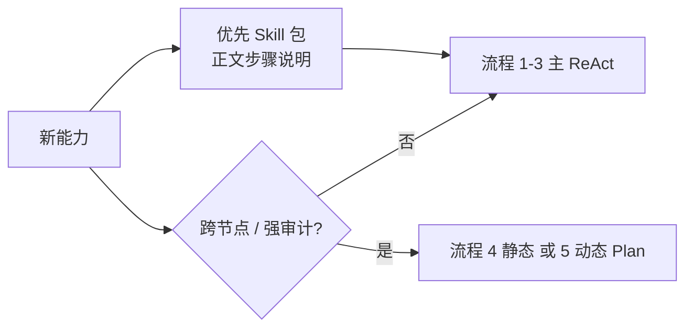

1. **默认**：新能力 → Skill 包 → 流程 1～3。  
2. **补充**：跨节点、强审计 → 流程 4（静态）或 **5A/5B**（动态 Plan）。  
3. **5B 明确存在**：**标准 Skill 正文不变**；Planner **解析正文工作流** → 动态生成 Plan JSON（⬜ 待实现），**不是**改 SKILL.md 标准、也不是 Markdown 机械解析。  
4. **单步 @skill**：仍走流程 1；**@skill + 多步** → 流程 5B。

---

### 九、实现状态

```mermaid
flowchart LR
  subgraph done [✅ 已落地]
    D1[skill-manager]
    D2[静态 workflow 绑 skill]
    D3[子 Agent overlay]
    D4[展开 detail]
    D5[Catalog 摘要/详情拆分 3.11.6]
  end
  subgraph todo [⬜ 待做 / Live]
    T6[5B / 自动发现 Live 点验]
  end
  subgraph done2 [✅ Skill 六种触发]
    T2[@ + 强提示 3.11.7]
    T3[自动发现 3.10.4]
    T4[5A 任务驱动 Plan 3.9]
    T5[5B Skill→Plan 3.10.4b]
  end
```

| 能力 | 触发流程 | 状态 |
|------|----------|:----:|
| skill-manager + SKILL.md | 全部 | ✅ |
| 静态 workflow agent 绑 skill | 4 | ✅ |
| PromptComposer / 子 Agent overlay | 4 | ✅ |
| 展开 detail「已加载技能：」 | 4 | ✅ |
| Catalog 摘要与详情拆分 | 加载 | ✅ 3.11.6 |
| `@` + 强提示解析（含多步→5B） | 1、2、5B | ✅ 3.11.7 |
| Chat `@` 补全 | 1 | ✅ 3.11.7 |
| 自动发现 + 主 ReAct 贯通 | 3 | ✅ SkillDiscoveryService |
| Intent / Planner 注入 Skill 目录摘要 | 5A、5B | ✅ PlanCatalogRenderer |
| 5A 任务驱动 Planner | 5A | ✅ 3.9 |
| 5B Skill 驱动 Planner（读 L2 正文→Plan JSON） | 5B | ✅ 3.10.4b（Live 点验 ⬜） |

---

**排期偏差：** 原周 1–2 应与 3.4 并行启动 3.10.1–3.10.3；RAG 已提前完成。**当前推荐路径（2026-06-22）：**

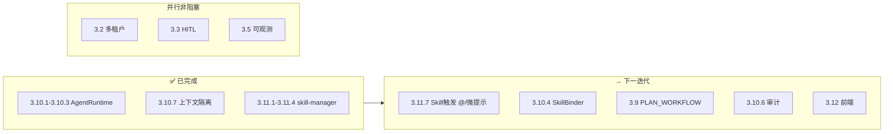

**Architecture:** `AgentRuntime` 统一 MAIN/SUB/PLANNER；Planner 产出 Plan JSON；`skill-manager` Catalog 驱动 **overlay**；**工具白名单** 由 workflow / Plan JSON 节点 `params.tools` 配置。

**Tech Stack:** JDK 21, AgentScope-Java 1.0.7, Spring Boot, Vue3, MySQL Flyway

**SSOT 设计:** [phase3-production-hardening-design.md](../specs/phase3-production-hardening-design.md)  

---

## 编号对照（旧 → 新）

| 旧编号 | 新编号 | 说明 |
|--------|--------|------|
| M1 | **3.10.1** | AgentRuntime |
| M2 | **3.10.2** | 工具白名单 + overlay | ✅ |
| M3 | **3.10.3** | AgentNodeHandler params | ✅ |
| M4 | **3.10.4** | PlannerAgentRuntime |
| M5 | **3.9.1–3.9.4** + **3.10.5** | PLAN_WORKFLOW 落库/API + DynamicExecutor |
| M6 | **3.10.6**（审计汇总见 **3.6**） | sub_agent_run |
| M7 | **3.10.7** | 记忆隔离 + Prompt 贯通 | ✅ |
| S1 | **3.11.1–3.11.3** | skill-manager 服务 |
| S2 | **3.11.4** | SkillCatalogService |
| S3 | **3.12.1–3.12.3** | `/skills` UI |
| — | **3.12.4** | Plan 详情页 |
| M8–M12 | **4.7.1–4.7.4** | 阶段四 |

---

## 排期（嵌入阶段三 8 周）

```
周 1    3.10.1 AgentRuntime
周 2    3.10.2–3.10.3 子 Agent 子集 + workflow skill 节点
周 3    3.11.1–3.11.4 skill-manager（阻塞 3.9）
周 6    3.10.4 + 3.9.1–3.9.4 + 3.10.5 PLAN_WORKFLOW
周 7    3.10.6 + 3.6 审计（sub_agent / plan.*）
周 8    3.10.7 + 3.12.1–3.12.4 前端
```

---

## 3.10 多 Agent 运行时

### 3.10.1 AgentRuntime 抽象

**Files:**
- Create: `orchestrator/.../agent/runtime/AgentRole.java`
- Create: `orchestrator/.../agent/runtime/AgentRunRequest.java`
- Create: `orchestrator/.../agent/runtime/AgentRuntime.java`
- Create: `orchestrator/.../agent/runtime/ReActAgentRuntime.java`
- Modify: `ReactExecutor` / `AgentNodeHandler` — 直接注入 `AgentRuntime`（已删除 `SunshineAgent` 门面）

- [x] **3.10.1a** 定义 `MAIN | SUB | PLANNER` 三角色
- [x] **3.10.1b** `ReActAgentRuntime.run(AgentRunRequest)`
- [x] **3.10.1c** `ReactExecutor` / `AgentNodeHandler` 改调 `AgentRuntime`
- [x] **3.10.1d** 现有单测绿

**验收:** `mvn test -pl orchestrator -Dtest=AgentNodeHandlerTest` 绿

---

### 3.10.2 子 Agent 工具子集 + Prompt Overlay

**Files:**
- Modify: `ReActAgentFactory.java` — `create(AgentRunRequest)`
- Modify: `DynamicToolkitFactory.java` — `build(List<String> toolWhitelist)`

- [x] **3.10.2a** 子 Agent 仅注册 whitelist 内工具
- [x] **3.10.2b** `systemOverlay` 追加到 sysPrompt
- [x] **3.10.2c** 单测：whitelist 外工具不可调用

---

### 3.10.3 AgentNodeHandler 补齐 params

**Files:**
- Modify: `AgentNodeHandler.java`
- Modify: `docs/nacos/sunshine-workflows.yaml` — `finance-smart` agent 节点加 `skill`

- [x] **3.10.3a** 解析 `skill`, `tools`, `maxIters`, `systemOverlay`
- [x] **3.10.3b** 构建 `AgentRunRequest(SUB, ...)`
- [x] **3.10.3c** `AgentNodeHandlerTest` 覆盖 skill 路径

---

### 3.10.4 PlannerAgentRuntime

**Files:**
- Create: `orchestrator/.../agent/runtime/PlannerAgentRuntime.java`
- Create: `orchestrator/.../plan/WorkflowPlanner.java`
- Create: `orchestrator/.../plan/PlanJson.java`
- Nacos: `agent.planner.model: deepseek-v4-flash`

- [x] **3.10.4a** Planner 专用 flash 模型
- [x] **3.10.4b** 输出 `PlanJson`（nodes + edges）；5B 路径（Skill L2 语义解析）⬜ 后续
- [x] **3.10.4c** Timeline `plan` 步展示节点链摘要
- [x] **3.10.4d** 失败 fallback → react

**验收:** 单测：给定 query + catalog，Planner 输出合法 JSON

---

### 3.10.5 DynamicWorkflowExecutor

**Files:**
- Create: `orchestrator/.../plan/DAGValidator.java`
- Create: `orchestrator/.../execution/DynamicWorkflowExecutor.java`

- [x] **3.10.5a** Validator：skillId 须在 Catalog、无环、≤8 节点
- [x] **3.10.5b** Plan → `WorkflowDefinition` 物化
- [x] **3.10.5c** 含 2+ `agent` 节点单测 + Nacos 双 agent 示例（live 点验待中间件）

**验收:** 「制度+财务+合规」三 agent 节点 Plan 执行成功

---

### 3.10.6 sub_agent_run 审计

> 与 **3.6** tool-audit / plan.* 同周联调。

**Files:**
- Create: `orchestrator/.../audit/SubAgentAuditEvent.java`
- Modify: `AuditService` 或新建 `SubAgentAuditService`

- [x] **3.10.6a** 子 Agent 完成时发 `sub_agent_run` 事件
- [x] **3.10.6b** payload：runId, skillId, toolCalls, outputSummary
- [x] **3.10.6c** `GET /api/audit/sub-runs?messageId=` 查询

---

### 3.10.7 上下文隔离（记忆 + Prompt 贯通）

> 对齐上文 **子 Agent 实现目标（SSOT）**；锁定决策：子 Agent **不共享**主 memory，仅 `injectedContext`。

**Files:**
- Create: `MemoryContext.injectedOnly(List<String> blocks)` 或等价工厂
- Modify: `AgentNodeHandler.java` — SUB 传 `MemoryContext.injectedOnly(injected)`，**不传** `streamCtx.memory()`
- Modify: `ReActAgentRuntime.java` — `PromptComposeRequest.forReact(..., request.skillId())`
- Test: 集成测试 + STM 写回断言

- [x] **3.10.7a** 子 Agent Prompt 不含 STM（`MemoryContextTest` + Handler/Runtime 单测）
- [x] **3.10.7b** Handler 不传 `streamCtx.memory()`；Runtime SUB 强制 `forSubAgent()`
- [x] **3.10.7c** `skillId` 贯通 `PromptComposer`；Nacos `finance-analysis` overlay
- [x] **3.10.7d** `AgentNodeHandlerTest` / `ReActAgentRuntimeTest` / `PromptComposerTest`

**验收:** 子 Agent run 日志 `stmTurns=0`；Prompt 仅含 `query` + `injectedBlocks` + 分层 system ✅

---

## 3.9 PLAN_WORKFLOW（编排与持久化）

### 3.9.1 执行模式与路由

**Files:**
- Modify: `ExecutionMode.java` — 增加 `PLAN_WORKFLOW`
- Create: `orchestrator/.../execution/PlanWorkflowExecutor.java`
- Modify: `ExecutionDispatcher.java` — 第四分支
- Create: `orchestrator/.../routing/policy/*` — **RoutingPolicyChain**（L0 Skill → L1 Structural → L2 GoldenRule → L3 LLM）
- Create: `StructuralPlanMatcher` — Nacos `agent.routing.structural`
- Modify: `RuleBasedRouter` — L2 黄金规则（`agent.routing.rules`）
- Modify: `IntentRouter` — L3 语义兜底

**验收提示词 SSOT：** [docs/routing/routing-golden-set.md](../../routing/routing-golden-set.md)

- [x] **3.9.1a** `PLAN_WORKFLOW` 与 simple/workflow/react 平级
- [x] **3.9.1b** IntentRouter 路由 `plan-workflow` 单测
- [x] **3.9.1c** Policy Chain + `StructuralPlanMatcher`（Nacos 可配置）+ `RoutingGoldenSetTest`
- [x] **3.9.1d** `PlanNormalizer`（缺 edges 推断）+ Planner 失败 plan 步可视化 + 降级 react 说明
- [x] **3.9.1e** 重试与降级：`NodeRetryExecutor`、Replan、`completed_with_errors` / `degraded_react` · SSOT [plan-workflow-retry-degradation.md](../../routing/plan-workflow-retry-degradation.md)
- [x] **3.9.1f** 静态 `WORKFLOW`：`StaticPlanAdapter` 物化 Plan + `execution_plan` 落库；Chat 复用 `PlanWorkflowPanel`（与 L1 Plan 同 UI）

**Files（3.9.1f）：** `StaticPlanAdapter.java`、`PlanRunFinalizer.java`；Modify `WorkflowExecutor.execute()`

---

### 3.9.2 Plan 持久化

**Files:**
- Create: `orchestrator/.../plan/ExecutionPlanEntity.java`
- Flyway: `Vx__execution_plan.sql`
- Modify: `chat_message` — `execution_plan_id` 外键

- [x] **3.9.2a** 状态机 draft→validated→running→completed|completed_with_errors|failed|rejected|degraded_react
- [x] **3.9.2b** `plan_json` / `execution_trace` 字段 + `chat_message.execution_plan_id`

---

### 3.9.3 Plan 回放 API

**Files:**
- Create: `orchestrator/.../plan/ExecutionPlanController.java`
- Modify: BFF 透传

- [x] **3.9.3a** `GET /api/execution-plans/{planId}`
- [x] **3.9.3b** `GET /api/execution-plans?conversationId=`
- [x] **3.9.3c** `GET /api/execution-plans/{planId}/nodes`
- [x] **3.9.3d** Timeline `planId`（plan 步 detail）；`planNodeId` / SkyWalking `plan.*` ⬜ 后续

---

### 3.9.4 plan.* 审计事件

- [x] **3.9.4a** RocketMQ：`plan.created` / `plan.validated` / `plan.completed` / `plan.failed` / `plan.planner_attempt` / `plan.node.attempt` / `plan.fallback_react`

---

## 3.11 skill-manager

**Files:**
- Create: `skill-manager/` Maven 模块 :8225
- Create: `docs/nacos/sunshine-skill-manager.yaml`
- Flyway: `skill_definition`, `skill_version`

- [x] **3.11.1** CRUD + `POST /api/skills/{id}/upload`
- [x] **3.11.2** `GET /api/skills/catalog`
- [x] **3.11.3** 种子 skill：`finance-analysis`、`policy-review`、`compliance-check`
- [x] **3.11.4** orchestrator `SkillCatalogService` HTTP 拉取 + 缓存
- [x] **3.11.5** 标准 SKILL.md（Cursor frontmatter：`name` + `description`）+ zip 上传 + 种子同步
- [x] **3.12.1** `/skills` 列表 + 上传 + 预览 + 版本运营（详见 [skills-management-ui-design.md](../specs/skills-management-ui-design.md)）
- [x] **3.12.1a** 元数据修改（displayName/description）· 下载/删除版本 · 卡片级删除 Skill
- [x] **3.11.6** Catalog 拆分：`GET /catalog/index`（无 overlay）+ `GET /skills/{id}/catalog`（含 overlay）
- [x] **3.11.7** Skill 显式绑定：`SkillBindingParser`（P0 `@` + P1 强提示句）+ Chat `@` 补全 + Nacos `hint-patterns`
- [x] **3.12.2** 在线编辑 overlay 正文（草稿版本 PUT file；SKILL.md 同步 overlay）；**版本 diff ✅**
- [ ] **3.12.3** ~~工具绑定~~（已取消：工具由 workflow 节点 params 配置）
- [x] **3.12.4** Timeline `plan` 步跳转 Plan 详情（`/plans/:planId`）

---

## 阶段四（原 M8–M12 → 4.7）

| 新编号 | 内容 |
|--------|------|
| **4.7.1** | `DelegateSkillTool` — react Coordinator 委派（非第五模式） |
| **4.7.2** | `ParallelAgentNodeHandler` — plan-workflow 内 fan-out/join |
| **4.7.3** | **第五顶层模式 `PEER_COLLAB`** — 路由 + MsgHub 受控协作 + transcript 审计 |
| **4.7.3a–d** | ExecutionMode / Policy Chain / Executor / `peer_run` 审计（见 peer-collab spec） |
| **4.7.4** | 前端子 Agent / Peer transcript 摘要展开 |

详设：
- 第五模式 SSOT：[2026-06-24-peer-collab-routing-design.md](../specs/2026-06-24-peer-collab-routing-design.md)
- 平台任务卡：[phase4-platformization-design.md](../specs/phase4-platformization-design.md) §4.7
- 锁定：[D10](../specs/2026-06-19-locked-architecture-decisions.md#d10-第五顶层模式--peer_collab阶段四)
- 路由验收：[routing-golden-set.md](../../routing/routing-golden-set.md#e-peer_collab阶段四)

---

## Spec Coverage

- [x] 任务编号与 phase3 SSOT §3.9–3.12 一致
- [x] 旧 M/S 编号对照表
- [x] 3.11 阻塞 3.9 依赖已标注
- [x] **子 Agent 实现目标（SSOT）** 与详设 §7 / locked D9 一致
- [ ] 实施时以 phase3 §6 检查门为最终验收
