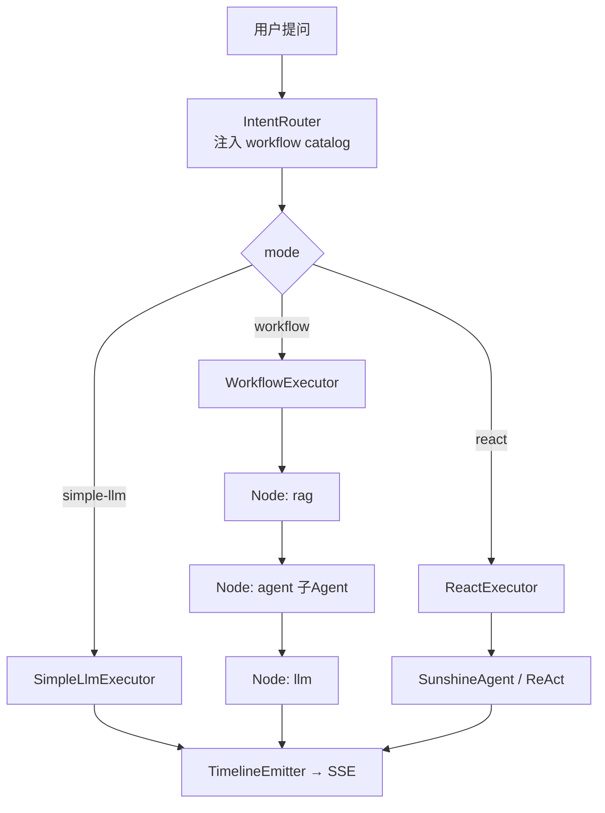

# Workflow 编排架构 — 简化 Dify 设计方案

> **⚠️ 已并入** [phase2-benchmark-design.md](./phase2-benchmark-design.md) **§2.9**。下文为历史详设。

> 日期：2026-06-18   · 状态：**待评审**  
> 前置：阶段二 MVP（ReActAgent、Timeline、Memory、Tool Manager 标杆）已落地  
> 关联：`ChatController.java`、`SunshineAgent.java`、`IntentRouter.java`、`docs/nacos/sunshine-orchestrator.yaml`

---

## 1. 背景与目标

### 1.1 现状问题

| 问题 | 表现 |
|------|------|
| 扩展性差 | 新增 Tool/业务域需改 `ChatController`、`AgentConfig`、`ToolInvokeService` 等多处硬编码 |
| 职责混淆 | Prefetch（编排层）与 ReAct Tool Call（认知层）双路径并存，靠 prompt 防重复 |
| 路由与执行耦合 | `IntentRouter` 输出 `simple/knowledge/finance`，`ChatController` 用 if/switch 绑定执行逻辑 |
| 展示不一致 | 直连 LLM 用 `think` 步骤，Agent 路径 reasoning 挂在 `agent` 容器步内 |
| 无统一编排 | 无法像 Dify 一样将 LLM/RAG/Tool/**Agent 节点**组合为可配置 DAG |

### 1.2 目标

构建 **简化版 Dify** 编排内核，满足：

1. **高扩展**：新增 Tool 只改 tool-manager；新增 Workflow 只改 Nacos YAML；orchestrator 核心不改 switch
2. **架构清晰**：路由层 / 执行层 / 展示层分离；Agent 节点 = 子 Agent 函数 `f(input)→output`
3. **三种执行模式**：`simple-llm` | `workflow` | `react`，意图识别一次选定
4. **可控可观测**：Workflow 节点间引擎推进；Agent 节点内有界自主；Timeline 双层可观测

### 1.3 非目标（本阶段不做）

- 可视化 Workflow 拖拽编辑器（先用 Nacos YAML）
- Workflow 并行分支、Loop 节点（第二阶段）
- Code 节点、MCP 节点、Agent Strategy 插件市场
- 多 Agent 协作（MsgHub / Planner-Executor，阶段三）
- 推翻现有微服务边界或整体重构

---

## 2. 已锁定决策

| # | 决策项 | 结论 |
|---|--------|------|
| D1 | 顶层路由 | 意图识别后三选一：`simple-llm` / `workflow` / `react` |
| D2 | Workflow 定位 | 简化 Dify DAG 引擎；老式固定流 = 无 agent 节点的线性 workflow |
| D3 | Agent 节点语义 | **子 Agent 函数**：`AgentNodeInput → AgentNodeOutput`，引擎拿 output 继续下游 |
| D4 | 顶层 react | 整单 ReAct，等价 `start → agent → answer`；与 workflow 内 agent 节点不同层级 |
| D5 | 节点间推进 | Workflow 引擎按 DAG 机械执行，**节点之间不让 LLM 确认下一步** |
| D6 | 意图识别输入 | classifier prompt **必须注入 workflow catalog**（id + 描述 + 节点摘要 + 示例问法） |
| D7 | 意图识别输出 | 结构化 JSON：`mode` + `workflowId`（workflow 时）+ `params` |
| D8 | 配置 SSOT | `docs/nacos/sunshine-workflows.yaml`（catalog + 图定义）+ `sunshine-orchestrator.yaml`（路由/执行器） |
| D9 | Agent 节点实现 | `AgentNodeHandler` → `AgentRuntime.run(SUB)`；3.10.1 起不再经 `SunshineAgent` |
| D10 | Timeline | Workflow 节点一层 step；agent 节点内展开 think/tool（统一语义，废弃 `agent` 容器步） |
| D11 | Tool 扩展 | tool-manager 引入 `ToolRegistry`（`List<ToolHandler>` 自动注册），消除 switch |
| D12 | 迁移策略 | 渐进式：先三 Executor 抽离，再 Workflow 引擎，不推倒重来 |

---

## 3. 方案对比（为何选本方案）

| 方案 | 描述 | 优点 | 缺点 |
|------|------|------|------|
| A. 维持三分支 if/switch | 继续 `simple/knowledge/finance` + 专用 flux 方法 | 零改动 | 不可扩展，与 Dify 目标背离 |
| B. 纯 Workflow 统一一切 | 所有请求走 DAG，simple 也是两节点 workflow | 概念统一 | simple 路径多一层引擎开销 |
| **C. 三模式 + Workflow 引擎（推荐）** | 顶层三分；workflow 为简化 Dify；react 为整单 Agent | 简单场景快、复杂场景可编排、Agent 可嵌入 | 需维护 Executor 注册表 |
| D. 全量 Dify 克隆 | 可视化编辑器 + 全节点类型 + 插件市场 | 功能完整 | 远超小团队 MVP 范围 |

**推荐方案 C**：顶层保留 `simple-llm` 直连快路径；结构化任务走 `workflow`；开放任务走 `react`。与 Dify「Workflow + Agent Node」哲学一致，实现量可控。

---

## 4. 架构总览

### 4.1 三层分离

```
┌─────────────────────────────────────────────────────────────┐
│ L1 路由层（Routing）                                          │
│   IntentRouter + WorkflowCatalog → ExecutionPlan              │
│   输出：mode + workflowId + params                            │
├─────────────────────────────────────────────────────────────┤
│ L2 执行层（Execution）                                        │
│   ExecutionDispatcher → SimpleLlmExecutor                     │
│                      → WorkflowExecutor（DAG）                │
│                      → ReactExecutor                          │
│   NodeHandler：start | llm | rag | tool | agent | if-else | answer │
├─────────────────────────────────────────────────────────────┤
│ L3 展示层（Presentation）                                     │
│   TimelineEmitter：workflow 节点 step + agent 节点内 think/tool │
│   复用现有 SSE StreamToken / Redis Generation 缓冲             │
└─────────────────────────────────────────────────────────────┘
```

### 4.2 请求主路径



### 4.3 与 Dify 的对应

| Dify | Sunshine 简化版 |
|------|----------------|
| Workflow DAG | `WorkflowExecutor` + Nacos YAML |
| LLM Node | `LlmNodeHandler` |
| Knowledge Retrieval | `RagNodeHandler` |
| Tool / HTTP | `ToolNodeHandler` → tool-manager |
| **Agent Node** | `AgentNodeHandler` → `AgentRuntime`（SUB） |
| If/Else | `IfElseNodeHandler`（第二阶段） |
| Answer | `AnswerNodeHandler`（汇聚输出） |
| Chatflow 纯 Agent | 顶层 `react` 模式 |

---

## 5. 三种执行模式

### 5.1 simple-llm

- **适用**：不需企业知识库/业务系统；单轮可答
- **执行**：`LlmGatewayClient.streamWithMemory()`，无 Toolkit
- **Timeline**：`intent → think → generate`
- **实现**：封装现有直连路径，不经过 WorkflowEngine

### 5.2 workflow（简化 Dify）

- **适用**：有匹配 workflow 模板；步骤可枚举
- **执行**：`WorkflowExecutor` 按 YAML DAG 顺序执行 NodeHandler
- **Timeline**：`intent → plan（可选）→ node-* → generate`
- **关键**：节点之间由引擎推进，上下文写入 `WorkflowContext`

### 5.3 react

- **适用**：无匹配 workflow；多工具组合不确定；意图分类 fallback
- **执行**：`ReactExecutor` → `AgentRuntime.run(MAIN)`，Toolkit 白名单
- **Timeline**：`intent → think → tool-* → generate`
- **约束**：`max-iters` + `agent.react.tools` 白名单（Nacos）

### 5.4 模式选择规则（写入 classifier prompt）

```
不需企业数据、一步能答           → simple-llm
catalog 中有匹配 workflowId      → workflow（附带 params）
模板兜不住、需自由组合工具        → react
拿不准                           → react（fallback）
```

---

## 6. Workflow 引擎

### 6.1 核心概念

| 概念 | 说明 |
|------|------|
| `WorkflowDefinition` | Nacos 静态图：nodes + edges（MVP 仅线性有序列表） |
| `WorkflowContext` | 运行时变量表：`nodeId.field → value` |
| `NodeHandler` | 节点类型实现：`run(NodeSpec, WorkflowContext) → NodeResult` |
| `ExecutionPlan` | 意图识别结果：`mode + workflowId + params` |

### 6.2 变量引用

节点参数支持 `{{nodeId.field}}` 模板（MVP 用简单字符串替换）：

```yaml
# 示例：finance-smart workflow
nodes:
  - id: start
    type: start
  - id: finance-list
    type: tool
    params:
      tool: list_finance_messages
      status: "{{plan.params.status}}"
  - id: analyze
    type: agent
    params:
      query: "{{start.userQuery}}"
      context: "{{finance-list.output}}"
      tools: [list_finance_messages]
      maxIters: 5
  - id: summarize
    type: llm
    params:
      prompt: "根据分析结果作答：{{analyze.answer}}"
  - id: answer
    type: answer
edges:
  - [start, finance-list, analyze, summarize, answer]
```

### 6.3 执行伪代码

```java
for (String nodeId : definition.linearOrder()) {
    NodeSpec spec = definition.node(nodeId);
    NodeHandler handler = handlerRegistry.get(spec.type());
    NodeResult result = handler.run(spec, ctx);
    ctx.put(nodeId, result);
    timeline.emitNode(nodeId, result);
    if (result.failed()) {
        return fallbackOrError(spec, result);
    }
}
return ctx.get("answer").asStreamTokens();
```

**节点之间不回调 LLM 决定下一步。**

### 6.4 MVP 节点类型

| type | Handler | 调 LLM | 说明 |
|------|---------|:------:|------|
| `start` | `StartNodeHandler` | ❌ | 注入 userQuery、memory、userId |
| `llm` | `LlmNodeHandler` | ✅ 单次 | 模板 prompt + 变量 |
| `rag` | `RagNodeHandler` | ❌ | 调 rag-service |
| `tool` | `ToolNodeHandler` | ❌ | 调 tool-manager |
| `agent` | `AgentNodeHandler` | ✅ 多轮 | 子 Agent，见 §7 |
| `if-else` | `IfElseNodeHandler` | 可选 | 第二阶段；MVP 可跳过 |
| `answer` | `AnswerNodeHandler` | ❌ | 汇聚最终输出 |

---

## 7. Agent 节点 — 子 Agent 函数

> **实现目标 SSOT**：[2026-06-19-multi-agent-architecture.md](../plans/2026-06-19-multi-agent-architecture.md#子-agent-实现目标ssot)（2026-06-22）

### 7.1 语义

Agent 节点是 Workflow 中的一种 **NodeHandler**，对外是黑盒函数：

```
AgentNodeHandler.run(input) → output
Workflow 引擎拿到 output 继续下一节点
```

**不是**整条链路的调度器；**不是**顶层 react 模式。子 Agent **默认不面向用户**；用户正文由下游 `llm` / `answer` 合成。

### 7.2 输入（workflow params → `AgentRunRequest.sub`）

```yaml
params:
  query: "{{start.userQuery}}"          # 本子任务
  context: "{{finance-list.output}}"    # 上游材料 → injectedBlocks（唯一默认上下文）
  skill: finance-analysis               # skill overlay + 默认工具（3.11 Catalog）
  tools: [list_finance_messages]        # 可选，覆盖/收窄 skill 默认
  maxIters: "4"
  systemOverlay: 本节点仅输出内部分析结论，不面向用户
```

**不含** `memory: {{start.memory}}` — 子 Agent **不**默认注入 STM/LTM/MTM（见 3.10.7）。

### 7.3 输出 `AgentNodeOutput`

```json
{
  "answer": "子任务结论文本",
  "toolCalls": ["tool-list_finance_messages"],
  "detail": "节点 summary.after 一行摘要"
}
```

`reasoning` 完整链落审计（3.10.6），**不写回**主 `chat_message.reasoning`。

### 7.4 内部实现（当前）

```java
@Component
public class AgentNodeHandler implements NodeHandler {
    private final AgentRuntime agentRuntime;

    public Mono<NodeResult> run(NodeSpec spec, WorkflowContext ctx, ExecutionStreamContext streamCtx) {
        // 目标态（3.10.7）：MemoryContext.injectedOnly(injected)，非 streamCtx.memory()
        return agentRuntime.run(AgentRunRequest.sub(...)).collectList().map(this::toNodeResult);
    }
}
```

- 节点内：ReAct（`ReActAgentRuntime` + 独立 `sub-{runId}` bridge）
- 节点外：引擎仅见 `node-{id}` Timeline 一步 + `AgentNodeOutput`

### 7.5 与顶层 react 对比

| | workflow 内 agent 节点 | 顶层 react |
|---|----------------------|------------|
| 输入 context | 上游 `context` 模板 → `injectedBlocks` | 完整 memory + 用户问题 |
| 记忆 | **仅注入块**（目标态） | LTM/MTM/STM 全量 |
| 工具范围 | 节点/skill 白名单 | react 全局白名单 |
| System prompt | base + skill + `systemOverlay` | base + mode overlay |
| 输出 | 交给下游 llm/answer | 直接给用户 |
| 观测 | 主 Timeline 仅 `node-{id}`；内层 think/tool 压缩 | think/tool/generate 全量 |

---

## 8. 意图识别与 Workflow Catalog

### 8.1 为何 catalog 必须注入 prompt

若分类器不知道有哪些 workflow，无法准确选择 `workflowId`，只能猜 `pipeline` 或 `react`。

### 8.2 Catalog 结构（Nacos）

```yaml
workflow-catalog:
  - id: simple-chat
    mode: simple-llm
    desc: 闲聊/通用写作/代码，不需企业数据
    examples: ["你好", "写一段 Python 快排"]

  - id: knowledge-qa
    mode: workflow
    desc: 查企业制度/手册，检索后作答
    nodes: [start, rag, llm, answer]
    examples: ["请假制度是什么", "报销流程规定"]

  - id: finance-list
    mode: workflow
    desc: 列出待审批/已审批财务消息
    nodes: [start, tool, llm, answer]
    examples: ["有哪些待审批报销"]

  - id: finance-smart
    mode: workflow
    desc: 财务综合分析，需 Agent 推理
    nodes: [start, tool, agent, llm, answer]
    examples: ["待审批是否合规", "对比制度与待办"]

  - id: open-agent
    mode: react
    desc: 开放任务，多工具自由组合
    examples: ["帮我查制度并列出相关待审批"]
```

### 8.3 分类器输出 JSON

```json
{
  "mode": "workflow",
  "workflowId": "finance-smart",
  "params": { "status": "pending" },
  "reason": "需查财务数据并分析合规性"
}
```

校验规则：
- `workflowId` 不在 catalog → fallback `react`
- `mode=simple-llm` 时忽略 workflowId
- `params` 仅填充，不发明新 step

### 8.4 IntentRouter 改造

- 渲染 `{{workflow-catalog}}` 进 `agent.intent.classifier-prompt`
- 解析 JSON 响应（替代裸字符串 `simple/knowledge/finance`）
- 落库 `chat_message.intent` 扩展为 `mode` + `workflowId`（Flyway 迁移）

---

## 9. Tool 扩展（tool-manager）

### 9.1 ToolRegistry

```java
public interface ToolHandler {
    String name();
    ToolSchema schema();
    String invoke(Map<String, String> params);
}

@Component
public class ToolRegistry {
    private final Map<String, ToolHandler> handlers; // 注入 List<ToolHandler>

    public String invoke(String name, Map<String, String> params) { ... }
    public List<ToolSchema> listSchemas() { ... }
}
```

- 消除 `ToolInvokeService` 的 `switch`
- 新增 Tool = 新增 `@Component implements ToolHandler`
- 暴露 `GET /api/tools` 供 orchestrator 拉 schema（可选，第二阶段）

### 9.2 orchestrator 侧

- `ToolNodeHandler` 统一调 `ToolManagerClient`
- **不再**为每个 Tool 建 `*AgentTool` 包装类（react 模式用 `DynamicToolkit` 从白名单生成）

---

## 10. 可观测性（Timeline）

### 10.1 双层模型

| 层级 | 事件 | 示例 |
|------|------|------|
| Workflow 层 | `type: step`，`phase: node` | `node-rag`、`node-agent`、`node-llm` |
| Agent 节点内层 | `type: step` / `stepDelta` | `think`、`tool-list_finance_messages` |

### 10.2 统一 step 语义（废弃 agent 容器步）

| 事件源 | step id |
|--------|---------|
| LLM reasoning（任意模式） | `think` 或 `think-{round}` |
| Tool 调用 | `tool-{name}` |
| Workflow 节点起止 | `node-{nodeId}` |
| 最终 content | `generate` |
| 路由结果 | `intent`（detail 含 mode + workflowId） |
| 执行计划 | `plan`（可选，展示将跑哪些节点） |

### 10.3 与现有组件关系

- 复用 `ProcessingTimelineSession`、`StreamToken`、`GenerationStreamService`
- 改造 `ThinkStepMapper`：Agent 路径 reasoning 也进 `think`，删除 `isAgentManagedPath` 特殊逻辑
- `AgentNodeHandler` 通过 `StepEventBridge` 发射内层 think/tool

---

## 11. 配置 SSOT

### 11.1 文件划分

| 文件 | 内容 |
|------|------|
| `docs/nacos/sunshine-orchestrator.yaml` | intent prompt、react 白名单、max-iters、执行器开关 |
| `docs/nacos/sunshine-workflows.yaml` | workflow-catalog + workflow 图定义 |
| `docs/nacos/sunshine-tool-manager.yaml` | 下游服务 URL（已有） |

### 11.2 orchestrator 新增配置项

```yaml
agent:
  execution:
    default-mode: react          # catalog 匹配失败时
    react:
      tools: [search_knowledge, list_finance_messages]
      max-iters: 5
  intent:
    classifier-prompt: |
      …（含 {{workflow-catalog}}）…
    output-format: json
```

---

## 12. 模块与文件规划

### 12.1 orchestrator 新增包

```
com.sunshine.orchestrator.execution
├── ExecutionDispatcher          # 根据 mode 分发
├── SimpleLlmExecutor
├── ReactExecutor
├── WorkflowExecutor
├── WorkflowContext
├── WorkflowDefinitionLoader     # 读 Nacos / RefreshScope
├── NodeHandler                  # 接口
├── NodeResult
└── handler
    ├── StartNodeHandler
    ├── LlmNodeHandler
    ├── RagNodeHandler
    ├── ToolNodeHandler
    ├── AgentNodeHandler         # 包装 SunshineAgent
    └── AnswerNodeHandler

com.sunshine.orchestrator.routing
├── ExecutionPlan                # mode + workflowId + params
├── WorkflowCatalog              # catalog 渲染
└── IntentRouter                 # 改造：JSON 输出
```

### 12.2 改造/瘦身

| 文件 | 改动 |
|------|------|
| `ChatController` | 删除 `resolveByIntent` / `*AgentFlux`；改为 `dispatcher.execute(plan, ctx)` |
| `AgentConfig` | Toolkit 改为 `DynamicToolkit`（react 模式按白名单注册） |
| `FinanceAgentTool` / `RagTool` | 迁移后删除或仅保留 rag 本地实现（待评估） |
| `StepLabels` | 改读 Nacos `agent.tools.metadata` 或 tool schema |

### 12.3 tool-manager

| 文件 | 改动 |
|------|------|
| `ToolInvokeService` | 改为委托 `ToolRegistry` |
| 新增 `ToolHandler` 接口 | `FinanceToolHandler` 迁移 |

---

## 13. 迁移与分期

### Phase 1（1–2 周）：三 Executor 抽离

- [ ] `ExecutionPlan` + `ExecutionDispatcher`
- [ ] `SimpleLlmExecutor` / `ReactExecutor` 从 `ChatController` 抽出
- [ ] `IntentRouter` 改 JSON + catalog 注入
- [ ] 行为与现网一致（回归 `phase2_agent_demo.py`）

### Phase 2（1–2 周）：Workflow 引擎 MVP

- [ ] `WorkflowExecutor` + 线性 DAG
- [ ] NodeHandler：start / llm / rag / tool / agent / answer
- [ ] `sunshine-workflows.yaml` 样板：knowledge-qa、finance-list、finance-smart
- [ ] 删除 `knowledgeAgentFlux` / `financeAgentFlux`

### Phase 3（1 周）：ToolRegistry + Timeline 统一

- [ ] tool-manager `ToolRegistry`
- [ ] Timeline 统一 think/tool/node；废弃 `agent` 容器步
- [ ] `plan` step 事件

### Phase 4（按需）：增强

- [ ] if-else 条件节点
- [ ] 并行分支
- [ ] `GET /api/tools` schema 同步
- [ ] 可视化 workflow 编辑器

---

## 14. 错误处理与降级

| 场景 | 策略 |
|------|------|
| 意图 JSON 解析失败 | fallback `react` |
| workflowId 不存在 | fallback `react` |
| 节点执行失败 | 节点级重试 1 次 → 整体 fallback `react` 或返回错误 SSE |
| Agent 节点达 maxIters | 返回已有 `answer` 或错误提示 |
| tool-manager 不可用 | 节点返回失败，workflow 走降级或中断 |
| 续传 / resume | `mode` + `workflowId` 写入 message；续传时 **不重新跑 workflow**，走现有 `streamContinue` |

---

## 15. 测试策略

| 层级 | 用例 |
|------|------|
| 单元 | 各 `NodeHandler`、`WorkflowExecutor` 线性执行、变量替换 |
| 单元 | `IntentRouter` JSON 解析 + catalog 匹配 |
| 集成 | `ConversationIntegrationTest` 扩展三模式各 1 条 |
| 集成 | workflow finance-smart 端到端 mock |
| 回归 | `phase2_agent_demo.py` |

---

## 16. 扩展性验收标准

完成 Phase 2 后应满足：

1. **新增 Tool**：仅 tool-manager 新增 `ToolHandler` + 下游 API，orchestrator 零改动
2. **新增 Workflow**：仅 `sunshine-workflows.yaml` 加图 + catalog 加条目，orchestrator 零改动
3. **新增模式组合**：workflow 内自由组合 llm/rag/tool/agent 节点
4. **意图可观测**：intent step 展示 mode + workflowId + reason
5. **执行可观测**：每个 workflow 节点有 start/complete；agent 节点内可展开 think/tool

---

## 17. 风险与开放问题

| 风险 | 缓解 |
|------|------|
| 意图 JSON 不稳定 | 低温 + 小模型 + 输出 schema 校验 + fallback react |
| SunshineAgent 强耦合 ReActAgent | `AgentNodeHandler` 隔离；未来可换 AgentRuntime 接口 |
| 续传与 workflow 状态 | MVP 续传仍走 LLM continue；workflow 状态机后续迭代 |
| RagTool 本地 vs tool-manager | Phase 2 统一为 `RagNodeHandler` 调 rag-service；删除双路径 |

---

## 18. 自审清单

- [x] 无 TBD / 占位符
- [x] 架构与 D1–D12 决策一致
- [x] 范围聚焦 orchestrator + tool-manager，不涉及 K8s/可视化
- [x] Agent 节点 = 子函数，与顶层 react 边界明确
- [x] 节点间不由 LLM 调度，与 Dify 一致
- [x] 迁移分期可独立验收

---

## 19. 下一步

用户审阅本 spec 通过后，使用 **writing-plans** / `apk-write-plan` 产出 `2026-06-18-workflow-orchestration-task.md` 实施计划。
