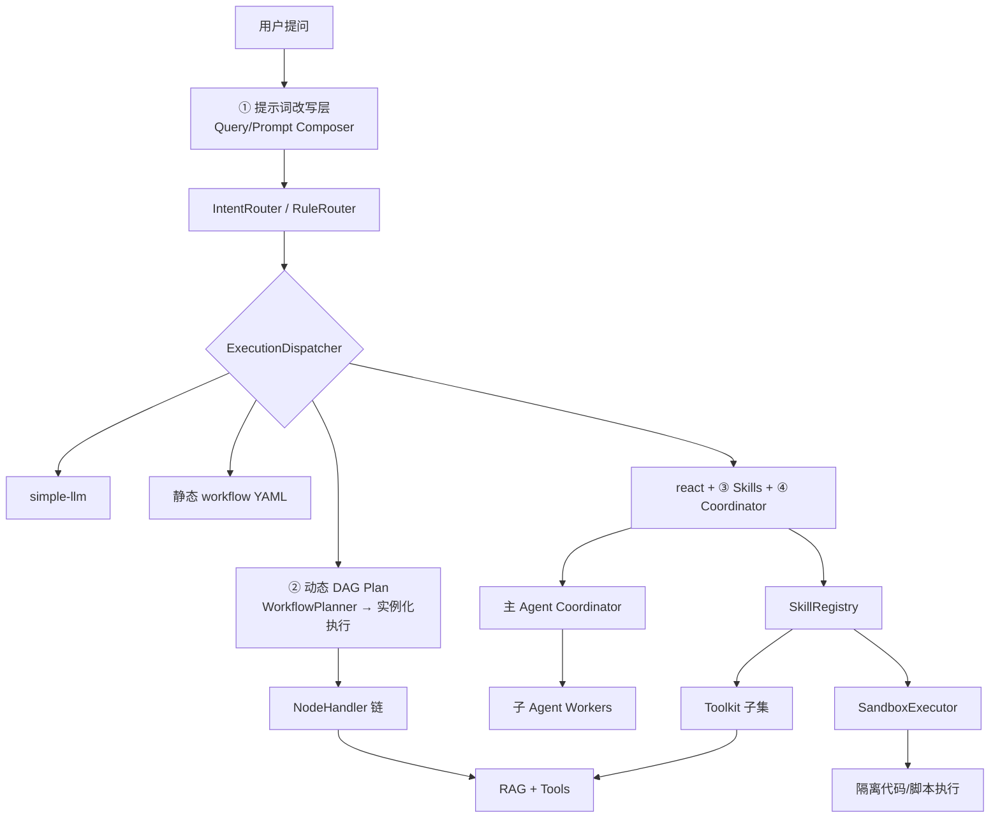
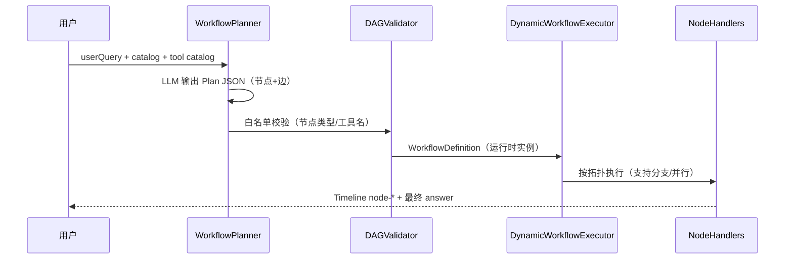
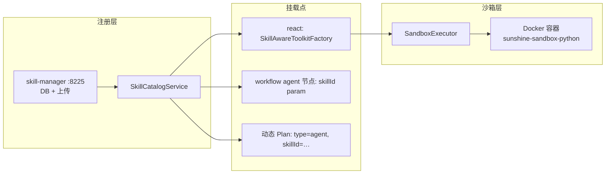
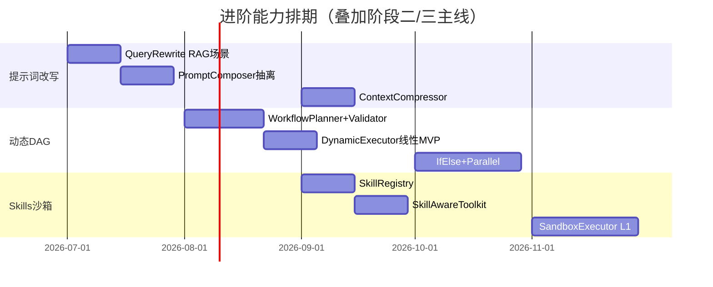

# 进阶能力方案：提示词改写 · 动态 DAG · Skills 沙箱 · 多 Agent

> **日期**：2026-06-19  
> **状态**：方案评审  
> **定位**：阶段二收尾 / 阶段三 RAG 主线之外的**四条并行演进**路径  
> **关联**：`phase2-closure-plan.md`、`2026-06-19-phase3-production-hardening-design.md`、`2026-06-18-workflow-orchestration-design.md`、**`2026-06-19-multi-agent-architecture-design.md`**

---

## 总览：三条路径在架构中的位置



| 方向 | 解决的核心问题 | 与现有架构关系 | 建议阶段 |
|------|----------------|----------------|----------|
| **① 提示词改写** | 检索差、路由偏、上下文爆、话术不可运营 | 贯穿全链路，不改 Executor 边界 | 阶段二末 ~ 阶段三 |
| **② 动态 DAG Plan** | 静态 workflow 无法覆盖组合爆炸 | 扩展 `WorkflowExecutor`，复用 NodeHandler | 阶段三 ~ 阶段四 |
| **③ Skills + 沙箱** | 能力包难复用、代码执行不安全 | 平行于 ToolRegistry，挂载 ReAct / workflow agent 节点 | 阶段三末 ~ 阶段四 |
| **④ 多 Agent 主子** | 单 Agent 不可控、子 Agent 能力未释放 | `AgentRuntime` + Planner + 动态 DAG 多子；详见 multi-agent spec | **阶段三主轴** |

---

## 一、提示词改写（Prompt Rewriting）

### 1.1 现状

| 类型 | 当前做法 | 问题 |
|------|----------|------|
| 系统提示词 | Nacos `agent.system-prompt` 单块 | 全场景共用，无法按 workflow/skill 叠加 |
| 意图分类 | 独立 classifier prompt + catalog 注入 | 用户表述口语化时 workflowId 不稳 |
| RAG query | 直接用户原问 embed | 阶段三 spec 已规划 Query Rewrite，尚未落地 |
| Workflow LLM 节点 | YAML 内联 `prompt` 模板 | 与主 prompt 割裂，无版本管理 |
| 记忆注入 | LTM/MTM/STM 固定格式 | 长会话时 token 膨胀 |

`prompt-manager` 模块（:8500）当前为骨架，尚未承担 SSOT 职责。

### 1.2 改写的五个层次（由浅入深）

```
L0 无改写（现状）
L1 Query Rewrite     — 仅改用户问法（检索/路由前）
L2 Prompt Compose    — 按 mode/workflow/skill 动态拼装 system prompt
L3 Context Compress  — 压缩 STM/工具结果再注入
L4 Prompt Ops        — 版本/A-B/评测门禁（阶段四 prompt 后台）
```

### 1.3 推荐架构：`PromptComposer` + `QueryRewriteService`

```
                    ┌─────────────────────┐
  userQuery ───────►│ QueryRewriteService │──► rewrittenQuery
                    │  (可开关、分场景)    │
                    └─────────────────────┘
                              │
          ┌───────────────────┼───────────────────┐
          ▼                   ▼                   ▼
    IntentRouter         RAG search         Tool param 提取
          │
          ▼
                    ┌─────────────────────┐
  mode/workflow/skill│ PromptComposer      │──► List<Msg> / system blocks
  memory context     │  layer 叠加         │
                    └─────────────────────┘
```

**`QueryRewriteService` 分场景策略**（Nacos `agent.rewrite.*`）：

| 场景 | 触发条件 | 改写策略 | 模型 |
|------|----------|----------|------|
| `rag` | 进入 rag 节点 / RagTool | 关键词补全 + 专有名词标准化；可选 HyDE | flash |
| `intent` | 规则未命中且 query < 8 字 | 补全意图短语 | flash |
| `empty-recall` | RAG 首次 0 命中 | Multi-Query 生成 2 个改写 query 再检 | flash |
| `off` | simple-llm 闲聊 | 不改写 | — |

**`PromptComposer` 叠加顺序**（与 memory-design 对齐）：

```
1. base-system        ← agent.system-prompt
2. mode-overlay       ← simple | workflow:{id} | react
3. skill-overlay      ← ③ Skills 启用时注入
4. memory-layers      ← LTM / MTM / STM（已有）
5. scope-prompt       ← 作答边界（已有）
6. node-prompt        ← workflow llm 节点模板（TemplateResolver 之后）
```

### 1.4 实现任务卡

| 编号 | 任务 | 模块 | 阶段 |
|------|------|------|------|
| P1 | `QueryRewriteService` 接口 + `rag` 场景 MVP | orchestrator | 阶段三（与 RAG R7 合并） |
| P2 | `PromptComposer` 抽离 `SunshineAgent.buildInputs` 逻辑 | orchestrator | 阶段三 |
| P3 | workflow `llm` 节点 prompt 走 Composer 第 6 层 | orchestrator | 阶段三 |
| P4 | `empty-recall` 二次改写检索 | rag-service + orchestrator | 阶段三 |
| P5 | STM 工具结果 `ContextCompressor`（摘要已命中条目） | orchestrator | 阶段三末 |
| P6 | prompt-manager 版本化 + 发布流 | prompt-manager | 阶段四 4.4 |

### 1.5 可控与可观测

- 改写**默认关闭**，按场景白名单开启；改写前后 query 写入 Timeline `detail`（可折叠）
- 审计事件增加 `rewriteApplied: true/false`、`rewriteLatencyMs`
- 评测：`golden-set` 增加 `raw_query` vs `rewritten_query` 对比报告

### 1.6 风险

| 风险 | 缓解 |
|------|------|
| 改写引入幻觉 query | 保留 raw query 兜底；改写仅影响检索，最终作答仍看原问 |
| Token 成本上升 | 仅 low-recall / 短 query 触发；flash 模型 + max_tokens 限制 |
| 与 system-prompt 冲突 | Composer 明确优先级；skill overlay 不得覆盖安全禁令层 |

---

## 二、动态 DAG Workflow Plan Execution

### 2.1 现状与缺口

当前 `WorkflowExecutor` 执行 **Nacos 静态 YAML** 的 `linearOrder`：

```11:15:orchestrator/src/main/java/com/sunshine/orchestrator/execution/WorkflowDefinition.java
public record WorkflowDefinition(
        String id,
        Map<String, NodeSpec> nodesById,
        List<String> linearOrder
) {
```

- `if-else`、并行分支在设计 spec 中标记为「第二阶段」，**未实现**
- `IntentRouter` 只能选 catalog 中**预定义**的 workflowId
- 阶段三 Planner/Executor 是 **MsgHub 对话式**协作，不是可观测的 DAG 实例

**缺口**：业务组合爆炸（「先查制度 → 再查财务 → 对比 → 生成报告」）无法为每种组合预写 YAML。

### 2.2 目标：Plan → Validate → Materialize → Execute

新增第四种顶层模式（**已锁定**，见 [locked-architecture-decisions](./2026-06-19-locked-architecture-decisions.md) D1）：

```
ExecutionMode.PLAN_WORKFLOW   // 对外标签 plan-workflow，与 workflow / react 平级
```

**持久化可观测（阶段三必做）**：每次 Planner 产出写入 `execution_plan` 表，关联 `message_id`；提供 `GET /api/execution-plans/{planId}` 回放；Timeline `plan` 步携带 `planId`；审计事件 `plan.*`。



### 2.3 Plan JSON Schema（LLM 输出）

```json
{
  "planId": "uuid",
  "reason": "用户要对比制度与待办合规性",
  "nodes": [
    { "id": "n1", "type": "rag", "params": { "topK": "3" } },
    { "id": "n2", "type": "tool", "params": { "tool": "list_finance_messages", "status": "pending" } },
    { "id": "n3", "type": "agent", "params": { "query": "对比 {{n1.output}} 与 {{n2.output}}" } },
    { "id": "n4", "type": "llm", "params": { "prompt": "生成合规结论…" } },
    { "id": "n5", "type": "answer" }
  ],
  "edges": [
    { "from": "start", "to": "n1" },
    { "from": "n1", "to": "n2" },
    { "from": "n2", "to": "n3" },
    { "from": "n3", "to": "n4" },
    { "from": "n4", "to": "n5" }
  ]
}
```

### 2.4 `DAGValidator` 硬约束（可控核心）

| 规则 | 说明 |
|------|------|
| 节点类型白名单 | 仅 `start|rag|tool|llm|agent|answer|if-else` |
| 工具白名单 | `params.tool` 必须在 ToolCatalog |
| 最大节点数 | 默认 ≤ 8，可 Nacos 配置 |
| 无环 | 拓扑排序必须成功 |
| 必须可达 answer | 所有路径终点为 `answer` |
| agent 节点 ≤ 1 | MVP 限制，避免嵌套爆炸 |
| 失败不自动 replan | MVP：整单失败 SSE 报错；阶段四可选 Replan |

### 2.5 执行引擎升级路径

| 阶段 | 能力 | 改动 |
|------|------|------|
| **3.D1** | 线性 Plan 实例化 | `DynamicWorkflowExecutor` 将 Plan JSON 转 `WorkflowDefinition`，复用现有线性执行 |
| **3.D2** | `if-else` 分支 | `IfElseNodeHandler`：条件表达式求值（SpEL/JSONPath），选边 |
| **3.D3** | 并行 fan-out | `ParallelNodeHandler`：rag + tool 并行，`join` 后进 llm |
| **4.D4** | 失败局部重试 / Replan | 单节点失败 → Planner 局部补丁 Plan |
| **4.D5** | Plan 缓存 | 相似 query 命中历史 Plan（Redis），人工审核后入库 |

### 2.6 与静态 workflow 的关系

```
                    ┌──────────────────┐
IntentRouter ──────►│ mode=workflow    │──► 静态 YAML（高频标杆流程）
                    │ mode=plan-workflow│──► WorkflowPlanner 动态实例
                    │ mode=react       │──► 整单 Agent（开放问题）
                    └──────────────────┘
```

- **静态 workflow**：财务列表、知识库问答等**高频、强约束、需审计**的场景
- **动态 Plan**：**长尾组合**、探索性分析；Plan 本身落库可审计
- 规则路由（阶段二 2.14）优先级仍最高

### 2.7 Timeline 可观测

- 新增步骤 `plan`（已有 Nacos 模板）：展示 Planner 输出的节点摘要列表
- 动态节点 id：`node-{planNodeId}`，label 来自 Planner 生成的 `displayName`
- 审计：`chat_message` 增加 `execution_plan_json` 列（Flyway）

### 2.8 实现任务卡

| 编号 | 任务 | 阶段 |
|------|------|------|
| D1 | `WorkflowPlanner` + Plan JSON schema + fallback → react | 阶段三 |
| D2 | `DAGValidator` + 单测（非法工具/有环/超节点） | 阶段三 |
| D3 | `DynamicWorkflowExecutor` MVP（线性 Plan） | 阶段三 |
| D4 | `IfElseNodeHandler` | 阶段三末 |
| D5 | `ParallelNodeHandler` + join | 阶段四 |
| D6 | Plan 落库 + 审计查询 API + 节点 trace | **阶段三 3.9**（与 PLAN_WORKFLOW 同步） |

### 2.9 与阶段三 Planner/Executor 的取舍

| 方案 | 描述 | 推荐 |
|------|------|------|
| A. 仅 MsgHub 对话式 Planner | 阶段三原 3.1 | 灵活但难审计、难回放 |
| B. 仅动态 DAG Plan | 本方案 | 可观测、可验证、可缓存 |
| **C. 双层（推荐）** | Planner 输出 **结构化 Plan JSON** → DAG 执行；MsgHub 仅用于 Plan 修订 | 兼顾可控与灵活 |

**推荐 C**：把阶段三 3.1 的 Planner 输出从「自然语言步骤」升级为 **DAG Plan JSON**，Executor 即 `DynamicWorkflowExecutor`。

---

## 三、Skills 与沙箱执行环境

### 3.1 概念定义

| 概念 | 定义 | 类比 |
|------|------|------|
| **Tool** | 原子能力，一次 API 调用 | `list_finance_messages` |
| **Skill** | 领域能力包：专属 prompt + 工具子集 + 策略 + 可选沙箱 | 「财务分析」「制度合规审查」 |
| **Sandbox** | 隔离执行环境：跑代码/SQL/脚本，强约束资源 | Cursor/Code Interpreter 容器 |

当前仅有 Tool 层（`ToolRegistry` + `DynamicToolkitFactory`），缺少 Skill 抽象与代码执行隔离。

### 3.2 Skill 模型与服务端管理（已锁定 D3）

Skills **SSOT 在 skill-manager 服务**（:8225），DB + 文件存储；支持上传 `SKILL.md` / zip、版本发布、启停。orchestrator 经 `GET /api/skills/catalog` 拉取，与 tool-manager Catalog 模式对称。

**元数据示例**（DB 行 + 文件 `SKILL.md` 正文）：

```yaml
# skill_definition 逻辑视图（非 Nacos SSOT）
id: finance-analysis
displayName: 财务分析
description: 分析待审批财务消息的合规性与风险
tools: [list_finance_messages, get_finance_detail]
side_effect: read
sandbox: none
max_iters: 4
enabled: true
version: 3
```

`system_overlay` 等内容来自上传的 `SKILL.md`（Cursor Skill 兼容格式）。

### 3.2.1 前端 Skills 管理页 `/skills`

| 功能 | 说明 |
|------|------|
| 列表 / 搜索 | id、displayName、状态、版本 |
| 上传 | SKILL.md 或 zip |
| 编辑 | overlay prompt Markdown |
| 版本 | 历史、diff、回滚、发布 |
| 绑定工具 | 从 tool-manager catalog 多选 |

BFF 透传 skill-manager；**禁止**在前端或 orchestrator 硬编码 skill 话术。

### 3.3 架构



**挂载方式**：

1. **ReAct 模式**：Intent 或 Planner 选出 `skillId` → `ReActAgentFactory.create(skillId)` 加载 overlay prompt + 工具子集
2. **Workflow agent 节点**：`params.skill: finance-analysis` 替代开放式 agent
3. **动态 Plan**：agent 节点必须声明 `skillId`，禁止无 skill 的开放 agent（可控）

### 3.4 沙箱执行器设计（已锁定 D4：Docker）

| 层级 | 方案 | 适用 |
|------|------|------|
| L0 | 无沙箱（现状） | HTTP Tool |
| **L1** | **Docker 受限 Python**（`network=none`, `read_only`, `cap_drop=ALL`） | **首实现，已锁定** |
| L2 | SQL 只读沙箱 | 独立只读 DB + SELECT 白名单（后续） |

**不采用** E2B/Modal 作为首实现；若未来资源不足再评估托管方案。

**Docker 运行示例**：

```bash
docker run --rm --network none --memory 256m --cpus 0.5 \
  --read-only --cap-drop ALL \
  -v /tmp/sandbox-{runId}:/workspace:ro \
  sunshine-sandbox-python:3.11-slim python /workspace/script.py
```

**执行链路**：

```
Agent 调用 sandbox_execute(skillId, code)
  → SandboxGateway 鉴权（userId + skill.sandbox_policy）
  → PreToolCallHook（HITL 若 side_effect=write）
  → 容器池分配 → 执行 → 采集 stdout/stderr
  → 脱敏 → 返回 ToolResult
  → 审计：完整代码 hash + 输出摘要（不落全文）
```

### 3.5 安全红线

| 规则 |  enforcement |
|------|-------------|
| 默认无沙箱 | 未显式声明 `sandbox` 的 skill 不能执行代码 |
| 网络隔离 | `network: false` 内核级 |
| 超时强杀 | 30s 默认，容器回收 |
| 无宿主机挂载 | 禁止 bind mount 业务目录 |
| 资源配额 | CPU/内存 limit per invocation |
| 审计 | 每次沙箱调用独立 audit 事件 |

### 3.6 实现任务卡

| 编号 | 任务 | 阶段 |
|------|------|------|
| S1 | 新建 **skill-manager** :8225 + MySQL + 上传 API | 阶段三末 |
| S2 | orchestrator `SkillCatalogService` HTTP 拉取 | 阶段三末 |
| S3 | 前端 **`/skills` 管理页**（列表/上传/编辑/发布） | 阶段三末 ~ 阶段四初 |
| S4 | **Docker `SandboxExecutor`** + `sunshine-sandbox-python` 镜像 | 阶段四 |
| S5 | 沙箱审计 + Grafana 指标 | 阶段四 |
| S6 | Skills 试跑调试（子 Agent 预览） | 阶段四 |

### 3.7 Skills vs Tools 扩展对比

| 维度 | 加 Tool | 加 Skill |
|------|---------|----------|
| 改动 | tool-manager 新 Handler | Nacos YAML + 可选新 Tool |
| Prompt | 改全局 system-prompt | 独立 overlay，不动全局 |
| 权限 | 工具级 | 能力包级（更易 RBAC） |
| 适用 | 单一 API | 领域流程 + 多工具组合 + 专属话术 |

---

## 四、三方案协同与推荐排期



### 协同示例：「对比请假制度与我的待审批是否合规」

1. **QueryRewrite**：`我的待审批` → `当前用户待审批财务消息`（若接用户上下文）
2. **IntentRouter**：规则未命中 → `mode=plan-workflow`
3. **WorkflowPlanner** 输出动态 DAG：`rag(制度)` → `tool(财务)` → `agent(skill=合规审查)` → `llm(结论)`
4. **Skill `合规审查`**：注入合规模型 overlay，工具子集只读
5. **PromptComposer**：叠加 compliance overlay + 检索结果 + 工具结果
6. **Timeline**：`plan` → `node-n1` → `node-n2` → `node-n3` → answer

---

## 五、阶段归属建议（写入 implementation-plan）

| 能力 | 任务编号 | 归属 |
|------|----------|------|
| Query Rewrite（RAG） | P1, P4 | 阶段三 3.4 子项（与 R7 合并） |
| PromptComposer | P2, P3 | 阶段三 3.8 |
| 动态 DAG Plan MVP | D1–D3 | 阶段三 3.9（替代原 3.1 对话式 Planner） |
| if-else / 并行 | D4, D5 | 阶段四 4.D |
| SkillRegistry | S1, S2 | 阶段三末 / 阶段四 4.S |
| Sandbox L1 | S4, S5 | 阶段四 4.S |
| Prompt 版本运营 | P6 | 阶段四 4.4 |
| **多 Agent 主子** | M1–M7 | 阶段三 **3.10**（与 3.9 合并，见 multi-agent spec） |
| Coordinator delegate | M8 | 阶段三末 / 阶段四 |
| 并行子 Agent / MsgHub | M10–M11 | 阶段四 4.MA |

---

## 六、多 Agent 主轴（详见独立 spec）

> 完整设计：[2026-06-19-multi-agent-architecture-design.md](./2026-06-19-multi-agent-architecture-design.md)

| 成熟度 | 模式 | 阶段 |
|:------:|------|------|
| L1 | Workflow 单子 Agent（已落地，待 Skill 增强） | 阶段三 M3 |
| **L3** | **Planner + 动态 DAG + 多子 Agent（推荐主轴）** | 阶段三 M4–M5 |
| L2 | 主 Coordinator + delegate 串行子 Agent | 阶段三末 M8 |
| L4 | 并行子 Agent + MsgHub Peer | 阶段四 M10–M11 |

**与动态 DAG 关系**：Planner 不是「聊天式多 Agent」，而是产出 **Plan JSON** 的专用子角色；引擎是唯一调度者，多个 `agent` 节点即多个子 Agent Worker。

---

## 七、已锁定决策（2026-06-19）

> 全文：[2026-06-19-locked-architecture-decisions.md](./2026-06-19-locked-architecture-decisions.md)

| # | 决策 | 结论 |
|---|------|------|
| 1 | 动态 Plan 执行模式 | **独立 `ExecutionMode.PLAN_WORKFLOW`** + `execution_plan` 表持久化与回放 API |
| 2 | Planner 模型 | **专用 `deepseek-v4-flash`**（`agent.planner.model`） |
| 3 | Skills 管理 | **skill-manager 服务端** + 上传 + 前端 **`/skills` 页** |
| 4 | 沙箱 | **Docker** 自建（`network=none`，首镜像 `sunshine-sandbox-python`） |

---

## 八、相关文档

- 阶段二收尾：`docs/phase2-closure-plan.md`
- 阶段三 RAG：`docs/superpowers/specs/2026-06-19-phase3-production-hardening-design.md`
- Workflow 静态 DAG：`docs/superpowers/specs/2026-06-18-workflow-orchestration-design.md`
- 记忆注入：`docs/superpowers/specs/2026-06-17-agent-memory-design.md`
- **多 Agent 主子架构**：`docs/superpowers/specs/2026-06-19-multi-agent-architecture-design.md`
