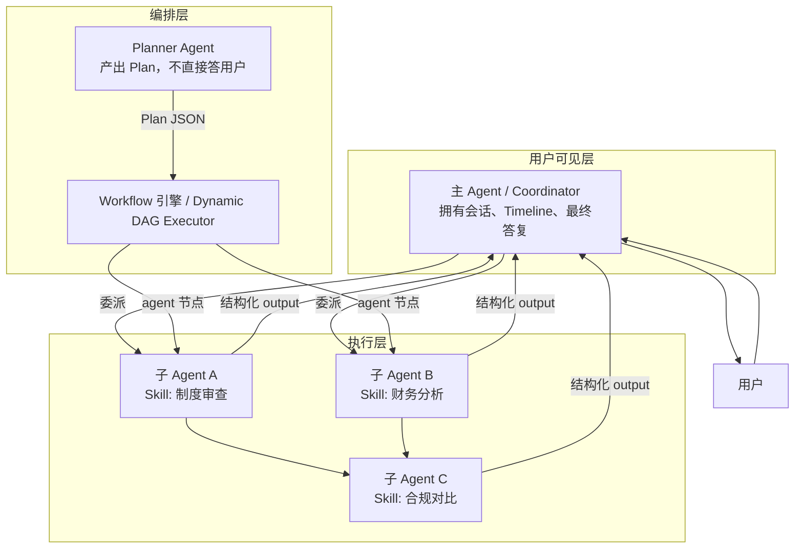
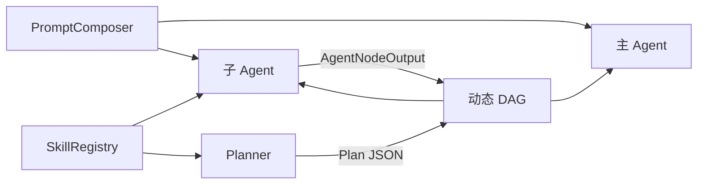

# 多 Agent 架构与主子 Agent 设计方案

> **⚠️ 任务卡已并入** [phase3-production-hardening-design.md](./phase3-production-hardening-design.md) **§3.9–3.10**；实施计划 [plans/2026-06-19-multi-agent-architecture.md](../plans/2026-06-19-multi-agent-architecture.md)（3.9.x / 3.10.x）。阶段四见 [phase4-platformization-design.md](./phase4-platformization-design.md) **§4.7**。下文为历史详设。

> **日期**：2026-06-19（**2026-06-23** 对齐 3.10.1–3.10.7、3.11.1–3.11.6、3.12.1/1a；**`/skills` UI** 见 [skills-management-ui-design.md](./skills-management-ui-design.md)）  
> **状态**：历史详设；**实现目标 SSOT** 见 [plans/2026-06-19-multi-agent-architecture.md §子 Agent 实现目标](../plans/2026-06-19-multi-agent-architecture.md#子-agent-实现目标ssot)  
> **定位**：企业助手**可控多智能体**的核心架构 — 与动态 DAG、Skills、提示词改写协同  
> **前置**：Workflow 2.9 已落地 `AgentNodeHandler`；3.10.1 起改调 `AgentRuntime`（`SunshineAgent` 已删除）  
> **关联**：`2026-06-18-workflow-orchestration-design.md` §7、`2026-06-19-advanced-capabilities-design.md`、`CLAUDE.md` Timeline 约定

---

## 1. 背景：已有能力与缺口

### 1.1 已落地（阶段二 2.9 + 阶段三 3.10.1–3.10.7、3.11.1–3.11.6）

| 层级 | 实现 | 代码锚点 |
|------|------|----------|
| **主 Agent（顶层 react）** | 整单 ReAct，绑定 `assistantMsgId`，think/tool/generate 全上主 Timeline | `ReactExecutor` → `AgentRunRequest.main(...)` → `AgentRuntime` |
| **子 Agent（workflow 节点）** | 黑盒 `f(query, context)→output`，引擎机械推进下一节点 | `AgentNodeHandler` → `AgentRunRequest.sub(...)` → `AgentRuntime` |
| **Bridge / Timeline 隔离** | SUB 独立 `sub-{runId}` bridge；主 SSE 仅 `node-{id}` | `AgentRunRequest.resolveBridgeId()` + `WorkflowExecutor` |
| **工具白名单 + overlay** | SUB 按节点 `tools` 限制 Toolkit；`systemOverlay` 叠 sysPrompt | `ReActAgentFactory` + `DynamicToolkitFactory`（3.10.2 ✅） |
| **节点 params** | `skill` / `tools` / `maxIters` / `systemOverlay` / `query` / `context` | `AgentNodeHandler` + `sunshine-workflows.yaml` `finance-smart`（3.10.3 ✅） |
| **记忆隔离 + skill overlay** | SUB 无 STM/LTM；`skillId` → `PromptComposer` Catalog overlay | `MemoryContext.forSubAgent()` + 3.10.7 ✅ |
| **skill-manager Catalog** | 摘要/详情拆分；MinIO 存储 | `SkillCatalogController` `/catalog/index` + `/{id}/catalog`（3.11.6 ✅） |

### 1.2 缺口（相对 SSOT 目标）

| 缺口 | 影响 | 任务 |
|------|------|------|
| 无 Planner / 动态 DAG | 不能自动规划多子 Agent | 3.9 + 3.10.4–3.10.5 |
| 无 `sub_agent_run` 审计 | 子 run 不可查 | 3.10.6 |
| 无 `@` / 强提示绑定 | 用户无法显式指定 skill | 3.11.7 |
| 主 ReAct 未贯通 skillId | 流程 1–3 未落地 | 3.10.4 + 3.11.7 |
| 仅 **1 层** 主子关系 | 子 Agent 不能再委派下级 Agent | 阶段四 |
| 无 **Coordinator** / **多子并行** / MsgHub | L2/L4 未开始 | 阶段三末 / 四 |
| 子 Agent 详情不可展开 | 前端只见 `summary.after` 一行 | 4.7.4 |

---

## 2. 术语与角色模型



| 术语 | 定义 | 是否面向用户 |
|------|------|:------------:|
| **主 Agent（Main）** | 会话所有者：承接用户问题、展示 Timeline、合成最终 content | ✅ |
| **子 Agent（Sub / Worker）** | 受界委派单元：接收 `query + injectedContext`，在工具/skill 白名单内 ReAct，返回 `AgentNodeOutput` | ❌（默认） |
| **Planner Agent** | 规划者：输出 DAG Plan 或步骤列表，**不**直接生成用户可见正文 | ❌ |
| **Coordinator** | 主 Agent 的编排策略：决定调用哪个子 Agent、顺序/并行、何时结束 | 逻辑角色 |
| **Peer Agent** | 同级协商（MsgHub）：多角色讨论，需严格约束使用场景 | 可选 |

**核心原则**：

1. **调度权在引擎，不在 LLM** — Workflow/DAG 机械推进；LLM 只在 Agent **节点内部** ReAct。
2. **主 Agent 唯一出口** — 用户只看到主 Timeline 的 `generate` / `answer` 正文（子 Agent 产出是中间产物）。
3. **子 Agent 无状态逃逸** — 子 Agent 的 reasoning 默认不进入主会话 STM；仅 `output` 摘要进入下游。

---

## 3. 多 Agent 成熟度模型（L0–L4）

| 级别 | 模式 | 描述 | 状态 |
|:----:|------|------|:----:|
| **L0** | 单 ReAct | 顶层 react，单 Agent 自由调工具 | ✅ |
| **L1** | 静态 Workflow + 单子 Agent 节点 | `finance-smart`：tool → agent → llm | ✅ |
| **L2** | 主 Coordinator + 多子 Agent（串行） | 主 Agent 按步骤委派不同 skill 子 Agent | ⬜ 阶段三 |
| **L3** | Planner + 动态 DAG + 多 agent 节点 | Planner 产出 Plan，引擎调度多个子 Agent | ⬜ 阶段三 |
| **L4** | 并行子 Agent + MsgHub 协商 | 多子并行汇总；极少数场景 MsgHub Peer 讨论 | ⬜ 阶段四 |

**推荐路径**：L1（已有）→ **L3**（动态 DAG + Skills，性价比最高）→ L2（顶层 Coordinator react）→ L4（按需）。

> 跳过「纯 MsgHub 对话式多 Agent」作为默认路径 — 难审计、难回放、与 Timeline V2 理念冲突。MsgHub 仅作为 L4 可选补充。

---

## 4. 主子 Agent 契约（`AgentRuntime`）

### 4.1 统一运行时接口

将 `SunshineAgent` 拆为 `AgentRuntime` 可配置运行时（**3.10.1 已完成**，门面已删除）：

```java
/** 主/子 Agent 统一执行契约 */
public interface AgentRuntime {
    Flux<StreamToken> run(AgentRunRequest request);
}

public record AgentRunRequest(
    AgentRole role,              // MAIN | SUB | PLANNER
    String runId,                // 全局唯一，用于 Trace / 审计
    String parentRunId,          // 子 Agent 指向父（主或引擎）
    MemoryContext memory,        // 主：完整；子：injectedOnly（无 STM/LTM，3.10.7）
    String query,
    List<String> injectedBlocks, // 上游 context 模板渲染结果
    String skillId,              // 可选，绑定 SkillRegistry
    List<String> toolWhitelist,  // 子 Agent 必填；主 Agent 用 react 白名单
    String systemOverlay,        // 叠加在 base system 之上
    int maxIters,
    TimelineBinding timeline     // MAIN_FULL | SUB_COMPRESSED | PLANNER_ONLY
) {}
```

### 4.2 主 vs 子 配置对比

| 维度 | 主 Agent（MAIN） | 子 Agent（SUB） | Planner（PLANNER） |
|------|------------------|-----------------|---------------------|
| `assistantMsgId` | 绑定，走 GenerationJob | **不绑定** | 不绑定 |
| Timeline | think/tool/generate 全量 | 仅 `node-{id}` 一步 + 可选 expand | 仅 `plan` 步 |
| Toolkit | react 全局白名单 | **节点 params.tools** | 无工具或仅 `search_knowledge` |
| System Prompt | base + mode overlay | base + **skill overlay + 节点 overlay** | planner 专用 prompt |
| Memory 写回 | 完整 STM 写回 | **不写回** reasoning；可选写 `output` 摘要 | 不写回 |
| 输出 | 用户可见 content | `AgentNodeOutput` 交给引擎 | `PlanJson` 交给 Validator |
| maxIters | 默认 5 | 节点配置，建议 3–4 | 1（单次输出 Plan） |

### 4.3 `AgentNodeInput` 补齐（对齐 workflow spec §7.2）

```yaml
# sunshine-workflows.yaml agent 节点 params 扩展
- id: analyze
  type: agent
  displayName: 合规分析
  params:
    query: "对比制度与待办是否合规"
    context: |
      制度：{{rag.output}}
      待办：{{finance-list.output}}
    skill: compliance-review          # 绑定 SkillRegistry
    tools: [list_finance_messages]    # 可选，覆盖 skill 默认
    maxIters: "4"
    systemOverlay: "本节点仅输出合规结论，不面向用户"
```

`AgentNodeHandler` 解析 params → `AgentRunRequest(SUB, ...)` → `AgentRuntime.run`。

---

## 5. 四种多 Agent 协作模式

### 5.1 模式 A：Workflow 内嵌子 Agent（已落地，需增强）

```
start → rag → tool → agent(子) → llm → answer
                       ↑
              引擎调用，非 LLM 调度
```

**增强项（阶段三）**：
- ~~子 Agent 支持 `skillId` + `toolWhitelist`~~ ✅ 3.10.2–3.10.3
- 记忆裁剪 + skill overlay 贯通 PromptComposer ⬜ 3.10.7
- `node-{id}` 步骤可展开 `expandDetail`（子 Agent tool 列表 + 摘要 reasoning）⬜ 4.7.4

### 5.2 模式 B：主 Coordinator + 串行子 Agent（阶段三）

顶层仍为 **主 ReAct**，但 Toolkit 中增加 **委派工具**：

```
delegate_to_skill(skillId, query, context) → 内部触发 Sub Agent run
```

| 项 | 说明 |
|----|------|
| 主 Agent | 决定「先调哪个 skill 子 Agent、是否继续委派」 |
| 子 Agent | 通过 `delegate` 工具触发，结果作为 tool result 回主 Agent |
| Timeline | 主 Timeline 有 `tool-delegate-{skillId}` 步骤；子内部压缩 |
| 风险 | 主 LLM 可能滥委派 → **maxDelegates=2** + skill 白名单 |

**与模式 A 取舍**：模式 B 灵活但不可控性高；**优先模式 C（DAG）**，模式 B 作为 react 模式增强。

### 5.3 模式 C：Planner + 动态 DAG + 多子 Agent（推荐主轴）

```
用户 → 主 Agent（可选，仅合成答案）
     → Planner Agent → Plan JSON
     → DAGValidator
     → DynamicWorkflowExecutor
           ├─ agent(skill=制度审查)
           ├─ agent(skill=财务分析)  [并行，阶段四]
           └─ llm(汇总) → answer
```

| 角色 | 职责 |
|------|------|
| Planner | **不是**主 Agent；只产出 Plan，用户不可见其正文 |
| 引擎 | 唯一调度者，按 DAG 调用子 Agent |
| 子 Agent | 各节点独立 skill + 工具子集 |
| 主呈现 | `WorkflowExecutor` 的 `answer` 节点或最终 `llm` 节点产出用户可见内容 |

**与 advanced-capabilities 动态 DAG 方案合并**，Planner 输出必须含 `type: agent` 节点及 `skillId`。

### 5.4 模式 D：MsgHub Peer 协商（阶段四，慎用）

```
AgentScope MsgHub: [角色A 制度专家] [角色B 财务专家] [角色C 仲裁]
                      ↓ 多轮内部对话
                 Coordinator 汇总 → 用户
```

| 适用 | 不适用 |
|------|--------|
| 开放式策略研讨、头脑风暴 | 财务查询、制度问答等需确定性路径 |
| 无明确 DAG 可模板化的探索 | 强审计、强合规场景 |

**硬约束**：MsgHub 对话**不上主 Timeline**；仅输出最终摘要；**maxRounds ≤ 3**；必须记录完整 transcript 到 audit ES。

---

## 6. Timeline 双层可观测

### 6.1 观测模型

```
主 Timeline（用户可见）
├── intent
├── plan                    ← Planner / 动态 DAG 节点链摘要
├── node-rag
├── node-finance-list
├── node-analyze            ← 子 Agent 压缩步（summary.after 一行）
│   └── [expand] 子 Agent 详情（可选展开）
│       ├── think 摘要
│       ├── tool-*
│       └── 结论一行
├── node-llm
└── generate / answer

子 Timeline（内部 / 展开态）
├── think → tool → think-2 → …
└── 完整 reasoning（落库 chat_message.sub_agent_traces，默认不下发）
```

### 6.2 数据模型扩展

```json
// chat_message 或独立表 sub_agent_run
{
  "runId": "sub-uuid",
  "parentRunId": "assistant-msg-id",
  "nodeId": "analyze",
  "skillId": "compliance-review",
  "toolCalls": [{"tool": "list_finance_messages", "durationMs": 120}],
  "outputSummary": "共 3 条待审批，2 条缺附件",
  "reasoningRef": "es://sub-agent-traces/sub-uuid"
}
```

### 6.3 前端

- 默认：`node-analyze` 只显示 `summary.after`（与现网一致）
- 展开：拉取 `GET /api/chat/messages/{id}/sub-runs/{runId}` 显示子 Timeline
- dividing line：展开区用 `--sun-font-base`，与 `OperationCard` 一致

---

## 7. 记忆与上下文隔离

> **实现目标 SSOT**：[plans/2026-06-19-multi-agent-architecture.md §子 Agent 实现目标](../plans/2026-06-19-multi-agent-architecture.md#子-agent-实现目标ssot)

| 数据 | 主 Agent | 子 Agent（目标态） | 当前代码（2026-06-22） |
|------|----------|-------------------|------------------------|
| LTM/MTM | 注入 | **不注入** | ✅ `MemoryContext.forSubAgent()` |
| STM 轮次 | 注入 | **不注入** | ✅ 同上 |
| 上游节点 output | — | `params.context` → `injectedBlocks` | ✅ |
| 节点 query | 用户问题 | `params.query` 或 `{{start.userQuery}}` | ✅ |
| skill / tools / overlay | — | skill overlay ← Catalog；tools ← 节点 params | ✅ 3.10.7 |
| 子 Agent reasoning | 写入主 `reasoning` | **不写回**；ES 审计（3.10.6） | ✅ 不上主 SSE；SUB 不写 STM |
| 子 Agent answer | 用户可见 content | `WorkflowContext` → 下游 `llm` | ✅ |

**子 Agent user 消息模板**：

```
【子任务 · 仅本节点】
{query}

【上游上下文】
{injectedContext}

禁止直接向用户致辞；只输出子任务结论。
```

---

## 8. 安全与可控

| 机制 | 主 Agent | 子 Agent |
|------|----------|----------|
| 工具白名单 | react 全局 | **节点 params**（Skill 包不绑工具） |
| HITL | 写工具确认 | 同左，且在子 run 上下文 |
| maxIters | 5 | 3–4（节点配置） |
| maxDelegates | 2（模式 B） | 0（子 Agent 不能再委派，MVP） |
| Grounding | 最终答复校验 | 子 output 校验后交给下游 llm |
| 审计 | assistant 终态 + tool 摘要 | `sub_agent_run` 独立事件 |

---

## 9. 实现任务卡

### 阶段三（与 3.1 / 3.9 合并）

| 编号 | 任务 | 模块 | 状态 |
|------|------|------|:----:|
| 3.10.1 / M1 | `AgentRunRequest` + `AgentRole` + `AgentRuntime` 接口 | orchestrator | ✅ |
| 3.10.2 / M2 | `ReActAgentFactory.create(AgentRunRequest)` overlay + 工具子集 | orchestrator | ✅ |
| 3.10.3 / M3 | `AgentNodeHandler` skillId / tools / maxIters / systemOverlay | orchestrator | ✅ |
| 3.10.4 / M4 | `PlannerAgentRuntime`：Plan JSON，Timeline `plan` 步 | orchestrator | ⬜ |
| 3.10.5 / M5 | `DynamicWorkflowExecutor` 多 `agent` 节点 | orchestrator | ⬜ |
| 3.10.6 / M6 | `sub_agent_run` 审计 + ES | orchestrator | ⬜ |
| 3.10.7 / M7 | 记忆裁剪 + skill→Composer；不污染 STM/reasoning | orchestrator | ⬜ |

### 阶段三末 / 阶段四

| 编号 | 任务 | 模块 |
|------|------|------|
| M8 | `DelegateSkillTool`（模式 B，react 委派） | orchestrator |
| M9 | 前端子 Agent 展开 UI + sub-runs API | sunshine-ui + orchestrator |
| M10 | `ParallelAgentNodeHandler`：多子 Agent fan-out/join | orchestrator |
| M11 | MsgHub Peer 模式（模式 D）+ transcript 审计 | orchestrator |
| M12 | 子 Agent 嵌套（子调子）— 默认禁止，仅 audit 特批 | — |

---

## 10. 与 Skills / 动态 DAG / 提示词改写的协同



| 组合 | 行为 |
|------|------|
| 子 Agent + Skill | `skillId` 决定 overlay prompt + 工具子集 + maxIters |
| Planner + 动态 DAG | Planner 不写用户正文，只产出含 `agent` 节点的 Plan |
| 主 Coordinator + delegate | react 模式备选；delegate 触发 Skill 子 Agent |
| QueryRewrite | 在 Planner 前改写；子 Agent 收到已改写 query |

---

## 11. 方案对比与推荐

| 方案 | 可控性 | 可观测 | 灵活性 | 推荐场景 |
|------|:------:|:------:|:------:|----------|
| 纯顶层 react（L0） | ★★ | ★★★ | ★★★★ | 开放闲聊、探索 |
| Workflow 单子 Agent（L1） | ★★★★ | ★★★★ | ★★★ | 财务智能分析（现状） |
| 主 Coordinator + delegate（L2） | ★★★ | ★★★ | ★★★★ | react 增强，谨慎启用 |
| **Planner + 动态 DAG 多子（L3）** | ★★★★★ | ★★★★★ | ★★★★ | **企业复杂任务主轴** |
| MsgHub Peer（L4） | ★★ | ★★ | ★★★★★ | 头脑风暴、策略研讨 |

**最终推荐**：

1. **短期**：增强 L1（`AgentNodeHandler` + Skill + 工具子集 + 审计）
2. **中期**：以 **L3** 为企业多 Agent 主轴（Planner 产出 DAG，引擎调度多子 Agent）
3. **长期**：L4 MsgHub 仅作补充；L2 delegate 作为 react 可选能力

---

## 12. 检查门

### 阶段三

- [ ] `finance-smart` workflow 子 Agent 使用 `skill: finance-analysis`，工具仅限 skill 子集
- [ ] Planner 输出 Plan JSON，含 2+ `agent` 节点，Validator 拒绝非法 skill
- [ ] 主 Timeline 只有 `node-*` 压缩步；`sub_agent_run` 可审计查询
- [ ] 子 Agent reasoning 不污染主 `chat_message.reasoning`
- [ ] 演示：「制度 + 财务 + 合规对比」Planner 自动规划 3 节点 DAG

### 阶段四

- [ ] 并行两子 Agent（制度 + 财务）后 join 汇总
- [ ] 前端可展开子 Agent 详情
- [ ] MsgHub 演示用例有完整 transcript 审计

---

## 13. 已锁定决策

> 与 [locked-architecture-decisions](./2026-06-19-locked-architecture-decisions.md) 一致

| # | 决策 | 结论 |
|---|------|------|
| 1 | 动态 Plan 模式 | **`ExecutionMode.PLAN_WORKFLOW`** 独立顶层模式 |
| 2 | Plan 持久化 | `execution_plan` 表 + 回放 API + Timeline `planId`（阶段三） |
| 3 | Planner 模型 | **`agent.planner.model: deepseek-v4-flash`** |
| 4 | Skills | **skill-manager** 服务端上传 + 前端 `/skills` |
| 5 | 沙箱 | **Docker** |
| 6 | 子 Agent 默认 maxIters | 4 |
| 7 | 子 Agent 共享主 memory | **否**；仅 `injectedContext` / `injectedBlocks`（见 locked **D9**、plan §子 Agent 实现目标） |

**仍开放**：顶层 react 是否升级为 Coordinator（L2）— 阶段三末可选。

---

## 14. 相关文档

- Workflow 子 Agent 初版：`2026-06-18-workflow-orchestration-design.md` §7
- 动态 DAG：`2026-06-19-advanced-capabilities-design.md` §二
- Skills：`2026-06-19-advanced-capabilities-design.md` §三
- 阶段三排期：`2026-06-19-phase3-production-hardening-design.md`
