# 阶段三：生产加固 — 技术设计

> **日期**：2026-06-19  
> **状态**：待实施  
> **周期**：约 6 周（兼职节奏）  
> **重点**：**RAG 全链路评测与召回优化**（混合检索 + Reranker + 持续回归）  
> **前置**：阶段二收尾完成（`phase2-closure-plan.md`），尤其 `docs/rag/golden-set.yaml` 与基线报告

---

## 1. 背景与目标

阶段二已具备：三模式编排、Workflow DAG、Timeline V2、Tool Catalog、会话可靠性。距**生产可用**仍缺：

- RAG 仅 **单向量 + 固定 minScore**，无混合检索与精排，命中率不可量化
- 多租户、写操作确认、运维大盘未落地
- Agent 复杂任务仍依赖单 ReAct，无可编排 Planner

### 1.1 阶段三目标

| # | 目标 | 可验收标准 |
|---|------|------------|
| G1 | **RAG 召回可量化、可回归** | Recall@5 较基线提升 ≥15%；`rag_eval.py` CI 门禁 |
| G2 | **检索链路可观测** | Grafana 面板：命中率、延迟、EmptyRate、Rerank 耗时 |
| G3 | **生产级隔离与管控** | 租户 Milvus Partition；写工具 HITL |
| G4 | **复杂任务可控** | Planner 拆解 + Executor 限定工具集 |
| G5 | **运维可告警** | 4 条 Prometheus 规则 + Dashboard |

### 1.2 非目标

- K8s 部署、MCP 协议（阶段四）
- 可视化 Workflow 编辑器
- 全自动 Prompt A/B 平台

---

## 2. RAG 现状与问题（重点）

### 2.1 当前链路

```
入库：Markdown → MarkdownParser(1200字/标题面包屑) → Embedding(text-embedding-v4) → Milvus(IP)
检索：query → embed → Milvus topK → minScore=0.48 过滤 → 返回 DocFragment
消费：RagNodeHandler / RagTool → 注入 LLM prompt
```

代码锚点：`RetrievalService.search()` — 纯向量，无 BM25、无 Rerank、无 query rewrite。

### 2.2 已知短板

| 问题 | 表现 | 根因 |
|------|------|------|
| 语义漂移 | 「报销流程」误命中请假文档 | 纯向量 + 语料相近 |
| 关键词漏召 | 专有名词/制度编号检索差 | 无稀疏检索 |
| 长 chunk 噪声 | 命中但答案段落靠后 | 无 passage 级精排 |
| 阈值僵化 | `minScore=0.48` 一刀切 | 无 per-query 自适应 |
| 无评测闭环 | 优化凭感觉 | 阶段二才建 golden-set |

### 2.3 优化原则

1. **先评测、再优化、必回归** — 任何检索策略变更必须跑 `rag_eval.py`
2. **渐进式叠加** — 向量基线 → +BM25 混合 → +Reranker → +Query Rewrite（逐步验证收益）
3. **配置驱动** — 策略开关在 `sunshine-rag.yaml`，禁止 orchestrator 硬编码
4. **编排无感** — `RetrievalService` API 不变，orchestrator / workflow 零改动

---

## 3. RAG 架构目标态

```mermaid
flowchart TB
    subgraph 入库 Pipeline
        DOC[文档上传] --> PARSE[MarkdownParser]
        PARSE --> CHUNK[Chunk + metadata]
        CHUNK --> DENSE[Dense Embedding]
        CHUNK --> SPARSE[Sparse BM25 索引]
        DENSE --> MV[Milvus 向量]
        SPARSE --> ES[Elasticsearch / Milvus Sparse]
    end

    subgraph 在线检索
        Q[Query] --> QR[Query Rewrite 可选]
        QR --> DENSE_Q[向量召回 topK1]
        QR --> SPARSE_Q[BM25 召回 topK2]
        DENSE_Q --> FUSE[RRF 融合]
        SPARSE_Q --> FUSE
        FUSE --> RERANK[BGE-Reranker topN]
        RERANK --> THRESH[动态阈值 / minScore]
        THRESH --> OUT[DocFragment 列表]
    end

    subgraph 评测闭环
        GS[golden-set.yaml] --> EVAL[rag_eval.py]
        EVAL --> REPORT[baseline / regression report]
        REPORT --> CI[CI 门禁]
    end
```



---

## 4. 任务卡详设

### 3.1 多 Agent 协作（Planner / 主子 Agent）

**方案**：见 [multi-agent-architecture-design](./superpowers/specs/2026-06-19-multi-agent-architecture-design.md)。不推荐纯 MsgHub 对话式多 Agent 作为默认路径。

| 角色 | 职责 | 工具集 |
|------|------|--------|
| **主 Agent（MAIN）** | 用户会话所有者；顶层 react 或最终 answer 合成 | react 全局白名单 |
| **Planner（PLANNER）** | 产出 **Plan JSON**（含多个 agent 节点），不直接答用户 | 无工具或只读检索 |
| **子 Agent（SUB）** | Workflow/DAG 节点 Worker；`skillId` + 工具子集 + overlay prompt | 节点级白名单 |

**推荐主轴 L3**：`ExecutionMode.PLAN_WORKFLOW` → Planner（**`agent.planner.model` flash**）→ **`execution_plan` 持久化** → DAGValidator → DynamicWorkflowExecutor → 多子 Agent（skill-manager catalog）→ llm/answer

**检查门**：Plan 可经 `GET /api/execution-plans/{planId}` 回放；含 2+ `agent` 节点的 Plan 执行成功。

---

### 3.2 多租户隔离

| 层 | 策略 |
|----|------|
| Milvus | `tenant_id` 字段 + Partition per tenant（或 collection 前缀） |
| 入库 API | `IngestionController` 强制 `x-tenant-id` |
| 检索 | `RetrievalService.search(query, topK, tenantId)` 带 partition filter |
| Memory MTM | 向量召回同 tenant 过滤 |
| Sentinel | Gateway 租户 QPS 配额（Nacos 配置） |

**检查门**：租户 A 文档，租户 B 检索 0 命中。

---

### 3.3 Human-in-the-Loop（写操作确认）

**方案**：AgentScope `PreToolCallHook` + Redis 暂停令牌。

```
工具 metadata（Catalog）增加 sideEffect: read | write
写工具调用前 → SSE type:confirmation → 前端弹窗
用户确认 → POST /api/chat/confirm-tool → 恢复 Agent
超时/拒绝 → 步骤标记 SKIP，Agent 告知用户
```

**检查门**：标记为 `write` 的工具（未来 OA 审批）必须经确认才执行。

---

### 3.4 RAG 检索增强（**核心**）

#### 3.4.1 评测基础设施（第 1 周，与阶段二 2.12 衔接）

| 子任务 | 内容 |
|--------|------|
| 3.4.1a | 完善 `scripts/rag_eval.py`：Recall@K、MRR、EmptyRate、P50/P95 |
| 3.4.1b | 支持 `--min-score` / `--top-k` 扫参，输出 CSV |
| 3.4.1c | 基线报告模板 `docs/rag/baseline-report.md`（阶段二填写实测值） |
| 3.4.1d | 扩展 golden-set 至 30+ 条，新增报销类语料（与 finance 标杆对齐） |

#### 3.4.2 入库增强

| 子任务 | 内容 |
|--------|------|
| 3.4.2a | Chunk metadata：`doc_id`, `section_path`, `tenant_id`, `chunk_index` |
| 3.4.2b | 可选 chunk overlap（128–256 字）减少边界截断 |
| 3.4.2c | 双写：Milvus 向量 + ES BM25 索引（推荐 ES，项目已有 9200） |

**ES 索引 mapping（示意）**：

```json
{
  "doc_id": "keyword",
  "tenant_id": "keyword",
  "doc_name": "text",
  "section_path": "text",
  "content": "text",
  "chunk_index": "integer"
}
```

#### 3.4.3 混合检索（Hybrid）

| 子任务 | 内容 |
|--------|------|
| 3.4.3a | `HybridRetrievalService`：向量 topK=20 + BM25 topK=20 |
| 3.4.3b | **RRF**（Reciprocal Rank Fusion）融合，`k=60` 可配置 |
| 3.4.3c | Nacos `rag.search.strategy: vector | hybrid` 开关 |

#### 3.4.4 精排（Reranker）

| 子任务 | 内容 |
|--------|------|
| 3.4.4a | 接入 **BGE-Reranker**（本地 ONNX 或阿里云 API，优先 API 降运维） |
| 3.4.4b | 融合后 top-20 → Rerank → 取 top-5 送入 LLM |
| 3.4.4c | Rerank 分替代裸 `minScore` 做主过滤，保留兜底阈值 |

#### 3.4.5 Query 增强（可选，收益验证后启用）

| 子任务 | 内容 |
|--------|------|
| 3.4.5a | 轻量 **HyDE** 或 **Multi-Query**：LLM 生成 1–2 个改写 query |
| 3.4.5b | 仅对 EmptyRate 高的 query 触发（节省 Token） |

#### 3.4.6 配置 SSOT（`sunshine-rag.yaml` 扩展）

```yaml
rag:
  search:
    strategy: hybrid          # vector | hybrid
    vector-top-k: 20
    bm25-top-k: 20
    rrf-k: 60
    rerank:
      enabled: true
      model: bge-reranker-v2-m3
      top-n: 5
      min-score: 0.35
    min-score: 0.48           # vector-only 模式沿用
    query-rewrite:
      enabled: false
```

#### 3.4.7 RAG 检查门（量化）

| 指标 | 基线（阶段二） | 阶段三目标 |
|------|----------------|------------|
| Recall@5（doc 级） | 记录实测 | **≥ 基线 × 1.15** |
| MRR | 记录实测 | **≥ 基线 × 1.10** |
| EmptyRate（非负例） | 记录实测 | **≤ 基线 × 0.7** |
| P95 latency | 记录实测 | **≤ 800ms**（含 Rerank） |

---

### 3.5 Grafana 告警与 RAG 可观测

**Dashboard 面板（RAG 专区）**：

| 面板 | 指标 |
|------|------|
| 检索 QPS / 错误率 | `rag_search_total`, `rag_search_errors` |
| 延迟 P50/P95 | `rag_search_duration_seconds` |
| 命中率 | `rag_hits_total / rag_search_total` |
| Empty 比例 | `rag_empty_total` |
| Rerank 耗时 | `rag_rerank_duration_seconds` |
| 策略分布 | label `strategy=vector|hybrid` |

**4 条告警规则**：

1. RAG P95 > 1s 持续 5min
2. RAG 错误率 > 5%
3. EmptyRate > 40% 持续 15min（排除负例）
4. LLM Gateway 熔断打开

---

### 3.6 审计扩展（Tool Call 全链路）

| 子任务 | 内容 |
|--------|------|
| 3.6.1 | 新 topic `sunshine-tool-audit`：toolId、params（脱敏）、output 摘要、durationMs、traceId |
| 3.6.2 | ES 索引 `tool-audit-*`，支持按 conversationId 查询 |
| 3.6.3 | 与 Timeline steps 交叉引用 |

---

### 3.7 Grounding 校验（可信）

**方案**：`AnswerGroundingChecker` — 若回答含企业数据表述（金额、条数、制度名），校验本轮是否存在对应 tool/rag 步骤且结果非空；失败则替换为安全话术。

---

## 5. 模块改动范围

| 模块 | 改动 |
|------|------|
| `rag-service` | HybridRetrieval、ES 客户端、Reranker、metrics、入库 metadata |
| `orchestrator` | HITL Hook、Planner 模式、Grounding、tenant 透传 |
| `gateway` | Sentinel 租户配额 |
| `sunshine-ui` | 写操作确认对话框 |
| `scripts` | `rag_eval.py` 增强、CI 集成 |
| `docs/rag` | golden-set、baseline、regression 报告 |

**orchestrator 对 RAG 增强零改动**（仅透传 `tenantId` 若尚未传递）。

---

## 6. 风险与缓解

| 风险 | 缓解 |
|------|------|
| Rerank 延迟超标 | 仅对融合 top-20 精排；异步预热；API 超时降级为融合结果 |
| ES 与 Milvus 双写不一致 | 入库事务日志 + 重建索引脚本 |
| 混合检索收益不及预期 | 严格 A/B：vector vs hybrid vs hybrid+rerank 三段报告 |
| BGE 本地部署资源 | 优先云 API；ecs4c16g 评估后再本地化 |

---

## 7. 阶段三总检查门

- [ ] `python scripts/rag_eval.py --strategy hybrid` Recall@5 达标
- [ ] Grafana RAG 面板可见，4 条告警可触发（测试环境）
- [ ] 租户 A/B 知识库隔离
- [ ] 写工具 HITL 端到端
- [ ] Planner + Executor 演示用例通过
- [ ] Tool audit 可按 conversationId 查询

---

## 8. 下一步

审阅通过后，按 [实施计划](./../plans/2026-06-19-phase3-production-hardening.md) 分 Task 执行；RAG 任务 **Task R1–R8** 优先于 3.1 Planner。

**相关文档**：
- 阶段二收尾：`docs/phase2-closure-plan.md`
- 黄金集：`docs/rag/golden-set.yaml`
- 阶段四平台化：`2026-06-19-phase4-platformization-design.md`
