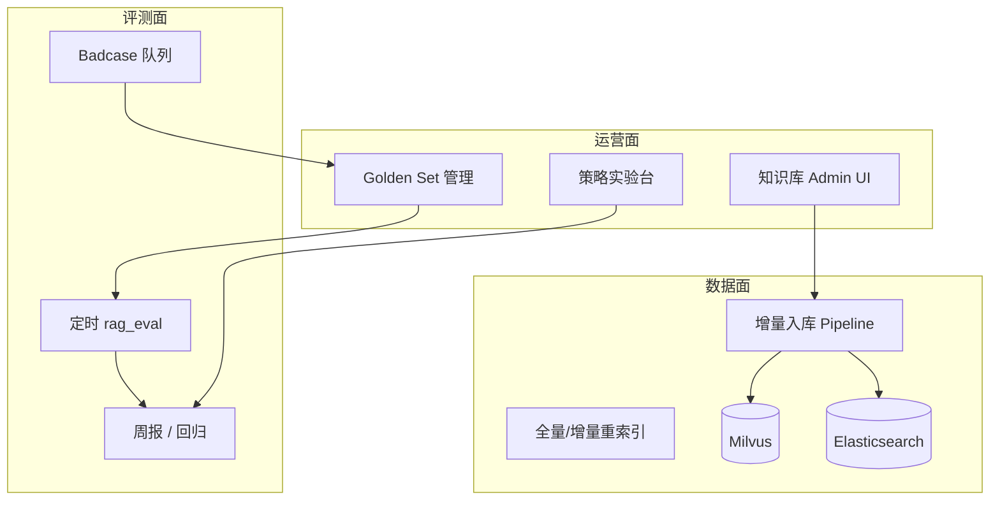

# 阶段四：平台化 — 技术设计

> **日期**：2026-06-19  
> **状态**：按需启动  
> **触发**：阶段三检查门通过 + 业务接入量/运维复杂度达到阈值  
> **重点**：**RAG 平台化**（持续评测、语料运营、多知识库）+ 协议扩展 + 弹性部署

---

## 1. 启动条件（何时进入阶段四）

| 任务卡 | 触发条件 | 优先级 |
|--------|----------|:------:|
| 4.RAG 平台 | golden-set >50 条、语料 >20 篇、需非研发运营知识库 | **高** |
| **4.DOC OCR 入库** | 业务需 PDF/扫描件/发票进知识库 | **高**（见 multimodal-ocr spec） |
| **4.MM Vision 对话** | 需聊天发图、临时识图 | 中（可降级为临时 OCR） |
| 4.1 MCP | 存在非 HTTP 遗留系统（数据库、桌面、SAP）需 Agent 调用 | 中 |
| 4.2 K8s | 单机 ecs4c16g 资源瓶颈或需多副本 HA | 中 |
| 4.3 Seata | 工具写操作跨 2+ 微服务且需一致性 | 中 |
| 4.4 Prompt 后台 | 提示词 >10 个 + 业务人员自助修改 | 中 |
| 4.5 Serverless | 调用量波动大，低谷闲置成本高 | 低 |

---

## 3. 多模态与 OCR（4.DOC / 4.MM）

> 完整设计：[2026-06-21-multimodal-ocr-design.md](./2026-06-21-multimodal-ocr-design.md)

| 层级 | 能力 | 任务卡 |
|:----:|------|--------|
| **L1** | OCR/PDF → 文本 chunk → 现有 Milvus | **4.DOC.1** |
| **L2** | 表格/多栏/低置信度 quarantine | **4.DOC.2** |
| **L3** | Vision 对话 + `/chat` 附件 | **4.MM.1** |

**不在阶段二/三**；阶段三仅需预留 chunk `source_type` 元数据（可选）。

建议顺序：`4.DOC.1` → `4.DOC.3`（knowledge UI）→ `4.DOC.4`（ocr golden-set）→ `4.DOC.2` → `4.MM.1`。

---

## 4. RAG 平台化（4.RAG — 建议作为阶段四主轴之一）

阶段三解决「单次召回优化」；阶段四解决「**持续运营与规模化**」。

### 4.1 目标

| 能力 | 说明 |
|------|------|
| 知识库多空间 | 按部门/项目/租户独立 collection + 权限 |
| 语料运营后台 | 上传、版本、下线、diff、重索引 — 扩展 `/knowledge` 或独立 Admin |
| 持续评测 | 定时 `rag_eval` + 线上采样 badcase 标注回流 golden-set |
| 检索策略实验 | A/B：vector vs hybrid vs rerank，自动出报告 |
| 在线反馈闭环 | 用户点「检索不准」→ 记录 query + 当前 chunks → 运营标注 |

### 4.2 架构



### 4.3 任务卡

| 子任务 | 内容 |
|--------|------|
| 4.RAG.1 | 知识库 `namespace` 模型：`tenant/dept/kbId` 三级 |
| 4.RAG.2 | 文档版本：同 doc_id 新版本入库自动失效旧 chunk |
| 4.RAG.3 | `scripts/rag_reindex.py` 全量重建 + 进度 |
| 4.RAG.4 | Admin API：`POST /api/kb/{kbId}/evaluate` 触发评测 |
| 4.RAG.5 | 前端：检索调试页（query → 各阶段候选 + 分数瀑布图） |
| 4.S.1 | **Docker 沙箱**：`SandboxExecutor` + `sunshine-sandbox-python` 镜像构建脚本 |
| 4.RAG.6 | Badcase：`POST /api/rag/feedback` + MySQL 表 + 导出至 golden-set |
| 4.RAG.7 | 策略实验：Nacos `rag.experiments` 按 userId hash 分流 |
| 4.RAG.8 | 周报 Cron：Recall@5、EmptyRate、Top badcase 自动邮件/飞书 |

### 4.4 检查门

- [ ] 运营可在 UI 上传新制度文档，5 分钟内可检索
- [ ] 文档更新 v2 后 v1 chunk 不可检索
- [ ] 每周自动生成 RAG 评测周报
- [ ] 检索调试页可看到 vector/bm25/rerank 各阶段分数

---

## 3. MCP 协议适配（4.1）

**目标**：Tool Manager 除 HTTP `ToolHandler` 外，支持 MCP Server 注册。

```
McpToolAdapter → 统一 Catalog 条目（kind=mcp）
orchestrator DynamicToolkit 按白名单加载 MCP 工具
```

**适用**：内部数据库只读查询、Jira、Git、本地脚本。

**检查门**：注册 1 个 MCP Server（如 filesystem readonly），ReAct 可调用。

---

## 4. K8s 生产部署（4.2）

| 子任务 | 内容 |
|--------|------|
| 4.2.1 | Helm Chart：gateway / bff / orchestrator / rag / llm-gateway |
| 4.2.2 | HPA：orchestrator、llm-gateway 按 CPU/QPS |
| 4.2.3 | Milvus / ES 有状态集或托管迁移评估 |
| 4.2.4 | Nacos 集群 + 配置 GitOps（ArgoCD 同步 `docs/nacos`） |

**检查门**：3 副本 orchestrator 滚动更新零中断 SSE（配合 Redis GenerationJob）。

---

## 5. Seata 分布式事务（4.3）

**场景**：Agent 调用「创建审批单 + 扣减预算」跨 finance + oa。

| 子任务 | 内容 |
|--------|------|
| 4.3.1 | 写工具标记 `transactional: true` |
| 4.3.2 | Tool Manager 编排 TCC/SAGA 模板 |
| 4.3.3 | 与 3.3 HITL 串联：确认后才开启全局事务 |

---

## 6. 独立提示词管理后台（4.4）

**目标**：非研发修改 `agent.system-prompt`、intent classifier、workflow llm 节点 prompt。

| 能力 | 说明 |
|------|------|
| 版本历史 | MySQL prompt_version 表 |
| 发布流程 | 草稿 → 审核 → 发布至 Nacos |
| 回滚 | 一键恢复上一版本 |
| 权限 | 仅 prompt-admin 角色 |

与 4.RAG.7 实验台联动：prompt 变更触发 rag_eval 子集回归。

---

## 7. Serverless 冷启动（4.5）

**目标**：低谷缩容 rag-service、llm-gateway 适配器为 0，请求时唤醒。

**约束**：orchestrator + Redis GenerationJob 需保持热实例；仅只读无状态服务 Serverless 化。

---

## 8. 阶段四与前三阶段关系

```
阶段二收尾 → 基线评测集 + legacy 清理
     ↓
阶段三     → 混合检索 + Rerank + 租户 + HITL + Grafana
     ↓
阶段四     → RAG 运营平台 + MCP + K8s + 事务 + Prompt 后台
```

---

## 9. 建议优先级（业务拓展导向）

若资源有限，按此顺序启动阶段四子项：

1. **4.RAG 知识库运营 + 检索调试页** — 直接支撑业务语料增长  
2. **4.DOC OCR 入库（L1）** — PDF/发票/扫描件进知识库（与 4.RAG 并列高优）  
3. **4.1 MCP** — 降低异构系统接入成本  
4. **4.4 Prompt 后台** — 业务自助调优  
5. **4.MM Vision 对话（L3）** — 有「拍图问一问」需求时  
6. **4.2 K8s** — 流量上来再做  
7. **4.3 Seata** — 有真实写链路再做  
8. **4.5 Serverless** — 最后优化成本  

---

## 10. 相关文档

- 阶段二收尾：`docs/phase2-closure-plan.md`
- 阶段三设计：`superpowers/specs/2026-06-19-phase3-production-hardening-design.md`
- RAG 黄金集：`docs/rag/golden-set.yaml`
