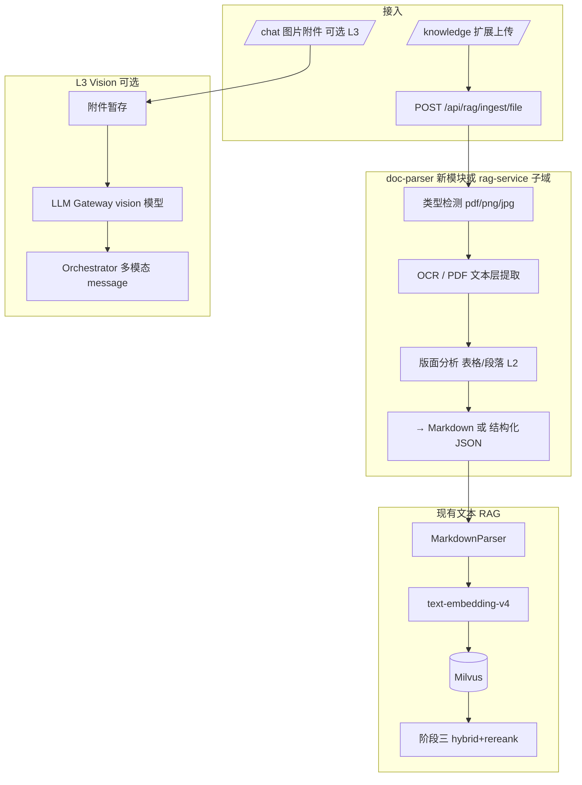

# 多模态与 OCR 文档理解 — 技术设计

> **⚠️ 已并入** [phase4-platformization-design.md](./phase4-platformization-design.md) **§4.2–4.4**。下文为历史详设。

> **日期**：2026-06-21  
> **状态**：方案评审（阶段四能力线）  
> **定位**：扩展知识库入库来源（PDF/图片/扫描件）+ 可选 Vision 对话；**不纳入阶段二/三**  
> **前置**：阶段三文本 RAG（混合检索 + Rerank）基线稳定；阶段二 `golden-set` + `rag_eval` 可回归  
> **关联**：`2026-06-20-phase2-closure-design.md`、`2026-06-19-phase3-production-hardening-design.md`、`2026-06-19-phase4-platformization-design.md`  
> **OCR 提供商（已锁定）**：**千问 / 阿里云 DashScope** — 见 §3.1、`2026-06-19-locked-architecture-decisions.md` D8

---

## 1. 背景与目标

### 1.1 现状

| 能力 | 状态 |
|------|------|
| 入库 | 仅 Markdown 文本 `POST /api/rag/documents` |
| 分段 | `MarkdownParser`（标题/表格语义切分） |
| 向量 | 通义 `text-embedding-v4`（1024 维） |
| 前端 `/knowledge` | Markdown 粘贴/上传 |
| 对话 | 纯文本 SSE；LLM Gateway 无 vision message |

**缺口**：报销发票照片、扫描版制度 PDF、含复杂表格的原件无法进入知识库；用户无法在聊天中「拍一张问制度」。

### 1.2 目标（分三层，可分期交付）

| 层级 | 能力 | 用户价值 |
|:----:|------|----------|
| **L1** | OCR / 文档解析 → **文本 chunk** → 现有 Milvus | 扫描件、PDF 可检索，**复用阶段三文本 RAG** |
| **L2** | 版面增强（表格/印章/多栏）+ 入库元数据 | 财务票据、制度表格检索更准 |
| **L3** | **Vision 对话**：聊天附件图 + 多模态 LLM | 临时识图问答，不必先入知识库 |

### 1.3 非目标（本 spec MVP 不做）

- 图搜图（纯视觉向量检索）作为默认路径  
- 视频/音频理解  
- 自建 GPU OCR 集群（优先云 API）  
- 替代阶段三文本 hybrid/rerank 主线  

---

## 2. 架构总览



**原则**：L1/L2 产出**文本**后走现有管线；不把多模态 Embedding 作为第一选择。

---

## 3. 方案对比

### 3.1 OCR / 文档解析引擎（已锁定：千问 DashScope）

| 方案 | 描述 | 结论 |
|------|------|:----:|
| **A. 千问 / DashScope** | 通义 OCR、文档智能、Qwen-VL 识图 | **已锁定首选** |
| B. 开源 PaddleOCR | 自建 CPU | 仅作灾备/离线评估，**不作默认** |
| C. PDF 文本层抽取 | pdfbox / pdfplumber（本地） | 与 A **组合**：电子版 PDF 优先 C，失败或无文字层再走 A |

**流水线（锁定）**：

```
PDF/图片
  → 电子版 PDF？─是→ pdf-text（本地抽取）
  → 否 / 抽取失败 / 图片 → 千问 DashScope OCR / 文档解析 API
  → Markdown 规范化 → MarkdownParser → text-embedding-v4 → Milvus
```

**千问侧能力映射**（实施时按 [DashScope 文档](https://help.aliyun.com/zh/model-studio/) 对齐 model id）：

| 场景 | DashScope 能力 | 配置键 |
|------|----------------|--------|
| 通用图片 OCR | 通义 OCR / 多模态 OCR | `rag.ocr.model` |
| 扫描 PDF / 复杂版面 | 文档智能 / 长文档解析 | `rag.ocr.doc-model`（L2 表格） |
| L3 聊天识图 | **Qwen-VL** 系列（经 LLM Gateway） | `llm-gateway` vision 路由 |

**密钥**：复用 `QWEN_API_KEY` / `DASHSCOPE_API_KEY`（与 Embedding、LLM Gateway 通义适配器一致），`OCR_API_KEY` 可覆盖。

**禁止**：阶段四 MVP 默认接入百度/腾讯 OCR 或 Paddle；若千问 API 不可用，降级为「入库失败 + 明确错误」，而非静默切换厂商。

### 3.2 模块归属

| 方案 | 描述 | 推荐 |
|------|------|:----:|
| A. 扩展 `rag-service` | 新增 `IngestionFileController` + `DocParserService` | **MVP** — 少一个服务 |
| B. 新建 `doc-parser-service` :8425 | 独立扩缩容 | 文档量大时阶段四后期拆分 |
| C. 放在 `desensitize` 旁 | 不合适 | ❌ |

**推荐 MVP**：**rag-service 内聚**；接口与存储设计预留拆分为 `doc-parser-service`。

### 3.3 Vision 对话（L3）

| 方案 | 描述 | 推荐 |
|------|------|:----:|
| A. OpenAI 兼容 `image_url` / `base64` 经 LLM Gateway | 与现有 `OpenAIChatModel` 对齐 | **推荐** |
| B. 先 OCR 再纯文本 chat | 无 vision 模型也能「识图」 | L1 已覆盖知识库场景 |
| C. 独立 multimodal-orchestrator | 过重 | ❌ |

**推荐**：L3 用 **A**；业务可先用 **B**（聊天发图 → 临时 OCR → 不入库）降低首期成本。

---

## 4. L1：OCR 入库管线（4.DOC.1 — 优先）

### 4.1 支持格式

| 类型 | 扩展名 | 处理 |
|------|--------|------|
| 图片 | png, jpg, jpeg, webp | 云 OCR → 文本 |
| PDF | pdf | 有文字层 → 抽取；否则 OCR 分页 |
| 文本 | md, txt | 直通现有逻辑 |

单文件上限：Nacos `rag.ingest.max-file-mb`（默认 20）；页数上限 50。

### 4.2 API

```
POST /api/rag/ingest/file
Content-Type: multipart/form-data
  file: 二进制
  docName: 可选
  docId: 可选（版本管理，对齐 4.RAG.2）
  tenantId: 从 x-tenant-id

Response:
{
  "code": 200,
  "docName": "2026报销制度扫描件",
  "sourceType": "pdf-ocr",
  "pages": 12,
  "chunks": 28,
  "ocrProvider": "qwen",
  "previewMarkdown": "前 2k 字预览..."
}
```

保留现有 `POST /api/rag/documents`（纯文本 Markdown）。

### 4.3 处理流程

```
1. 病毒扫描 / 扩展名白名单（可选 MVP 仅白名单）
2. 存对象存储或本地 staging：data/rag/staging/{uploadId}/
3. detect → pdf-text | image-ocr
4. normalize → UTF-8 Markdown（保留 ## 页码 / 表格为 Markdown table）
5. MarkdownParser.parse → chunks
6. embed → milvus insert（doc_name + metadata: source_type, upload_id, page）
7. 写 MySQL rag_document_index（doc_id, version, status, chunk_count）
8. 删除 staging 或保留 7 天审计
```

### 4.4 元数据（Milvus / MySQL）

| 字段 | 说明 |
|------|------|
| `source_type` | `markdown` / `pdf-text` / `pdf-ocr` / `image-ocr` |
| `original_filename` | 原始文件名 |
| `page_no` | PDF/OCR 页码 |
| `ocr_confidence` | 可选，低置信度 chunk 标 flag |

### 4.5 Nacos（`sunshine-rag.yaml` 扩展）

```yaml
rag:
  ingest:
    max-file-mb: 20
    max-pages: 50
    allowed-extensions: [pdf, png, jpg, jpeg, webp, md, txt]
  ocr:
    provider: qwen                 # 已锁定：千问 DashScope（禁止默认 paddle/其他云）
    api-key: ${OCR_API_KEY:${QWEN_API_KEY:${DASHSCOPE_API_KEY}}}
    base-url: https://dashscope.aliyuncs.com/api/v1
    model: qwen-vl-ocr-latest      # 图片/单页 OCR，实施时按 DashScope 最新 id 对齐
    doc-model: qwen-doc-parse      # 扫描 PDF / 长文档 + L2 表格（占位，上线前核对）
    language: auto                 # 中英混合
    table-mode: true               # L2：表格输出 Markdown table
    timeout-sec: 120
    max-retries: 2
```

### 4.6 检查门（L1）

- [ ] 上传扫描版 PDF（≥5 页）→ 检索命中关键句  
- [ ] 上传发票照片 → OCR 金额/税号可被 golden-set 扩展题命中  
- [ ] 电子版 PDF 走文本层，耗时 < OCR 路径 50%  
- [ ] `rag_eval` 可增加 `source_type=ocr` 子集报表  

---

## 5. L2：版面增强（4.DOC.2）

| 子任务 | 内容 |
|--------|------|
| 4.DOC.2a | 表格 OCR → Markdown table，禁止拍平成乱序段落 |
| 4.DOC.2b | 多栏版面阅读顺序校正 |
| 4.DOC.2c | 印章/水印区域降权或标注 `[印章]` |
| 4.DOC.2d | 低置信度 chunk 不入库或入 `quarantine` 队列人工复核 |

**触发**：L1 发票/制度表格 Recall 明显低于纯 Markdown 语料。

---

## 6. L3：Vision 对话（4.MM.1 — 可选）

### 6.1 场景

- 用户聊天上传**单张**图片：「这张发票能否报销？」（无需先入知识库）  
- 与 L1 区别：L1 **持久化**进 Milvus；L3 **会话级**理解  

### 6.2 链路

```
前端 chat 附件 → BFF multipart → Orchestrator
  → 图片存临时对象存储（Redis 元数据 + 24h TTL）
  → LLM Gateway vision 模型（如 qwen-vl-max / gpt-4o 兼容接口）
  → ReAct 可将 OCR 结果作为 tool 或 inline image part
```

### 6.3 Gateway 改动

- Nacos 路由 **vision 模型族优先 Qwen-VL**（如 `qwen-vl-max` / `qwen-vl-plus`），与 OCR 同一 DashScope 账号  
- `ChatCompletionRequest.messages` 支持 `content: [{type:text},{type:image_url}]`  

### 6.4 安全与治理

| 规则 | 说明 |
|------|------|
| 大小/分辨率限制 | 与 ingest 一致 |
| 脱敏 | OCR/Vision 输出过 `desensitize` |
| 审计 | 附件 hash + 模型 id；**不**默认长期存原图 |
| 租户 | 临时文件按 `tenantId` 隔离 |

### 6.5 检查门（L3）

- [ ] 聊天上传 PNG 发票，助手识别金额并引用脱敏后字段  
- [ ] 未启用 vision 模型时降级：自动走临时 OCR 文本路径（方案 B）  

---

## 7. 前端改造

### 7.1 `/knowledge`（L1 必做）

| 功能 | 说明 |
|------|------|
| 上传区 | 支持拖拽 pdf/png/jpg；显示解析进度（轮询 job status） |
| 预览 | OCR 后 Markdown 预览 + 分段数 |
| 列表 | 已入库文档：source_type、页数、chunk 数、重索引 |

### 7.2 `/chat`（L3 可选）

| 功能 | 说明 |
|------|------|
| 附件按钮 | 单图/多图（MVP 单图） |
| 展示 | 用户消息气泡含缩略图 |
| 限制 | 格式/大小提示 |

---

## 8. Agent / Tool 集成

| 接入点 | L1/L2 | L3 |
|--------|-------|-----|
| Workflow `rag` 节点 | 检索已 OCR 入库 chunk | — |
| ReAct Tool `search_knowledge` | 同上 | — |
| 新 Tool `parse_document_image` | 可选：临时 OCR 不入库 | 会话级 |
| skill-manager 沙箱 | 不执行任意 OCR；仅注册文档类 skill | — |

**不建议** Agent 直接调云 OCR API；统一经 **rag-service ingest** 或 **parse_document** 服务，便于审计与配额。

---

## 9. 评测与 golden-set 扩展

阶段二/三 `golden-set` 为纯文本制度。OCR 上线后新增：

```
docs/rag/golden-set-ocr.yaml   # 可选扩展集
  - 上传固定扫描件 doc_id
  - query 针对 OCR 易错点（金额、税号、表格单元格）
```

`rag_eval.py` 增加：

```bash
python scripts/rag_eval.py --suite ocr
python scripts/rag_eval.py --suite all   # text + ocr
```

指标除 Recall 外增加 **CER 抽样**（人工标注 20 条 OCR 原文 vs ground truth，运维抽检）。

---

## 10. 任务卡与排期（阶段四）

| 任务卡 | 内容 | 依赖 | 预估 |
|--------|------|------|------|
| **4.DOC.1** | L1：file ingest API + 云 OCR + PDF 文本层 + staging | 阶段三 RAG 稳定 | 2–3 周 |
| **4.DOC.2** | L2：表格/多栏/低置信度 quarantine | 4.DOC.1 | 1–2 周 |
| **4.DOC.3** | `/knowledge` 文件上传 UI + 任务进度 | 4.DOC.1 | 1 周 |
| **4.DOC.4** | `golden-set-ocr` + `rag_eval --suite ocr` | 4.DOC.1 | 3 天 |
| **4.MM.1** | L3：Gateway vision + chat 附件 + 降级 OCR | 4.DOC.1 可选 | 2 周 |
| **4.MM.2** | Vision 审计 + 配额 + Grafana | 4.MM.1 | 3 天 |

**建议顺序**：`4.DOC.1` → `4.DOC.3` → `4.DOC.4` → `4.DOC.2` → `4.MM.1`。

---

## 11. 与阶段二/三边界

| 阶段 | 多模态/OCR |
|------|------------|
| 阶段二收尾 | ❌ 仅文本 Markdown 语料 + eval 基线 |
| 阶段三 | ❌ 文本 hybrid + rerank；不为 OCR 改 Milvus schema（可预留 metadata 字段） |
| 阶段四 | ✅ 本 spec 全文 |

阶段三实施时**建议预留**：Milvus chunk metadata `source_type` 字段（可为空），避免阶段四再重建 collection。

---

## 12. 风险与缓解

| 风险 | 缓解 |
|------|------|
| OCR 错误进入知识库 | 低置信度 quarantine；preview 人工确认后发布 |
| 成本飙升 | 按租户日配额；大 PDF 异步队列 |
| 隐私 | 原件 staging 加密 + 定期清理；脱敏后再 embed |
| Vision 幻觉 | 财务类强制「引用 OCR 原文」；Grounding 校验（阶段三 3.7 延伸） |
| 与文本 RAG 指标混淆 | `rag_eval --suite text|ocr` 分报表 |

---

## 13. 检查门（阶段四 DOC/MM）

- [ ] 扫描 PDF + 发票图入库并可检索  
- [ ] `/knowledge` 文件上传全流程可用  
- [ ] `golden-set-ocr` 评测报告归档  
- [ ] （可选）聊天发图问答可用或 OCR 降级可用  

---

## 14. 相关文档

- 阶段二文本基线：`2026-06-20-phase2-closure-design.md`  
- 阶段三文本 RAG：`2026-06-19-phase3-production-hardening-design.md`  
- 阶段四平台化：`2026-06-19-phase4-platformization-design.md`  
