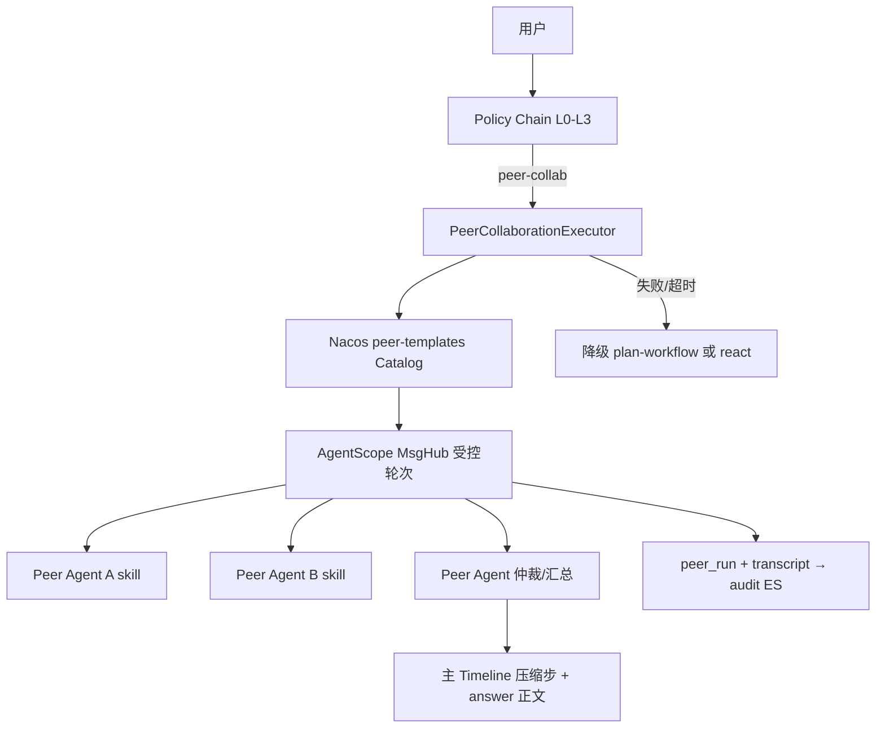

# 第五顶层模式：Peer 协作路由（PEER_COLLAB）

> **阶段**：四 · **任务卡**：4.7.3（及 4.7.3a–d）  
> **状态**：⬜ 按需（阶段三检查门通过后启动）  
> **锁定决策**：[2026-06-19-locked-architecture-decisions.md](./2026-06-19-locked-architecture-decisions.md) **D10**  
> **平台 SSOT**：[phase4-platformization-design.md](./phase4-platformization-design.md) §4.7  
> **多 Agent 详设**：[2026-06-19-multi-agent-architecture-design.md](./2026-06-19-multi-agent-architecture-design.md) §5.4（模式 D / L4）  
> **实施计划**：[plans/2026-06-19-multi-agent-architecture.md](../plans/2026-06-19-multi-agent-architecture.md) §阶段四  
> **路由验收**：[routing-golden-set.md](../../routing/routing-golden-set.md) §E（阶段四启用）

---

## 1. 定位

在现有四种顶层执行模式之上，阶段四新增**第五模式**，专门承接「多 Agent **对等协作、相互验证**」类任务：

| 模式 | 对外标签 | 阶段 | 协作形态 |
|------|----------|:----:|----------|
| `SIMPLE_LLM` | `simple-llm` | 二 | 单轮直答 |
| `WORKFLOW` | `workflow` | 二 | 静态 DAG |
| `REACT` | `react` | 二 | 单 Agent ReAct |
| `PLAN_WORKFLOW` | `plan-workflow` | 三 | Planner 动态 DAG + Orchestrator-Worker |
| **`PEER_COLLAB`** | **`peer-collab`** | **四** | **受控 MsgHub 有限轮对话 + 仲裁汇总** |

**非默认路径**：与 D9 编排器-Worker 主轴并存；**不替代** `plan-workflow`。结构化「验证链」（A → Reviewer → answer）仍走 L3 DAG。

---

## 2. 与 `plan-workflow` 的边界

| 维度 | `plan-workflow`（第四模式） | `peer-collab`（第五模式） |
|------|----------------------------|---------------------------|
| 调度者 | Planner + 引擎机械推进 | Peer 轮次引擎 + 仲裁 Agent |
| Agent 关系 | 串行/并行 Worker，**不看**对方 reasoning | 对等可见结论，可**反驳/复核** |
| 路径 | Plan JSON 可校验、可落库 | 运行时 emergent，transcript 为真相来源 |
| 适用 | 「先检索再分析再汇总」 | 「多专家互相验证」「交叉审查」「策略研讨」 |
| Timeline | `plan` + `node-*` | 主 Timeline **仅压缩摘要**；transcript 进 audit |
| 可控性 | ★★★★★ | ★★（硬约束补偿） |

**路由优先级**：L1 结构命中 **多步流水线** → `plan-workflow`；命中 **对等协商/交叉验证** → `peer-collab`；二者皆未命中时 L3 classifier 区分。

---

## 3. 架构



### 3.1 枚举与分发

```java
public enum ExecutionMode {
    SIMPLE_LLM,
    WORKFLOW,
    REACT,
    PLAN_WORKFLOW,
    PEER_COLLAB;  // 阶段四 4.7.3a
}
```

`ExecutionMode.from("peer-collab")`；`ExecutionDispatcher` 增加第五分支 → `PeerCollaborationExecutor`。

### 3.2 Policy Chain 扩展

| 层级 | 新增/变更 | 配置键 |
|:----:|-----------|--------|
| L1 | `PeerStructuralRoutingPolicy`（可选，与 structural 并列评估顺序见 4.7.3b） | `agent.routing.peer.structural-patterns` |
| L2 | 一般不新增 peer 规则（避免与 L1/L3 重复） | — |
| L3 | `classifier-prompt` 增加第五 mode | `agent.intent.classifier-prompt` |
| — | 协作模板 Catalog | `agent.peer.templates`（Nacos 或 DB，SSOT 待定 4.7.3b） |

L3 输出示例：

```json
{"mode":"peer-collab","workflowId":null,"params":{"templateId":"compliance-cross-review"},"reason":"需制度与财务专家交叉验证"}
```

### 3.3 受控 MsgHub（4.7.3c）

- 基于 AgentScope **MsgHub**，非自由对话默认路径。
- 角色来自 **peer-template**：`roles[]` 每项含 `skillId`、`displayName`、`systemOverlay`（可选）。
- **硬约束**（与 [multi-agent-design §5.4](./2026-06-19-multi-agent-architecture-design.md) 一致）：
  - `maxRounds ≤ 3`（Nacos 可配，默认 3）
  - 角色 / skill **白名单**（Catalog 驱动，禁止 orchestrator 硬编码）
  - MsgHub 内部对话 **不上主 Timeline SSE**
  - 主 Timeline：`intent` → `peer-collab`（压缩步）→ `answer` 或等价终态
  - 完整 **transcript** 写入 audit ES + `peer_run` 表（4.7.3d）

### 3.4 降级

| 条件 | 行为 |
|------|------|
| template 不存在 / 角色 skill 非法 | 降级 `react` + intent 步说明 |
| MsgHub 超时 / 无共识 | 降级 `plan-workflow`（可选 Flash 重规划）或 `react` |
| 与 Planner 失败降级策略对齐 | 日志 `[PeerCollaborationExecutor]` |

---

## 4. 子任务拆分（4.7.3）

| 编号 | 内容 | 产出 |
|------|------|------|
| **4.7.3a** | `ExecutionMode.PEER_COLLAB` + `ExecutionDispatcher` 第五分支 | 枚举、分发、单测 |
| **4.7.3b** | Policy Chain：L1 peer-patterns + L3 classifier 第五 mode + `agent.timeline.intent.modes.peer-collab` | Nacos + `RoutingGoldenSetTest` §E |
| **4.7.3c** | `PeerCollaborationExecutor` + MsgHub 轮次引擎 + `agent.peer.templates` | orchestrator 模块 |
| **4.7.3d** | `peer_run` 表 + transcript 审计 API + ES；失败降级 | Flyway + audit |
| **4.7.4** | 前端 Peer 摘要展开 / transcript 查看（可与子 Agent 详情 UI 复用） | sunshine-ui |

**同 §4.7 其它子项（非第五模式本身）**：

| 编号 | 内容 | 与第五模式关系 |
|------|------|----------------|
| 4.7.1 | `DelegateSkillTool` | react 内 L2 委派，**不**新增顶层 mode |
| 4.7.2 | `ParallelAgentNodeHandler` | **plan-workflow 内**并行，非 peer-collab |

---

## 5. Nacos 配置草案（实施时落盘）

```yaml
agent:
  intent:
    classifier-prompt: |
      # … 现有四种 mode …
      - peer-collab：需多角色对等协作、交叉验证、互相质疑（如「制度与财务专家分别审查并互相验证」）；无固定流水线顺序；勿与「先…再…」多步 plan 混淆
  routing:
    peer:
      structural-patterns:
        - "互相验证"
        - "交叉审查"
        - "多专家讨论"
        - "分别分析并质疑"
  peer:
    max-rounds: 3
    templates:
      compliance-cross-review:
        displayName: 合规交叉审查
        roles:
          - skillId: policy-review
            displayName: 制度专家
          - skillId: finance-analysis
            displayName: 财务专家
          - skillId: compliance-arbitrator
            displayName: 仲裁汇总
  timeline:
    intent:
      modes:
        peer-collab:
          detail: 多专家协作
          after: "{query}将由多专家协作交叉验证"
```

---

## 6. 检查门（阶段四 4.7）

- [ ] Golden-set §E1：「制度与财务专家分别审查报销合规性并互相验证」→ `peer-collab`，**非** `plan-workflow`
- [ ] 主 Timeline 无 MsgHub 多轮 raw 对话；仅有压缩 `peer-collab` 步 + 终态 answer
- [ ] audit 可按 `peer_run_id` 查完整 transcript
- [ ] `maxRounds` 截断可观测；超时降级有 intent 说明
- [ ] 与 §E2 对照：「先查制度再查报销再合规分析」仍 → `plan-workflow`

---

## 7. 相关文档

| 文档 | 关联 |
|------|------|
| [phase4-platformization-design.md](./phase4-platformization-design.md) | §4.7 任务总览与检查门 |
| [2026-06-19-locked-architecture-decisions.md](./2026-06-19-locked-architecture-decisions.md) | D10 锁定 |
| [2026-06-19-multi-agent-architecture-design.md](./2026-06-19-multi-agent-architecture-design.md) | L4、§5.4 模式 D |
| [2026-06-19-advanced-capabilities-design.md](./2026-06-19-advanced-capabilities-design.md) | §2.9 方案 C（MsgHub 仅 Plan 修订 / L4 补充） |
| [routing-golden-set.md](../../routing/routing-golden-set.md) | §E 验收用例 |
| [implementation-plan.md](../../implementation-plan.md) | 阶段四 4.7 摘要 |
