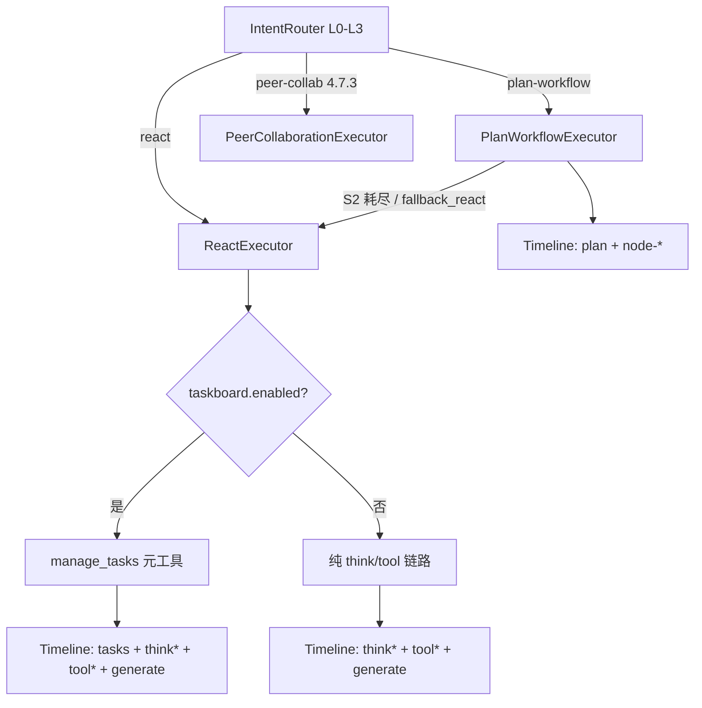

# ReAct TaskBoard（软规划 Todo）

> **阶段**：四 · **任务卡**：4.7.5（及 4.7.5a–e）  
> **状态**：⬜ 按需（阶段三检查门通过后启动；可与 4.7.1 并行）  
> **锁定决策**：[2026-06-19-locked-architecture-decisions.md](./2026-06-19-locked-architecture-decisions.md) **D11**  
> **平台 SSOT**：[phase4-platformization-design.md](./phase4-platformization-design.md) §4.7  
> **路由验收**：[routing-golden-set.md](../../routing/routing-golden-set.md) §F（阶段四启用）  
> **前置**：阶段三 ReAct Timeline（think/tool/generate）、3.6 tool 审计、3.10 `AgentRuntime` 统一入口

---

## 1. 定位

在 **不新增顶层 ExecutionMode** 的前提下，为 `react` 模式增加 **软规划 TaskBoard**，对齐 Claude Code / Cursor Agent 的 Todo 体验：

| 维度 | `plan-workflow`（硬规划） | **ReAct TaskBoard（软规划）** |
|------|---------------------------|-------------------------------|
| 触发 | L1/L3 路由到第四模式 | **始终仅在 `react` 内**；路由不变 |
| 规划产物 | Plan JSON + DAG 校验 + `execution_plan` 落库 | 轻量 checklist；**无 DAG 校验** |
| 修订 | Replan（校验反馈） | 模型随时 `manage_tasks` 增删改状态 |
| 工具约束 | 节点 type/tool 白名单 | 仍走 react 工具白名单；todo **不绑定**具体 tool |
| Timeline | `plan` + `node-*` | **`tasks` 单步**（清单摘要）+ 现有 `think*` / `tool*` |
| 审计 | `execution_plan` + node trace | `react_task_board` 快照 + tool 审计 |
| 适用 | 跨域结构化流水线 | 开放探索、单域多步、路径不确定、编码式 Agent |

**非目标**：

- **不**替代 `plan-workflow`；L1 结构命中仍走动态 Plan。
- **不**把 TaskBoard 做成 mini-DAG（禁止 edges、节点 type、工具绑定字段）。
- **不**新增第六顶层模式；**不**在 plan-workflow 成功路径展示 `tasks` 步。

---

## 2. 与现有模式的关系



### 2.1 路由边界（不变）

| 用户表述 | 仍路由至 | 说明 |
|----------|----------|------|
| 先检索制度，再查待审批，再合规分析 | `plan-workflow` | L1 结构守卫 |
| 查一下待审批报销有哪些 | `workflow` / `react` | L2 或 L3 |
| 帮我分析这几条报销有没有问题（多工具探索） | `react` + TaskBoard | 开放路径 |
| 制度与财务专家互相验证 | `peer-collab`（4.7.3） | 非 TaskBoard |

### 2.2 与 plan-workflow 降级的衔接

`PlanWorkflowExecutor` / `PlanTimeline.planRejectedStep` 降级 ReAct 时：

| 场景 | TaskBoard 行为 |
|------|----------------|
| `status=rejected`，无部分节点 | 空板；由模型首轮 `manage_tasks` 自建 |
| `status=degraded_react`，已有 `injectedBlocks` | **可选**引擎预填 1 条 todo「接续未完成分析」（Nacos `seed-from-injected-summary`） |
| 曾产出 Plan 但校验失败 | **禁止**把 Planner JSON 自动转成 DAG；仅允许 **plain-text 摘要** 写入 todo content |

---

## 3. 架构

### 3.1 组件

| 组件 | 模块 | 职责 |
|------|------|------|
| `ManageTasksTool` | orchestrator | AgentScope 元工具；解析 merge/replace；写 Redis + 发 Timeline |
| `ReactTaskBoardService` | orchestrator | 会话级状态 CRUD、版本号、终态快照 |
| `ReactTaskBoardStore` | orchestrator | Redis `react:taskboard:{assistantMsgId}` |
| `TaskBoardTimelineSupport` | orchestrator | `tasks` 步 lifecycle + `StepMetadata.tasks[]` |
| `ReactTaskBoardAuditService` | orchestrator | 终态 / 每次变更 → MQ + ES（可选采样） |
| `TaskBoardPanel` | sunshine-ui | Chat 时间线内嵌 checklist（只读展示 + 展开） |

**注册原则**（对齐 Catalog 驱动）：

- `manage_tasks` 为 **orchestrator 内置元工具**，类似 `RagTool`；**不**进 tool-manager Catalog。
- `DynamicToolkitFactory` 在 `agent.execution.react.taskboard.enabled=true` 时 **自动注册**，**不**占用 Nacos `react.tools` 白名单槽位。
- displayName / timelinePhase 由 orchestrator 本地常量 + Nacos `agent.timeline.steps.tasks` 提供。

### 3.2 数据模型

```json
{
  "boardId": "uuid",
  "assistantMsgId": "msg-xxx",
  "revision": 3,
  "updatedAt": 1719225600000,
  "items": [
    {
      "id": "t1",
      "content": "检索差旅报销制度要点",
      "status": "completed"
    },
    {
      "id": "t2",
      "content": "查询待审批报销单列表",
      "status": "in_progress"
    },
    {
      "id": "t3",
      "content": "汇总合规风险并撰写结论",
      "status": "pending"
    }
  ]
}
```

| 字段 | 约束 |
|------|------|
| `items[].id` | 模型提供或引擎生成 `t{n}`；同一 board 内唯一 |
| `items[].content` | 1–200 字；中文任务描述 |
| `items[].status` | `pending` \| `in_progress` \| `completed` \| `cancelled` |
| `items` 数量 | ≤ `max-items`（Nacos，默认 12） |
| `revision` | 每次 `manage_tasks` +1；用于 SSE 幂等 |

**禁止字段**：`edges`、`tool`、`nodeType`、`skillId`、`dependsOn` —— 出现则工具返回校验错误，引导模型改用 `plan-workflow` 场景表述。

### 3.3 元工具 `manage_tasks`

Agent 可见 schema（OpenAI function 风格）：

```json
{
  "name": "manage_tasks",
  "description": "维护当前会话的任务清单。多步复杂问题请先创建任务再逐步执行；每完成一步更新 status。",
  "parameters": {
    "type": "object",
    "properties": {
      "merge": {
        "type": "boolean",
        "description": "true=按 id 合并更新；false=整板替换（仅当需完全重写清单时用）"
      },
      "items": {
        "type": "array",
        "items": {
          "type": "object",
          "properties": {
            "id": { "type": "string" },
            "content": { "type": "string" },
            "status": {
              "type": "string",
              "enum": ["pending", "in_progress", "completed", "cancelled"]
            }
          },
          "required": ["content", "status"]
        }
      }
    },
    "required": ["merge", "items"]
  }
}
```

**引擎规则**：

1. 同一时刻 **最多 1 条** `in_progress`；若模型提交多条，引擎保留首条 in_progress，其余降为 `pending`。
2. `merge=true`：按 `id` 更新；未知 `id` 且 `content` 非空则追加。
3. `merge=false`：整板替换；`revision` 仍单调递增。
4. 返回工具结果 JSON（供模型读）：`{ "ok": true, "revision": 4, "summary": "2/3 已完成" }`。
5. **不上** tool 时间线独立一步（与 `manage_tasks` 元操作语义一致）；Timeline 只更新 **`tasks` 聚合步**。

Hook 集成：`PreActing` / `PostActing` 对 `manage_tasks` **跳过**常规 tool 步，改由 `TaskBoardTimelineSupport` 发射 `tasks` 步。

---

## 4. Timeline / SSE 契约

### 4.1 步骤形态

ReAct 成功路径（TaskBoard 开启）：

```
intent → tasks → think → tool-* → think-2 → … → generate
```

| 步 id | phase | 说明 |
|-------|-------|------|
| `tasks` | `tasks` | **唯一**任务清单步；每次 `manage_tasks` 全量刷新 `metadata.tasks` |
| `think` / `think-{n}` | `think` | 不变；reasoning 仍走 step_delta |
| `tool-*` | `tool` | 不变 |
| `generate` | `generate` | 不变 |

**门控**：

- 存在 `planId=` 或 `phase=plan` → **不展示** `tasks`（plan-workflow / 静态 workflow）。
- `tasks` 步 **never** 与 `plan` 步并存。

### 4.2 ProcessingStep 扩展

`StepMetadata` 增加可选字段：

```java
public record TaskBoardItemView(
    String id,
    String content,
    String status   // pending | in_progress | completed | cancelled
) {}

// StepMetadata.tasks: List<TaskBoardItemView>
// StepMetadata.taskRevision: Integer
// StepMetadata.taskProgress: String  // e.g. "2/5 已完成"
```

SSE `type:step` 示例：

```json
{
  "type": "step",
  "step": {
    "id": "tasks",
    "phase": "tasks",
    "lifecycle": "running",
    "label": "任务清单",
    "summary": { "active": "正在执行：查询待审批报销单列表" },
    "metadata": {
      "taskRevision": 3,
      "taskProgress": "1/3 已完成",
      "tasks": [
        { "id": "t1", "content": "检索制度", "status": "completed" },
        { "id": "t2", "content": "查询待审批", "status": "in_progress" },
        { "id": "t3", "content": "汇总结论", "status": "pending" }
      ]
    }
  }
}
```

终态：`tasks` 步 `lifecycle=done`，`summary.after` = Nacos 模板（如「任务清单已全部完成」）。

### 4.3 前端

| 项 | 约定 |
|----|------|
| 组件 | `TaskBoardPanel.vue`，由 `OperationStack` 在 `phase===tasks` 时渲染 |
| 展示 | Checkbox 风格只读列表；`in_progress` 高亮；**不**允许用户拖拽改序 |
| 文案 | 用 SSE `step.label` + `summary.*`；**禁止**前端 `TASK_STATUS_LABELS` 硬编码 |
| 排序 | 按 `items` 数组顺序；completed 不自动沉底（保持模型意图） |
| Plan 共存 | 有 `planId` 时只展示 `PlanWorkflowPanel`；**不**渲染 TaskBoard |

`processingSteps.ts`：`STEP_ORDER` 在 `intent` 之后插入 `tasks`（在 `plan` 之后、`think` 之前）。

---

## 5. 持久化与审计

### 5.1 Redis（会话态）

| Key | TTL | 内容 |
|-----|-----|------|
| `react:taskboard:{assistantMsgId}` | 24h | 完整 board JSON + revision |

### 5.2 MySQL（终态）

Flyway **V{n}**：`react_task_board`

| 列 | 说明 |
|----|------|
| `id` | boardId |
| `message_id` | assistantMsgId |
| `conversation_id` | |
| `tenant_id` / `user_id` | |
| `revision` | 终态 revision |
| `items_json` | 最终 items 快照 |
| `created_at` / `updated_at` | |

写入时机：`generate` 完成或 ReAct 异常终止时 `ReactTaskBoardAuditService.persistFinal()`。

### 5.3 审计事件

| 事件 | 触发 |
|------|------|
| `react.taskboard.updated` | 每次 `manage_tasks`（可 Nacos 采样 `audit.sample-rate`） |
| `react.taskboard.final` | 消息终态 |

ES 文档含：`items`、`revision`、关联 `toolCalls` 计数（便于分析「有 todo 是否减少 iter」）。

---

## 6. Nacos 配置（实施时落盘）

```yaml
agent:
  prompt:
    mode-overlays:
      react: |
        - 外部数据先调匹配工具，可多轮串联不同工具。
        - 超时/不可用：改参或换工具再试一次，禁止相同参数连调。
        - 参数校验失败：按报错补参后再调。
        - 0 条或无数据：改写 query 再试一次，仍无效则收束作答。
        - 【TaskBoard】当用户问题隐含 2 步及以上（查、比、汇总、多工具）时，先调用 manage_tasks 列出任务再执行；每完成一步将对应项标为 completed，下一步标 in_progress；路径变化时可增删任务。
  timeline:
    intent:
      modes:
        react:
          detail: 自主智能体
          after: "{query}将由自主智能体分析并作答"
    steps:
      tasks:
        before: 规划任务步骤
        active: "正在执行：{activeTask}"
        after: 任务清单已更新
        all-done: 全部任务已完成
  execution:
    react:
      tools: [search_knowledge, list_finance_messages, ...]
      max-iters: 5
      taskboard:
        enabled: true
        max-items: 12
        max-in-progress: 1
        seed-from-injected-summary: true   # plan 降级 ReAct 时可选预填 1 条
        audit:
          sample-rate: 1.0
```

**Feature Flag**：`taskboard.enabled=false` 时行为与阶段三完全一致（无 `manage_tasks`、无 `tasks` 步）。

---

## 7. 与 4.7 其它子项的协作

| 子项 | 关系 |
|------|------|
| **4.7.1** `DelegateSkillTool` | todo 可写「委派 xx skill 分析」；委派本身仍走 tool 步，**不**在 todo 内嵌 skill 参数 |
| **4.7.3** `PEER_COLLAB` | 互不干扰；peer 主 Timeline 无 `tasks` |
| **4.7.4** 子 Agent 详情 UI | TaskBoard 仅主 ReAct；子 Agent 内部 **不上** 主 Timeline |
| **4.6** 动态 DAG | Plan 并行/if-else 与 TaskBoard 无交集 |

---

## 8. 子任务拆分（4.7.5）

| 编号 | 内容 | 产出 |
|------|------|------|
| **4.7.5a** | `ManageTasksTool` + `ReactTaskBoardService` + Redis store | orchestrator + 单测 |
| **4.7.5b** | `DynamicToolkitFactory` 条件注册 + `TaskBoardTimelineSupport` + Hook 跳过 tool 步 | Timeline SSE + `ProcessingTimelineSessionTest` |
| **4.7.5c** | Flyway `react_task_board` + `ReactTaskBoardAuditService` + `GET /api/audit/taskboard/{messageId}` | 审计可查 |
| **4.7.5d** | 前端 `TaskBoardPanel` + `processingSteps.ts` STEP_ORDER | sunshine-ui |
| **4.7.5e** | Nacos overlay + golden-set §F + `ReactTaskBoardTest` / demo 脚本扩展 | 验收 |

**建议顺序**：4.7.5a → 4.7.5b → 4.7.5d → 4.7.5c → 4.7.5e（可先 UI 联调 mock SSE）。

---

## 9. 验收（Golden-Set §F）

### 9.1 启用条件

同 [routing-golden-set.md](../../routing/routing-golden-set.md) 验收前准备；额外：`agent.execution.react.taskboard.enabled=true`。

### 9.2 正例（应出现 `tasks` 步）

| # | 提示词 | 预期 |
|---|--------|------|
| F1 | 帮我查待审批报销，并对有风险的单据逐条说明原因 | `react`；`tasks` 含 ≥2 项；后续 tool 步 |
| F2 | 先搜知识库看年假规定，再查 OA 待办里我的请假申请 | 若 L1 未命中：`react`+TaskBoard；**若 L1 命中**：`plan-workflow`，**无** `tasks` |
| F3 | 用财务工具汇总各状态数量，并解释异常偏多的状态 | `react`；todo 含「汇总」「解释」 |

### 9.3 负例

| # | 场景 | 预期 |
|---|------|------|
| F-N1 | A1 主验收句（三域流水线） | `plan-workflow` + Plan DAG；**无** `tasks` |
| F-N2 | `taskboard.enabled=false` | 与阶段三 ReAct 一致 |
| F-N3 | 简单单轮「你好」 | 无 `tasks` 或 0 项（模型可不调用 manage_tasks） |

### 9.4 单测

```bash
mvn test -pl orchestrator -Dtest=ReactTaskBoardTest,ManageTasksToolTest,ProcessingTimelineSessionTest,RoutingGoldenSetTest
```

### 9.5 演示脚本（可选）

`scripts/phase2_agent_demo.py --suite react-taskboard`：断言 SSE 含 `phase=tasks` 且 `metadata.tasks.length>=2`。

---

## 10. 锁定决策 D11（摘要）

| 项 | 要求 |
|----|------|
| 模式 | **不**新增 ExecutionMode；仅 `REACT` 内可选能力 |
| 与 Plan 边界 | 成功 plan-workflow **禁止**出现 `tasks`；TaskBoard **禁止** DAG 字段 |
| 与 Peer 边界 | `peer-collab` **禁止** TaskBoard |
| 元工具 | `manage_tasks` orchestrator 内置，**不**进 tool-manager Catalog |
| Timeline | 单步 `tasks` 聚合更新；**禁止**每次 manage_tasks 单独 tool 步 |
| 提示词 | TaskBoard 行为 **仅** Nacos `mode-overlays.react` + tool description |
| 降级 | plan → react 可文本摘要预填；**禁止** Planner JSON 自动转 DAG todo |

完整条目见 [locked-architecture-decisions.md §D11](./2026-06-19-locked-architecture-decisions.md#d11-react-taskboard软规划阶段四)。

---

## 11. 风险与缓解

| 风险 | 缓解 |
|------|------|
| 与 plan-workflow UI 混淆 | `planId=` 门控互斥；文案区分「执行计划 DAG」vs「任务清单」 |
| 模型不写 todo | Nacos overlay 强引导；评测 iter 次数 / 完成率 |
| todo 过多占 context | `max-items` + 工具返回截断提示 |
| 双规划（think 写计划 + tasks） | 允许；`tasks` 为 SSOT 进度，think 为推理过程 |
| max-iters 内做不完 | 终态 board 持久化；下轮会话 **不**自动续板（除非 STM 引用了上轮摘要） |

---

## 12. 实施检查门

- [ ] `taskboard.enabled=true` 时 ReAct 复杂 query 出现 `tasks` 步且 metadata 含 ≥2 items
- [ ] A1 三域句仍走 `plan-workflow`，无 `tasks`
- [ ] `manage_tasks` 不占用 tool-manager Catalog；react 白名单不变
- [ ] plan 降级 ReAct 时 injected 摘要可选预填；Planner JSON 未自动导入
- [ ] 终态 `react_task_board` 表可查；审计事件可检索
- [ ] `phase2_agent_demo.py --suite react` 仍 PASS（flag 默认 false 或兼容）
