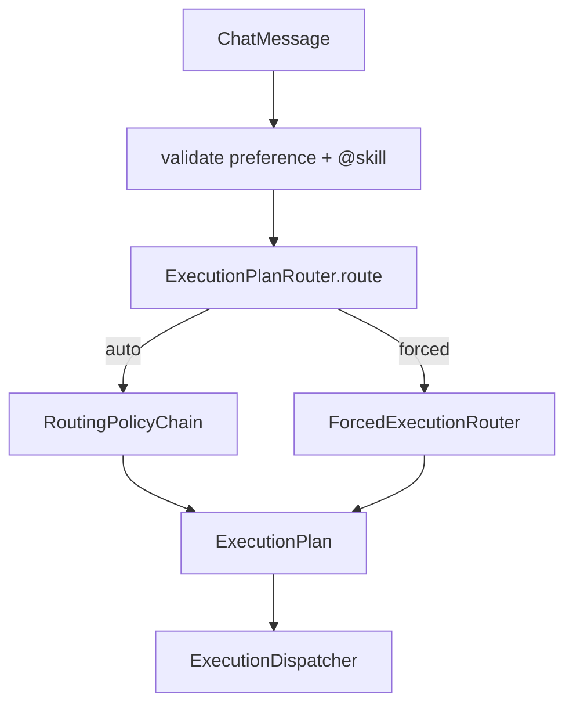

# Chat 输入框 · 执行模式选择器

> **阶段**：三/四交界 · **状态**：✅ P0 已完成  
> **触发**：用户需在发送前强制指定执行路径，而非完全依赖 Policy Chain  
> **关联**：[workflow-studio-design.md](./2026-06-25-workflow-studio-design.md)（`#` Workflow 显式绑定，与本方案互补）

---

## 1. 定位

在 Chat 输入框**底栏**增加执行模式选择，与现有 Policy Chain **并存**：

| UI 选项 | `executionPreference` | 后端 `ExecutionMode` | 路由行为 |
|---------|----------------------|----------------------|----------|
| **自动** | `auto`（默认） | 由链决定 | L0 Skill → L1 Structural → L2 GoldenRule → L3 LLM |
| **简单对话** | `simple-llm` | `SIMPLE_LLM` | 强制直答，跳过意图链 |
| **自主推理** | `react` | `REACT` | 强制 ReAct；仍允许 L0 `@skill` |
| **工作流** | `workflow` | `WORKFLOW` | 强制静态 workflow；**禁用 `@skill`** |
| **动态规划** | `plan-workflow` | `PLAN_WORKFLOW` | 强制 Planner DAG；仍允许 L0 `@skill` |

**不包含**：第五模式 `peer-collab`（阶段四，仅自动路由触发）。

### 1.1 与 Workflow Studio 的职责边界（2026-06-25 锁定）

| 能力 | 负责方 | 机制 |
|------|--------|------|
| **选执行路径**（走 workflow / react / plan…） | 本方案 · Chat 底栏 | `executionPreference` → `ForcedExecutionRouter` |
| **选具体 workflow 模板** | 阶段四 **4.13** · Workflow Studio | `/workflows` 管理 + `workflow-manager` `GET /api/workflows/catalog` |
| **Chat 内指定 workflow** | 4.13 · 对称 `@` | 正文 **`#workflowId`**（L0），**非**底栏二级 catalog 下拉 |
| **不指定模板、强制走 workflow** | 本方案 P0 ✅ | `preference=workflow` 且无 `#` / 无 `workflowId` → L2 规则 → L3 仅 WORKFLOW |

**禁止在本方案内**：底栏 workflow 子下拉、Chat 维护 workflow 列表 Map、第二套 catalog 源（与 [workflow-studio-design.md](./2026-06-25-workflow-studio-design.md) §3.4 冲突）。

---

## 2. 请求契约

### 2.1 SSE 发送体（BFF / Orchestrator 一致）

```json
{
  "content": "公司的年假制度是什么？",
  "conversationId": "uuid",
  "executionPreference": "auto",
  "workflowId": null
}
```

| 字段 | 类型 | 说明 |
|------|------|------|
| `executionPreference` | string | `auto` \| `simple-llm` \| `react` \| `workflow` \| `plan-workflow`；缺省 `auto` |
| `workflowId` | string? | **API/Studio 跳转专用**（如「在 Chat 试用」）；**非** Chat 底栏主交互。用户指定模板优先正文 `#id`（4.13）。未传时 `preference=workflow` 走 L2→L3 自动选型 |

`resumeMessageId` 续传**不传** preference，沿用首条 user 消息已落库的模式（可选 P1：持久化 `executionPreference` 到 message metadata，**不含** workflow catalog）。

### 2.2 与 `#workflow` 显式绑定的关系

| 机制 | 优先级 | 说明 |
|------|--------|------|
| `@skill` | L0（允许时） | 自主推理 / 动态规划 / 自动 |
| `#workflow` | L0（阶段四 4.13） | **Workflow Studio** 交付；catalog 来自 `workflow-manager`，与本 selector **互补、不重复** |
| **底栏 preference** | 发送前强制 | 覆盖 L1–L3；L0 skill 按模式表禁用/保留 |

P0 仅实现 **底栏 preference**，不实现 `#` 解析。**`#` 补全 / L0 绑定 / catalog API 一律归属 4.13**，不在本方案 P1/P2 重复建设。

**组合示例**（4.13 后）：

| 底栏 | 正文 | 行为 |
|------|------|------|
| 工作流 | `年假可以请几天` | L2/L3 自动选 knowledge-qa |
| 自动 / 工作流 | `#knowledge-qa 年假可以请几天` | L0 锁定 workflowId |
| 工作流 | `#finance-smart 待审批是否合规` | L0 锁定 + 强制 WORKFLOW 路径 |

---

## 3. 后端路由



### 3.1 `ForcedExecutionRouter`

| preference | 产出 | Skill L0 |
|------------|------|----------|
| `simple-llm` | `ExecutionPlan(SIMPLE_LLM, reason=user:forced-simple-llm)` | ❌ |
| `react` | L0 命中则 **合并** skill 参数，否则 forced react | ✅ |
| `plan-workflow` | L0 命中则 **合并** skill 参数，否则 forced plan | ✅ |
| `workflow` | `workflowId` 直出，或 L2→L3 仅选 WORKFLOW | ❌ |

**强制模式 + `@skill` 合并**（2026-06-25）：`react` / `plan-workflow` 下 L0 单步 `@skill` 默认产出 `REACT` plan，**不得覆盖** forced `mode` / `reason`；`skillOrFallback` 仅合并 `params`（如 `skillId`），保留 `user:forced-*` reason。

`workflow` 无 `workflowId` 时顺序：Nacos L2 规则 → `IntentRouter`；若仍非 `WORKFLOW` → **400**。

### 3.2 `@skill` 禁用

- **工作流 / 简单对话**：`SkillBindingRoutingPolicy` 见 `RoutingContext.allowsSkillBinding()==false` 直接 skip。
- **发送前校验**：正文以 `@skillId` 开头且 preference 禁用 skill → **400**「当前执行模式不支持 @Skill」。

Workflow 节点内 `params.skill`（YAML）不受影响。

### 3.3 Intent 时间线

强制模式 `ExecutionPlan.reason` 前缀 `user:forced-*`；`IntentLabelService` 读 Nacos：

```yaml
agent.timeline.intent.modes:
  simple-llm:
    forced-after: "{query}将按您指定的「简单对话」模式直接回复"
  react:
    forced-after: "{query}将按您指定的「自主推理」模式处理"
  workflow:
    forced-after: "{query}将按您指定的「工作流」模式处理"
  plan-workflow:
    forced-after: "{query}将按您指定的「动态规划」模式处理"
```

---

## 4. 前端 UI

### 4.1 布局（对齐参考图）

```
┌─ composer-inner ─────────────────────────────┐
│ ┌─ composer-box ───────────────────────────┐ │
│ │ [textarea 多行输入]                       │ │
│ ├─ composer-toolbar ────────────────────────┤ │
│ │ [模式 ▾ 自动]              [发送]        │ │
│ └──────────────────────────────────────────┘ │
└──────────────────────────────────────────────┘
```

### 4.2 组件

| 文件 | 职责 |
|------|------|
| `composables/useExecutionPreference.ts` | 状态 + `localStorage` 默认 |
| `components/chat/ExecutionModeSelector.vue` | 5 项下拉；文案 SSOT 见 `executionModes.ts` |
| `api/executionModes.ts` | 类型 + 标签 + `allowsSkillMention` |
| `ChatView.vue` | 底栏集成；workflow/simple 时隐藏 `@` 补全；**不**嵌入 workflow catalog 下拉（4.13 做 `#` suggest） |

### 4.3 交互

- 默认 **自动**；切换仅影响下一条消息。
- **回复中**：底栏 **保留** 模式选择器（可切换下一条 preference）；上方显示「AI 正在回复…」+ 停止，输入框仍可编辑/发送（非整体 disabled）。
- placeholder：`workflow` / `simple-llm` →「发消息，Enter 发送」；其余保留 `@` 提示（4.13 后合并为「@ Skill，# 工作流」，见 Workflow Studio §3.4）。

---

## 5. 实施分期

| 阶段 | 内容 | 状态 |
|------|------|:----:|
| **P0** | API 字段 + ForcedExecutionRouter + 底栏五模式 + workflow 禁 `@` | ✅ |
| **P1（可选）** | 会话级 `executionPreference` 记忆 + intent metadata 审计（`user:forced-*`） | ✅ |
| ~~P1~~ | ~~workflow 二级 catalog 选择~~ | **取消** → 移交 **4.13** `#` + `GET /api/workflows/catalog` |
| ~~P2~~ | ~~与 `#workflow` L0 绑定统一~~ | **取消** → 移交 **4.13.3 / 4.13.5 / 4.13.6** |
| **P2（可选）** | 设置页全局默认 `executionPreference`（`UserSettingsModal` + localStorage） | ✅ |

**workflow 模板选取 SSOT**：4.13 `workflow-manager` + Chat `#` 补全 + `/workflows` 管理页；与 Skill `@` 对称。

---

## 6. 验收（Golden）

| preference | 问题示例 | 预期 mode | @skill |
|------------|----------|-----------|--------|
| auto | 年假制度 | L2/L3 命中 knowledge-qa | ✅ |
| simple-llm | 写快速排序 | simple-llm | ❌ |
| react | 待审批是否合规 | react | ✅ |
| workflow | 年假制度 | workflow:knowledge-qa | ❌ |
| plan-workflow | 先查制度再查待审批 | plan-workflow | ✅ |
| workflow + `@x` | — | 400 | ❌ |

扩展现有 `docs/routing/routing-golden-set.md` **§J**（P0 ✅）。

---

## 7. 改动清单（P0）

| 层 | 文件 |
|----|------|
| 后端 | `ExecutionPreference`、`RoutingContext`、`ForcedExecutionRouter`、`ExecutionPlanRouter`、`ChatMessage`、`ChatController` |
| BFF | `ChatRequest` |
| Nacos | `agent.timeline.intent.modes.*.forced-after` |
| 前端 | `executionModes.ts`、`ExecutionModeSelector.vue`、`useExecutionPreference.ts`、`chatSessions.ts`、`ChatView.vue` |
| 测试 | `ForcedExecutionRouterTest` |

---

## 8. 实现补充（2026-06-25）

| 项 | 说明 |
|----|------|
| BFF 透传 | `ChatRequest.executionPreference` → orchestrator `ChatMessage`；改 BFF 后需重启 `:8001` |
| 日志 | orchestrator / BFF 请求日志含 `pref=simple-llm` 等，便于验收强制路由 |
| `@skill` + 强制 plan | `ForcedExecutionRouter.skillOrFallback` 保留 forced mode，仅合并 L0 params |
| UI 文案 | 模式名完整显示；「动态规划」（非「动态推理」）；Nacos `agent.timeline.intent.modes.plan-workflow.forced-after` 对齐 |
| Plan DAG | `planGraph.ts` 修复 **开始** 节点耗时展示（与 `PlanWorkflowPanel` 对齐） |
| RAG 抽屉 | `StepMetadata.rewriteInDetail` / `expandSectionTitle`；前端读 metadata，禁止关键字过滤 detail |
| 关联 RAG 链 | HyDE 改为首检 0 命中 fallback；见 `docs/rag/baseline-report.md` §Query 改写 |

---

## 9. 明确不做（避免与 4.13 冲突）

| 项 | 原因 | 替代 |
|----|------|------|
| 底栏 workflow 子下拉 / 二级 catalog | 与 Studio Chat `#` suggest 重复 | 4.13.5 `GET /api/workflows/catalog` |
| 前端维护 workflow 列表 Map | catalog SSOT 应在 workflow-manager | `CompositeWorkflowCatalog` |
| 在 selector 项目实现 `#` L0 | 应一次性在 orchestrator 4.13.3 | `WorkflowBindingParser` + Policy |
| Chat 内 workflow CRUD / 发布 | 管理面在 `/workflows` | Workflow Studio |
| 以 `workflowId` 请求字段为主 UX | 用户路径应对称 `@` → `#` | Studio「在 Chat 试用」可预填 `#id`；API 字段保留供跳转 |

---

## 10. P1/P2 实现（2026-06-25）

| 项 | 说明 |
|----|------|
| **P1 会话记忆** | `chat_conversation.execution_preference`（Flyway V9）；发送时 `ChatController` 落库；GET `/conversations` 返回；前端切换会话 `applyConversationPreference` |
| **P1 审计** | `RoutingAuditExtractor` → `AuditService.payload.routing`（`routingReason` / `userForced` / `skillId`） |
| **P2 全局默认** | `UserSettingsModal` → `setGlobalDefault` + localStorage；新会话/无记忆会话用全局默认 |
| **§J 单测** | `RoutingGoldenSetTest#forcedJ1`–`forcedJ6` |
| **Live** | `python scripts/verify_execution_preference.py` |
