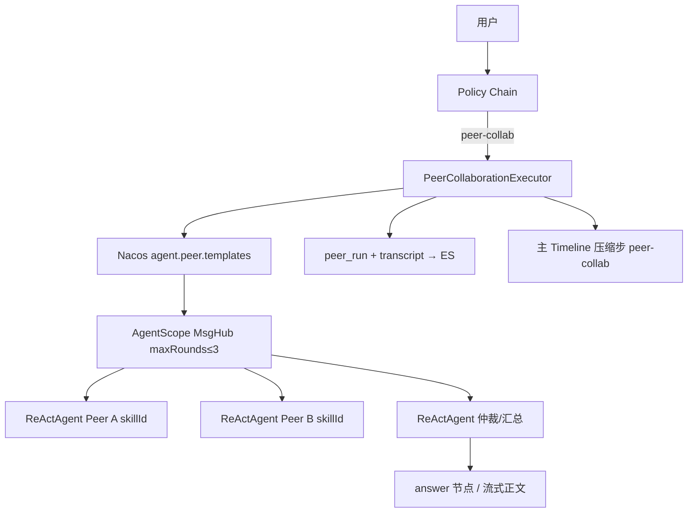
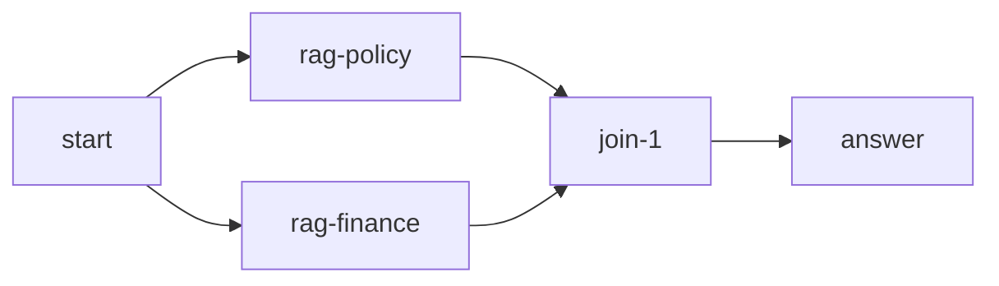
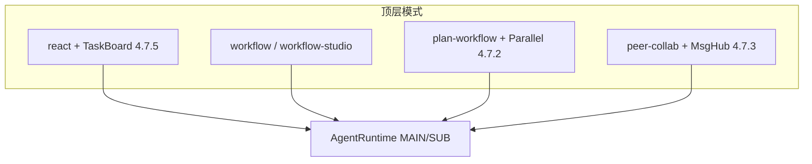

# 阶段四 · 多 Agent 能力接入边界（P0）

> **阶段**：四 · **任务卡**：4.7.2 / 4.7.3 / 4.7.5  
> **状态**：⬜ 按需（阶段三检查门通过后启动）  
> **平台 SSOT**：[phase4-platformization-design.md](./phase4-platformization-design.md) §4.7  
> **关联详设**：[peer-collab-routing-design.md](./2026-06-24-peer-collab-routing-design.md) · [react-taskboard-design.md](./2026-06-24-react-taskboard-design.md)

---

## 1. 总览

| P0 场景 | 手段 | AgentScope 1.0.7 | 自研 | 任务卡 |
|---------|------|:----------------:|:----:|--------|
| 多专家交叉验证 | 第五模式 `peer-collab` | **MsgHub** | Executor / 审计 / 路由 | **4.7.3** |
| Plan 并行 fan-out/join | DAG 并行节点 | FanoutPipeline（**不接**） | `ParallelNodeHandler` | **4.7.2** |
| ReAct 长任务软规划 | Todo 勾选 Timeline | PlanNotebook（**不接**） | `ManageTasksTool` | **4.7.5** |

**原则**：AgentScope 只承担「单会话内 Agent 协作原语」；Plan 落库、Timeline、路由、审计一律 Sunshine 引擎层。

---

## 2. PEER_COLLAB（4.7.3）— MsgHub 接入边界

### 2.1 定位

- **接**：`io.agentscope.core.pipeline.MsgHub` — 多 Peer 共享上下文、有限轮广播。
- **不接**：MsgHub 自由对话作为默认路径；禁止塞入 `react` / `plan-workflow`（**D10**）。

### 2.2 架构



### 2.3 与 `AgentRuntime` 衔接

| 组件 | 职责 |
|------|------|
| `PeerCollaborationExecutor` | 第五模式入口；读 template → 构建 MsgHub participants |
| `ReActAgentFactory` | 每个 Peer 角色独立 `AgentRunRequest(SUB)`，`MemoryContext.forSubAgent()` |
| `StepEventBridge` | Peer **不绑定** `assistantMsgId`；bridgeId = `peer-{runId}-{role}` |
| `AgentRuntime` | **不直接**走 MAIN 流；由 Executor 包装 MsgHub 轮次调用 `agent.call()` |
| 终态 answer | 仲裁 Agent 输出 → 复用 `WorkflowLlmStreamSupport` 或 dedicated answer 步 |

```java
/** 4.7.3c — Executor 伪代码 */
public Flux<StreamToken> execute(ExecutionStreamContext ctx, PeerTemplate tpl) {
    String runId = UUID.randomUUID().toString();
    List<ReActAgent> peers = tpl.roles().stream()
            .map(r -> agentFactory.create(toPeerRequest(runId, r, ctx)))
            .toList();
    ReActAgent moderator = agentFactory.create(toModeratorRequest(runId, tpl, ctx));
    try (MsgHub hub = MsgHub.builder()
            .name("peer-" + runId)
            .participants(peers)
            .maxRounds(tpl.maxRounds())
            .build()) {
        hub.enter().block();
        // 轮次引擎 + transcript 采集 → peerAuditService.save(...)
    }
    return synthesizeAnswer(moderator, ctx);
}
```

### 2.4 硬约束（与 D10 一致）

| 项 | 约束 |
|----|------|
| `maxRounds` | ≤ 3（Nacos 可配） |
| 主 Timeline | 仅 `intent` → `peer-collab`（压缩）→ `answer` |
| transcript | 完整写入 audit ES + `peer_run` 表 |
| 降级 | template 非法 → `react`；超时/无共识 → `plan-workflow` 或 `react` |

### 2.5 检查门

- [ ] `RoutingGoldenSetTest` §E 全 PASS
- [ ] 主 SSE 无 MsgHub raw 多轮；audit 可查 transcript
- [ ] Peer Agent 仅 Catalog 白名单 skill + tools

---

## 3. 并行子 Agent（4.7.2）— 自研 ParallelNodeHandler

### 3.1 为何不接 FanoutPipeline

| 维度 | FanoutPipeline | 自研 ParallelNode |
|------|----------------|-------------------|
| Plan 落库 | 无 | `execution_plan` + trace |
| 重试 / on-failure | 无 | 复用 `NodeRetryExecutor` |
| Timeline | 难对齐 V2 | 每分支 `node-{id}` + join 步 |
| 与静态 workflow 统一 | 否 | 与 Plan DAG UI 同构 |

### 3.2 Plan JSON 扩展

```json
{
  "nodes": [
    { "id": "rag-policy", "type": "rag", "displayName": "制度检索", "params": { "topK": "3" } },
    { "id": "rag-finance", "type": "rag", "displayName": "财务检索", "params": { "topK": "3" } },
    { "id": "join-1", "type": "join", "displayName": "汇总", "params": {} },
    { "id": "answer", "type": "answer", "displayName": "生成回答", "params": {} }
  ],
  "edges": [
    { "from": "start", "to": "rag-policy" },
    { "from": "start", "to": "rag-finance" },
    { "from": "rag-policy", "to": "join-1" },
    { "from": "rag-finance", "to": "join-1" },
    { "from": "join-1", "to": "answer" }
  ]
}
```

- **MVP**：仅支持 **fan-out → N 并行业务节点 → 单 join → answer**（无嵌套并行）。
- `join` 节点：收集 `{{node-id.output}}` 注入 answer prompt；无 LLM。

### 3.3 执行流



```java
/** WorkflowExecutor 扩展 — 伪代码 */
if (node.type().equals("parallel-fork")) {
    List<String> branchIds = plan.branchTargets(node.id());
    return Flux.merge(branchIds.stream().map(this::executeBranch).toList())
        .then(Mono.fromCallable(() -> ctx.snapshotForJoin(node.id())));
}
```

| 组件 | 变更 |
|------|------|
| `PlanValidator` | 校验 fan-out 入度、join 出度、无环 |
| `PlanLinearizer` | 并行段标记；UI 横向展示 |
| `WorkflowExecutor` | `ParallelForkNodeHandler` + `JoinNodeHandler` |
| `AgentNodeHandler` | 并行分支内 SUB 仍走 `AgentRuntime.run(SUB)` |

### 3.4 与 AgentRuntime

- 每个并行 `agent` 节点：**独立** `AgentRunRequest`，`parentRunId` 相同，`runId` 分支唯一。
- `StepEventBridge`：分支 `bridgeId = sub-{runId}` 互不干扰。
- join 后 answer：走现有 `answer` 节点 + `PlanAnswerPromptAssembler`。

### 3.5 检查门

- [ ] 双 rag 并行 → join → answer live 演示
- [ ] 一分支失败 → `on-failure` / `completed_with_errors` 与串行一致
- [ ] `PlanDagGraph` 并行段横向布局

---

## 4. ReAct TaskBoard（4.7.5）— 自研 ManageTasksTool

> 详设 SSOT：[react-taskboard-design.md](./2026-06-24-react-taskboard-design.md) · **D11**

### 4.1 为何不接 PlanNotebook

- AgentScope `PlanNotebook` 与 Sunshine `execution_plan` / Plan-Workflow **双 SSOT** 冲突。
- TaskBoard 是 **react 内软规划**，不新增顶层 mode；PlanNotebook 面向 Agent 内置 plan hint。

### 4.2 接入边界

| 层 | 实现 |
|----|------|
| AgentScope | `@Tool manage_tasks` 注册到 `DynamicToolkitFactory`（**不占** react.tools 白名单槽位） |
| 存储 | Redis `taskboard:{conversationId}:{assistantMsgId}` |
| Timeline | `TaskBoardTimelineSupport` 发 `tasks` 步；Hook **跳过** `manage_tasks` 的常规 tool 步 |
| AgentRuntime | MAIN 路径不变；`ReActAgentFactory` 条件注册 Tool |

```java
@Tool(name = "manage_tasks", description = "创建或更新当前会话任务列表…")
public String manageTasks(
        @ToolParam(name = "action") String action,  // merge | replace
        @ToolParam(name = "tasks") String tasksJson) {
    taskBoardService.apply(conversationId, assistantMsgId, action, tasksJson);
    taskBoardTimeline.emitTasksStep(...);
    return "ok";
}
```

### 4.3 Hook 衔接（`ProcessingStepHook`）

```java
if (event instanceof PreActingEvent pre) {
    if ("manage_tasks".equals(pre.getToolUse().getName())) {
        return Mono.just(event); // 跳过常规 tool 步
    }
    // …现有 tool 步逻辑
}
```

### 4.4 模式互斥

| 模式 | TaskBoard |
|------|-----------|
| `react` | ✅ 可选（`agent.execution.react.taskboard.enabled`） |
| `plan-workflow` | ❌ 禁止（有 plan 步即隐藏 tasks） |
| `peer-collab` | ❌ 禁止 |
| `workflow` | ❌ 禁止 |

### 4.5 检查门

- [ ] react 长任务出现 `tasks` 步 + 勾选态 SSE
- [ ] `manage_tasks` 不出现在 tool-* 常规步
- [ ] Redis 任务态可审计查询

---

## 5. 三能力共存关系



| 能力 | 触发 mode | 共用 |
|------|-----------|------|
| TaskBoard | `react` only | `DynamicToolkitFactory`、Hook |
| Parallel | `plan-workflow` / DB workflow | `WorkflowExecutor`、`PlanValidator` |
| MsgHub Peer | `peer-collab` only | `ReActAgentFactory`（SUB 构建） |

---

## 6. 实施顺序建议

1. **4.7.2** ParallelNode — 解锁 Workflow Studio 复杂图（见 [workflow-studio-design.md](./2026-06-25-workflow-studio-design.md)）
2. **4.7.5** TaskBoard — 独立，可与 4.7.2 并行
3. **4.7.3** PEER_COLLAB — 依赖 MsgHub 集成与 audit 表

---

## 7. 相关文档

- [2026-06-24-peer-collab-routing-design.md](./2026-06-24-peer-collab-routing-design.md)
- [2026-06-24-react-taskboard-design.md](./2026-06-24-react-taskboard-design.md)
- [2026-06-25-workflow-studio-design.md](./2026-06-25-workflow-studio-design.md)
- [2026-06-19-locked-architecture-decisions.md](./2026-06-19-locked-architecture-decisions.md) D10 / D11
