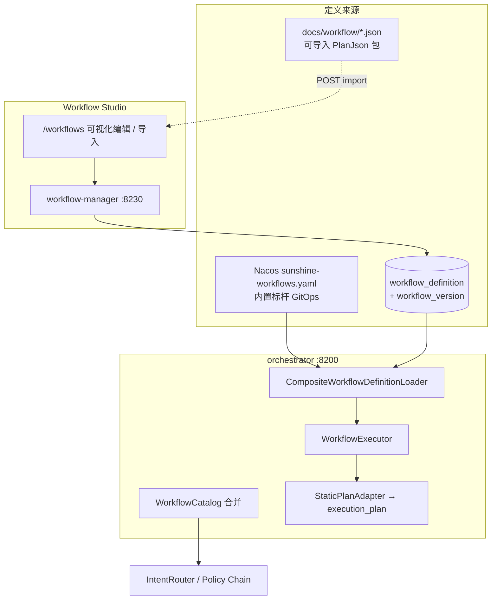
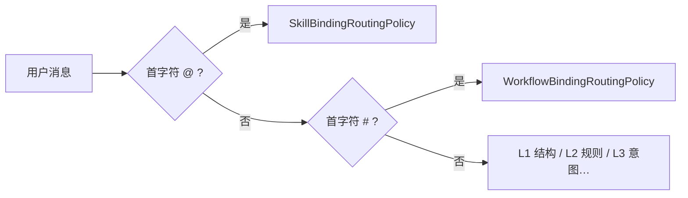
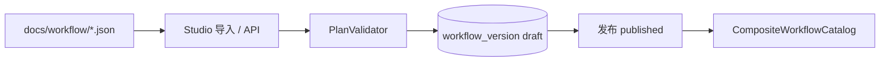

# 阶段四 · Workflow Studio（可视化工作流维护）

> **阶段**：四 · **任务卡**：**4.13**（新增）  
> **状态**：⬜ 按需  
> **触发**：静态 Nacos workflow 运维成本高；业务方需 Dify 式自助编排  
> **平台 SSOT**：[phase4-platformization-design.md](./phase4-platformization-design.md)  
> **对称参照**：[skills-management-ui-design.md](./skills-management-ui-design.md)（skill-manager + `/skills`）  
> **执行引擎复用**：`WorkflowExecutor` · `StaticPlanAdapter` · `PlanMaterializer` · `PlanValidator`

---

## 1. 定位

将当前 **Nacos `sunshine-workflows.yaml` 静态定义** 扩展为 **DB 托管 + 前端可视化编辑** 的双轨体系：

| 来源 | 用途 | 变更方式 |
|------|------|----------|
| **Nacos 内置** | 平台标杆 workflow（finance-*、knowledge-qa） | GitOps + `sync_nacos.py` |
| **DB Workflow Studio** | 租户/业务自助 workflow | `/workflows` 管理页 |
| **`docs/workflow/*.json`** | YAML → PlanJson **可导入包**（无 DB 种子） | 与 Nacos 同步维护；Studio **导入**入 DB |

**核心原则**：

1. **存储形态 = PlanJson 同构** — 与 `execution_plan.plan_json`、Planner 输出、Chat Plan DAG **同一 schema**。
2. **执行路径不变** — 路由命中 `workflow` → `WorkflowExecutor`；物化前经 `PlanMaterializer`。
3. **禁止第二套引擎** — 不引入 Dify 运行时；Sunshine DAG 引擎为唯一执行器。
4. **Chat 显式绑定与 Skill 区分** — **`@` 仅 Skill**，**`#` 仅 Workflow**（见 §3）。
5. **与 Chat 执行模式选择器正交** — 底栏 `executionPreference` 只选**执行路径**；**具体 workflow 模板**由本 Studio + `#` 负责，**禁止**在底栏再做 workflow catalog 下拉（见 [chat-execution-mode-selector-design.md](./2026-06-25-chat-execution-mode-selector-design.md) §1.1、§9）。

---

## 2. 与现有架构关系



### 2.1 已有能力可直接复用

| 现有组件 | Studio 中的角色 |
|----------|----------------|
| `PlanJson` / `PlanNode` / `PlanEdge` | DB 存储 schema |
| `PlanValidator.validate()` | 发布前校验 |
| `PlanMaterializer.materialize()` | 执行时 PlanJson → `WorkflowDefinition` |
| `StaticPlanAdapter.from()` | 执行实例落库 `execution_plan`（与静态 workflow 一致） |
| `PlanDagGraph.vue` | 只读预览 + **编辑态扩展** |
| `PlanWorkflowPanel.vue` | Chat 内 DAG 展示（不变） |

---

## 3. Chat 显式绑定：`@` Skill · `#` Workflow

> **与 Skill 对称、互不混用** — Skill 已有 `@` + `SkillBindingRoutingPolicy`（L0）；Workflow 新增 `#` + `WorkflowBindingRoutingPolicy`（L0）。

### 3.1 约定（SSOT）

| 前缀 | 绑定对象 | 执行 mode | 状态 |
|------|----------|-----------|:----:|
| **`@skillId`** | Skill（skill-manager Catalog） | `REACT` 或 `PLAN_WORKFLOW`（5B 多步 @） | ✅ |
| **`#workflowId`** | Workflow（Nacos + DB 合并 Catalog） | **`WORKFLOW`** | ⬜ 4.13 |

**禁止**：

- 用 `@` 指定 workflow（~~`@knowledge-qa`~~）
- 用 `#` 指定 skill（~~`#finance-analysis`~~）
- Nacos `explicit-workflows` 字符串匹配（`#` 由 **Parser + Catalog** 统一处理，无需额外 YAML 映射表）

### 3.2 句式示例

```
@finance-analysis 这笔报销是否合规       → REACT + skill=finance-analysis
@finance-analysis 先查制度再分析再润色     → PLAN_WORKFLOW 5B + skill=finance-analysis

#knowledge-qa 年假可以请几天               → WORKFLOW workflowId=knowledge-qa
#finance-smart 待审批报销是否合规           → WORKFLOW workflowId=finance-smart（显式指定，压过 L2/L3 自动选型）
```

- 前缀后 **第一个 token** 为 id；其余为 **effectiveQuery**（作为 `{{start.userQuery}}` / workflow 上下文）。
- 未知 Skill id → 400「未找到 Skill…请检查 /skills」；未知 Workflow id → 400「未找到工作流…请检查 /workflows」。

### 3.3 Policy Chain（L0 扩展）



| Policy | order | 正则 | 产出 |
|--------|:-----:|------|------|
| `SkillBindingRoutingPolicy` | 0 | `^@([\w\u4e00-\u9fff-]+)…` | `REACT` / `PLAN_WORKFLOW` |
| **`WorkflowBindingRoutingPolicy`** | 0 | `^#([\w\u4e00-\u9fff-]+)…` | **`WORKFLOW`** + `workflowId` |

**后端（对称 `SkillBindingParser`）**：

```java
// WorkflowBindingParser — 4.13.3
// Pattern: ^#([\w\u4e00-\u9fff-]+)(?:\s+(.*)|\s*)$
// resolveWorkflowId(token) → CompositeWorkflowCatalog（DB published + Nacos enabled）
// → ExecutionPlan(WORKFLOW, workflowId, params{effectiveQuery}, "workflow:#mention")
```

**与 Skill L0 优先级**：首字符互斥，无「同时 @ 又 #」；`#` 命中后 **不再**走 L1/L2/L3（与 `@` 锁定 skill 同理）。

**Timeline**：intent metadata 含 `workflowId`；`reason=workflow:#mention`；after 仍用 catalog `displayName`。

### 3.4 前端 Chat（对称 `@` 补全）

> **边界**：workflow catalog **仅**走 `workflow-manager` `GET /api/workflows/catalog`；**不在** Chat 底栏 `ExecutionModeSelector` 内嵌二级下拉（已取消，见 chat-selector §9）。

| 能力 | Skill（✅ 现有） | Workflow（⬜ 4.13.5） |
|------|----------------|----------------------|
| 触发字符 | `@` | `#` |
| 下拉 API | `GET /api/skills/catalog` | `GET /api/workflows/catalog` |
| 插入 | `@skillId ` | `#workflowId ` |
| 列表项 | `@id` + displayName | `#id` + displayName |
| 「在 Chat 试用」 | — | Studio 跳转 `#workflowId ` |

**Composer placeholder**（合并一行）：

`发消息，Enter 发送；@ 指定 Skill，# 指定工作流`

**实现要点**（`ChatView.vue`）：

- `HASH_PATTERN = /#([\w\u4e00-\u9fff-]*)$/` — 与现有 `@` 正则对称
- `workflowSuggest` 下拉 UI 复用 `.skill-suggest` 样式，class 可加 `.workflow-suggest`
- `@` 与 `#` **不同时**出现 suggest（检测末尾 active 前缀）

---

## 4. 数据模型

### 4.1 表结构（workflow-manager）

**`workflow_definition`**

| 列 | 类型 | 说明 |
|----|------|------|
| `id` | VARCHAR(64) PK | 如 `knowledge-qa` |
| `tenant_id` | VARCHAR(64) | 租户隔离 |
| `display_name` | VARCHAR(128) | 中文名 |
| `description` | VARCHAR(512) | Catalog / 路由描述 |
| `mode` | VARCHAR(24) | 固定 `workflow` |
| `enabled` | BOOLEAN | 是否可被 `#` / L3 选中 |
| `active_version` | BIGINT | 生效版本 |
| `source` | VARCHAR(16) | `import` \| `studio` |
| `maintainer` | VARCHAR(64) | — |
| `created_at` / `updated_at` | TIMESTAMP | — |

**`workflow_version`**

| 列 | 类型 | 说明 |
|----|------|------|
| `workflow_id` | VARCHAR(64) FK | — |
| `version` | INT | 递增 |
| `status` | VARCHAR(16) | `draft` \| `published` |
| `plan_json` | MEDIUMTEXT | PlanJson 全文 |
| `catalog_meta` | JSON | `examples[]`、`nodes[]` 摘要 |
| `published_at` | TIMESTAMP | — |

### 4.2 PlanJson 存储约定

DB 存 **可执行完整 Plan**（含 `start` + 业务节点 + `answer`）。Studio 保存时 Normalizer 补 `start`；`answer.params.prompt` 由 Studio 编辑（不走 `PlanAnswerPromptAssembler`）。

---

## 5. 导入包：`docs/workflow/*.json`

> **无 Flyway / 无 DB 种子**。将现有 Nacos YAML 转为 PlanJson 导入包，供 Studio 或 API 一次性导入。

### 5.1 目录（SSOT）

```
docs/workflow/
├── README.md
├── manifest.json          # 批量导入清单
├── knowledge-qa.json
├── finance-list.json
├── finance-smart.json
└── finance-summary.json
```

内容与 `docs/nacos/sunshine-workflows.yaml` **一一对应**；YAML 变更时同步更新 JSON。

### 5.2 单文件 Schema（`schemaVersion: 1`）

```json
{
  "schemaVersion": 1,
  "workflowId": "knowledge-qa",
  "displayName": "知识库问答",
  "description": "…",
  "mode": "workflow",
  "enabled": true,
  "source": "import",
  "catalog": {
    "examples": ["年假可以请几天"],
    "nodeSummary": ["start", "rag", "answer"]
  },
  "plan": {
    "planId": null,
    "reason": "导入自 sunshine-workflows.yaml · knowledge-qa",
    "nodes": [ … ],
    "edges": [ … ]
  }
}
```

| 字段 | 说明 |
|------|------|
| 顶层 | Catalog 元数据 + `plan`（PlanJson 同构，含 `start` / `answer`） |
| `source` | 固定 `import`（区别于用户在 Studio 创建的 `studio`） |
| `catalog.nodeSummary` | 对应 YAML catalog `nodes[]`，供路由摘要 |

### 5.3 导入流程



| 入口 | 行为 |
|------|------|
| Studio **导入 JSON** | 选单文件或 `manifest.json` 批量 → 草稿 → 人工发布 |
| `POST /api/workflows/import` | 同上（4.13.2） |
| **运行时默认** | 仍走 **Nacos**；仅 DB 发布且 `enabled=true` 后覆盖同 ID |

**禁止**：Flyway 自动灌入 workflow；启动时静默写 DB。

### 5.4 Chat / 验收

- 示例：`#knowledge-qa 年假可以请几天`（Nacos 或导入 DB 均可）
- 导入验收：Studio 导入 `knowledge-qa.json` → 发布 → `#knowledge-qa …` 命中 DB 定义

---

## 6. 后端服务

### 6.1 workflow-manager (:8230)

CRUD · 发布 · **导入** · `GET /api/workflows/catalog` · PlanValidator 预检。

### 6.2 orchestrator 改造

- **`CompositeWorkflowDefinitionLoader`**：DB published → `PlanMaterializer`；否则 Nacos
- **`CompositeWorkflowCatalog`**：合并 Catalog 供 `#` 解析 + L3 意图
- **`WorkflowBindingParser` + `WorkflowBindingRoutingPolicy`**：L0 `#`（§3.3）

执行路径不变：`WORKFLOW` → `WorkflowExecutor` → `StaticPlanAdapter` → `execution_plan` 落库。

### 6.3 API 清单

| 方法 | 路径 | 说明 |
|------|------|------|
| GET | `/api/workflows/catalog` | Chat `#` 补全 + orchestrator 路由 |
| POST | `/api/workflows/import` | 导入 `docs/workflow` 格式 JSON |
| GET | `/api/workflows/{id}/versions/{v}/plan` | Loader 拉定义 |
| … | 见 §9 子任务 | Admin CRUD / publish / validate |

---

## 7. 前端 Workflow Studio（`/workflows`）

类 Dify / 对称 `/skills`：列表 + DAG 编辑器 + 节点属性面板。节点 type 与引擎一致（`rag` / `tool` / `agent` / `answer`）；工具 Skill 下拉走 Catalog API。

**「在 Chat 中试用」**：跳转 `/chat` 并预填 `#${workflowId} `（**不用**底栏 workflow 子选；可选 API `workflowId` 字段供程序化跳转，主 UX 为 `#`）。

---

## 8. 动态加载与缓存

- Catalog Caffeine 60s；发布 evict
- `#` 路由 **无需** restart orchestrator

---

## 9. Nacos 与 DB 优先级

DB published 且 `enabled=true` 同 ID **覆盖** Nacos。`enabled=false` 回退 Nacos。

---

## 10. 子任务拆分（4.13）

| 编号 | 内容 | 产出 |
|------|------|------|
| **4.13.1** | Flyway + 表（**无 workflow 种子**） | workflow-manager |
| **4.13.2** | Admin / **Import** / Catalog API + PlanValidator | workflow-manager |
| **4.13.3** | CompositeLoader + **`WorkflowBindingParser/Policy`** + Catalog 合并 | orchestrator |
| **4.13.4** | BFF/Gateway 透传 | bff |
| **4.13.5** | `/workflows` 编辑器 + **JSON 导入** + Chat `#` 补全（**非**底栏 catalog 下拉） | sunshine-ui |
| **4.13.6** | golden-set **§I Workflow # 绑定** + `RoutingGoldenSetTest` | test |
| **4.13.7** | 并行节点编辑（依赖 4.7.2） | UI |

---

## 11. 检查门

- [ ] 导入 `docs/workflow/knowledge-qa.json` → 发布 → `#knowledge-qa 年假…` 命中 DB 定义
- [ ] 未导入时 `#knowledge-qa …` 仍走 Nacos（行为不变）
- [ ] `@finance-analysis …` 行为与现网一致（Skill L0 不受影响）
- [ ] `#unknown-flow` → 400，文案指向 `/workflows`
- [ ] Chat 输入 `#` 出现 workflow 下拉；输入 `@` 仅 skill 下拉
- [ ] Studio 发布 → 60s 内 `#my-flow` 可命中

---

## 12. 非目标

- `@` 触发 workflow / `#` 触发 skill
- Nacos `explicit-workflows` 字符串表（`#` 走 Parser）
- Dify 外部运行时

---

## 13. 相关文档

- [routing-golden-set.md](../../routing/routing-golden-set.md) §I
- [workflow/README.md](../../workflow/README.md) — 导入包 SSOT
- [2026-06-25-phase4-agent-capabilities-boundaries.md](./2026-06-25-phase4-agent-capabilities-boundaries.md)
- [skills-management-ui-design.md](./skills-management-ui-design.md)
