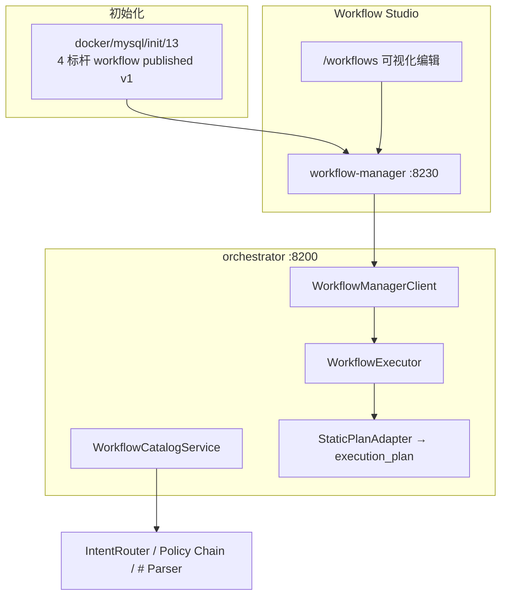

# 阶段四 · Workflow Studio（可视化工作流维护）

> **阶段**：四 · **任务卡**：**4.13**  
> **状态**：⬜ 进行中（4.13.1 ✅ 表结构；4.13.2+ 待实施）  
> **触发**：业务方需 Dify 式自助编排；**废弃 Nacos workflow 双轨**  
> **修订（2026-07-11）**：Workflow **完全 DB 单轨** — 去掉 Nacos `sunshine-workflows.yaml` 与一切兼容/回退逻辑；标杆 workflow 由 **MySQL init 种子** 初始化  
> **平台 SSOT**：[phase4-platformization-design.md](./phase4-platformization-design.md)  
> **实施计划**：[2026-07-11-workflow-studio.md](../plans/2026-07-11-workflow-studio.md)  
> **对称参照**：[skills-management-ui-design.md](./skills-management-ui-design.md)（skill-manager + `/skills`）  
> **执行引擎复用**：`WorkflowExecutor` · `StaticPlanAdapter` · `PlanMaterializer` · `PlanValidator`

---

## 1. 定位

将 workflow 定义从 **Nacos YAML** 迁移为 **`workflow-manager` DB 唯一 SSOT**，并提供 Dify 式可视化编辑（`/workflows`）。

| 来源 | 用途 | 变更方式 |
|------|------|----------|
| **MySQL init 种子** | 平台标杆 workflow（4 条：knowledge-qa、finance-*） | `docker/mysql/init/13-sunshine-workflow-manager.sql` |
| **DB Workflow Studio** | 租户/业务自助 workflow | `/workflows` 管理页 CRUD + 发布 |
| **`docs/workflow/*.json`** | 种子/迁移 **文档模板**（非运行时） | 与 init SQL 同构；运维可用 `POST /api/workflows/import` |

**核心原则**：

1. **存储形态 = PlanJson 同构** — 与 `execution_plan.plan_json`、Planner 输出、Chat Plan DAG **同一 schema**。
2. **执行路径不变** — 路由命中 `workflow` → `WorkflowExecutor`；物化前经 `PlanMaterializer`。
3. **禁止第二套引擎** — 不引入 Dify 运行时；Sunshine DAG 引擎为唯一执行器。
4. **DB 唯一 SSOT** — orchestrator **仅**经 `WorkflowManagerClient` 读 published 定义；**禁止** Nacos 回退、`Composite*` 合并逻辑。
5. **Chat 显式绑定** — **`@` 仅 Skill**，**`#` 仅 Workflow**（见 §3）。
6. **与 Chat 执行模式选择器正交** — 底栏 `executionPreference` 只选**执行路径**；**具体 workflow 模板**由 Studio + `#` 负责（见 [chat-execution-mode-selector-design.md](./2026-06-25-chat-execution-mode-selector-design.md) §1.1、§9）。

---

## 2. 与现有架构关系


```mermaid
flowchart TB
    subgraph init [初始化]
        SEED["docker/mysql/init/13<br/>4 标杆 workflow published v1"]
    end
    subgraph admin [Workflow Studio]
        UI["/workflows 可视化编辑"]
        WM[workflow-manager :8230]
    end
    subgraph orch [orchestrator :8200]
        WMC[WorkflowManagerClient]
        WC[WorkflowCatalogService]
        WE[WorkflowExecutor]
        SPA[StaticPlanAdapter → execution_plan]
    end
    SEED --> WM
    UI --> WM
    WM --> WMC
    WMC --> WE
    WC --> IR[IntentRouter / Policy Chain / # Parser]
    WE --> SPA
```

### 2.1 已有能力可直接复用

| 现有组件 | Studio 中的角色 |
|----------|----------------|
| `PlanJson` / `PlanNode` / `PlanEdge` | DB 存储 schema |
| `PlanValidator.validate()` | 发布前校验 |
| `PlanMaterializer.materialize()` | 执行时 PlanJson → `WorkflowDefinition` |
| `StaticPlanAdapter.from()` | 执行实例落库 `execution_plan` |
| `PlanDagGraph.vue` | 只读预览 + **编辑态缩略图** |
| `PlanWorkflowPanel.vue` | Chat 内 DAG 展示（不变） |

### 2.2 废弃组件（4.13 移除）

| 废弃 | 替代 |
|------|------|
| `docs/nacos/sunshine-workflows.yaml` | DB `workflow_version.plan_json` |
| `WorkflowProperties`（Nacos 绑定） | `WorkflowManagerClient` |
| `WorkflowDefinitionLoader`（读 Nacos） | `WorkflowManagerClient.loadPublished(id)` |
| `CompositeWorkflowDefinitionLoader` | **不实现** |
| `CompositeWorkflowCatalog` | `WorkflowCatalogService`（workflow-manager HTTP + 本地缓存） |
| orchestrator `optional:nacos:sunshine-workflows.yaml` | 从 `application.yml` 删除 |
| `sync_nacos.py` 中的 `sunshine-workflows.yaml` | 删除 |

---

## 3. Chat 显式绑定：`@` Skill · `#` Workflow

> **与 Skill 对称、互不混用** — Skill 已有 `@` + `SkillBindingRoutingPolicy`（L0）；Workflow `#` + `WorkflowBindingRoutingPolicy`（L0）。

### 3.1 约定（SSOT）

| 前缀 | 绑定对象 | 执行 mode | 状态 |
|------|----------|-----------|:----:|
| **`@skillId`** | Skill（skill-manager Catalog） | `REACT` / `PLAN_WORKFLOW` | ✅ |
| **`#workflowId`** | Workflow（workflow-manager DB catalog） | **`WORKFLOW`** | ⬜ 4.13 |

**禁止**：

- 用 `@` 指定 workflow
- 用 `#` 指定 skill
- Nacos `explicit-workflows` 或任何 YAML 字符串表

### 3.2 句式示例

```
#knowledge-qa 年假可以请几天               → WORKFLOW workflowId=knowledge-qa
#finance-smart 待审批报销是否合规           → WORKFLOW workflowId=finance-smart（压过 L2/L3）
```

- 前缀后 **第一个 token** 为 id；其余为 **effectiveQuery**（`{{start.userQuery}}`）。
- 未知 Workflow id → 400「未找到工作流…请检查 /workflows」；**无 Nacos 回退**。

### 3.3 Policy Chain（L0 扩展）

```java
// WorkflowBindingParser — 4.13.3
// Pattern: ^#([\w\u4e00-\u9fff-]+)(?:\s+(.*)|\s*)$
// resolveWorkflowId(token) → WorkflowCatalogService（DB enabled + published）
// → ExecutionPlan(WORKFLOW, workflowId, params{effectiveQuery}, "workflow:#mention")
```

### 3.4 前端 Chat（对称 `@` 补全）

| 能力 | Skill（✅） | Workflow（⬜ 4.13.5） |
|------|------------|----------------------|
| 触发字符 | `@` | `#` |
| 下拉 API | `GET /api/skills/catalog` | `GET /api/workflows/catalog` |
| 插入 | `@skillId ` | `#workflowId ` |

**Composer placeholder**：`发消息，Enter 发送；@ 指定 Skill，# 指定工作流`

---

## 4. 数据模型

### 4.1 表结构（workflow-manager）

**`workflow_definition`** — 见 `docker/mysql/init/13-sunshine-workflow-manager.sql`

**`workflow_version`** — `plan_json`（PlanJson 全文）、`catalog_meta`（`examples[]`、`nodeSummary[]`）

### 4.2 PlanJson 存储约定

DB 存 **可执行完整 Plan**（含 `start` + 业务节点 + `answer`）。Studio 保存时 Normalizer 补 `start`；`answer.params.prompt` 由 Studio 编辑（**不走** `PlanAnswerPromptAssembler`）。

### 4.3 节点 params 与项目配置对齐

| type | params 关键字段 | 配置来源 |
|------|----------------|----------|
| **rag** | `topK` | Studio 表单 |
| **tool** | `tool`（Catalog ID `sdk__*` / `mcp__*`）、业务参数 | `GET /api/tools/catalog` |
| **agent** | `skill`、`query`、`context`、`tools[]`、`maxIters`、`systemOverlay` | `GET /api/skills/catalog` + tools catalog |
| **answer** | `prompt`（含 `{{node-id.output}}`） | Studio 文本编辑 |
| **重试（可选）** | `retry.maxAttempts`、`retry.backoffMs`、`retry.onFailure` | Studio 高级面板；全局默认见 `/tools` `execution_mode_policy` |

**变量引用 SSOT**：`{{start.userQuery}}` · `{{plan.params.*}}` · `{{node-id.output}}` · `{{node-id.answer}}`

### 4.4 MySQL init 种子（标杆 4 条）

`docker/mysql/init/13-sunshine-workflow-manager.sql` 追加 **published v1**（内容同 `docs/workflow/*.json`，工具 ID 须为 Catalog 格式）：

| workflowId | displayName |
|------------|-------------|
| `knowledge-qa` | 知识库问答 |
| `finance-list` | 财务待办查询 |
| `finance-smart` | 财务智能分析 |
| `finance-summary` | 财务汇总统计 |

- `enabled=1`，`active_version=1`，`source=seed`
- **禁止**各模块 Flyway 灌入；**禁止**启动时静默写 DB

---

## 5. `docs/workflow/*.json`（文档 / 迁移模板）

> **非运行时 SSOT**。供 init SQL 编写参考、Studio 批量导入、环境迁移。

```
docs/workflow/
├── README.md
├── manifest.json
├── knowledge-qa.json
├── finance-list.json
├── finance-smart.json
└── finance-summary.json
```

单文件 Schema（`schemaVersion: 1`）不变；`reason` 可写「种子来源 · workflowId」。**不再**要求与 Nacos YAML 同步。

---

## 6. 后端服务

### 6.1 workflow-manager (:8230)

CRUD · 发布 · 可选 import · `GET /api/workflows/catalog` · `GET /api/workflows/{id}/published` · PlanValidator 预检。

发布时 Redis `workflow-catalog-changed`（对称 `tool-catalog-changed`）。

### 6.2 orchestrator 改造

- **`WorkflowManagerClient`**：HTTP 拉 catalog + published PlanJson → `PlanMaterializer` → `WorkflowDefinition`
- **`WorkflowCatalogService`**：缓存 catalog；供 `#` 解析、L3 `{{workflow-catalog}}`、`WorkflowCatalog.sanitize`
- **`WorkflowBindingParser` + `WorkflowBindingRoutingPolicy`**：L0 `#`
- **移除** `WorkflowProperties`、`WorkflowDefinitionLoader`（Nacos 版）
- **`NodeRetryPolicyResolver`**：DB workflow 启用与 plan-workflow 相同的节点 `retry.*` + `execution_mode_policy`（去掉 `planWorkflow=false` 时 `noRetry` 硬编码）

执行路径不变：`WORKFLOW` → `WorkflowExecutor` → `StaticPlanAdapter` → `execution_plan` 落库。

### 6.3 API 清单

| 方法 | 路径 | 说明 |
|------|------|------|
| GET | `/api/workflows/catalog` | Chat `#` + L3 prompt + 路由校验 |
| GET | `/api/workflows/{id}/published` | orchestrator 拉生效 PlanJson |
| GET | `/api/workflows` | Studio 列表 |
| POST | `/api/workflows` | 新建 |
| PUT | `/api/workflows/{id}/draft` | 保存草稿 |
| POST | `/api/workflows/{id}/publish` | PlanValidator → published |
| POST | `/api/workflows/import` | JSON 导入（运维迁移，非必需） |

---

## 7. 前端 Workflow Studio（`/workflows`）

类 Dify / 对称 `/skills`：左列表 + 中画布（`@vue-flow/core` 拖拽）+ 右节点属性面板。视觉与 Chat `PlanDagGraph` / `PlanNodeDrawer` 对齐（`--sun-black` + 边框分区）。

### 7.1 MVP 节点类型（线性 DAG）

`start` / `rag` / `tool` / `agent` / `answer` — 与 `WorkflowNodeType` 一致。

### 7.2 高级图（引擎先行，Studio 后开）

| 节点 type | 依赖任务卡 | 约束 |
|-----------|------------|------|
| `parallel-fork` + `join` | **4.7.2** | 单层 fan-out → N 并行 → 单 join |
| `if-else` | **4.6.1** | 结构化条件算子（`empty`/`not_empty`/`contains`/`eq`） |
| `loop` | **4.6 扩展** | `maxIterations` 硬顶（默认 3，Nacos 可配，硬顶 5）；受控回边，禁止任意环 |

Studio **禁止**编辑引擎尚未实现的节点类型。

---

## 8. 动态加载与缓存

- orchestrator Catalog Caffeine 60s；订阅 `workflow-catalog-changed` evict
- Studio 发布 → **无需** restart orchestrator
- `enabled=false` 的 workflow：**不可**被 `#` / L3 选中；**无** Nacos 回退

---

## 9. 子任务拆分（4.13）

| 编号 | 内容 | 产出 |
|------|------|------|
| **4.13.1** | 表结构 | workflow-manager ✅ |
| **4.13.1b** | **MySQL init 种子**（4 标杆 published v1） | `13-sunshine-workflow-manager.sql` |
| **4.13.2** | Admin / Catalog / Published API + PlanValidator | workflow-manager |
| **4.13.2b** | orchestrator 移除 Nacos workflow + `WorkflowManagerClient` | orchestrator |
| **4.13.3** | `WorkflowCatalogService` + **`WorkflowBindingParser/Policy`** | orchestrator |
| **4.13.3b** | DB workflow 节点重试策略对齐 | orchestrator `NodeRetryPolicyResolver` |
| **4.13.4** | BFF/Gateway 透传 | bff |
| **4.13.5** | `/workflows` 线性编辑器 + Chat `#` 补全 | sunshine-ui |
| **4.13.6** | golden-set **§I** + live 验收 | test + `verify_workflow_studio_live.py` |
| **4.13.7** | 并行/条件/循环节点编辑（依赖 4.7.2 / 4.6.1 / loop） | UI + 引擎 |

---

## 10. 检查门

- [ ] 新环境仅 MySQL init，**不**配置 Nacos workflow，`#knowledge-qa 年假…` 命中 DB
- [ ] orchestrator **无** `sunshine-workflows.yaml` 依赖；`sync_nacos.py` 已移除该项
- [ ] `@finance-analysis …` 行为不变（Skill L0 不受影响）
- [ ] `#unknown-flow` → 400，文案指向 `/workflows`
- [ ] Chat `#` / `@` 下拉互不干扰
- [ ] Studio 发布新版本 → 60s 内 `#` 命中新定义
- [ ] 节点 `retry.maxAttempts=2` 执行后 DAG 角标 `×2`
- [ ] `routing-golden-set` §B–D、§I 全 PASS（数据源为 DB）

---

## 11. 非目标

- Nacos workflow 双轨 / DB 覆盖 Nacos / enabled=false 回退 Nacos
- `@` 触发 workflow / `#` 触发 skill
- Dify 外部运行时
- Studio 画出引擎未实现的 parallel / if-else / loop 节点（须引擎先行）

---

## 12. 相关文档

- [2026-07-11-workflow-studio.md](../plans/2026-07-11-workflow-studio.md) — 实施计划
- [routing-golden-set.md](../../routing/routing-golden-set.md) §I
- [workflow/README.md](../../workflow/README.md)
- [plan-workflow-retry-degradation.md](../../routing/plan-workflow-retry-degradation.md)
- [2026-06-25-phase4-agent-capabilities-boundaries.md](./2026-06-25-phase4-agent-capabilities-boundaries.md)
- [skills-management-ui-design.md](./skills-management-ui-design.md)
