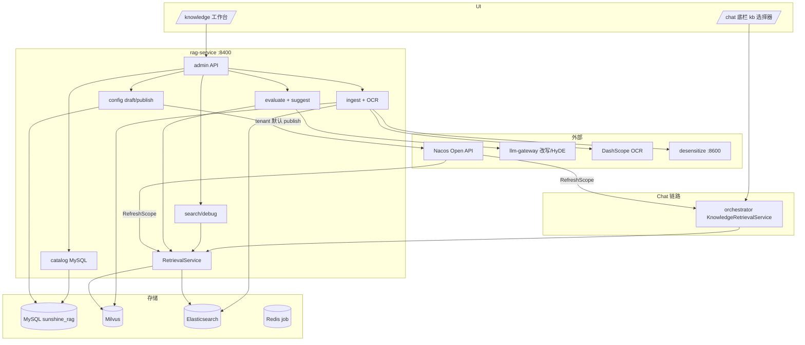

# RAG 知识库工作台设计（SSOT）

> **状态**：⬜ 阶段四 4.1 + 4.2 待实施  
> **路由**：`/knowledge` · **后端**：rag-service :8400（**不新增微服务**）· **前端**：直连 Gateway :8000 或 `VITE_RAG_API_BASE`  
> **关联**：[phase4-platformization-design.md](./phase4-platformization-design.md) §4.1–4.2 · [skills-management-ui-design.md](./skills-management-ui-design.md)（UI 范式）· `docs/rag/golden-set.yaml` · `scripts/rag_eval.py`

---

## 0. 需求决策（Brainstorming 已定稿）

| # | 议题 | 决策 |
|---|------|------|
| 1 | 交付范围 | **做全**：4.1 RAG 平台化 + 4.2 OCR L1，不做 MVP 裁剪 |
| 2 | 服务边界 | **不新增微服务**；管理 API 全部内聚 `rag-service :8400` |
| 3 | 知识库模型 | **多 kb + tenant 默认库**（C） |
| 4 | 参数作用域 | **tenant 默认 + kb 可选覆盖**（B）；未覆盖字段继承 |
| 5 | 元数据存储 | rag-service 内 **MySQL `sunshine_rag`** + Flyway（A） |
| 6 | 参数发布 | **硬门禁**（A）：smoke 评测 Recall@5 ≥ 基线才允许 publish |
| 7 | OCR 入库 | **预览确认 + 置信度分流**（D） |
| 8 | Chat 绑库 | 底栏 **会话级 kb 下拉**（B）；本阶段不做 `#kb` 语法 |
| 9 | 权限 | **暂不 RBAC**（C）；`X-Admin-Token` + Gateway JWT |
| 10 | Nacos 发布 | **Nacos Open API** 直接 patch（方案 1） |

---

## 1. 目标与非目标

### 1.1 目标

将 `/knowledge` 从「Markdown 粘贴 + 简单检索」升级为**一站式知识库运营工作台**：

- 多格式文档入库（含 PDF/图片 OCR）
- 多知识库 namespace + 文档版本
- 动态参数（rag 检索/rerank + orchestrator 改写 prompt + chunk）草稿→评测→发布
- 检索 debug 瀑布 + golden-set 批量评测 + LLM 优化建议
- Badcase 回流、A/B 对比、评测周报
- Chat 底栏 kb 选择器，会话级绑定默认库

### 1.2 非目标（本 spec）

- 新建 `rag-manager` 或独立微服务
- Chat `#kb` 绑定（对称 4.13 workflow `#`）
- 4.3 L2 版面理解全量（quarantine 队列本 spec 仅 L1 前置）
- 4.4 Vision 对话 L3
- 图搜图 / 视频音频
- 本阶段 RBAC 角色细分（后续迭代）

---

## 2. 架构



| 原则 | 说明 |
|------|------|
| **执行引擎不变** | 检索仍走 `RetrievalService`；Chat 改写链仍在 orchestrator |
| **Nacos SSOT** | tenant 级默认参数运行时以 Nacos 为准；UI publish 写 Nacos |
| **kb 覆盖** | 存 MySQL；检索/debug/评测按 `tenantId + kbId` 合并 effective config |
| **禁止** | 前端硬编码 RAG 参数默认值 Map；禁止对模型输出做截断兜底 |

---

## 3. 页面结构

```
┌─────────────────────────────────────────────────────────────────────┐
│ 知识库管理              [租户▼] [知识库▼] [设默认] [刷新]              │
├──────────────┬──────────────────────────────────────────────────────┤
│ 左栏         │ 右栏 Tab                                              │
│ · kb 列表    │ [文档] [入库] [参数] [检索调试] [评测] [Badcase]        │
│ · 文档树     │                                                       │
│ · 版本/状态  │  Tab 内容区（宽布局，参照 SkillsView detail-panel）    │
└──────────────┴──────────────────────────────────────────────────────┘
```

| Tab | 组件 | 说明 |
|-----|------|------|
| **文档** | `KbDocPanel` | 版本列表、chunk 预览、失效/重索引 |
| **入库** | `KbIngestPanel` | 拖拽上传；子 Tab：进行中 / 待审核 / 已完成 |
| **参数** | `KbConfigPanel` | 切换「租户默认 / 当前 kb」；Preset；草稿→发布 |
| **检索调试** | `KbDebugPanel` | 单 query 瀑布 + 改写 trace |
| **评测** | `KbEvalPanel` | 跑分、报告、A/B、优化建议、周报入口 |
| **Badcase** | `KbBadcasePanel` | 标注 relevant_docs → 导出 custom suite |

**风格**：Codex 中性灰（`--sun-*`）；主按钮 `type="warning"` + `kb-action-btn`；代码/prompt 用 JetBrains Mono。

**禁止**：前端维护检索策略话术 Map；步骤文案与本页无关。

---

## 4. 概念与术语

| 概念 | UI | 存储 |
|------|-----|------|
| **Tenant** | 顶栏租户选择器 | `x-tenant-id` |
| **KnowledgeBase (kb)** | 左栏 kb 列表 + 顶栏下拉 | MySQL `knowledge_base` |
| **默认库** | kb 卡片 Tag「默认」 | `knowledge_base.is_default` |
| **Document** | 文档树节点 | MySQL `document` |
| **Version** | 版本下拉 + Tag 生效/历史 | MySQL `document_version` |
| **Chunk** | 文档详情 chunk 列表 | Milvus + ES |
| **Effective Config** | 参数 Tab 合并预览 | Nacos tenant 默认 + MySQL kb 覆盖 |
| **Quarantine** | 入库「待审核」 | `ingest_job.status=quarantine` |
| **Baseline** | 评测报告中的基线 Recall@5 | MySQL `eval_report` 最近 publish 成功报告 |

**Namespace**：`tenantId / kbId / docId`（本阶段不做 dept 级；4.1.1 dept 预留字段可空）。

---

## 5. 数据模型

### 5.1 MySQL（`sunshine_rag`）

```sql
-- 知识库
knowledge_base (
  id, tenant_id, kb_id, display_name, description,
  is_default, status, created_at, updated_at
)

-- 文档
document (
  id, kb_id, doc_id, display_name, source_type,
  created_at, updated_at
)

-- 文档版本
document_version (
  id, document_id, version, status,  -- draft|active|superseded
  parsed_markdown, chunk_count,
  ingest_job_id, published_at, created_at
)

-- kb 参数覆盖（JSON 稀疏字段）
kb_config_override (
  id, kb_id, override_json, updated_at
)

-- 配置草稿（tenant 级，待 publish）
config_draft (
  id, tenant_id, scope, payload_json, status,  -- draft|published
  created_by, created_at, published_at
)

-- 入库任务
ingest_job (
  id, kb_id, document_id, file_name, mime_type,
  status,  -- parsing|preview|quarantine|embedding|active|failed
  confidence, parsed_markdown, error_msg,
  auto_pass, created_at, updated_at
)

-- 评测
eval_job (
  id, tenant_id, kb_id, suite, config_snapshot_json,
  status, report_id, created_at, finished_at
)

eval_report (
  id, job_id, recall_at_5, mrr, delta_json,
  baseline_recall_at_5, passed_gate, report_md_path, created_at
)

-- Badcase
badcase (
  id, tenant_id, kb_id, query, relevant_doc_ids_json,
  notes, source, created_at
)
```

### 5.2 Milvus / ES schema 演进

在现有 `doc_name / tenant_id / content / embedding` 基础上扩展 metadata（需 migration/rebuild）：

| 字段 | 用途 |
|------|------|
| `kb_id` | 知识库过滤 |
| `doc_id` | 稳定文档标识 |
| `version` | 版本号 |
| `chunk_index` | 分段序号 |
| `status` | `active` \| `superseded` |
| `source_type` | `markdown` \| `docx` \| `pdf` \| `image` \| … |

检索 expr：`tenant_id == "{tid}" && kb_id == "{kbId}" && status == "active"`。

ES `sunshine_rag_chunks` 同步字段；BM25 检索同 filter。

### 5.3 Chunk 参数外置

`MarkdownParser.MAX_CHUNK_SIZE` → Nacos `rag.chunk.max-size`（默认 1200），经 `@ConfigurationProperties` 注入；kb 覆盖可改。

---

## 6. API 设计（rag-service）

Base path：`/api/rag/admin/**`（现有 `/api/rag/documents`、`/api/rag/search` 保留兼容）。

鉴权：`X-Admin-Token`（`rag.admin.token`）+ Gateway JWT 透传 `x-tenant-id`。

### 6.1 知识库与文档

| Method | Path | 说明 |
|--------|------|------|
| GET | `/api/rag/admin/kbs` | 列出租户下 kb 列表 |
| POST | `/api/rag/admin/kbs` | 新建 kb |
| PUT | `/api/rag/admin/kbs/{kbId}/default` | 设为 tenant 默认库 |
| GET | `/api/rag/admin/kbs/{kbId}/documents` | 文档列表 |
| GET | `/api/rag/admin/kbs/{kbId}/documents/{docId}` | 文档详情 + 版本 |
| GET | `/api/rag/admin/kbs/{kbId}/documents/{docId}/chunks` | chunk 预览（?version=） |
| DELETE | `/api/rag/admin/kbs/{kbId}/documents/{docId}/versions/{version}` | 失效版本 |

### 6.2 入库

| Method | Path | 说明 |
|--------|------|------|
| POST | `/api/rag/admin/kbs/{kbId}/ingest/text` | 文本/Markdown（兼容现有 body） |
| POST | `/api/rag/admin/kbs/{kbId}/ingest/file` | multipart；类型检测 |
| GET | `/api/rag/admin/ingest-jobs/{jobId}` | 进度与状态 |
| POST | `/api/rag/admin/ingest-jobs/{jobId}/confirm` | 预览确认 → embed |
| POST | `/api/rag/admin/ingest-jobs/{jobId}/reject` | 拒绝 |
| POST | `/api/rag/admin/rebuild` | 现有；全库 rebuild |

**入库状态机**：

```
parsing → preview → [quarantine?] → embedding → active
                  ↘ failed
```

| 场景 | 行为 |
|------|------|
| 单文件默认 | OCR/解析 → Markdown 预览 → 人工 confirm → 脱敏 → embed |
| 批量 + `autoPassHighConfidence=true` | 置信度 ≥ 阈值跳过 preview |
| 低置信度 | `quarantine`；待审核 Tab confirm 后 embed |

OCR：**DashScope**；PDF 优先文本层，失败 OCR（锁定 4.2）。

### 6.3 参数

| Method | Path | 说明 |
|--------|------|------|
| GET | `/api/rag/admin/config/schema` | 全部可配项 Catalog + 当前 effective |
| GET | `/api/rag/admin/config/drafts` | 草稿列表 |
| PUT | `/api/rag/admin/config/drafts/{scope}` | 保存草稿 |
| POST | `/api/rag/admin/config/drafts/{scope}/publish` | 触发 smoke → 通过则写 Nacos |
| GET | `/api/rag/admin/config/effective?kbId=` | 合并 tenant + kb 覆盖 |
| PUT | `/api/rag/admin/kbs/{kbId}/config/override` | kb 级覆盖 |
| DELETE | `/api/rag/admin/kbs/{kbId}/config/override/{field}` | 恢复继承 |

**scope 枚举**：

| scope | Nacos dataId | 字段 |
|-------|--------------|------|
| `rag-search` | sunshine-rag.yaml | `rag.search.*` |
| `rag-rerank` | sunshine-rag.yaml | `rag.rerank.*` |
| `rag-chunk` | sunshine-rag.yaml | `rag.chunk.*`（新增） |
| `rewrite-rag` | sunshine-orchestrator.yaml | `agent.rewrite.rag` |
| `rewrite-hyde` | sunshine-orchestrator.yaml | `agent.rewrite.rag.hyde` |
| `rewrite-empty-recall` | sunshine-orchestrator.yaml | `agent.rewrite.empty-recall` |
| `orchestrator-rag-search` | sunshine-orchestrator.yaml | `rag.search.default-top-k/strategy` |

kb 覆盖字段子集存 MySQL `kb_config_override.override_json`；**改写 prompt 仅 tenant 级** publish Nacos（kb 覆盖不含 rewrite prompt，避免 orchestrator 无法 per-kb 热加载复杂度）。

### 6.4 Nacos 发布（方案 1）

`NacosPublishService`：

1. `GET /v1/cs/configs?dataId=&group=` 拉取当前 YAML
2. SnakeYAML 解析 → patch 目标段落 → 序列化
3. `POST /v1/cs/configs` 写回（同 `scripts/sync_nacos.py`）
4. 同步更新 `docs/nacos/*.yaml` 本地副本（可选 webhook 或 publish 后 export）
5. 记录 `config_draft.published_at` + audit log

凭证：Nacos `rag.nacos.username/password`（Nacos SSOT 新增段落，勿硬编码）。

**硬门禁 publish 流程**：

```
保存草稿 → POST publish
  → 自动 eval_job (smoke, golden-set 50条, effective config)
  → Recall@5 ≥ baseline ?
      是 → Nacos patch + status=published
      否 → 422 + 失败样本 + suggest API 结果
```

### 6.5 检索调试

| Method | Path | 说明 |
|--------|------|------|
| POST | `/api/rag/admin/search/debug` | 瀑布检索 |

Request:

```json
{
  "query": "年假可以请几天",
  "kbId": "policy",
  "topK": 5,
  "overrides": { "minScore": 0.45 },
  "includeRewrite": true
}
```

Response stages：`rewrite` | `hyde` | `vector` | `bm25` | `rrf` | `rerank` | `filter` | `final`；每 stage 含 `candidates[]`（`docName`, `content`, `score`, `source`）与 `latencyMs`。

`includeRewrite=true` 时 rag-service 调 llm-gateway（逻辑对齐 `scripts/rag_eval.py` + orchestrator 提示词）。

### 6.6 评测与建议

| Method | Path | 说明 |
|--------|------|------|
| POST | `/api/rag/admin/eval/run` | 异步评测 job |
| GET | `/api/rag/admin/eval/jobs/{jobId}` | 进度 |
| GET | `/api/rag/admin/eval/reports/{reportId}` | 报告 JSON + markdown |
| POST | `/api/rag/admin/eval/suggest` | 低分样本 → LLM 优化建议 |
| POST | `/api/rag/admin/eval/ab` | A/B：current vs draft config |

**指标**：Recall@5、MRR、rewrite Δ、HyDE Δ、pipeline Δ（与 `rag_eval.py` 一致）。

**默认 suite**：`docs/rag/golden-set.yaml` v6；支持上传 custom suite。

**周报**：`@Scheduled` cron；报告落盘 `docs/rag/reports/` + MySQL 索引；UI 评测 Tab 展示历史。

### 6.7 Badcase

| Method | Path | 说明 |
|--------|------|------|
| POST | `/api/rag/admin/badcases` | 新增 |
| GET | `/api/rag/admin/badcases?kbId=` | 列表 |
| POST | `/api/rag/admin/badcases/export-golden` | 导出 YAML |

---

## 7. Chat 联动（底栏 kb 选择器）

| 项 | 说明 |
|----|------|
| **UI** | Chat 底栏新增「知识库」下拉，与 `executionPreference` 并列 |
| **作用域** | 会话级；切换后后续轮次生效 |
| **默认** | 未选 → tenant `is_default=true` 的 kb |
| **请求** | Chat 请求体新增 `kbId`；BFF/Gateway 透传 orchestrator |
| **orchestrator** | `KnowledgeRetrievalService` / `RagClient.search` 增加 `kbId` 参数 |
| **参数** | rag-service 按 kbId 合并 effective config |

Workflow/Plan RAG 节点 `params.kbId` 可选；未填继承会话 kbId 或 tenant 默认库。

---

## 8. 任务拆分（对齐 phase4 §4.1–4.2）

| 编号 | 任务 | 模块 |
|------|------|------|
| **4.1.0** | rag-service + MySQL + Flyway + admin 包结构 | infra |
| **4.1.1** | kb namespace API + Milvus/ES kb_id | catalog |
| **4.1.2** | 文档版本 + superseded 过滤 | catalog |
| **4.1.3** | `scripts/rag_reindex.py` 全量重建 + 进度 API | ops |
| **4.1.4** | EvaluateService + `/eval/run` | eval |
| **4.1.5** | `/search/debug` 瀑布 | debug |
| **4.1.6** | Badcase CRUD + export | badcase |
| **4.1.7** | A/B eval + experiment snapshot | eval |
| **4.1.8** | 评测周报 Cron | eval |
| **4.1.9** | NacosPublishService + 硬门禁 | config |
| **4.1.10** | KnowledgeView → 工作台 UI | frontend |
| **4.1.11** | Chat kb 选择器 + orchestrator kbId | frontend + orchestrator |
| **4.2.1** | multipart ingest + 类型检测 | ingest |
| **4.2.2** | DashScope OCR + PDF 文本层 | ingest |
| **4.2.3** | quarantine + preview confirm + 脱敏 | ingest |
| **4.2.4** | docx 解析 | ingest |
| **4.2.5** | ocr golden-set + rag_eval 扩展 | eval |

**建议实施顺序**：4.1.0 → 4.1.1/4.1.2 → 4.1.5 → 4.1.9 → 4.1.10（文档+调试+参数 UI）→ 4.1.4/4.1.6 → 4.2.x → 4.1.11 → 4.1.7/4.1.8

---

## 9. 检查门

| 检查项 | 标准 |
|--------|------|
| 入库时效 | UI 上传 md 5 分钟内可检索 |
| 版本失效 | v2 active 后 v1 chunk 不可检 |
| debug 瀑布 | 可见 vector/bm25/rrf/rerank 各阶段分数 |
| 发布门禁 | 未过 smoke Recall@5 不可 publish |
| OCR | PDF/图片 preview → confirm 后可检索 |
| Chat 绑库 | 底栏切换 kb 后 RAG 命中对应库文档 |
| 周报 | Cron 自动生成报告条目 |

---

## 10. 测试

| 类型 | 内容 |
|------|------|
| 单元 | `NacosPublishService` patch；effective config 合并；ingest 状态机 |
| 集成 | kb 隔离；version superseded；debug stages |
| 脚本 | `rag_eval.py` 与 `EvaluateService` 结果对齐（同 suite 偏差 < 0.01） |
| 前端 | `npx vue-tsc -b`；入库/debug/参数 Tab 手测 |
| Live | golden-set v5 `--ci --fail-if-recall5-below 0.98` 作为 publish smoke 门槛 |

---

## 11. 相关文档

- [phase4-platformization-design.md](./phase4-platformization-design.md) §4.1–4.2
- [2026-06-21-multimodal-ocr-design.md](./2026-06-21-multimodal-ocr-design.md) §L1
- [skills-management-ui-design.md](./skills-management-ui-design.md)
- `docs/nacos/sunshine-rag.yaml`、`docs/nacos/sunshine-orchestrator.yaml`
- `docs/rag/golden-set.yaml`、`scripts/rag_eval.py`、`scripts/sync_nacos.py`
