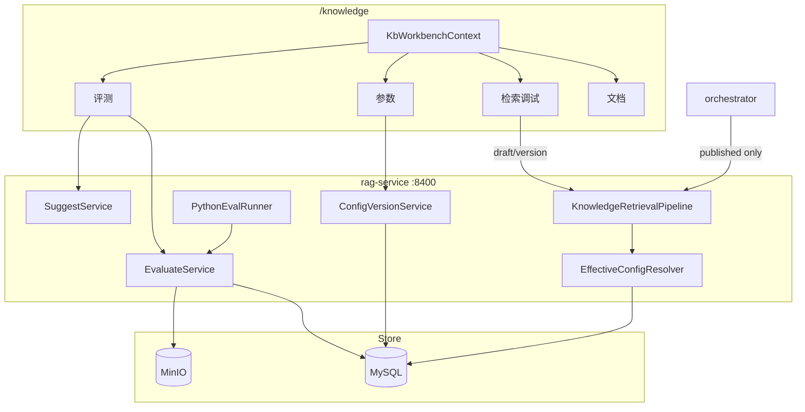

# RAG 知识库工作台 V2 扩展设计

> **状态**：已实施（核心 2026-07-03）· 缺口见 [docs/rag/backlog.md](../../rag/backlog.md)  
> **父文档**：[2026-06-27-rag-knowledge-studio-design.md](./2026-06-27-rag-knowledge-studio-design.md)  
> **实施计划**：[2026-06-27-rag-knowledge-studio.md](../plans/2026-06-27-rag-knowledge-studio.md)（T23–T28）  
> **关联**：[ADR-002](../../architecture/ADR-002-rag-pipeline-in-rag-service.md)

---

## 1. 背景与动机

迭代 4–5 已完成参数 schema、per-scope 草稿、Nacos publish（过渡期）、EvaluateService 与基础工作台 UI。运营反馈与架构收敛要求：

1. 去掉 per-scope「发布」；改为**版本化**（草稿 / 发布 / 切换生效版）。
2. 四 Tab **严格绑定**右上角 `(tenant, kb)`，切换即重载。
3. 评测支持**上传 suite**（声明式 + hook + Python）、可视化报告、**Suggest 一键应用草稿**。
4. 业务配置与评测资产迁出 **Nacos / 本地文件**，统一 **MySQL + MinIO**。

---

## 2. 需求决策（Brainstorming 2026-07-01）

| # | 议题 | 决策 |
|---|------|------|
| V2-1 | 配置作用域 | **每个 `(tenant_id, kb_id)` 独立配置包 + 独立版本链**；**无**租户默认继承 / merge |
| V2-2 | 存储 | **MySQL 元数据 + MinIO 大对象**（suite、报告、Python 脚本） |
| V2-3 | Suggest | 结构化建议 + **一键应用为草稿**；**不**自动发布 |
| V2-4 | 评测集形态 | **同期**：YAML/JSON 声明式 + **hook 字段** + **Python 脚本** |
| V2-5 | Python 沙箱 | **subprocess 受限**：仅可调 rag-service 内部 eval API；禁外网、禁写盘 |
| V2-6 | Nacos 业务段 | **干净去掉**；`docs/` 下默认配置 SQL/模板仅用于**初始化**或**新建知识库 seed** |
| V2-7 | 切换生效版 | 与发布相同：**必须过 smoke** Recall@5 门禁 |
| V2-8 | 工作台上下文 | `KbWorkbenchContext`；租户或 kb 变更 → 四 Tab `revision++` 全量重载 |

---

## 3. 架构总览



**原则**

- 线上 `POST /api/rag/search`（Chat）**仅**读取该 kb 的 `active_published_version`。
- Admin debug / eval 通过 `configMode` 使用 draft 或历史 version。
- Nacos 仅基础设施（端口、数据源、密钥、`rag.storage.*`、`rag.eval.suggest.system-prompt`）。

---

## 4. 配置版本（每 kb 独立）

### 4.1 数据模型

```sql
rag_config_bundle (
  id, tenant_id, kb_id,
  draft_version_id,
  active_published_version_id,
  created_at, updated_at,
  UNIQUE(tenant_id, kb_id)
)

rag_config_version (
  id, bundle_id, version_no,
  status,              -- draft | published | archived
  payload_json,
  change_note, created_by,
  publish_eval_job_id,
  created_at, published_at
)
```

- `knowledge_base` 与 `rag_config_bundle` **1:1**（每个 kb 一条 bundle）。
- `payload_json` 合并 6 个逻辑 scope 为一棵 JSON（见父 spec §6.3）。

### 4.2 生命周期

| 操作 | 行为 |
|------|------|
| **新建 kb** | 从 `config-seed.json` + init SQL seed → **仅 v1 `active`**；用户 **复制为草稿** 后再编辑 |
| **保存草稿** | 更新该 kb 的 `draft_version`；**不影响** `active_published` |
| **发布** | 对**整包 draft** 跑 smoke → 通过 → 新 `published` 版本、`active_published` 指向它、旧 published → `archived` |
| **切换生效版** | 将历史 `published` 设为 active → **同样跑 smoke** → 通过才切换 |

### 4.3 API（kb 路径）

| Method | Path |
|--------|------|
| GET | `/api/rag/admin/kbs/{kbId}/config/schema` |
| GET | `/api/rag/admin/kbs/{kbId}/config/effective?mode=draft\|published\|version&versionId=` |
| PUT | `/api/rag/admin/kbs/{kbId}/config/draft` |
| POST | `/api/rag/admin/kbs/{kbId}/config/publish` |
| GET | `/api/rag/admin/kbs/{kbId}/config/versions` |
| POST | `/api/rag/admin/kbs/{kbId}/config/versions/{id}/activate` |

过渡期 per-scope + Nacos 端点（T10–T12）在 T25 后标记 `@deprecated`。

### 4.4 UI

- 顶栏：**保存草稿 | 发布 | 版本历史**（无 per-scope 发布）。
- 版本侧栏：版本号、时间、Recall@5、是否当前生效。

---

## 5. 运行时解析

```java
EffectiveConfigResolver.resolve(tenantId, kbId, mode)
  PRODUCTION   → bundle.active_published_version.payload
  DRAFT        → bundle.draft_version.payload
  VERSION(id)  → rag_config_version.payload
```

| 调用方 | mode |
|--------|------|
| `/api/rag/search`（orchestrator） | `PRODUCTION`（强制） |
| `/api/rag/admin/search/debug` | 请求体 `configMode` |
| `/api/rag/admin/eval/run` | 请求体 `configMode` + `versionId?` |

发布后通过 Caffeine 缓存失效或 Redis pub/sub 刷新。

---

## 6. 工作台上下文（T23）

```ts
// useKbWorkbenchContext.ts
{ tenantId, kbId, revision }
```

- `KnowledgeView` 唯一 SSOT；`provide` 至四 Tab。
- 租户变 → 重置 kb → `loadKbs` → `revision++`。
- kb 变 → 清 doc 选中 → `revision++`。
- 各 Tab：`watch(revision)` + `AbortController`。

---

## 7. 评测平台

### 7.1 eval_suite

```sql
eval_suite (
  id, tenant_id, suite_key, display_name,
  kind,                 -- declarative | python
  format,               -- yaml | json | py
  storage,              -- minio
  content_ref,
  hooks_json,           -- 声明式 suite 的默认 hook
  item_count, status,
  created_at
)
```

**声明式示例**（MinIO）：

```yaml
suite: custom-v1
hooks:
  strategy: hybrid+rerank
  topK: 5
  configMode: draft
queries:
  - id: q1
    query: 年假几天
    expectedDocNames: [考勤制度]
```

### 7.2 Python 脚本（同期）

- 上传 `.py` → MinIO；`kind=python`。
- `PythonEvalRunner`：`subprocess` + 受限环境变量；仅 `RAG_EVAL_INTERNAL_URL`；禁 `socket`、禁文件写（除 stdout JSON）。
- 脚本约定输出：

```json
{ "metrics": { "recall_at_5": 0.98 }, "failedSamples": [...] }
```

- 内部实现：脚本通过 HTTP 调 `EvaluateService` 提供的 **受信内部端点**（仅 localhost + admin token），不重复实现 pipeline。

### 7.3 eval_job / eval_report 扩展

- `eval_job`：`suite_id`、`config_version_id`、`config_mode`、`report_object_key`。
- `eval_report`：`summary_json`、`failed_samples_json`、`suggestions_json`；正文在 MinIO。

### 7.4 Suggest

`POST /api/rag/admin/eval/suggest`：

**输入**：`reportId`、kb 配置快照、kb 概要（doc/chunk 数、top 文档名）、badcase 列表。

**输出**：

```json
{
  "diagnosis": "...",
  "suggestions": [
    { "path": "search.minScore", "current": 0.48, "proposed": 0.42, "reason": "..." },
    { "path": "rewrite.rag.systemPrompt", "proposed": "...", "reason": "..." }
  ]
}
```

**一键应用草稿**：`POST .../config/draft/apply-suggestions` + `versionId` → 合并进该版本 payload；**仅 eval_failed** 可调用；成功后 **status=draft** 并更新 `draftVersionId`（不自动提交评测）。

Prompt 模板：Nacos `rag.eval.suggest.system-prompt`（基础设施，非业务参数）。

---

## 8. 存储与迁移

### 8.1 MinIO 路径

| 前缀 | 内容 |
|------|------|
| `rag-eval/{tenant}/{suiteKey}/` | YAML/JSON/Python suite |
| `rag-eval-reports/{tenant}/{jobId}/` | report.md、report.json |
| `rag-config-seed/` | 可选：超大默认模板 |

### 8.2 Nacos 收敛

- **删除运行时依赖**：`rag.search`、`rag.rerank`、`rag.chunk`、`rag.rewrite.*` 不再作为 SSOT。
- **保留**：`server`、`spring.datasource`、`embedding`、`rag.admin`、`rag.storage`、`rag.eval.suggest.system-prompt`。
- **初始化**：`config-seed.json` + `docker/mysql/init/16-sunshine-rag-config-seed.sql`（新建 kb / 环境 seed）

### 8.3 废弃

- `config_draft`（per-scope）→ `rag_config_version`
- `kb_config_override` → 每 kb 独立 bundle（无 merge）
- `docs/rag/golden-set.yaml` 只作 seed 源，运行时读 `eval_suite`
- `docs/rag/reports/` 只作 dev 导出
- `NacosPublishService` 业务 publish → T25 后删除

---

## 9. 实施顺序（纵向切片）

| 阶段 | Task | 交付物 |
|------|------|--------|
| 1 | T23 | `KbWorkbenchContext`；四 Tab 重载 |
| 2 | T24 | Flyway V2/V3；`ConfigVersionService`；统一发布 UI |
| 3 | T25 | `EffectiveConfigResolver`；去 Nacos 业务段；迁移脚本 |
| 4 | T26 | MinIO；`eval_suite`；声明式 + hook 上传 |
| 5 | T27 | `PythonEvalRunner`；Suggest；评测 UI 增强 |
| 6 | T28 | CI 改 API；`verify_rag_studio` 扩展 |

---

## 10. 检查门

| 项 | 标准 |
|----|------|
| kb 配置隔离 | 改 kb A 的 draft 不影响 kb B 的 published |
| 线上隔离 | orchestrator 无法使用 draft |
| 发布/回滚 | 未过 smoke 不可 publish 或 activate |
| 上下文 | 切换租户/kb 后四 Tab 无串数据 |
| 评测 | 可对 draft 跑声明式 + Python suite |
| Suggest | 一键应用后 draft 变更可 diff，需手动发布 |
| 存储 | 报告与 suite 在 MinIO；MySQL 可列表检索 |

---

## 11. 测试

| 类型 | 内容 |
|------|------|
| 单元 | `ConfigVersionService`；`EffectiveConfigResolver`；`PythonEvalRunner` 沙箱拒绝 socket |
| 集成 | publish/activate 门禁；debug `configMode=draft` |
| Live | 新建 kb → seed → 发布 → Chat 检索行为变化 |
| CI | `rag_eval.py` 调 `POST /eval/run`；不再读本地 golden-set |

---

## 12. 与父 spec 关系

本文件为 **V2 扩展 SSOT**。与父 spec 冲突时以本文件为准：

- ~~租户默认包 + kb merge~~ → **每 kb 独立包**
- ~~Nacos 业务 publish~~ → **DB 版本 + docs seed**
- 父 spec §12 演进摘要 → 指向本文件
