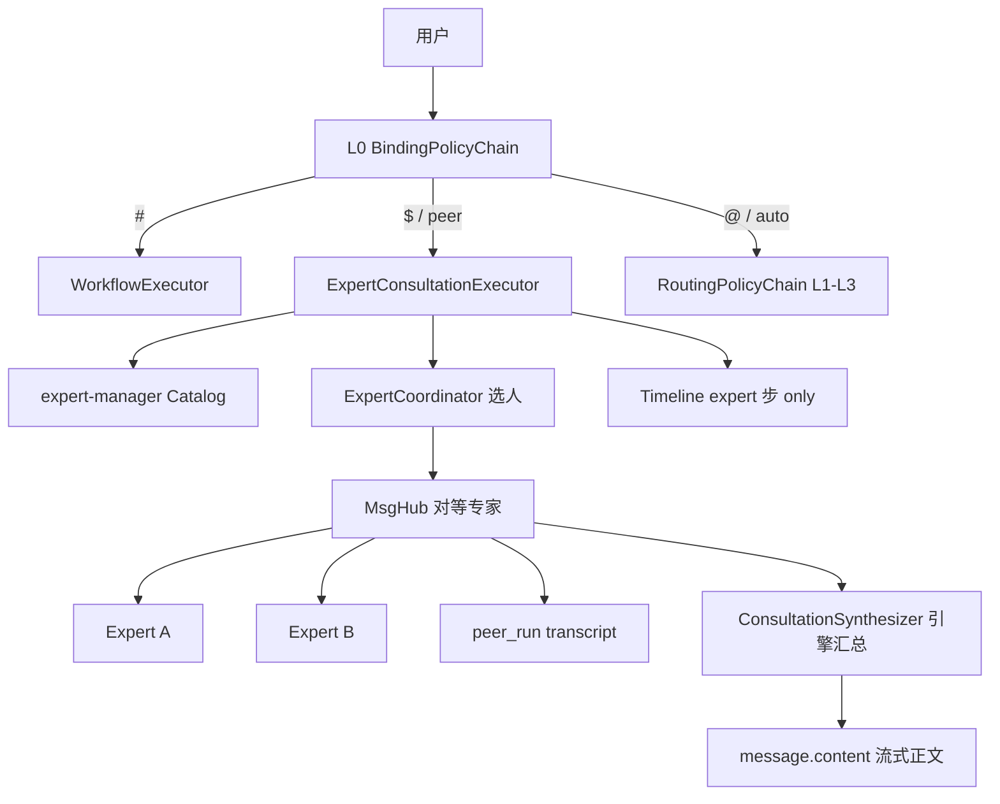

# 多专家协作（Expert Consultation / peer-collab）— 技术设计

> **阶段**：四 · **任务卡**：4.7.3 演进（替代 Nacos `peer.templates` 固定 roster）  
> **状态**：✅ **完整交付**（2026-07-08）— `expert-manager` :8235 · `/experts` · Chat `$` · Hub 反应式轮次（min/max + continue + 反应式选人）· Synthesizer 流式正文 · §E/§K Live  
> **日期**：2026-07-07（rev.3 · 轮次协调 + 4 专家种子 + Synthesizer `**` 流式修复）  
> **前置**：[peer-collab-routing-design.md](./2026-06-24-peer-collab-routing-design.md) · [phase4-agent-capabilities-boundaries.md](./2026-06-25-phase4-agent-capabilities-boundaries.md) · [skills-management-ui-design.md](./skills-management-ui-design.md)  
> **关联**：`skill-manager`（Skill 能力包）· `AgentScope MsgHub`（Hub 自由轮次）

---

## 1. 定位

将当前 **写死 peer-template 三角色 + 压缩 Timeline** 的 MVP，演进为：

| 概念 | 定义 |
|------|------|
| **Expert（专家）** | 可运营的协作专家：名称、系统提示词、可选关联 Skill、可选工具白名单 |
| **Skill** | 可复用能力包（`/skills`）；Expert 可 0~N 挂载 |
| **多专家协作（peer-collab）** | 多位 **对等** Expert 在 MsgHub 内反应式讨论；Timeline **按发言逐步展示**（可展开）；终态答复由 **引擎汇总** 写入消息正文 |

与 **Workflow / Plan-workflow** 的本质差异不变：讨论路径由 **transcript** 塑造，而非预置 DAG。

---

## 2. 已锁定决策

| # | 决策 |
|---|------|
| D1 | Expert 为 **独立实体**；Skill 为可选能力包 |
| D2 | Chat **`$专家`** L0 绑定 → 自动 `peer-collab` |
| D3 | 未写 `$` 时 **Coordinator** 从 Catalog 选 2~4 位专家 + 理由 |
| D4 | Hub：**仅对等专家**进 MsgHub（无「仲裁专家」特殊角色） |
| D5 | **终态答复**：Hub 结束后 **引擎 ConsultationSynthesizer** 读 transcript 流式写入 `message.content`；**不出现** `generate` /「撰写回复」Timeline 步 |
| D6 | L0 优先级：**`#` > `$` > `@`** |
| D7 | Timeline 展示每次专家发言，**不展示「第 N 轮」**；文案 Nacos SSOT |
| D8 | **不强制**用户挑选仲裁专家；不为每种协作场景预置仲裁 Expert |

---

## 3. L0 绑定优先级

```
#workflowId   →  WORKFLOW（最高）
$expertId     →  PEER_COLLAB + expertIds[]
@skillId      →  现有 Skill 逻辑（最低）
```

| 组合 | 行为 |
|------|------|
| `#finance-smart $制度专家 …` | **仅 `#`** |
| `$A $B 是否合规` | peer-collab；roster = {A,B} |
| `$A @finance-analysis …` | **仅 `$`** |
| 无 `#/$/@` | Policy Chain；命中 peer 时 Coordinator 选人 |

**解析**：`$` 对称 `@`；补全 `GET /api/experts/catalog`。

---

## 4. 架构



### 4.1 服务边界

| 组件 | 职责 |
|------|------|
| **expert-manager** `:8235` | Expert CRUD、Catalog |
| **orchestrator** | L0、`ExpertCoordinator`、`ExpertConsultationExecutor`、MsgHub、**Synthesizer**、Timeline |
| **skill-manager** | 不变；Expert 可选关联 Skill |
| **sunshine-ui** | `/experts`、`$` 补全、`ExpertStepPanel` |

---

## 5. 终态汇总：为何不用「仲裁专家」

### 5.1 问题（评审反馈）

| 旧方案问题 | 说明 |
|------------|------|
| 须预置仲裁 Expert | 每种场景要想不同的「合规仲裁」「技术仲裁」，扩展性差 |
| 用户未 `$` 仲裁 | Coordinator 强行追加默认仲裁， roster 与用户意图不符 |
| 与 workflow 同质 | 固定「讨论 → 仲裁节点 → 答复」仍是 DAG 思维 |

### 5.2 新方案：对等讨论 + 引擎汇总（推荐）

| 层 | 职责 |
|----|------|
| **Hub 内** | 仅 **对等专家**；每人可多次发言；无 Catalog 级「仲裁」类型 |
| **Hub 后** | `ConsultationSynthesizer`：读用户问题 + 完整 transcript，按 Nacos `agent.peer.synthesis-prompt` **一次**生成用户可见答复 |
| **Timeline** | 只到专家发言步为止；汇总 **不进 Timeline**（直接进消息正文流） |

**可选扩展（非 MVP）**：若运营确需「带汇总人格的专家」，可建普通 Expert（如「综合研判」），用户 `$` 召入 Hub **作为对等一员**发言——仍 **不**赋予特殊引擎角色；终态仍由 Synthesizer 统一产出，避免「最后一位专家 = 最终答案」的不确定性。

### 5.3 Synthesizer 契约

- 输入：`userQuery` + `transcript[]`（含各专家 displayName、content、可选 toolTrace）
- 输出：流式 `StreamToken.content` → 与现网 ReAct 正文相同落库路径
- 配置：Nacos `agent.peer.synthesis-prompt`（禁止业务代码硬编码）
- **无** `generate` phase、**无** `think` 步上 Timeline（Synthesizer 内部 reasoning 可选落 `message.reasoning` 或省略，与 ReAct generate 路径对齐实现时再定）

---

## 6. 数据模型（MVP）

**库**：`sunshine_expert`（`docker/mysql/init/15-sunshine-expert-manager.sql`）

### 6.1 `expert_definition`

| 字段 | 说明 |
|------|------|
| `id` | 稳定 ID |
| `display_name` | 展示名 |
| `system_prompt` | 专家系统提示词（必填） |
| `description` | Catalog 摘要，供 Coordinator |
| `enabled` | 可召集 |
| `tags` | 可选域标签 |
| `tools_json` | MVP 默认 `["*"]` |

**移除** `moderator_capable`：专家无角色类型之分。

### 6.2 `expert_skill_link`

`expert_id` + `skill_id`（0~N）

### 6.3 种子（4 名）

| id | display_name |
|----|--------------|
| `policy-expert` | 制度专家 |
| `finance-expert` | 财务专家 |
| `compliance-expert` | 合规专家 |
| `legal-expert` | 法务专家 |

（**不**再种子「合规仲裁」；汇总由 Synthesizer 负责。SQL：`docker/mysql/init/15-sunshine-expert-manager.sql`）

---

## 7. 专家管理页 `/experts`（MVP）

| 能力 | MVP |
|------|-----|
| CRUD、启停、关联 Skill | ✅ |
| 工具 | 只读「全部工具」 |
| ~~仲裁能力开关~~ | **不做** |

---

## 8. 执行流程

### 8.1 Roster

1. **显式 `$`**：`expertIds[]`（enabled、去重）；**仅**用户/Coordinator 点名的专家
2. **无 `$`**：Coordinator 选 2~4 人 + `reason`（**不**自动追加仲裁）
3. **Hub 人数**：≥2（少于 2 降级单 Expert ReAct 或提示用户多选）

### 8.2 MsgHub 反应式轮次

- **Participants** = roster **全员**（全部对等，无仲裁位）
- **轮次上下限**：Nacos `agent.peer.min-rounds`（默认 1）、`agent.peer.max-rounds`（默认 3）；**不对用户展示「第 N 轮」**
- **sessionMaxRounds**：显式 `$` 时由 `ExpertCoordinatorService` 的 `complexity-prompt` 评估；未 `$` 时 Coordinator `coordinator-prompt` 输出 `maxRounds`
- **第 1 轮**：roster 全员依次发言（gather + speak 两阶段，§8.4）
- **第 2 轮起**：`ExpertRoundCoordinatorService.selectReactiveSpeakers` 按 `round-speakers-prompt` 仅选有异议/需补充者；空数组则提前结束
- **每轮结束**：`evaluateContinue`（`round-continue-prompt`）判断是否继续；未达 `min-rounds` 时强制继续
- 每发言一次 → 一条 Timeline `expert-*` 步
- 结束：达 `sessionMaxRounds`、continue=false、或反应式选人为空

### 8.3 终态

1. `peer_run` 落库 transcript  
2. `ConsultationSynthesizer` 流式写 `message.content`  
3. Timeline **结束于最后一条专家步**；用户阅读区看到汇总正文（与专家步并列，非额外「撰写回复」步）

### 8.4 专家发言两阶段（展示层流式）

| 阶段 | 引擎 | Timeline |
|------|------|----------|
| **1 工具检索** | Sub-Agent `ReAct call().block()`；`ExpertSpeakHook` 刷 expert 步 active | 仅 active 文案（如「查财务…」） |
| **2 正式发言** | `ExpertSpeakStreamer` → `LlmGatewayClient.streamComposed`（与 Synthesizer 同通路） | `step_delta(result)` 逐 token |

- Nacos：`agent.peer.gather-instruction`（阶段1）、`agent.peer.speak-prompt`（阶段2模板）
- **禁止**在 ReAct Hook / `agent.stream()` 上承载专家步 token 流（acting 空窗 + 线程安全已证伪）

---

## 9. Timeline V2

### 9.1 步骤形态（成功路径）

```
识别意图     → …将由多专家协作… / 已指定专家…
多专家协作   → 已召集：制度专家、财务专家（可展开 Coordinator 理由）
制度专家     → 正在分析… → 摘要 | 展开全文
财务专家     → 正在分析…
制度专家     → 正在回应其他专家观点… → …（同一专家再次发言，仍只显示专家名）
财务专家     → 正在回应…
（消息正文区开始流式输出协作结论 — 无 Timeline 步）
```

**禁止**：UI 出现「第 1 轮」「第 2 轮」；`metadata` 可有内部 `speakSeq` 仅供排序，**不下发**给前端展示。

### 9.2 Step ID

| id | 说明 |
|----|------|
| `expert-convene` | 召集 |
| `expert-{expertId}-s{speakSeq}` | 该专家第几次发言（**仅 id**，界面不展示 seq） |

`phase=expert`；`metadata`: `expertId`, `displayName`, `speakSeq`（内部）, `toolTrace?`

### 9.3 Nacos 文案

```yaml
agent:
  timeline:
    steps:
      expert-convene:
        label: 多专家协作
        before: 正在匹配协作专家
        active: 正在召集专家
        after: "已召集：{expertNames}"
      expert:
        label: "{displayName}"
        before: "准备听取{displayName}意见"
        active: "{displayName}正在分析"
        active-responding: "{displayName}正在回应其他专家观点"
        after: "{displayName}已完成发言"
```

**选用规则**（引擎，不对用户暴露轮次）：

- 该专家 **本场第一次**发言 → `active`
- 该专家 **再次**发言且 Hub 内已有其他专家发言 → `active-responding`

**移除**：`active-moderator` / `after-moderator` / `generate` 相关协作文案。

**轮次协调**（Nacos `agent.peer`，不对用户展示轮次）：

| 键 | 用途 |
|----|------|
| `min-rounds` / `max-rounds` | Hub 全局轮次下限/上限 |
| `round-continue-prompt` | 每轮结束是否继续 |
| `round-speakers-prompt` | 第 2 轮起反应式选人 |
| `coordinator-prompt` / `complexity-prompt` | Coordinator 选人 + `maxRounds` 估计 |
| `synthesis-prompt` | Hub 后终态答复（流式 `message.content`） |

### 9.4 前端

- `ExpertStepPanel`：主行 `label` + `summary`；展开 `step.result`
- **不**渲染 `speakSeq` / round
- 消息正文区：Synthesizer 流式内容与现网 assistant 消息一致

---

## 10. API 与组件（摘要）

| 组件 | 说明 |
|------|------|
| `ExpertBindingRoutingPolicy` | L0 `$`，order 在 `#` 后、`@` 前 |
| `ExpertCoordinatorService` | 选人 + `sessionMaxRounds`（coordinator / complexity prompt） |
| `ExpertRoundCoordinatorService` | 轮次 continue 判断 + 第 2 轮起反应式选人 |
| `ExpertHubEngine` | MsgHub 多轮调度 + 专家发言两阶段 |
| `ExpertConsultationExecutor` | Hub + Timeline 步 + 调 Synthesizer |
| `ConsultationSynthesizer` | transcript → 流式正文（经 `StreamDeltaNormalizer`，闭合 Markdown 标记勿丢） |
| `GET /api/experts/catalog` | Chat `$` 补全 |

---

## 11. 迁移

| 项 | 处理 |
|----|------|
| Nacos `peer.templates` | deprecated |
| `moderator` 角色 / `compliance-moderator` 种子 | 删除 |
| `PeerCollabPanel` 按轮分组 | 改为按 **发言顺序** 列表（不显示轮次标题） |
| 底栏「多专家协作」 | 保留 |

---

## 12. 范围外（MVP）

- Expert 工具 / MCP 白名单
- 会中用户指定下一位发言人
- 将 Synthesizer 再拆为 Catalog 专家（除非后续产品明确要求）

---

## 13. 检查门

- [x] L0：`#` > `$` > `@`
- [x] `$A $B` → ≥2 个 `expert-*` 步，**无** `plan`，**无** `generate` 步
- [x] Timeline **无**「第 N 轮」文案；同一专家多次发言仅重复 `displayName` + 不同展开内容
- [x] 未 `$` 仲裁专家时仍能完成多专家协作并得到正文（Synthesizer）
- [x] `peer_run` 与专家步内容一致
- [x] `/experts` CRUD + `$` 补全
- [x] 专家步内正文：`gather` + `streamComposed` 两阶段流式（§8.4）
- [x] Hub `min-rounds` / `max-rounds` + 每轮 continue + 第 2 轮起反应式选人
- [x] Synthesizer 流式 Markdown 闭合 `**` 不丢（`StreamDeltaNormalizer` TD-076）

---

## 14. 相关文档

| 文档 | 关联 |
|------|------|
| [peer-collab-routing-design.md](./2026-06-24-peer-collab-routing-design.md) | 第五模式基线（本设计 supersede 仲裁与 Timeline §） |
| [routing-golden-set.md](../../routing/routing-golden-set.md) | §K Expert `$`；§E L1 句式 peer |
