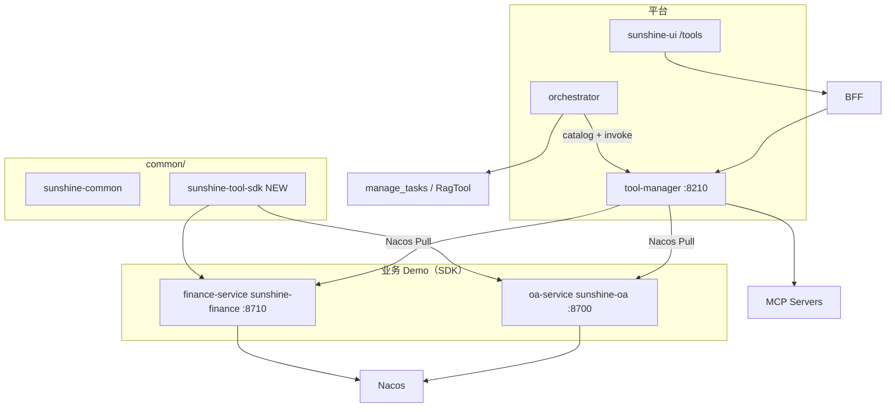
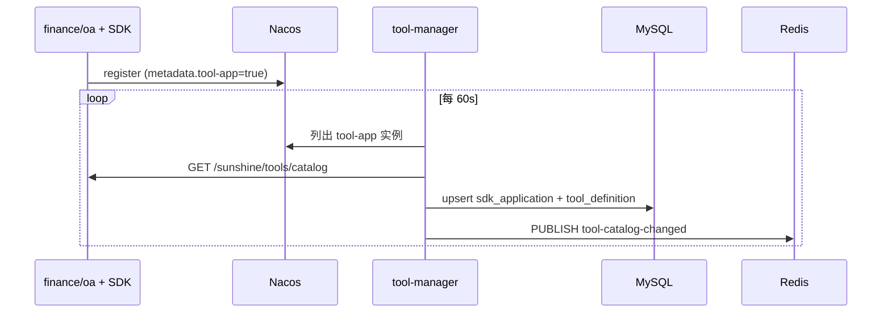

# 工具集成（SDK + MCP）— 技术设计

> **阶段**：四 · **任务卡**：4.8 演进（MCP 动态引入 + SDK 业务解耦）  
> **状态**：✅ Phase 1 检查门通过（2026-07-10）  
> **实施计划**：[2026-07-09-tool-integration.md](../plans/2026-07-09-tool-integration.md)
> **日期**：2026-07-09  
> **前置**：[phase4-platformization-design.md](./phase4-platformization-design.md) §4.8 · [locked-architecture-decisions.md](./2026-06-19-locked-architecture-decisions.md) D3 · [react-taskboard-design.md](./2026-06-24-react-taskboard-design.md)  
> **对称参照**：skill-manager（:8225 + `/skills`）— tool-manager 扩 Catalog + Admin API + `/tools` 管理页

---

## 1. 定位

将当前 **tool-manager 编译期 `ToolHandler` + Nacos `react.tools` 白名单 + 直连 finance/oa HTTP** 的模式，演进为：

| 概念 | 定义 |
|------|------|
| **SDK 集成** | 业务应用引入 `common/sunshine-tool-sdk`，声明 `@SunshineTool`；Nacos 注册 → tool-manager Pull catalog → invoke 回调 |
| **MCP 集成** | 标准 MCP 协议；管理页配置 Server → probe `tools/list` → 动态 schema 写入 Catalog |
| **工具池** | MySQL 持久化；管理页启停 + 描述覆盖；**弃用 Nacos 工具白名单** |
| **工具集** | 全局 ReAct 默认集 + 租户覆盖；Skill / Workflow 从池中二次筛选 |

**架构目标**：AI 中台与业务解耦；扩展靠注册而非改 tool-manager 代码；配置动态生效、可维护。

---

## 2. 已锁定决策

| # | 决策 |
|---|------|
| D1 | **方案 A**：扩展 tool-manager（:8210），Catalog SSOT 在 MySQL |
| D2 | **SDK 模块**位于 `common/sunshine-tool-sdk`（与 `sunshine-common` 并列） |
| D3 | **去除** tool-manager 对 finance-service / oa-service 的直接 HTTP 依赖；删除全部写死 `*ToolHandler` |
| D4 | **Demo 应用** = 现有 `finance-service`（`sunshine-finance`）+ `oa-service`（`sunshine-oa`），各自实现 SDK 工具 |
| D5 | **Catalog 工具 ID**：SDK `sdk__{appId}__{externalName}`、MCP `mcp__{serverId}__{externalName}`（SSOT：`common/.../ToolIds.java`）；`@SunshineTool.id` 仍为应用内短名（invoke 路径） |
| D12 | **LLM 与 Catalog 同 ID**：ReAct 注册给模型的 function name = Catalog `tool_definition.id`；**禁止**点号 ID 与编码转换层 |
| D6 | **Schema 策略**：SDK 注册时锁定（`schema_hash`）；MCP probe 时动态刷新（同 Cursor） |
| D7 | **工具集模型 C+D**：全局 enabled 池 + `global_react_default` + 租户 `tenant_react_default` 覆盖 |
| D8 | **描述类字段**可在 `/tools` 管理页动态编辑；SDK/MCP schema 本体不可在 UI 篡改 |
| D9 | **特殊工具**不进 DB Catalog：`manage_tasks`（TaskBoard）、`search_knowledge`（RagTool）留 orchestrator 内置 |
| D10 | **Phase 1**：SDK + MCP + `/tools` + 工具集；**Phase 2**：Platform 内置工具（web_search、exec、read/write、grep + sandbox） |
| D11 | `mcp.json` 仅作 **导入/导出** 格式（Cursor 兼容），运行时 SSOT = MySQL |

---

## 3. 模块与边界



| 模块 | 职责 | 不做 |
|------|------|------|
| `sunshine-tool-sdk` | 注解、schema 生成、Catalog/Invoke HTTP 端点、Starter 自动配置 | 不含业务逻辑 |
| `finance-service` / `oa-service` | `@SunshineTool` 实现 + 调本地 Service | 不感知 orchestrator |
| `tool-manager` | MySQL Catalog、SDK 发现、MCP 连接池、Invoke 路由、Admin API、摘要模板 | 不含 finance/oa 业务代码 |
| `orchestrator` | ToolSet 解析、Catalog 缓存热刷新、AgentTool 包装（HITL/审计） | 不硬编码工具 Map |
| `sunshine-ui /tools` | SDK/MCP/工具集管理 | 不维护工具 displayName Map |

---

## 4. sunshine-tool-sdk（`common/sunshine-tool-sdk`）

### 4.1 Maven 坐标

```
common/
├── sunshine-common/
└── sunshine-tool-sdk/          ← 新增
    └── pom.xml                 artifactId: sunshine-tool-sdk
```

根 `pom.xml` `<modules>` 增加 `<module>common/sunshine-tool-sdk</module>`；父 POM `dependencyManagement` 声明版本。

**依赖**：`spring-boot-starter-web`、`spring-boot-autoconfigure`；**可选** `spring-cloud-starter-alibaba-nacos-discovery`（业务 App 自行引入）。

### 4.2 业务侧用法

```java
@Component
public class FinanceSunshineTools {

    private final FinanceMessageService financeMessageService;

    @SunshineTool(
        id = "list_finance_messages",
        displayName = "查询待审批财务消息",
        description = "查询财务待办/审批消息。status: pending|approved|all",
        outputSummaryKind = "finance-list"
    )
    public String listFinanceMessages(
        @ToolParam(value = "status", description = "pending | approved | all") String status
    ) {
        // 直接调 finance-service 本地 Service，不再经 tool-manager HTTP 转发
    }

    @SunshineTool(id = "get_finance_message_detail", ...)
    public String getFinanceMessageDetail(@ToolParam("id") String id) { ... }

    @SunshineTool(id = "summarize_finance_by_status", outputSummaryKind = "finance-summary", ...)
    public String summarizeFinanceByStatus(@ToolParam("status") String status) { ... }
}
```

```java
@Component
public class OaSunshineTools {

    @SunshineTool(id = "list_oa_tasks", outputSummaryKind = "oa-tasks", ...)
    public String listOaTasks(@ToolParam("status") String status) { ... }

    @SunshineTool(id = "approve_oa_task", sideEffect = "write", ...)
    public String approveOaTask(@ToolParam("taskId") String taskId) {
        // 原 tool-manager 模拟写操作迁入 oa-service
    }
}
```

**Starter 启用**：业务 `application.yml` 增加 `sunshine.tools.enabled=true`（默认 true）。

### 4.3 SDK 暴露端点（固定契约）

| 方法 | 路径 | 说明 |
|------|------|------|
| GET | `/sunshine/tools/catalog` | 返回工具清单 + schema |
| POST | `/sunshine/tools/invoke/{toolId}` | Body: `Map<String,String>` params |
| GET | `/sunshine/tools/health` | 健康探测 |

**Catalog 响应**：

```json
{
  "appId": "sunshine-finance",
  "appVersion": "1.0.0-SNAPSHOT",
  "schemaVersion": 1,
  "tools": [{
    "name": "list_finance_messages",
    "displayName": "查询待审批财务消息",
    "description": "...",
    "sideEffect": "read",
    "timelinePhase": "tool",
    "outputSummaryKind": "finance-list",
    "parameters": { "type": "object", "properties": { "status": { "type": "string" } } }
  }]
}
```

**Invoke 响应**：

```json
{ "ok": true, "result": "..." }
{ "ok": false, "error": "..." }
```

### 4.4 Nacos 元数据

业务 App 注册 Nacos 时在 metadata 标记：

```yaml
spring.cloud.nacos.discovery.metadata:
  sunshine.tool-app: "true"
  sunshine.tool-app-id: "sunshine-finance"   # 与 sdk_application.id 对齐
```

tool-manager `SdkDiscoveryPuller` 仅 Pull 带 `sunshine.tool-app=true` 的实例。

---

## 5. Demo 应用迁移（finance-service + oa-service）

### 5.1 变更清单

| 服务 | Nacos 服务名 | 端口 | SDK 工具 |
|------|-------------|------|----------|
| finance-service | `sunshine-finance` | 8710 | `list_finance_messages`, `get_finance_message_detail`, `summarize_finance_by_status` |
| oa-service | `sunshine-oa` | 8700 | `list_oa_tasks`, `approve_oa_task` |

**finance-service**

- `pom.xml` 增加 `sunshine-tool-sdk` 依赖
- 新增 `FinanceSunshineTools`（格式化输出逻辑从原 `FinanceServiceClient` 迁入，调 `FinanceMessageService`）
- 确保 Nacos discovery 已启用（已有）

**oa-service**

- `pom.xml` 增加 `sunshine-tool-sdk` 依赖
- 新增 `OaSunshineTools`；`approve_oa_task` 保留模拟写操作 + `sideEffect=write`（HITL 验收）
- 补充 Nacos config import（与 finance 对齐，可选）

### 5.2 tool-manager 删除项

```
删除：
  tool/client/FinanceServiceClient.java
  tool/client/OaServiceClient.java
  tool/tool/FinanceTool.java
  tool/tool/FinanceToolHandler.java
  tool/tool/FinanceDetailToolHandler.java
  tool/tool/FinanceSummaryToolHandler.java
  tool/tool/OaTool.java
  tool/tool/OaToolHandler.java
  tool/tool/ApproveOaTaskToolHandler.java
  tool/tool/SearchKnowledgeToolHandler.java   # search_knowledge 归 orchestrator RagTool

保留：
  tool/summary/*                              # 摘要策略仍 SSOT 在 tool-manager
  tool/registry → 重构为 DB Catalog + InvokeRouter
```

**Nacos `sunshine-tool-manager.yaml` 删除**：

```yaml
finance:
  base-url: ...
oa:
  base-url: ...
```

---

## 6. MySQL 表结构

**库名**：`sunshine_tool`（`01-init-databases.sql` 增库；`16-sunshine-tool-manager.sql` 建表）

### 6.1 sdk_application

```sql
CREATE TABLE sdk_application (
    id              VARCHAR(64) PRIMARY KEY,
    nacos_service   VARCHAR(128) NOT NULL,
    display_name    VARCHAR(128),
    catalog_path    VARCHAR(256) NOT NULL DEFAULT '/sunshine/tools/catalog',
    invoke_path     VARCHAR(256) NOT NULL DEFAULT '/sunshine/tools/invoke',
    tenant_id       VARCHAR(32) NOT NULL DEFAULT 'default',
    status          VARCHAR(16) NOT NULL DEFAULT 'offline',
    last_seen_at    TIMESTAMP NULL,
    schema_version  INT NOT NULL DEFAULT 0,
    created_at      TIMESTAMP NOT NULL DEFAULT CURRENT_TIMESTAMP,
    updated_at      TIMESTAMP NOT NULL DEFAULT CURRENT_TIMESTAMP ON UPDATE CURRENT_TIMESTAMP
);
```

### 6.2 mcp_server

```sql
CREATE TABLE mcp_server (
    id              VARCHAR(64) PRIMARY KEY,
    display_name    VARCHAR(128),
    transport       VARCHAR(16) NOT NULL,
    command         VARCHAR(512),
    args_json       JSON,
    endpoint        VARCHAR(512),
    env_json        JSON,
    tenant_id       VARCHAR(32) NOT NULL DEFAULT 'default',
    enabled         TINYINT(1) NOT NULL DEFAULT 0,
    last_probe_at   TIMESTAMP NULL,
    probe_status    VARCHAR(16),
    probe_error     VARCHAR(512),
    created_at      TIMESTAMP NOT NULL DEFAULT CURRENT_TIMESTAMP,
    updated_at      TIMESTAMP NOT NULL DEFAULT CURRENT_TIMESTAMP ON UPDATE CURRENT_TIMESTAMP
);
```

### 6.3 tool_definition

```sql
CREATE TABLE tool_definition (
    id                  VARCHAR(128) PRIMARY KEY,
    source              VARCHAR(16) NOT NULL,
    source_ref          VARCHAR(64) NOT NULL,
    external_name       VARCHAR(128) NOT NULL,
    display_name        VARCHAR(128) NOT NULL,
    description         TEXT,
    schema_json         JSON NOT NULL,
    schema_hash         VARCHAR(64),
    kind                VARCHAR(16) NOT NULL,
    timeline_phase      VARCHAR(16) NOT NULL DEFAULT 'tool',
    output_summary_kind VARCHAR(32) NOT NULL DEFAULT 'truncate',
    side_effect         VARCHAR(16) NOT NULL DEFAULT 'read',
    require_confirmation TINYINT(1) NOT NULL DEFAULT 0,
    confirmation_edited TINYINT(1) NOT NULL DEFAULT 0,
    tenant_id           VARCHAR(32) NOT NULL DEFAULT 'default',
    enabled             TINYINT(1) NOT NULL DEFAULT 0,
    metadata_edited     TINYINT(1) NOT NULL DEFAULT 0,
    id_valid            TINYINT(1) NOT NULL DEFAULT 1,
    id_error            VARCHAR(512),
    discovered_at       TIMESTAMP NULL,
    updated_at          TIMESTAMP NOT NULL DEFAULT CURRENT_TIMESTAMP ON UPDATE CURRENT_TIMESTAMP,
    UNIQUE KEY uk_source_tool (source, source_ref, external_name)
);
```

**Catalog 合并规则**（对外 API）：

- `displayName` / `description`：管理页可编辑；保存时设 `metadata_edited=1`。SDK Pull / MCP refresh **不覆盖** `metadata_edited=1` 的记录
- `parameters`：始终来自 `schema_json`（SDK 仅 hash 变时更新；MCP probe 全量刷新）
- `schema_json`：UI **只读**

**Tool ID 命名（D5 / D12）**：

| 来源 | `tool_definition.id` | 说明 |
|------|---------------------|------|
| SDK Demo | `sdk__{appId}__{externalName}`（如 `sdk__sunshine-finance__list_finance_messages`） | `ToolIds.sdk()` 生成；与 MCP 对称 |
| MCP | `mcp__{serverId}__{externalName}` | `ToolIds.mcp()` 生成；避免跨 Server 冲突 |
| Platform（Phase 2） | `platform__{name}` | — |

**校验**：`id_valid` / `id_error`；Pull/sync 时 ID 与规范不一致则删旧记录并按规范重建（**无**旧 ID 迁移兼容层）。允许字符集：`^[a-zA-Z0-9_-]+$`（禁止 `.`）。

### 6.4 tool_set / tool_set_member

```sql
CREATE TABLE tool_set (
    id              VARCHAR(64) PRIMARY KEY,
    set_type        VARCHAR(32) NOT NULL,
    tenant_id       VARCHAR(32),
    display_name    VARCHAR(128),
    updated_at      TIMESTAMP NOT NULL DEFAULT CURRENT_TIMESTAMP ON UPDATE CURRENT_TIMESTAMP,
    UNIQUE KEY uk_set_type_tenant (set_type, tenant_id)
);

CREATE TABLE tool_set_member (
    set_id          VARCHAR(64) NOT NULL,
    tool_id         VARCHAR(128) NOT NULL,
    sort_order      INT NOT NULL DEFAULT 0,
    PRIMARY KEY (set_id, tool_id)
);
```

### 6.5 execution_mode_policy

```sql
CREATE TABLE execution_mode_policy (
    id              VARCHAR(64) PRIMARY KEY,
    mode_key        VARCHAR(32) NOT NULL,
    tenant_id       VARCHAR(32),
    policy_json     JSON NOT NULL,
    updated_at      TIMESTAMP NOT NULL DEFAULT CURRENT_TIMESTAMP ON UPDATE CURRENT_TIMESTAMP,
    UNIQUE KEY uk_mode_tenant (mode_key, tenant_id)
);
```

**种子数据**（Phase 1 迁移）：

- `tool_set`：`global_react_default`（5 个 SDK 工具）、`global_plan_workflow_critical`（2 个关键读工具）
- `execution_mode_policy`：`global-plan-workflow-policy`（Plan/Workflow 重试/降级默认）
- `sdk_application` 种子：`sunshine-finance`、`sunshine-oa`（首次 Pull 前 offline）

---

## 7. SDK 发现与同步



| 行为 | 说明 |
|------|------|
| 首次 Pull | 自动 upsert `sdk_application`；`status=online` |
| 实例全下线 | `status=offline`；工具不删，`enabled` 保持 |
| schema_hash 变化 | 更新 `schema_json`；保留管理页 `description` 编辑 |
| 手动同步 | Admin API `POST /api/admin/tools/sdk-applications/{id}/sync` |

**配置**（Nacos `sunshine-tool-manager.yaml`）：

```yaml
tool:
  sdk:
    pull-interval-seconds: 60
    invoke-timeout-seconds: 30
  mcp:
    refresh-interval-seconds: 300
    invoke-timeout-seconds: 60
```

---

## 8. MCP 接入

对齐 phase4 §4.8，合并进统一 `/tools` 页（非独立 `/mcp` 路由名可仍为 MCP Tab）。

| 能力 | 设计 |
|------|------|
| 连接 | `McpClientPool`：stdio 子进程 / SSE HTTP |
| Schema | probe + 定时 refresh；**动态覆盖** DB |
| Tool ID | `mcp__{serverId}__{externalName}`（见 §6.3） |
| 写工具 HITL | 发现时 `sideEffect=write` 可设默认；**运行时门禁**以管理页 `require_confirmation=1` 为准（`confirmation_edited` 防覆盖） |
| 导入 | `POST /api/admin/mcp/servers/import` 解析 mcp.json |
| 导出 | `GET /api/admin/mcp/servers/export` Cursor 兼容 |

---

## 9. Invoke 路由

```
POST /api/tools/invoke { toolId, params, tenantId }

InvokeRouter:
  1. load tool_definition (tenant 可见性校验)
  2. enabled=false → 403
  3. source=sdk  → LB Nacos 实例 → POST {invoke_path}/{external_name}
  4. source=mcp  → McpClientPool.tools/call
  5. source=platform → Phase 2
  6. 审计 + 返回统一 R
```

**ReAct 路径**：orchestrator `CatalogRemoteAgentTool.getName()` = Catalog ID → LLM `tool_call.function.name` 同 ID → `ToolManagerClient.invoke`。

**Workflow / Plan 路径**：`ToolNodeHandler` 读节点 `params.tool`（Catalog ID）→ 直调 `ToolManagerClient.invokeMono`；**不经** LLM `tool_call`（answer/llm 节点 `tools=0`）。

扩展 `GenericRemoteToolFactory` 支持 `kind=mcp`。

---

## 10. 工具集解析（orchestrator）

**弃用**：`agent.execution.react.tools`（Nacos + `AgentExecutionProperties.react.tools` 默认值）

**新增**：`ToolSetResolver.resolveReactTools(tenantId)`：

```
pool     = catalog(enabledOnly=true, tenantId)
setIds   = tenant_react_default(tenantId) ?? global_react_default
react    = setIds ∩ pool
toolkit  = react + orchestratorSpecialTools(taskboard?, rag?)
```

| 场景 | 工具来源 |
|------|----------|
| Chat ReAct（无 Skill/Workflow） | 工具集解析结果 |
| Skill ReAct | `skill_version.tools_json` ∩ pool |
| Workflow agent 节点 | `params.tools` ∩ pool |
| Plan-Workflow | Planner `{{tool-catalog}}` = pool；Validator 校验 id ∈ catalog |
| Plan/Workflow 关键工具 | `global_plan_workflow_critical`（可租户覆盖）；与 ReAct 默认集独立配置 |

**Plan/Workflow 执行策略**（`execution_mode_policy`，mode_key=`plan_workflow`）：

- SSOT：MySQL `execution_mode_policy`；管理页 **Planner Workflow** Tab 编辑
- orchestrator `ExecutionModePolicyClient` → `NodeRetryPolicyResolver`（替代 Nacos 节点级 retry 配置）
- 种子见 `16-sunshine-tool-manager.sql`（`criticalOnFailure`、`byType.tool` 等）

---

## 11. 动态生效

| 事件 | 机制 |
|------|------|
| 管理页改 enabled / 描述 / 工具集 | 写 DB → Redis `tool-catalog-changed:{tenantId}` |
| SDK Pull / MCP refresh | 同上 |
| orchestrator | `ToolCatalogService` 订阅 + 30s 兜底轮询；**不重启** |
| 进行中 Generation | 不中断；下次 build Toolkit 生效 |

---

## 12. `/tools` 管理页

**路由**：`/tools`（侧栏与 `/skills`、`/experts` 并列）

**布局**：左列表 + 右详情；`--sun-black` + 边框分区（Codex 简约）

| Tab | 内容 |
|-----|------|
| SDK 应用 | 应用列表、在线状态、同步按钮、下属工具启停与描述编辑 |
| MCP 服务 | Server CRUD、probe、导入/导出 mcp.json、工具列表 |
| 平台工具 | Phase 2 灰显 |
| 工具集配置 | 子 Tab：**ReAct**（全局/租户默认集）· **Planner Workflow**（关键工具集 + 执行策略 JSON） |

**BFF 透传**（新增）：

```
GET/POST   /api/admin/tools/sdk-applications
POST       /api/admin/tools/sdk-applications/{id}/sync
GET/POST   /api/admin/mcp/servers
POST       /api/admin/mcp/servers/import
GET        /api/admin/mcp/servers/export
POST       /api/admin/mcp/servers/{id}/probe
PATCH      /api/admin/tools/{toolId}
GET/PUT    /api/admin/tools/sets/react-default?tenantId=
GET/PUT    /api/admin/tools/sets/plan-workflow-critical?tenantId=
GET/PUT    /api/admin/tools/modes/plan-workflow?tenantId=
GET        /api/tools/catalog?tenantId=&enabledOnly=
```

工具列表「非法 ID」列：仅 `idValid=false` 时展示（规范校验失败），与 enabled 无关。

---

## 13. 安全与租户

| 规则 | 说明 |
|------|------|
| 注册归属 | `sdk_application.tenant_id` / `mcp_server.tenant_id` |
| Catalog | 仅返回本 tenant + `default` 共享 |
| Invoke | 必须带 `x-tenant-id`（Gateway 注入） |
| MCP stdio | command 白名单校验，禁止任意 shell |
| 跨租户 | 禁止 invoke 他租户工具 |

---

## 14. HITL 与审计

复用 3.3 / 3.6，扩展审计字段：

- `source`: `sdk` | `mcp` | `platform`
- `source_ref`: `sunshine-finance` | mcp server id

**HITL 门禁 SSOT**：`tool_definition.require_confirmation`（管理页可改，设 `confirmation_edited=1`）；SDK/MCP 发现可写入初始值，但 **不以** PATCH `sideEffect` 作为确认依据。`approve_oa_task` 种子 `require_confirmation=1`，Live G8 仍有效。

**可观测**：llm-gateway `LlmIoTracer` 在流式/非流式完成日志输出 `toolCalls=`（ReAct 路径可见 Catalog ID；Workflow 直调路径无 LLM tool_call）。

---

## 15. Phase 范围

### Phase 1（本设计）

| 交付物 | 说明 |
|--------|------|
| `common/sunshine-tool-sdk` | Starter + 注解 + 端点 |
| finance-service / oa-service SDK 化 | Demo + 替换原 tool-manager 桥接 |
| tool-manager DB + Admin + SDK Pull + MCP + InvokeRouter | 核心 |
| orchestrator ToolSetResolver + 热刷新 + kind=mcp | 去 Nacos 白名单 |
| sunshine-ui `/tools` | SDK / MCP / 工具集 |
| `scripts/verify_tool_integration_live.py` | 检查门 |
| MySQL init | `sunshine_tool` + 种子 |

### Phase 2（非目标）

- Platform 工具（web_search、exec、read、write、grep）
- Python SDK
- sandbox-service 执行器
- mTLS

---

## 16. 检查门

| # | 验收项 | 通过标准 |
|---|--------|----------|
| G1 | SDK 发现 | 启动 finance + oa → `/tools` 见 2 个 SDK 应用 + 5 个工具 |
| G2 | SDK invoke | ReAct 调 `list_finance_messages` → 返回 finance-service 数据 |
| G3 | 解耦 | tool-manager 无 finance/oa HTTP client；删旧 Handler 后编译通过 |
| G4 | MCP | 导入 mcp.json → probe → 工具入 Catalog |
| G5 | MCP 动态 schema | Server 变更 tools → refresh 后 schema 更新 |
| G6 | 工具集 | 配 global + tenant default → ReAct 仅加载交集 |
| G7 | 动态生效 | disable 工具 → 下次请求不可用，无需重启 |
| G8 | HITL | `approve_oa_task` 仍弹确认 |
| G9 | Catalog ID 一致 | workflow `finance-list` / skill `tools_json` 使用 `sdk__*` Catalog ID（如 `sdk__sunshine-finance__list_finance_messages`） |
| G10 | 特殊工具 | `manage_tasks` / `search_knowledge` 正常，不进 DB |

---

## 17. 实现任务卡

| ID | 任务 | 依赖 |
|----|------|------|
| T1 | `common/sunshine-tool-sdk` 模块 + 注解 + 端点 + AutoConfiguration | — |
| T2 | MySQL `sunshine_tool` + JPA Entity + Repository | — |
| T3 | finance-service / oa-service 接入 SDK，删除 tool-manager 桥接 | T1 |
| T4 | tool-manager：删旧 Handler/Client；Catalog 读 DB | T2,T3 |
| T5 | SdkDiscoveryPuller + InvokeRouter(sdk) | T4 |
| T6 | McpClientPool + InvokeRouter(mcp) + import/export | T4 |
| T7 | Admin API + Redis catalog-changed 事件 | T4 |
| T8 | orchestrator ToolSetResolver；删 Nacos react.tools | T7 |
| T9 | BFF 透传 + sunshine-ui `/tools` | T7 |
| T10 | `verify_tool_integration_live.py` + 文档/implementation-plan 更新 | T3–T9 |

---

## 18. 与现有文档关系

| 文档 | 关系 |
|------|------|
| phase4 §4.8 | MCP 部分由本设计承接；UI 合并为 `/tools` MCP Tab |
| CLAUDE.md「新工具」 | SDK 实现 → Nacos 注册 → `/tools` 启用 → 加入工具集；Workflow 用 Catalog ID `sdk__*` |
| implementation-plan.md | 新增 4.8.x 子任务指向本 spec |

---

## 19. 非目标（明确不做）

- tool-manager 内继续新增 `@Component ToolHandler` 业务工具
- Nacos 维护 react 工具白名单
- 前端 `TOOL_DISPLAY_NAMES` 硬编码
- Flyway（库表变更走 `docker/mysql/init/`）
- Phase 1 实现 Platform 内置工具
