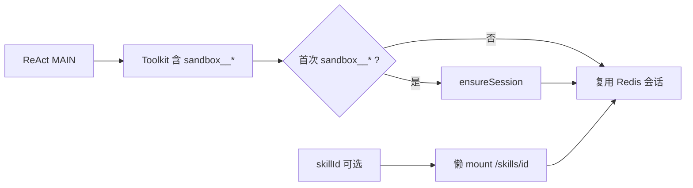

# 对话级沙箱常驻工具（方案 B）

**日期**：2026-07-16  
**状态**：已定稿 · **已实现**（方案 B）  
**前序**：[2026-07-15-skills-docker-sandbox-design.md](./2026-07-15-skills-docker-sandbox-design.md) · [2026-07-16-conversation-sandbox-multi-skill-design.md](./2026-07-16-conversation-sandbox-multi-skill-design.md) · [2026-07-16-sandbox-workspace-drawer-design.md](./2026-07-16-sandbox-workspace-drawer-design.md)

---

## 1. 背景

4.5 初版将 `sandbox__*` 与 **Skill `sandbox=docker`** 绑定：无 `skillId` 或 L3 未输出 skill 时，主 ReAct **看不到**六工具，易出现「只说过渡语、不调工具」。  
同会话 STM 为完整 `user`+`assistant` 正文，与 Skill 门控叠加后，模型更易从历史轮次拼凑 TaskBoard。

**目标**：对齐 Cursor 式体验——**对话绑定一个沙箱工作区**；文件/脚本能力不依赖是否选中 Skill。

---

## 2. 已确认决策（方案 B）

| 项 | 选择 |
|----|------|
| 工具可见性 | 主 ReAct **始终**注册六工具（同 `search_knowledge`、`manage_tasks`） |
| 容器生命周期 | **懒创建**：首次调用任一 `sandbox__*` 时 `ensureSession(conversationId)`；同会话复用 |
| 会话绑定 | `conversationId` + Redis `sandbox:conv:{tenant}:{id}`；TTL 见 `agent.sandbox.conversation-ttl-sec` |
| Skill 角色 | **仅** overlay + 可选懒挂载 `/skills/{skillId}/`；**不再**门控工具或开箱 |
| 会话策略 | Nacos `agent.sandbox.runtime`（统一基座镜像）；**不**再因 Skill `sandbox=docker` 才允许沙箱 |
| 子 Agent | 默认**不**注入六工具（白名单边界）；二期可按节点显式开启 |
| Skill Catalog `sandbox` 字段 | 保留作展示/种子/试跑元数据；**orchestrator 不读作开关** |

---

## 3. 架构

```text
Chat ReAct（任意 mode=react，可无 skillId）
  → DynamicToolkitFactory（MAIN）
       → 始终：search_knowledge + manage_tasks? + sandbox__* ×6
  → 首次 sandbox__* RPC
       → SandboxSessionLifecycle.ensureConversationSession(convId)
            → 无绑定 / 死会话 → POST sandbox-service（空 workspace + 空 skills/）
            → Redis 写入 sessionId + loadedSkillIds=[]
            → bind bridge（run 级）
  → 若本轮有 skillId 且 ∉ loadedSkillIds
       → PUT mount /skills/{skillId}/（懒挂载，与现多 Skill 方案一致）
  → sandbox-service 执行工具（PathJail：/workspace + /skills/{id}/）
```



---

## 4. 与 4.5 初版差异

| 维度 | 4.5 初版（已实现） | 方案 B（本文） |
|------|-------------------|----------------|
| 工具注入 | `shouldAttachSandbox(skillId)` | MAIN **始终**六工具 |
| 开箱时机 | `openIfNeeded` 在 Agent run 开始且 `needsSandbox(skillId)` | **首次工具调用**前 `ensureSession` |
| 无 Skill 的 react | 无 `sandbox__*` | 有工具；可调 `/workspace` |
| Skill `sandbox=docker` | 门控开关 | 元数据；不门控 |
| 意图路由 | L3 须输出 skillId 才能沙箱 | skillId **仅**用于 overlay/挂载，**非**沙箱前置条件 |

---

## 5. 实现要点（✅ 已落地）

| 组件 | 变更 |
|------|------|
| `DynamicToolkitFactory` | MAIN scope 始终 `registerAgentTool(sandbox__*)` |
| `SandboxSessionLifecycle` | 首次工具 / 抽屉 → `ensureSession`；无 skill 亦可 create |
| `SandboxAgentTools` | RPC 前 ensure；write 拒覆盖；exec Guard + `writeHitlMode` |
| `ReActAgentRuntime` | close 仅 unbind；开箱懒触发 |
| Nacos `mode-overlays.react` | sandbox__* 与 RAG 同级说明 |
| Live `verify_sandbox_live` | G1：无 skill 亦可出现 sandbox__* |

**后续增强（已另文）**：工作区 `writeHitlMode` · 时间线路径展示 · 见 [docs/sandbox/README.md](../../sandbox/README.md)。

**不改**：STM 形态、PathJail、`/skills/{id}` 多挂载、TTL Reaper。

---

## 6. 非目标

- 每条对话在进入 Chat 时预创建容器（选 B 而非 A）
- 用 L2/L3 规则判断「要不要沙箱」
- Workflow 子 Agent 默认沙箱
- 恢复 `/skill` 单数路径

---

## 7. 验收

| # | 场景 | 预期 | 状态 |
|---|------|------|:----:|
| B1 | 新会话、`react`、无 skillId、写 workspace | Toolkit 含六工具；首次 write 后 Redis 有会话 | ✅ Live G1 |
| B2 | 同会话第二轮读 | 复用容器 | ✅ W5 |
| B3 | `@sandbox-coding-demo` | 懒挂载 `/skills/.../` | ✅ |
| B4 | `simple-llm` / SUB | 无六工具 | ✅ |
| B5 | TTL 到期 | Reaper 回收 | ✅ |

---

## 8. 文档索引

- 总索引：[docs/sandbox/README.md](../../sandbox/README.md)
- [2026-07-15-skills-docker-sandbox-design.md](./2026-07-15-skills-docker-sandbox-design.md)
- [2026-07-16-conversation-sandbox-multi-skill-design.md](./2026-07-16-conversation-sandbox-multi-skill-design.md)
- [2026-07-16-sandbox-workspace-drawer-design.md](./2026-07-16-sandbox-workspace-drawer-design.md)
- [2026-07-16-sandbox-write-hitl-skip-design.md](./2026-07-16-sandbox-write-hitl-skip-design.md)
- [docs/skills/README.md](../../skills/README.md)
