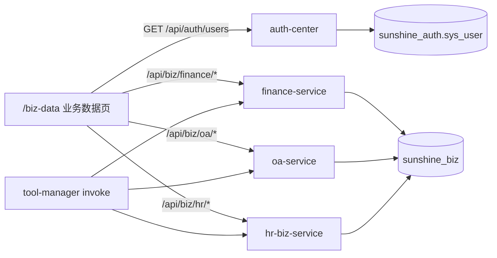

# 业务库落库 + `/biz-data` 表级 CRUD

> **状态**：✅ 已落地  
> **路由**：前端 `/biz-data`（`BizDataView`）；Admin 默认 token `sunshine-biz-admin-dev`（`BizAdminAuth`）  
> **关联**：[corpus50-platform-adapt](./2026-07-21-corpus50-platform-adapt-design.md)（数据层已被本文 supersede）

> **状态**：📝 设计已定稿（Brainstorming 2026-07-21）  
> **范围**：finance / oa / hr 三服务去掉进程内 JSON Mock，改为共享 MySQL `sunshine_biz` + SQL seed；前端业务数据页改为「左表类型 + 右 CRUD」  
> **实现路径**：方案 1 — 各服务自管本域表 + 本域 Admin CRUD；用户下拉读 `sunshine_auth.sys_user`  
> **关联**：[corpus50-platform-adapt](./2026-07-21-corpus50-platform-adapt-design.md) · tool-integration · 禁止 Flyway（`docker/mysql/init/` SSOT）

---

## 0. 需求决策（已定稿）

| # | 议题 | 决策 |
|---|------|------|
| 1 | 库拓扑 | **单库** `sunshine_biz`，三服务共用；各域自定表 |
| 2 | 重置种子 | **去掉**「重置种子」；仅靠 MySQL init + 页内 CRUD |
| 3 | 用户主表 | **不建** `biz_user`；业务表存 `user_id` |
| 4 | 用户下拉 | `sunshine_auth.sys_user`（`GET /api/auth/users`） |
| 5 | user_id 语义 | **`sys_user.id`（UUID）**；演示账号写入 auth 种子；`x-user-id` 与登录一致 |
| 6 | 落地方式 | **方案 1**：各服务 JPA + 本域 `/api/biz/...` CRUD；SDK 工具同库读写 |
| 7 | 旧 Mock | **清除、不做兼容**：删除 Store/JSON/`/api/mock/*`，禁止 alias |

### 0.1 演示用户固定 UUID（SSOT）

| id（= x-user-id） | username | nickname |
|-------------------|----------|----------|
| `a1111111-1111-4111-a111-111111111111` | `alice` | 爱丽丝 |
| `b2222222-2222-4222-b222-222222222222` | `bob` | 鲍勃 |
| `c3333333-3333-4333-c333-333333333333` | `carol` | 卡罗尔 |

密码：与现网联调惯例一致（实现计划中写明 BCrypt hash；可与现有测试账号同一口令）。  
业务种子行中的 `user_id` / `assignee_user_id` **只使用上表 id**，禁止再出现 `u-alice`。

---

## 1. 目标与非目标

### 1.1 目标

- 三服务业务数据持久化在 MySQL，重启不丢联调改动（除非手工 DELETE 或重跑 init）
- `/biz-data`（文案「业务数据」）左侧为**表类型**，右侧为该表基础增删改查列表
- SDK 工具与 Admin CRUD 读写同一库表；按 `x-user-id` 隔离
- 用户枚举来自真实 auth，表单提交 UUID

### 1.2 非目标

- 不对接真实 ERP/HRIS
- 不建跨库外键（`sunshine_biz` → `sunshine_auth`）
- 不做 JSON→DB 自动迁移；不做旧 `/api/mock` 兼容层
- 不引入 Flyway；不新增独立 biz-admin 服务
- 不改 RAG / Catalog 工具短名（仅数据源与验收身份 ID）

---

## 2. 架构

要点：

- 三服务 datasource 均指向 `sunshine_biz`；JPA 实体只映射本域表
- 删除 `TenantUserStore*`、`classpath:mock/seed-users.json`、`MockAdminController`、reset API
- 种子：`01-init-databases.sql` 增加库；`10-sunshine-auth.sql` 增补演示用户；新建 `18-sunshine-biz.sql` 建表 + INSERT
- Live 存量库：一次性执行 schema/seed 脚本（实现计划提供 `scripts/apply_sunshine_biz_schema.py` 或等价），**不做**进程内 reset

---

## 3. 表结构

**文件**：`docker/mysql/init/18-sunshine-biz.sql`  
**库**：`USE sunshine_biz;`  
所有业务表含 `tenant_id VARCHAR(32) NOT NULL DEFAULT 'default'`；时间列 `created_at` / `updated_at` DATETIME(3)。

| 域 | 表 | 主键 | 关键列 | 左栏名 |
|----|-----|------|--------|--------|
| finance | `fin_expense` | `id` | `user_id`, category, amount, status, occurred_on, remark | 报销单 |
| finance | `fin_inbox` | `id` | `user_id`, title, status, amount | 财务待办 |
| oa | `oa_task` | `id` | `assignee_user_id`, title, category, status | OA 待办 |
| hr | `hr_leave_balance` | `(tenant_id, user_id, year)` | annual, qingsong, compensatory | 假期余额 |
| hr | `hr_leave_request` | `id` | `user_id`, leave_type, start_date, end_date, reason, status | 请假单 |
| hr | `hr_attendance_month` | `(tenant_id, user_id, year_month)` | late_count, overtime_hours, frost_ledger_summary | 考勤月报 |

索引：各表 `(tenant_id, user_id)` 或 `(tenant_id, assignee_user_id)`；列表过滤 status 可加辅助索引。

种子内容对齐原 JSON（alice 报销/青松假等），仅身份改为 §0.1 UUID。

---

## 4. API 与页面契约

### 4.1 Auth

新增（需登录；经 Gateway `/api/auth/**`）：

`GET /api/auth/users?tenantId=default` → `[{ id, username, nickname }]`（仅 status=正常；按租户过滤）。

### 4.2 Biz Admin（替换 `/api/mock/*`）

鉴权：请求头 `X-Admin-Token`（配置键可保留 `sunshine.mock.admin-token` 或改名为 `sunshine.biz.admin-token`，实现时二选一并全仓统一；**禁止**保留双路径）。

统一形态（`{domain}` ∈ finance|oa|hr；`{table}` 见下）：

| 方法 | 路径 | 说明 |
|------|------|------|
| GET | `/api/biz/{domain}/{table}` | 列表；可选 `userId` / `status` / `tenantId` |
| POST | `/api/biz/{domain}/{table}` | 新建 |
| PUT | `/api/biz/{domain}/{table}/{id}` | 按主键更新（复合键表用路径或 query 明确约定，见下） |
| DELETE | `/api/biz/{domain}/{table}/{id}` | 删除 |

**table 路径段**：

| 域 | table | 备注 |
|----|-------|------|
| finance | `expenses` | 主键 id |
| finance | `inbox` | 主键 id |
| oa | `tasks` | 主键 id |
| hr | `leave-balances` | 复合键：`PUT/DELETE .../leave-balances/{userId}/{year}` |
| hr | `leave-requests` | 主键 id |
| hr | `attendance-months` | 复合键：`PUT/DELETE .../attendance-months/{userId}/{yearMonth}` |

删除旧接口：`/api/mock/**` 的 users / snapshot / reset / patch。

### 4.3 SDK 工具

- 短名与 Catalog ID **不变**（`list_my_expenses` 等）
- 实现改为 Repository 读库；`ToolInvocationContext` 取 `userId`/`tenantId`
- 资源归属校验：非本人 → 业务 not found（与现行为一致）
- 写工具仍走 HITL / `sideEffect=write` 既有约定

### 4.4 前端

- 路由 **`/biz-data`**；侧栏文案「业务数据」
- 顶栏：财务 / 人事 / OA
- 左栏：该域表类型列表（非用户）
- 右栏：`n-data-table` + 新建/编辑弹窗 + 删除确认；`user_id` / `assignee_user_id` 下拉绑定 auth 用户（展示 nickname，提交 id）
- 去掉「重置种子」；保留「刷新」
- Vite：`/api/biz/finance|oa|hr` → 对应服务端口；移除 `/api/mock/*` proxy

---

## 5. 清除范围

| 类别 | 删除 / 替换 |
|------|-------------|
| Store | `TenantUserStore` / `OaTenantUserStore` / `HrTenantUserStore` 及单测 |
| 种子 JSON | `*/resources/mock/seed-users.json` |
| Controller | `MockAdminController`（三服务） |
| 前端 API | `resetMockData`、snapshot/users mock 客户端改为 biz CRUD + auth users |
| 脚本 / Live | `u-alice` 等改为 §0.1 UUID（含 `verify_user_isolated_tools_live.py`） |
| 文档 | corpus50 设计中「进程内 JSON / 重置」表述以本文为准作废该段 |

禁止：`/api/mock` alias、JSON 回退读、无 user 头回退全局数据。

---

## 6. 验收门

| Gate | 标准 |
|------|------|
| G1 | 对 `fin_expense` 增改删后，列表与 DB 一致 |
| G2 | alice UUID 工具可见其报销；bob 空集；bob 查 alice 单据 → not found |
| G3 | 页左栏为表类型；用户仅出现在表单下拉（auth） |
| G4 | 无「重置种子」；`rg` 业务路径无 `TenantUserStore` / `seed-users.json` / `/api/mock/` |
| G5 | `GET /api/auth/users` 含三人；登录 alice 后 Chat/工具命中其种子行 |

---

## 7. 测试策略

- 单测：Repository + Admin CRUD + 工具读库（H2/Testcontainers，跟仓内 JPA 惯例）
- Live：更新 `verify_user_isolated_tools_live.py`；手动 `/biz-data` CRUD
- 编译启动：三服务 + auth + tool-manager；执行 biz schema 脚本后再验

---

## 8. 实现顺序（概要）

1. SQL：建库 + auth 演示用户 + `18-sunshine-biz.sql`
2. 三服务：datasource + JPA 实体/Repo；工具改读库；删 Store/JSON/MockAdmin
3. Admin CRUD Controllers（`/api/biz/...`）
4. Auth：`GET /api/auth/users`
5. 前端 `BizDataView` + `bizData.ts`；proxy `/api/biz/*`
6. Nacos datasource；Live apply schema；改 Live 脚本 UUID
7. 单测 + G1–G5 验收

详细任务拆分见实现计划（writing-plans）。
