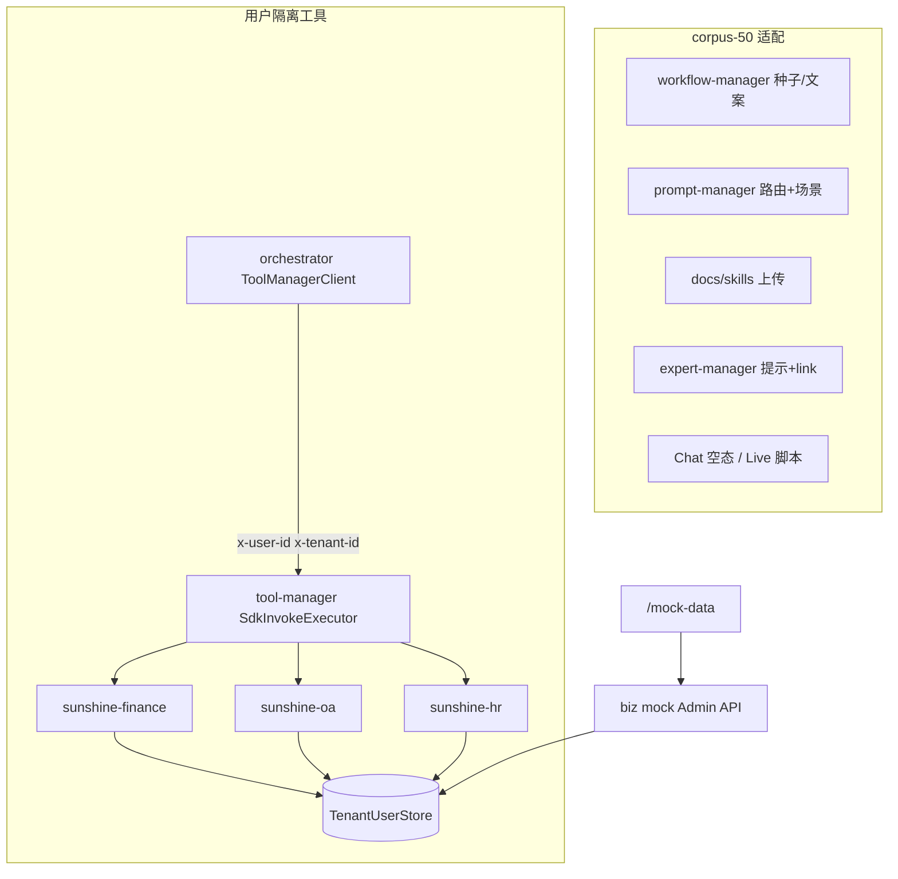

# corpus-50 平台适配 + 用户隔离 SDK 工具 + Mock 业务页

> **状态**：📝 设计已定稿（Brainstorming 2026-07-21）  
> **范围**：知识库语料切换后的 Skill / Workflow / Expert / Prompt / 路由验收适配；SDK 工具按用户隔离；前端 Mock 企业数据页  
> **实现路径**：**方案 A** — SSOT 改种子 + 运维脚本同步 Live  
> **关联**：corpus-50（`docs/knowledge/` · `generate_rag_corpus.py` · `rag_eval.py`）· [tool-integration](./2026-07-09-tool-integration-design.md) · [workflow-studio](./2026-06-25-workflow-studio-design.md) · [expert-consultation](./2026-07-07-expert-consultation-design.md)

---

## 0. 需求决策（已定稿）

| # | 议题 | 决策 |
|---|------|------|
| 1 | 适配范围 | **全栈一并改**：Workflow / Prompt / Skill / Expert / 路由 golden / Chat 空态 / Live 脚本 + RAG rewrite 域词 |
| 2 | 落地方式 | **方案 A**：改 `docker/mysql/init` + `docs/skills` 等 SSOT，再用 Python 同步 Live 库并重启 |
| 3 | 知识场景 | 非 demo：对齐 corpus-50 八域锚点问法（青松假、网约车上限、锁钥通道、变更窗口等） |
| 4 | knowledge 拓扑 | **不新增**第 5 个 knowledge 工作流；深化现有 `knowledge-qa/dual/branch/loop` |
| 5 | SDK 工具 | **合理增加**真实参数工具；身份只认 Gateway `x-user-id` / `x-tenant-id`；**禁止** LLM 传 `userId` 冒充 |
| 6 | 数据层 | 进程内可重置 **TenantUserStore**（JSON 种子）；接口形状按真实企业 API，暂不建业务 MySQL |
| 7 | 服务切分 | **增强 finance + oa**；新增 **`hr-biz-service`（app-id `sunshine-hr`）** 承载假期/考勤 |
| 8 | 前端 | 新增 **`/mock-data`** 业务 Mock 页（左域列表 + 右详情；可切换用户、重置种子） |
| 9 | 写工具 | `sideEffect=write`；需确认的走 HITL `require_confirmation` |
| 10 | 旧语料 | **不回灌** `leave-policy-v1` 等历史 docId |

---

## 1. 目标与非目标

### 1.1 目标

- Chat / Workflow / Skill / Expert 与 corpus-50 知识库一致，验收句可检索命中
- Agent 调用企业工具时，**不同登录用户看到不同业务数据**
- 联调人员可在 `/mock-data` 查看与构造「我的报销 / 假期余额 / OA 待办」等场景
- 新环境（init）与现网（sync 脚本）行为一致

### 1.2 非目标

- 不对接真实 ERP/HRIS
- 不新建业务数仓 / 不强制业务表落 MySQL（本轮）
- 不改 RAG 检索主链路（rewrite 仅扩域词）
- 不让模型参数决定身份
- 不新增 knowledge-* 工作流拓扑数量

---

## 2. 架构

### 2.1 身份透传（基础设施，必做）

| 环节 | 改动 |
|------|------|
| `ToolManagerClient.invokeMono` | 增加并转发 `x-user-id`、`x-tenant-id`（从当前聊天 / Agent 上下文取；写工具缺头则拒绝） |
| tool-manager `SdkInvokeExecutor` | HTTP 调用 SDK app 时原样透传上述头 |
| `SunshineToolController.invoke` | 将头注入 `ToolInvocationContext`，供工具实现读取 |
| CatalogRemoteAgentTool / Workflow tool 节点 | 与 ReAct 同一透传路径 |

**规则**：工具方法 **不得** 声明 `@ToolParam("userId")` 作为身份；资源 ID（`expenseId` 等）必须校验归属当前用户，越权返回业务 not found。

### 2.2 TenantUserStore

- Key：`(tenantId, userId)`
- 值：该用户的报销单、请假单、假期余额、考勤月报、OA 任务、财务待办消息等
- 启动加载 `classpath:mock/seed-users.json`（或多文件按域）
- Admin：`POST .../mock/reset` 恢复种子；可选 `PATCH` 改状态/金额便于造数
- 演示用户：

| userId | 角色 | 种子数据侧重 |
|--------|------|--------------|
| `u-alice` | 员工 | 有待报销、青松假余额、部分请假单 |
| `u-bob` | 主管 | OA 待批任务、较少个人报销 |
| `u-carol` | 财务 | 财务待审消息队列 |

---

## 3. SDK 工具清单

Catalog ID：`sdk__{appId}__{name}`（现有 `ToolIds` 约定）。

### 3.1 `sunshine-finance`（增强）

| 短名 | sideEffect | 参数 | 行为 |
|------|------------|------|------|
| `list_my_expenses` | read | `status?` | 仅当前用户 |
| `get_expense_detail` | read | `expenseId` | 归属校验 |
| `submit_expense` | write | `category, amount, occurredOn, remark?` | 写入当前用户 pending |
| `list_finance_messages` | read | `status?` | **改为按用户过滤**（兼容旧名） |
| `get_finance_message_detail` | read | `id` | 归属校验 |
| `summarize_finance_by_status` | read | `status?` | 仅当前用户聚合 |

### 3.2 `sunshine-hr`（新建 `hr-biz-service`）

| 短名 | sideEffect | 参数 | 行为 |
|------|------------|------|------|
| `get_leave_balance` | read | `year?` | 年假/青松假/调休余额 |
| `list_leave_requests` | read | `status?` | 当前用户请假单 |
| `submit_leave_request` | write | `leaveType, startDate, endDate, reason` | 写申请；可 HITL |
| `get_attendance_month` | read | `yearMonth` (YYYY-MM) | 迟到/加班/霜降台账摘要 |

端口建议 `8720`；Nacos metadata `sunshine.tool-app=true`，`app-id=sunshine-hr`。

### 3.3 `sunshine-oa`（增强）

| 短名 | sideEffect | 参数 | 行为 |
|------|------------|------|------|
| `list_oa_tasks` | read | `status?` | 仅负责人 = 当前用户 |
| `approve_oa_task` | write | `taskId` | 仅负责人可批 |

### 3.4 启用与挂载

1. 服务启动 → SdkDiscoveryPuller sync  
2. `/tools` 启用新工具  
3. 加入 `global-react-default`；`knowledge-loop` / `finance-*` 改用隔离后工具  
4. init：`16-sunshine-tool-manager.sql` 增加 `sdk_application`：`sunshine-hr`

---

## 4. 前端 `/mock-data`

| 项 | 约定 |
|----|------|
| 路由 | `/mock-data`；侧栏「业务数据」 |
| 布局 | Skills 同构：左域（财务/人事/OA）+ 用户切换；右表详情 |
| 能力 | 按租户+用户查看；重置种子；简单改状态/金额 |
| 风格 | `--sun-black` + 边框；`sun-field`；禁止灰底卡片堆砌 |
| API | 经 BFF 或 Vite proxy 到 biz mock Admin；写操作需登录态 |

---

## 5. corpus-50 能力适配

### 5.1 场景咬合

| 用户意图 | 知识库 | 工具 |
|----------|--------|------|
| 青松假政策 + 余额 | `c50-hr-leave` | `get_leave_balance` |
| 网约车上限 + 待报销 | `c50-hr-expense` | `list_my_expenses` |
| `#knowledge-dual` | leave + expense 双 RAG | 可选再拉余额/单据 |
| `#knowledge-branch` | 「报销/费用」→财务 RAG，否则人事 | 边条件可保留关键字 |
| `#knowledge-loop` | RAG + 财务工具多轮 | 隔离后的 list/summarize |
| Expert 合规 | 制度条文 | 只读拉该用户单据再评 |

### 5.2 种子 / Catalog 改动面

| SSOT | 改动要点 |
|------|----------|
| `13-sunshine-workflow-manager.sql` | knowledge-* 文案/examples → corpus 锚点 |
| `17-sunshine-prompt-manager.sql` | 路由/场景 prompt 扩八域；例子换锚点 |
| `14` + `config-seed.json` | rewrite/hyde 域词扩展 |
| `15-sunshine-expert-manager.sql` | expert 提示对齐；skill_link 与实际上传一致 |
| `docs/skills/*` | 多域制度审阅，非单点年假 demo |
| Chat 空态 / Knowledge placeholder | 锚点问法与 `c50-*` |
| routing-golden-set + verify_* | Live 句全面替换 |
| `scripts/sync_corpus50_platform.py` | Live 同步（实现期新增） |

### 5.3 推荐验收句

- `#knowledge-qa 青松假有多少天、怎么申请`
- `#knowledge-qa 市内网约车报销上限多少`
- `#knowledge-dual 青松假和网约车报销上限一起查`
- `#knowledge-branch 网约车报销需要哪些材料` / `#knowledge-branch 青松假怎么申请`
- `#knowledge-loop 分析青松假余额和我的待报销`（登录 u-alice）

---

## 6. 落地顺序

1. 身份透传（orchestrator → tool-manager → SDK context）  
2. Store + finance/oa 改造 + hr-biz 新服务 + mock Admin API  
3. 前端 `/mock-data`  
4. corpus-50 文案/种子/Skill/Expert/路由/脚本 + Live sync  
5. 启用工具、挂工具集、重启；跑 workflow Live + 工具隔离抽检 + rag smoke  

---

## 7. 验收标准

| ID | 标准 |
|----|------|
| G1 | u-alice / u-bob 调用 `list_my_expenses` 结果集不同 |
| G2 | 跨用户 `get_expense_detail` → not found |
| G3 | `/mock-data` 切换用户与重置种子可用 |
| G4 | `#knowledge-qa 青松假…` 命中 leave 相关内容 |
| G5 | knowledge-branch/dual/loop Live 绿 |
| G6 | ReAct 可选 `get_leave_balance` 且参数不含 userId |
| G7 | 配置了 confirmation 的写工具走 HITL |

---

## 8. 风险与缓解

| 风险 | 缓解 |
|------|------|
| 透传遗漏 | 单测：无 user 头时 write 拒绝；read 空集 |
| 演示账号不一致 | Mock 页与 README 标明 u-alice/bob/carol |
| Live 与 init 漂移 | sync 脚本可重复执行 |

---

## 9. 文档 SSOT

| 产物 | 路径 |
|------|------|
| 本设计 | `docs/superpowers/specs/2026-07-21-corpus50-platform-adapt-design.md` |
| 实施计划 | `docs/superpowers/plans/2026-07-21-corpus50-platform-adapt.md`（下一步） |
| 语料/评测 | `docs/knowledge/*` · `scripts/generate_rag_corpus.py` · `rag_eval.py` |
