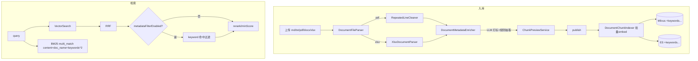

# RAG 入库与检索管线优化设计（P1/P2/P3）

> **状态**：📝 设计定稿（待用户评审确认）  
> **范围**：rag-service 入库链路 + 检索链路 + `/knowledge` 前端 + `scripts/rag_*.py`；**不新增微服务**  
> **关联**：[2026-07-21-rag-chunk-strategies-design.md](./2026-07-21-rag-chunk-strategies-design.md) · [2026-07-01-rag-studio-v2-design.md](./2026-07-01-rag-studio-v2-design.md) · [ADR-002](../../architecture/ADR-002-rag-pipeline-in-rag-service.md) · 评估依据：通用 RAG 流程对照评估（2026-07-27 会话）

---

## 0. 背景与需求决策

2026-07-27 对照「通用 RAG 处理流程」（格式转换→清洗降噪→智能分块→语义增强→存储索引）评估当前系统，结论：整体完成度约 85%，分块策略（5 种）、PII 治理（服务化脱敏 + quarantine）、检索链路（改写/HyDE/RRF/rerank/向量锚点门禁/评测闭环）均强于通用方案；通用方案中的「正则去标点/特殊符号」为反模式，**明确不引入**。

识别出的差距（用户已拍板全做）：

| # | 议题 | 决策 |
|---|------|------|
| 1 | P1 chunk 语义元数据缺失（无关键词/主题标注，无法内容级过滤） | **做**：文档级 LLM 打标（关键词+主题）+ 规则抽取（年份/文号），随 chunk 写入 Milvus/ES，检索时可过滤/加权 |
| 2 | P1 Excel 解析缺口（台账/FAQ 无法入库） | **做**：`xlsx` sourceType，Apache POI → Markdown 表格，复用现有解析→预览→发布链路 |
| 3 | P2 分块长度按字符数，无 token 维度校验 | **做**：`TokenEstimator` 统一估算，preview 响应输出每块 token 数 + 超限硬门禁（≤ 8192 token） |
| 4 | P2 `SemanticChunker` 逐句阻塞 embed，长文档极慢 | **做**：`EmbeddingService.embedBatch`（DashScope 原生多文本，≤10/批）+ 批量并发化入库 embed |
| 5 | P3 PDF 页眉页脚/水印重复行噪声 | **做**：`RepeatedLineCleaner` 在 PDF 解析后剥离跨页高频重复行（≥3 页出现且占比 >40%） |
| 6 | P3 embedding 维度 1024 硬编码，换模型静默错位 | **做**：`embedding.dimension` 配置化，启动时与 Milvus collection schema 校验，不匹配直接 fail-fast |
| 7 | 元数据检索启用方式 | **开关默认关闭**（`search.metadataFilterEnabled` 默认 false），改动须经 corpus-50 评测门禁方可默认开启 |
| 8 | 打标失败策略 | **降级入库**（metadata 置空 + warn 日志），不阻塞发布；PII 脱敏仍 fail-on-error（不变） |
| 9 | 存量数据迁移 | **不兼容、直接重建**（用户 2026-07-27 确认）：Milvus collection 加字段即重建清空，ES 删索引重建，上线后 `rag_wipe_and_ingest.py` 全量重灌 + `rag_eval.py` 基线回归；不留任何旧 schema 兼容层 |

---

## 1. 目标与非目标

### 1.1 目标

- chunk 携带内容语义元数据（关键词/主题/年份/文号/章节路径），可审计（落 `document_version.doc_metadata_json`）
- 检索侧可选启用「元数据过滤 + BM25 关键词加权」，走现有 rag_config_version 配置与评测门禁
- Excel(.xlsx) 文档可上传入库，表格还原为 Markdown 表格
- 分块 token 数可见、可门禁；semantic 分块与批量入库性能显著提升
- PDF 噪声下降、embedding 配置错位启动即暴露

### 1.2 非目标

- 不做「正则去标点/特殊符号」类破坏性清洗（反模式）
- 不做 chunk 级 LLM 逐块打标（成本与延迟不可控，本期文档级）
- 不做 BM25 查询自动抽取元数据过滤（query understanding 复杂度与误过滤风险高，后续单独立项）
- 不迁移/回填存量 chunk 的 metadata
- 不改改写/HyDE/rerank 主链路语义；不改 `DocumentSourceType` 之外的文档模型

---

## 2. 架构总览



### 2.1 核心组件

| 组件 | 职责 | 位置 |
|------|------|------|
| `XlsxDocumentParser` | POI 读 xlsx，逐 sheet → Markdown 表格 + sheet 标题 | `admin/catalog/parser/` 新增 |
| `RepeatedLineCleaner` | 剥离跨页高频重复行（页眉/页脚/水印） | `admin/catalog/parser/` 新增 |
| `DocumentMetadataEnricher` | 文档级元数据：LLM（关键词/主题）+ 规则（年份/文号）+ section_path | `admin/catalog/metadata/` 新增 |
| `MetadataExtractionPrompt` | 打标 system prompt（SSOT 内聚，JSON 约束输出） | 同上 |
| `TokenEstimator` | 中英文混合 token 估算（CJK≈0.6/字，ASCII≈0.25/字符） | `chunker/` 新增 |
| `EmbeddingService.embedBatch` | 多文本批量 embed（≤10/请求，批间并发） | `service/EmbeddingService` 改 |
| `EmbeddingDimensionGuard` | 启动时校验配置维度 == Milvus collection 维度 | `service/MilvusService` 内 |

### 2.2 数据流（关键约定）

**入库**：解析 →（PDF 清洗）→ 全文元数据打标（一次，基于前 4000 字）→ 分块（每块 chunkIndex 元数据 = 文档级元数据 + `section_path`）→ preview 快照（含 metadata，hash 含正文，**不含** metadata）→ publish → `embedAndIndexDrafts`（批量 embed + Milvus/ES 双写含 metadata）→ `document_version.doc_metadata_json` 落库。

**检索**：向量 expr 维持 `tenant/kb/status/chunk_level`；metadata 过滤**不进入 Milvus expr**（expr 过滤对 Array contains 支持弱且易误伤召回），统一在 `RetrievalService` 结果层处理；BM25 将 `keywords` 以 boost=2 加入 `multi_match`。

---

## 3. 数据模型与配置

### 3.1 元数据结构

文档级（落 `document_version.doc_metadata_json` + 每个 chunk 冗余到 Milvus/ES）：

```json
{
  "keywords": ["报销", "差旅", "发票", "审批"],
  "topics": ["财务制度", "费用管理"],
  "years": [2024, 2025],
  "docNos": ["财发〔2024〕12号"]
}
```

chunk 级（仅 `section_path`，随 chunk 写入，ES 已有同名字段/直接启用；Milvus 新增）：

```json
{ "section_path": "第三章/费用报销/3.2 差旅标准" }
```

### 3.2 MySQL 变更

`docker/mysql/init/14-sunshine-rag-service.sql`（一项目一文件，禁 Flyway）：

```sql
ALTER TABLE document_version
    ADD COLUMN doc_metadata_json JSON NULL AFTER chunk_params_json;
```

`DocumentVersionEntity` 增加 `docMetadataJson` 字段；publish/ingestText 时写入。

### 3.3 Milvus collection 变更

新增 5 个标量字段（在 `createCollection` 中追加）：

| 字段 | 类型 | 说明 |
|------|------|------|
| `keywords` | `Array<VarChar(64)>` max_capacity=16 | 关键词 |
| `topics` | `Array<VarChar(64)>` max_capacity=8 | 主题 |
| `years` | `Array<Int16>` max_capacity=8 | 规则抽取年份 |
| `doc_nos` | `Array<VarChar(128)>` max_capacity=8 | 文号 |
| `section_path` | `VarChar(512)` | 章节路径 |

`V2_FIELDS` 集合同步扩为含上述字段 → `schemaSupportsV2()` 对旧 collection 返回 false → **启动时自动重建**（现有机制）。运维须知：上线即触发 collection 重建，存量向量清空，需 `scripts/rag_wipe_and_ingest.py` 重灌（CLAUDE.md 既有流程）。

### 3.4 ES 变更

- `section_path`：mapping 已存在（keyword），开始写入真实值
- 新增 mapping：`keywords`/`topics`/`doc_nos`（`text` + `keyword` 子字段）、`years`（`integer`），落入 `ensureIndex()` 的 mapping SSOT
- **不兼容重建**：上线时删除旧索引 `sunshine_rag_chunks`，由服务启动 `ensureIndex()` 按新 mapping 重建；不写 `_put_mapping` 兼容逻辑

### 3.5 检索配置（rag_config_version，UI 可调）

`RagConfigSchemaService.RAG_SEARCH` 新增字段（SSOT 走现有 bundle）：

| path | 类型 | 默认 | 说明 |
|------|------|------|------|
| `search.metadataFilterEnabled` | boolean | **false** | 元数据过滤总开关 |
| `search.metadataKeywordBoost` | number | 2.0 | BM25 keywords 字段 boost |
| `search.metadataMinKeywordHit` | number | 2 | query 与 chunk keywords 命中数下限（≥才保留） |

`EffectiveRagConfig` record 增加对应字段 + merge 逻辑。Eval Suggest 允许建议路径追加 `search.metadataFilterEnabled`（sunshine-rag.yaml `rag.eval.suggest` 输出约束同步更新）。

---

## 4. 各工作项详细设计

### 4.1 P1-1 文档语义元数据（enricher）

**`DocumentMetadataEnricher.extract(String fullText) → DocumentMetadata`**：

1. **规则抽取**（纯本地）：`years` 正则 `(19|20)\d{2}\s*年?`；`docNos` 正则 `[一-龥]{1,6}(发|办|规|函)?〔\d{4}〕\d+号` 及 `第?\d{4}[-—]\d+号`；去重、上限 8。
2. **LLM 打标**（一次调用，输入 `fullText.substring(0, 4000)`）：`LlmGatewayClient.complete(model, MetadataExtractionPrompt.SYSTEM, user)`，约束输出纯 JSON `{"keywords":[],"topics":[]}`；解析失败/超时/空 → 空集合降级（warn）。
3. `DocumentMetadata = (List<String> keywords, List<String> topics, List<Integer> years, List<String> docNos)`，均为不可空（空集合）。

**section_path**：markdown 策略沿用 `MarkdownParser` 标题栈，将当前 chunk 所属标题路径写入 `ChunkDraft.meta.sectionPath`；parent_child 的 parent 写自身路径、child 继承 parent；fixed/recursive/semantic 无标题栈时为空串。**不做**对非 markdown 文本的标题猜测。

### 4.2 P1-2 检索侧应用（默认关闭）

- **BM25**：`Bm25SearchService.buildSearchBody` 的 `multi_match.fields` 由 `[content, doc_name^?]` 扩为 `[content, doc_name, keywords^boost]`（boost 读 `metadataKeywordBoost`，开关关闭时退化为现行为）。
- **结果层过滤**：`RetrievalService.hybridSearch`/`vectorSearch` 在 `applyMinScore` 前插入 `metadataFilter(candidates, config)`：仅当 `metadataFilterEnabled=true` 且 candidate 携带 keywords（`SearchHit`/`RetrievalCandidate` 增加 `keywords` 字段透传）时，统计 query（及其改写后 effectiveQuery）与 keywords 的**大小写不敏感子串命中数**，`< metadataMinKeywordHit` 则丢弃；keywords 为空的 chunk **不过滤**（向后兼容存量/打标失败数据）。
- **锚点门禁优先级不变**：向量锚点判空仍在过滤前执行，避免元数据过滤掩盖「真的没检索到」。

### 4.3 P1-3 Excel 解析

`DocumentSourceType` 新增 `XLSX("xlsx", "请上传 Excel（.xlsx）文件，系统将解析为 Markdown 表格。")`；`inlineEditable()=false`；`validateUploadFileName` 接受 `.xlsx`（`.xls` 不支持，POI HSSF 不引入）。

`XlsxDocumentParser.parse(byte[], ParseProgressListener)`：
- `WorkbookFactory.create` → 逐 sheet：`## {sheetName}\n\n` + 表格 Markdown（复用 `DocxDocumentParser.tableToMarkdown` 同款转义：`|→\|`、换行→空格）
- 空单元格占位空串；合并单元格取左上角值；公式取 `getCachedFormulaResultType` 计算值
- 全 workbook 无有效行 → `INGEST_PARSE_FAILED`；进度按 sheet 粒度回调
- `DocumentFileParser.isAsyncSourceType` 加入 XLSX（异步解析 + quarantine 流程与 PDF/DOCX 一致）

前端：`docSourceTypes.ts` 增加 xlsx 选项（accept `.xlsx`、markdownPreview=true、inlineEditable=false）；`KbDocPanel` 上传/类型选择随之生效（组件已按 option 驱动，无需硬编码）。

`scripts/rag_ingest_bulk.py`：`--source-type xlsx` 支持按目录批量入库。

### 4.4 P2-1 token 校验

`TokenEstimator.estimate(String) → int`（静态工具，无外部依赖）：

```
token ≈ ceil( cjkChars * 0.6 + asciiChars * 0.25 + otherChars * 0.5 )
```

（text-embedding-v4 / deepseek 系经验值，仅做门禁与展示，不追求精确。）

- **preview 响应**：`ChunkPreviewChunkItem` 增加 `tokenCount`；前端预览面板每块展示字符数 + token 数
- **硬门禁**：`ChunkerRegistry.chunk` 末尾统一校验，`tokenCount > 8192` 抛 `CHUNK_TOKEN_LIMIT_EXCEEDED`（新 `RagErrorCode`）——8192 为 text-embedding-v4 上限，预留提示词余量由 maxSize 默认值保证
- **不做**：按「模型上下文 60%」动态换算（模型多、上下文不一，简化为 embedding 硬上限）

### 4.5 P2-2 批量 embedding

`EmbeddingService` 新增：

```java
public Mono<List<List<Float>>> embedBatch(List<String> texts)
```

- 单请求 `input.texts` ≤ 10（DashScope 上限）；分片后用 `Flux` 以 concurrency=4 并发请求，保序拼接
- 失败语义与 `embed` 一致（doOnError 日志，异常向上）

改造点：
1. `SemanticChunker.chunk`：`embedBatch(sentences).block()` 替换逐句 `embed().block()`（本类为同步分块上下文，统一一次 block）
2. `DocumentChunkIndexer.embedAndIndexDrafts`：当前 `flatMap(draft → embed→insert)` 改为「先 `embedBatch(texts)` 一次性取向量 → 再按 chunk 循环 insert Milvus/ES」（insert 为同步阻塞 SDK，保持在 boundedElastic 上执行）；per-chunk 失败语义不变（异常中断整个 publish，由 preview 重试）

### 4.6 P3-1 PDF 重复行清洗

`RepeatedLineCleaner.clean(String markdown) → String`，仅在 `PdfDocumentParser` 两条路径（文本层 / OCR）产出后调用：

- 按行切分，trim 后长度 ∈ [4, 60] 且匹配「无句读结尾」或「含页码模式(`第?\d+页` / `-\s*\d+\s*-` / `\d+\s*/\s*\d+`)」的候选行
- 候选行按归一化文本计数：出现页数 ≥3 **且** 出现次数 > 有效行数 × 40% → 判定为页眉/页脚/水印，全部删除
- 单页文档（文本层无分页符时按 ~50 行虚拟页）不启用页数维度，仅处理页码模式行
- 保守原则：宁留勿删；误删风险高的行（表格 `|` 开头、标题 `#` 开头）不处理

### 4.7 P3-2 embedding 维度守卫

- `EmbeddingService` 新增 `@Value("${embedding.dimension:1024}") int dimension`；Nacos `sunshine-rag.yaml` `embedding:` 下显式声明 `dimension: 1024` 并注释「换模型必须同步改此项并 rag_reset」
- `MilvusService.DIMENSION` 改为从 `EmbeddingService` 注入（构造器参数）；`ensureCollection()` 中新增：已存在 collection 的 `embedding` 字段维度 ≠ 配置维度 → 抛 `IllegalStateException`（fail-fast，**不自动重建**——重建只在字段缺失时触发，维度错位属于人为配置事故必须显式介入）

---

## 5. API 与前端变更

| 位置 | 变更 |
|------|------|
| `ChunkPreviewChunkItem` | +`tokenCount`、+`meta.sectionPath` 透出 |
| 预览面板（KbDocPanel） | 每块显示 `chars / tokens`；xlsx 类型可选 |
| `docSourceTypes.ts` | +xlsx option |
| DocumentDetail API | +`docMetadata`（解析 `doc_metadata_json`），详情抽屉展示关键词/主题/文号 |
| `RagConfigSchemaService` | +3 个 search 字段（§3.5），配置 Tab 可调 |
| Eval Suggest prompt | `suggestions.path` 允许 `search.metadataFilterEnabled` |

---

## 6. 验收方案

### 6.1 单测（新增/扩展）

| 类 | 覆盖点 |
|----|--------|
| `XlsxDocumentParserTest` | 多 sheet/合并单元格/公式缓存值/空表/转义 |
| `RepeatedLineCleanerTest` | ≥3 页页眉剥离、页码行、表格行不误删、单页保守 |
| `DocumentMetadataEnricherTest` | 年份/文号正则、LLM 失败降级、JSON 解析容错 |
| `TokenEstimatorTest` | 纯中文/纯英文/混合边界 |
| `SemanticChunkerTest` | 批量 embed 后切分结果与逐句一致 |
| `ChunkerRegistryTest` | token 超限门禁触发 |
| `MilvusServiceTest`（或集成测试） | 维度不匹配 fail-fast |
| `RetrievalServiceTest` | metadataFilter 开关关=不过滤、开关开+空 keywords=不过滤、命中数不足丢弃 |
| `Bm25SearchServiceTest` | buildSearchBody 含 keywords boost / 关闭时退化 |

### 6.2 Live 验收（scripts）

- `verify_chunk_strategies_live.py`：扩展断言 preview 响应含 `tokenCount`、xlsx 文档走通 预览→发布→检索
- 新增 `verify_rag_metadata_live.py`（可选）：上传含关键词文档 → 断言 Milvus/ES chunk 携带 keywords/section_path → 开启 `metadataFilterEnabled` 后离题 query 空召回率提升
- `rag_eval.py`：corpus-50 回归门禁（开关关闭时基线不回退；开启后单独出报告对比）

### 6.3 运维步骤（上线清单）

1. 执行 `14-sunshine-rag-service.sql` ALTER（doc_metadata_json）
2. `sync_nacos.py`（embedding.dimension 显式声明 + eval suggest prompt 更新）→ 重启 rag-service
3. rag-service 启动触发 Milvus collection 重建（加字段不匹配即重建）
4. 删除 ES 旧索引 `sunshine_rag_chunks`，由服务 `ensureIndex()` 按新 mapping 重建
5. `rag_wipe_and_ingest.py` 全量重灌语料
6. `rag_eval.py` 基线回归通过 → 如需再开启 metadataFilterEnabled 并复测

---

## 7. 风险与权衡

| 风险 | 缓解 |
|------|------|
| Milvus collection 重建清空存量 | 已确认不兼容路线：上线清单强制重灌；`rag_eval` 基线门禁兜底 |
| LLM 打标增加入库延迟（~1-2s/篇） | 仅文档级一次调用；失败降级不阻塞 |
| metadata 过滤误伤召回 | 默认关闭 + 空 keywords 不过滤 + 评测门禁后才允许开启 |
| token 估算误差 | 仅用于展示与 embedding 硬上限门禁，不参与切分决策 |
| xlsx 大文件内存 | POI streaming（XSSF→SXSSF 不需要，读用 `WorkbookFactory` + 行级遍历）；超过 5MB 由现有上传大小限制兜底 |
| 批量 embed 部分失败 | 异常中断 publish，preview 可重试；与现状一致 |

---

## 8. 实施顺序建议（供 plan 阶段拆任务）

1. **Batch A（纯增量、无重建）**：TokenEstimator + token 门禁 + preview 透出；EmbeddingService.embedBatch + SemanticChunker/Indexer 改造；RepeatedLineCleaner
2. **Batch B（需重建/重灌）**：Milvus 字段 + 维度守卫 + ES mapping + metadata enricher + 双写 + `doc_metadata_json`
3. **Batch C（检索行为，默认关）**：RetrievalService/Bm25 metadata 应用 + schema 字段 + Eval Suggest 路径
4. **Batch D（前端与脚本）**：xlsx 端到端（解析器+sourceType+前端+bulk 脚本）
5. 全程 Live 验收脚本扩展 + corpus-50 回归

> 评审确认后，按 superpowers writing-plans 拆分为实施计划（`docs/superpowers/plans/2026-07-27-rag-pipeline-optimization.md`）。
