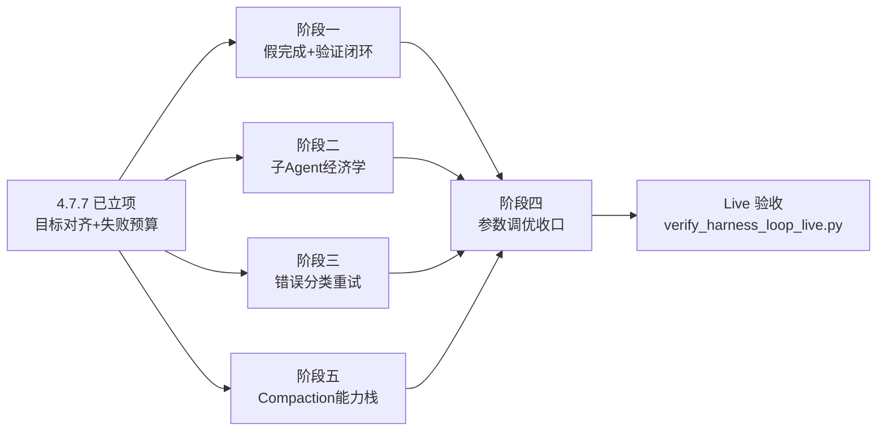

# ReAct Harness Loop 长任务能力增强（四阶段）

> **阶段**：四 · **任务卡**：4.7.8（候选）
> **状态**：📋 设计评审中（未实现）
> **日期**：2026-07-28
> **前置**：4.7.7 ReAct 目标对齐与失败预算（`2026-07-27-react-goal-alignment-design.md`）、AS 2.0 HarnessAgent + CompactionConfig（P2）、4.7.6 spawn_subagent、4.5 沙箱六工具、3.7 Grounding 校验
> **关联**：[2026-07-27-react-goal-alignment-design.md](./2026-07-27-react-goal-alignment-design.md) · [2026-07-22-agentscope-2-upgrade-design.md](./2026-07-22-agentscope-2-upgrade-design.md) · `ReActAgentRuntime` · `HarnessAgentFactory` · `ProcessingStepMiddleware` · `AgentExecutionProperties`

---

## 0. 背景与定位

4.7.7 解决了「过程中漂移」（目标对齐 + 失败预算）。但 ReAct 模式要达到 Claude Code 级长任务能力，仍有四类缺口：

| 缺口 | 现状 | 危害 |
|------|------|------|
| 假完成 | 模型声称「已完成」即终止，无完成度校验 | 写了代码没跑测试、改了配置没验证，用户拿到半成品 |
| 验证闭环缺失 | 沙箱能跑 `mvn test`，但无「写后必验证」约束 | 模型可写完直接收束，验证全靠自觉 |
| 子 Agent 上下文膨胀 | `spawn_subagent` 结果全文回传主循环 | 主循环 8 轮子任务后上下文爆炸，compaction 丢失关键发现 |
| ReAct 错误无分类重试 | `ExecutionErrorClassifier` 仅 Plan 节点用；ReAct 工具失败全占 LLM 轮次 | 瞬态错误（超时/限流）浪费决策轮次，加速 max-iters 耗尽 |

**定位**：本 spec 是 4.7.7 的续篇，复用其 `AgentRunState` 载体与瞬态注入模式，分四阶段补齐上述缺口。**不引入新 ExecutionMode、不新增前端组件、不违背 D11（TaskBoard 非 mini-DAG）**。

### 关键事实（代码核查结论）

- **循环内 compaction 仅启用最简配置**：`HarnessAgentFactory.buildCompactionConfig()` 当前只装配 `triggerMessages/keepMessages`（对标 `MemoryProperties.AutoContext`），AS 2.0 原生 compaction 栈的其余能力（`triggerTokens`/`keepTokens`/`toolResultEviction`/`truncateArgs`/`flushBeforeCompact`/`offloadBeforeCompact`/overflow 恢复/`session_search` 引用化）**全部未启用**。阶段五补齐
- **`max-iters` 默认 5**（`AgentExecutionProperties.React.maxIters`）：长任务需调高，但必须配合 4.7.7 失败预算 + 本 spec 假完成门禁 + 阶段五 compaction 能力栈，否则死循环更贵
- **沙箱写工具已可识别**：`SandboxIds.WRITE` / `SandboxIds.EDIT`；`ProcessingStepMiddleware:226` 已有写工具分支
- **子 Agent 全文回传**：`SpawnSubagentTool:141 return result`
- **`ExecutionErrorClassifier` 现成可用**：TIMEOUT/CIRCUIT_OPEN/SERVICE_UNAVAILABLE/VALIDATION/BUSINESS 五类 + `retryableByDefault`

---

## 1. 五阶段总览

| 阶段 | 能力 | 复用基础 | 核心交付 |
|------|------|---------|---------|
| **一** | 假完成检测 + 验证闭环 | 4.7.7 `AgentRunState` + 瞬态注入 | `CompletionGuardMiddleware` + 写后必验证 prompt |
| **二** | 子 Agent 上下文经济学 | 4.7.6 `spawn_subagent` + `AgentRunRequest` | 子 Agent 分类（explore/execute）+ 结果摘要回传 |
| **三** | ReAct 错误分类重试 | `ExecutionErrorClassifier` + `NodeRetryExecutor` 模式 | `ReactToolRetryer` 瞬态错误自动重试 |
| **四** | 长任务参数调优 + 收口 | 全部上述能力 | `max-iters` 调高 + TaskBoard 强约束 + Live 验收 |
| **五** | Compaction 能力栈全面启用 | AS 2.0 `CompactionConfig` + `ToolResultEvictionConfig` | token 触发 + 引用化 offload + tool 结果驱逐 + overflow 恢复 |

**依赖关系**：阶段一无前置（可与 4.7.7 并行）；阶段二独立；阶段三独立；阶段五独立但阶段四依赖它；阶段四依赖一二三五全部落地。**建议执行顺序**：一 -> 三 -> 二 -> 五 -> 四（一三最轻、价值最高；二工程量最大；五是 compaction 基础设施；四是收口配置）。



---

## 2. 方案选型

| 决策点 | 选择 | 备选 | 理由 |
|--------|------|------|------|
| 假完成检测位置 | `finishAnswerStream` 前置门禁 | 每轮 reasoning 校验 | 终态校验成本最低；过程中靠 4.7.7 goal-check |
| 验证闭环约束 | 代码门禁 + Catalog prompt 双轨 | 纯 prompt | 纯 prompt 无硬保障；纯代码太死板。双轨对齐 4.7.7「软提示非硬拒」原则 |
| 子 Agent 分类 | `AgentRunRequest.subagentType` 枚举 | 多个独立元工具 | 复用 spawn_subagent 机制，不新增 catalog 条目 |
| 子 Agent 结果回传 | 长文本 LLM 摘要 | 截断 / 全文 | 截断丢信息；全文膨胀。摘要符合「模型输出不二次加工」（摘要是新模型调用，非截断） |
| ReAct 错误重试 | `ReactToolRetryer` 包裹工具调用 | 复用 `NodeRetryExecutor` | ReAct 是 Middleware 链，与 Plan 的 Supplier 模式不同；但分类器复用 |
| 瞬态错误重试次数 | 固定 1 次 + 退避 | 可配 | 瞬态错误重试 >1 次应升级为失败预算问题 |
| `max-iters` 新默认 | 15 | 5 / 50 | 5 太短；50 在无假完成门禁下危险。15 配合 4.7.7 + 阶段一 + 阶段五 compaction |
| compaction 触发方式 | token 阈值（`triggerTokens`）为主 + 消息数（`triggerMessages`）兜底 | 纯消息数 | 纯消息数对长 tool 结果无感；token 触发精准对齐模型窗口，与 L1 压缩的 `max-tokens-ratio` 口径一致 |
| 原始消息引用化 | AS 2.0 原生 `offloadBeforeCompact` + `session_search` | 自研引用表 | 官方原生提供 offload 到 `*.log.jsonl` + `session_search` 按需检索，无需自建引用体系 |
| tool 结果驱逐 | AS 2.0 原生 `ToolResultEvictionConfig` | 自研截断 | 官方原生 offload 到 workspace + head/tail 预览 + `read_file` 指针，非粗暴截断 |
| 压缩专用模型 | `CompactionConfig.model()` 指定轻量模型 | 主模型压缩 | 压缩是后台 LLM 调用，用 flash 模型降本；主模型留给推理 |

---

## 3. 架构

```mermaid
flowchart TB
    subgraph Middleware 链（顺序固定，阶段一三五新增）
        PSM[ProcessingStepMiddleware<br/>已有：timeline/tool 步]
        FBM[FailureBudgetMiddleware<br/>4.7.7：onActing 失败预算]
        RTR[ReactToolRetryer<br/>阶段三新增：瞬态错误自动重试]
        GAM[GoalAlignmentMiddleware<br/>4.7.7：onReasoning 目标对齐]
        CGM[CompletionGuardMiddleware<br/>阶段一新增：终态完成度校验]
        TRM[TaskReminderMiddleware<br/>原生：任务清单重注入]
    end
    CGM -->|写后无验证/任务未完成| CAT1[Catalog react.completion-guard]
    RTR -->|TIMEOUT/SERVICE_UNAVAILABLE<br/>自动重试1次不占LLM轮次| CLS[ExecutionErrorClassifier<br/>已有]
    FBM -->|ERROR 达阈值| CAT2[Catalog react.tool-failure-budget]

    subgraph Compaction 栈（阶段五新增，AS 2.0 原生）
        CM[CompactionMiddleware<br/>token 阈值触发 + 结构化摘要]
        TRE[ToolResultEvictionMiddleware<br/>大 tool 结果 offload 到 workspace]
        OF[OverflowSafetyNet<br/>context_length_exceeded 自动恢复]
        CM -.->|flushBeforeCompact| MEM[MemoryFlush<br/>事实提取到 MEMORY.md]
        CM -.->|offloadBeforeCompact| LOG[session log.jsonl<br/>session_search 按需检索]
    end

    subgraph 子 Agent 路径（阶段二）
        SST[SpawnSubagentTool<br/>已有] -->|subagentType| REQ[AgentRunRequest.sub<br/>新增 explore/execute]
        REQ -->|结果>阈值| SUM[SubagentResultSummarizer<br/>阶段二新增：LLM 摘要]
        SUM -->|摘要回传| MAIN[主循环 messages]
    end
```

| 组件 | 阶段 | 模块 | 职责 |
|------|------|------|------|
| `CompletionGuardMiddleware` | 一 | orchestrator `agent/` | 终态门禁：检测「有写无验证」「TaskBoard 未完成」-> 注入续跑提示而非 complete |
| `ReactToolRetryer` | 三 | orchestrator `agent/` | 包裹工具执行，瞬态错误自动重试 1 次（不占 LLM 轮次） |
| `SubagentResultSummarizer` | 二 | orchestrator `agent/` | 子 Agent 结果超阈值走 LLM 摘要后回传 |
| `AgentRunRequest.subagentType` | 二 | orchestrator `agent/runtime/` | 枚举 `EXPLORE`（无写工具）/ `EXECUTE`（默认） |
| `AgentRunState` 扩展 | 一 | orchestrator `agent/`（4.7.7 已建） | 新增 `writeToolSeen` / `verifyToolSeen` / `taskTerminalSeen` 标记 |
| `CompactionConfig` 全面配置 | 五 | orchestrator `agent/` + Nacos | token 触发 + keepTokens + flush + offload + 专用模型 + truncateArgs |
| `ToolResultEvictionConfig` | 五 | orchestrator `agent/` | 大 tool 结果 offload + head/tail 预览 + read_file 指针 |
| Catalog `react.completion-guard` | 一 | prompt-manager DB | 续跑提示模板 |
| Nacos `agent.execution.react.completion-guard.*` 等 | 一三五 | Nacos | 开关、阈值（仅非提示词运行参数） |

**中间件顺序约束**（阶段一三五落地后完整链）：
`ProcessingStep` -> `FailureBudget` -> `ReactToolRetryer` -> `GoalAlignment` -> `CompletionGuard` -> `TaskReminder`（原生）-> **`CompactionMiddleware`**（AS 原生，PreReasoning）-> **`ToolResultEviction`**（AS 原生，onReasoning）。
- `ReactToolRetryer` 在 `FailureBudget` 之后：重试成功则不计失败预算；重试失败才进预算
- `CompletionGuard` 在 `GoalAlignment` 之后：终态门禁最后判，避免被过程提醒干扰
- `CompactionMiddleware` / `ToolResultEviction` 在业务中间件之后、LLM 调用之前：业务中间件先注入完瞬态提示，compaction 再压缩，避免摘要丢失刚注入的提醒

---

## 4. 阶段一：假完成检测 + 验证闭环

### 4.1 问题

`ReActAgentRuntime.finishAnswerStream`（:197-223）当前只做 Grounding 校验（金额/制度名证据），不校验完成度。模型第 4 轮说「已修改完成」即终止，即使从未跑过测试。

### 4.2 CompletionGuardMiddleware 设计

**触发点**：`onReasoning` 钩子，但仅在「模型本轮未请求工具调用」（即准备收束）时检查。不同于 4.7.7 的周期性注入，这是**终态门禁**。

**校验条件**（任一命中即注入续跑提示，拒绝 complete）：

| 条件 | 判定 | 续跑提示 |
|------|------|---------|
| 有写无验证 | `AgentRunState.writeToolSeen=true` 且 `verifyToolSeen=false` | 「检测到已执行写操作但未运行验证命令。请先调用 sandbox__exec 运行相关测试/编译/lint，确认修改无误后再收束。」 |
| TaskBoard 未完成 | `tasksContext` 非空且存在 `status != completed/cancelled` 的项 | 「任务清单存在未完成项：{pendingTasks}。请完成或用 todo_write 调整状态后收束。」 |

**关键约束**：
- **软提示非硬拒**：不拦截 complete，而是注入续跑提示后让模型自行决定下一轮（对齐 4.7.7 原则）。模型若仍坚持收束，第二轮门禁不再拦截（防死循环）
- **每 run 每条件只触发一次**：复用 `AgentRunState.markBudgetTriggered` 语义
- **MAIN-only**：SUB / PLANNER / 专家不注入
- **与 Grounding 互补**：Grounding 拦「无证据的企业数据表述」（终态内容校验），CompletionGuard 拦「未验证的写操作」（终态过程校验）

### 4.3 AgentRunState 扩展

在 4.7.7 的 `AgentRunState` 上新增（**不改已有字段**）：

```java
/** 阶段一：CompletionGuard 用 */
private final AtomicBoolean writeToolSeen = new AtomicBoolean();
private final AtomicBoolean verifyToolSeen = new AtomicBoolean();
/** 完成度门禁已触发标记（每条件一次，防死循环） */
private final Map<String, Boolean> completionGuardTriggered = new ConcurrentHashMap<>();
```

**写入点**：`ProcessingStepMiddleware` 的 `completeToolStep` 分支（已有 `SandboxIds.WRITE/EDIT` 判定处，:226）追加：
- `SandboxIds.WRITE` / `SandboxIds.EDIT` 成功 -> `runState.writeToolSeen.set(true)`
- `SandboxIds.EXEC` 成功且参数含测试/编译/lint 关键字 -> `runState.verifyToolSeen.set(true)`

**验证命令识别**（`SandboxIds.EXEC` 的 command 参数关键字匹配）：
`test` / `pytest` / `mvn test` / `npm test` / `jest` / `lint` / `eslint` / `typecheck` / `tsc` / `compile` / `mvn compile` / `build`。**匹配规则 SSOT = Nacos**（`agent.execution.react.completion-guard.verify-commands`，正则），不在 Java 硬编码。

### 4.4 Catalog 模板（`react.completion-guard`）

```
<system-reminder>
【完成度检查】{reason}
请先完成上述事项再收束作答。若确信无需验证（如纯调研任务），请在正文中说明跳过验证的理由。
</system-reminder>
```

占位符 `{reason}` 由代码拼接（多条件用换行连接），**模板正文 SSOT = Catalog**。

### 4.5 配置

```yaml
agent:
  execution:
    react:
      completion-guard:
        enabled: false              # 灰度开关
        verify-commands: "test|pytest|mvn.*test|npm.*test|jest|lint|eslint|typecheck|tsc|compile|mvn.*compile|build"
        max-guard-per-run: 1        # 每 run 最多拦截次数（防死循环，默认 1）
```

### 4.6 与 4.7.7 的边界

| 4.7.7 | 阶段一 |
|-------|--------|
| 过程中漂移（周期性） | 终态完成度（一次性门禁） |
| `onReasoning` 周期注入 | `onReasoning` 终态注入（仅无 tool_call 时） |
| `goal_check` / `tool_failure_budget` | `completion_guard` |
| 每 N 轮 + 工具闸门 | 每 run 最多 `max-guard-per-run` 次 |

---

## 5. 阶段二：子 Agent 上下文经济学

### 5.1 问题

`SpawnSubagentTool`（:141）`return result` 全文回传。子 Agent 跑 8 轮产出的长文本全进主循环 messages，多次 spawn 后主上下文爆炸，compaction 丢弃早期关键发现。

### 5.2 子 Agent 分类

`AgentRunRequest` 新增 `SubagentType` 枚举（向后兼容，默认 `EXECUTE`）：

| 类型 | 工具集 | 结果回传 | 适用场景 |
|------|--------|---------|---------|
| `EXPLORE` | **剥离写工具**（移除 `sandbox__write`/`edit`） | 长文本走摘要 | 代码库调研、大范围检索、文档审阅 |
| `EXECUTE` | 与主 Agent 同（现状） | 全文回传（现状） | 边界清晰的修改任务 |

**工具集剥离实现**：`SpawnSubagentTool` 在构建 `AgentRunRequest.sub(...)` 时，若 `subagentType=EXPLORE`，从 `sameToolsAsMain` 列表过滤掉写工具。**不改 `ToolSetResolver`**，仅 spawn 路径过滤。

**模型如何选择类型**：扩展 `spawn_subagent` 工具 schema 加 `subagent_type` 参数（可选，默认 `execute`）。Catalog `mode-overlay.subagent` 提示词补充：「调研/检索类子任务用 `explore`，修改类用 `execute`」。

### 5.3 结果摘要回传

新增 `SubagentResultSummarizer`：

```
if subagentType == EXPLORE and result.length() > threshold:
    summary = llmGatewayClient.complete(catalog "react.subagent-summary", result)
    return summary + "\n\n[完整结果已存子 Agent 上下文，如需细节可再次 spawn]"
else:
    return result  // EXECUTE 或短文本走原文
```

**阈值**：`agent.execution.react.subagent.summary-threshold-chars`（默认 2000）。

**Catalog `react.subagent-summary`**：
```
将以下子任务结果压缩为关键发现摘要（≤500字），保留：
1. 核心结论
2. 关键数据/路径/文件名
3. 待办或风险
剔除过程性叙述。
```

### 5.4 与现有机制的边界

| 机制 | 关系 |
|------|------|
| 4.7.6 单独取消 | 不动；摘要在 `blockLast` 完成后做，取消走原路径 |
| 子 Agent 上下文隔离（`forSubAgent()`） | 不动；EXPLORE 仅工具集差异 |
| compaction（阶段五） | 分层互补：子 Agent 摘要减小**单次回传体积**（入 messages 前截流），compaction 管 **messages 累积后的总量压缩**（入 messages 后回收）。两者作用域不重叠：摘要发生在 `SpawnSubagentTool` 返回前，compaction 发生在后续 reasoning 的 PreReasoning |

---

## 6. 阶段三：ReAct 错误分类重试

### 6.1 问题

ReAct 工具失败全占 LLM 轮次。瞬态错误（超时、限流、服务不可用）本应自动重试，但当前直接把错误回传模型，模型可能重复同参调用（被 4.7.7 失败预算拦截后才换策略），浪费 2-3 轮决策。

### 6.2 ReactToolRetryer 设计

**位置**：Middleware 链，`FailureBudgetMiddleware` 之后（重试成功不计失败预算）。

**行为**：
```
onActing:
  result = next.apply(input)  // 执行工具
  if result is ERROR and classifier.isRetryable(errorClass, RETRYABLE_SET):
      if attempt < maxRetries (默认 1):
          sleep(backoffMs)  // 默认 500ms
          return next.apply(input)  // 重试，不占 LLM 轮次
  return result  // 重试失败或不可重试，正常返回（进失败预算）
```

**复用 `ExecutionErrorClassifier`**（已有）：
- `retryableByDefault` 返回 true 的类别：`TIMEOUT` / `SERVICE_UNAVAILABLE` / `CIRCUIT_OPEN`
- `VALIDATION` / `BUSINESS` / `UNKNOWN` 不重试（确定性错误，重试无效）

**与 `FailureBudgetMiddleware` 协作**：
- `ReactToolRetryer` 在 `FailureBudget` 之后：重试是透明的，`FailureBudget` 看到的是重试后的最终结果
- 重试成功 -> `FailureBudget` 计为 SUCCESS -> 清零计数
- 重试失败 -> `FailureBudget` 计为 ERROR -> 进预算

### 6.3 配置

```yaml
agent:
  execution:
    react:
      tool-retry:
        enabled: false
        max-attempts: 1        # 瞬态错误自动重试次数（不含首次）
        backoff-ms: 500
        retry-on: "TIMEOUT,SERVICE_UNAVAILABLE,CIRCUIT_OPEN"  # ExecutionErrorClass 名
```

### 6.4 排除项

- **不重试 INTERRUPTED**（用户取消，走 4.5.7）
- **不重试 DENIED**（HITL 拒绝）
- **不重试元工具**（`todo_write` / `spawn_subagent`）

---

## 6.5 阶段五：Compaction 能力栈全面启用

### 6.5.1 问题

当前 `HarnessAgentFactory.buildCompactionConfig()` 只配了 `triggerMessages=40` + `keepMessages=12`（对标旧 `AutoContext` 参数），AS 2.0 原生 compaction 栈的其余能力全部未启用：

| AS 2.0 原生能力 | 当前状态 | 缺口危害 |
|----------------|---------|---------|
| `triggerTokens`（token 阈值触发） | 未启用 | 纯消息数触发对长 tool 结果无感；20 轮短消息不触发但 3 轮大代码就爆窗 |
| `keepTokens`（按 token 预算保留尾部） | 未启用 | `keepMessages=12` 按条数保留，12 条大 tool 结果仍可能超窗 |
| `ToolResultEvictionMiddleware` | 未启用 | 单条 tool 结果（如 `sandbox__exec` 跑 `mvn test` 输出）直接全量进 context，无 offload |
| `flushBeforeCompact`（事实提取到 memory） | 未启用 | 压缩前不提取事实，关键发现随摘要一起被蒸馏 |
| `offloadBeforeCompact`（原始消息 offload） | 未启用 | 压缩后原始消息丢失，模型无法按需回溯 |
| overflow 恢复（`context_length_exceeded` 自动重试） | 未启用 | 超窗直接报错中断，无自动恢复 |
| `TruncateArgsConfig`（参数预截断） | 未启用 | `write_file`/`edit_file` 的 body 全量进 context，白占预算 |
| 压缩专用模型 `.model()` | 未启用 | 压缩用主模型（pro），成本高 |
| `session_search` / `memory_search` 引用工具 | 被 `disableMemoryTools()` 关闭 | 模型无法按需检索已压缩的历史 |

### 6.5.2 设计：全面启用 AS 2.0 原生 compaction 栈

**核心原则**：不做自研压缩逻辑，全部复用 AS 2.0 原生能力。AS 2.0 的 compaction 不是"粗暴截断"，而是结构化摘要 + offload 引用化 + 按需检索的完整体系。

#### 改造 1：`buildCompactionConfig()` 全面配置

```java
private CompactionConfig buildCompactionConfig() {
    MemoryProperties.AutoContext ac = memoryProperties.getAutoContext();
    if (!ac.isEnabled()) {
        return CompactionConfig.builder().build();
    }
    return CompactionConfig.builder()
            .triggerMessages(ac.getMsgThreshold())      // 消息数兜底（现有 40）
            .triggerTokens(ac.getTriggerTokens())       // 新增：token 阈值主触发
            .keepMessages(ac.getLastKeep())              // 消息数保留（现有 12）
            .keepTokens(ac.getKeepTokens())               // 新增：token 预算保留尾部
            .flushBeforeCompact(ac.isFlushBeforeCompact())     // 新增：压缩前提取事实到 memory
            .offloadBeforeCompact(ac.isOffloadBeforeCompact()) // 新增：压缩前 offload 原始消息
            .truncateArgs(CompactionConfig.TruncateArgsConfig.builder()
                    .maxArgLength(ac.getTruncateArgsMaxLen())
                    .truncationText("... [truncated] ...")
                    .build())
            .model(ac.getCompactionModel())              // 新增：专用轻量模型
            .build();
}
```

#### 改造 2：启用 `ToolResultEvictionMiddleware`

在 `HarnessAgentFactory.create()` 的 builder 链中新增 `.toolResultEviction(...)`：

```java
HarnessAgent harness = HarnessAgent.builder()
        .fromAgent(reactAgent)
        .compaction(buildCompactionConfig())
        .toolResultEviction(buildToolResultEvictionConfig())  // 新增
        // ... 现有 disable 链不变
        .build();
```

**排除列表**（默认排除已自分页/小 payload 的工具）：`read`/`write`/`edit`/`grep`/`glob`/`list` 等。**不排除** `sandbox__exec`--命令输出可能很大（编译日志、测试输出），正是驱逐的目标。

#### 改造 3：放开 `session_search` / `memory_search` 引用工具

当前 `disableMemoryTools()` 关闭了所有 memory 工具。改为**仅关闭 `memory_get`/`memory_search`**（Sunshine 有自己的 L2/L3 跨会话记忆体系，不依赖 AS 的 MEMORY.md），**保留 `session_search`**（本轮会话内已压缩消息的按需检索）。

```java
// 改前
.disableMemoryTools()

// 改后：仅禁跨会话 memory 工具，保留 session_search（本轮已压缩消息检索）
.disableMemorySearch()
.disableMemoryGet()
// 不调 disableSessionSearch() -- 保留 session_search
```

> **注意**：`disableMemoryHooks()` 保持调用（不启用 AS 的 memory flush 后台维护），因为 Sunshine 的跨会话记忆走自研 L2/L3，不走 AS 的 MEMORY.md 体系。`flushBeforeCompact` 的事实提取走的是 AS 内部的 `MemoryFlushMiddleware`，与 `disableMemoryHooks` 的后台维护是两个独立开关（见 AS 文档「compaction 与 memory 独立开关」）。

#### 改造 4：overflow 恢复

AS 2.0 原生：只要 `.compaction(...)` 已配置，`HarnessAgent.recoverFromOverflow()` 自动生效。模型返回 `context_length_exceeded` 时，自动执行 `triggerMessages=1` 的极端压缩并重试一次。**无需额外代码**，改造 1 配好 compaction 即激活。

### 6.5.3 配置变更（Nacos `agent.memory.auto-context.*`）

```yaml
agent:
  memory:
    auto-context:
      enabled: true
      # 现有（保留）
      msg-threshold: 40           # triggerMessages
      last-keep: 12               # keepMessages
      # 新增：token 触发（主触发，对齐 L1 的 max-tokens-ratio=0.8 口径）
      trigger-tokens: 80000       # triggerTokens（AS 默认 80K，对齐 deepseek-v4-pro 128K 窗口的 ~62%）
      keep-tokens: 12000          # keepTokens（保留尾部 token 预算，覆盖 keepMessages 的条数限制）
      # 新增：引用化
      flush-before-compact: true   # 压缩前提取事实到 memory
      offload-before-compact: true  # 压缩前 offload 原始消息到 *.log.jsonl
      # 新增：参数预截断
      truncate-args-max-len: 2000  # tool call args 超此长度截断（write_file/edit_file body）
      # 新增：压缩专用模型
      compaction-model: deepseek-v4-flash  # 用 flash 模型压缩降本；null=用主模型
      # 新增：tool 结果驱逐
      tool-result-eviction:
        enabled: true
        threshold-chars: 80000     # AS 默认 80K chars (~20K tokens)
```

### 6.5.4 与 L1/L2/L3 三层记忆的协同

阶段五 compaction 启用后，Sunshine 形成完整的分层压缩体系：

| 层 | 作用域 | 触发 | 机制 | 与其他层关系 |
|----|--------|------|------|-------------|
| **L1 压缩** | 跨轮次（会话级） | token 达模型窗口 80% 或轮次超 40 | Near/Mid/Far 三段切分 + Mid 摘要 + Far 折叠 | 管对话轮次的总量，不碰单次 run 内 tool 消息 |
| **AS compaction** | 单次 run 内（轮次内） | `triggerTokens` 或 `triggerMessages` | 结构化摘要（SESSION INTENT / SUMMARY / ARTIFACTS / NEXT STEPS） + offload 引用化 | 管单次 ReAct 的 tool 消息流，不碰对话轮次 |
| **ToolResultEviction** | 单条 tool 结果 | 结果超 80K chars | offload 到 workspace + head/tail 预览 + `read_file` 指针 | compaction 的前置防线，大结果先驱逐再决定是否压缩 |
| **L2** | 跨会话 | 每轮 completed 后 | LLM 抽取结构化状态 + 置信门禁 | L1 压缩时 Far 折叠读 L2 为权威锚点 |
| **L3** | 跨会话 | 每轮 completed 后 ingest + 按需召回 | 向量检索 + 时间衰减 | 召回时排除 L1 已覆盖 msgId，Far 降权非硬排除 |

**关键协同点**：
- AS compaction 的 `flushBeforeCompact` 提取的事实写入 AS 内部 MEMORY.md，**不替代** L2 抽取（L2 走自研 `L2ExtractService` + Catalog `context.l2.extract`）。两者作用域不同：AS memory flush 是单次 run 内的事实，L2 是跨会话的用户画像。`disableMemoryHooks()` 关闭了 AS 后台 memory 维护，`flushBeforeCompact` 仍可用（独立开关）。
- `session_search` 保留后，模型可检索本轮已压缩的原始消息，弥补 compaction 信息损失。
- `offloadBeforeCompact` 的 `*.log.jsonl` 与 L3 的 Milvus 向量库是两套存储：前者是会话内原始消息日志（AS 管理），后者是跨会话向量化检索（Sunshine 管理），不冲突。

### 6.5.5 风险与缓解

| 风险 | 缓解 |
|------|------|
| `flushBeforeCompact` 的 memory flush 与 L2 抽取重复 | 两者独立：AS flush 写 MEMORY.md（单次 run 内），L2 写 `user_context_state`（跨会话）。`disableMemoryHooks` 关闭 AS 后台维护，flush 仅在压缩时触发，非每轮 |
| `session_search` 检索到已过期信息 | `session_search` 仅检索本轮会话的 `*.log.jsonl`，天然限定在本轮上下文，不跨会话 |
| `ToolResultEviction` 的 workspace 目录膨胀 | AS 原生按 agentId+sessionId 隔离；Sunshine `HarnessAgentHolder` 按 fingerprint 缓存实例，workspace 生命周期跟随实例。沙箱 purge 机制（4.5）不覆盖 AS workspace，需确认是否需补清理 |
| 压缩专用模型质量不足 | `compaction-model` 可配；默认 flash 模型已足够（摘要任务比推理简单）。可随时切回主模型 |
| compaction + L1 压缩双重压缩导致信息损失叠加 | 两者作用域正交（AS 管单次 run 内 tool 消息，L1 管跨轮对话轮次），不重叠。AS compaction 的产物（摘要消息）在轮次结束后经 `ContextWritePath` 只取 `user`/`assistant` 角色消息入 L1 history，tool 摘要不进 L1 |

### 6.5.6 验收补充

| # | 场景 | 预期 |
|---|------|------|
| C1 | 单轮 ReAct 内 50 条消息（含大 tool 结果） | `triggerTokens=80000` 触发 compaction，摘要后保留尾部 12K tokens |
| C2 | `sandbox__exec` 返回 100K chars 测试日志 | `ToolResultEvictionMiddleware` offload 到 workspace，context 中仅留 head+tail 预览 + `read_file` 指针 |
| C3 | compaction 后模型调用 `session_search` | 能检索到已压缩的原始消息 |
| C4 | 构造 `context_length_exceeded` | overflow 恢复自动触发极端压缩并重试一次 |
| C5 | `write_file` 传入 5000 chars body | `TruncateArgsConfig` 在压缩前截断为 2000 chars |
| C6 | 压缩使用 `deepseek-v4-flash` | 压缩 LLM 调用走 flash 模型，非主模型 |
| C7 | 全部 `enabled=false` | 行为与现状完全一致（回归） |

---


### 7.1 max-iters 调高

`AgentExecutionProperties.React.maxIters`：5 -> **15**（Nacos `agent.execution.react.max-iters`）。

**前提条件**（必须全部满足才调高）：
1. 4.7.7 失败预算已启用（防死循环跑满）
2. 阶段一 CompletionGuard 已启用（防假完成）
3. 阶段三 ReactToolRetryer 已启用（瞬态错误不浪费轮次）
4. 阶段五 compaction 能力栈已启用（token 触发 + offload 引用化 + tool 结果驱逐，防长任务爆窗）

**不调到更高的理由**：50 轮即使有 compaction 仍有上下文压力；15 轮配合上述四层治理已覆盖绝大多数长任务。阶段五启用 AS 2.0 原生 offload + `session_search` 引用化后，已具备超长任务的上下文回收能力，无需更高 max-iters。

### 7.2 TaskBoard 强约束（纯 prompt，零代码）

Catalog `mode-overlay.react` 追加策略：
1. **长任务开局先建板**：「收到复杂任务时，第一轮 think 必须先调用 `todo_write` 拆解任务，再行动」
2. **完成项需附验证**：「标记任务 `completed` 前，须有对应的验证工具成功调用（测试/编译/lint）或明确说明跳过理由」
3. **N 轮未更新则检查**：「连续 3 轮未更新任务板，请在下一轮 think 中检查任务进度」

**不做成代码强约束**的理由：TaskBoard 是模型的自主规划工具，代码层强约束会破坏模型自主性。纯 prompt 策略 + 4.7.7 goal-check（周期性注入任务进度）已足够。

### 7.3 Live 验收脚本

新建 `scripts/verify_harness_loop_live.py`，覆盖四阶段：

| # | 场景 | 阶段 | 预期 |
|---|------|------|------|
| H1 | 写代码后未跑测试直接收束 | 一 | CompletionGuard 注入续跑提示，模型调用 exec 验证后再收束 |
| H2 | TaskBoard 存在未完成项时收束 | 一 | 注入续跑提示，模型完成或调整状态后收束 |
| H3 | `max-guard-per-run=1` 后二次收束 | 一 | 不再拦截，模型可收束（防死循环） |
| H4 | spawn explore 子任务，结果 >2000 字 | 二 | 主循环收到摘要而非全文 |
| H5 | spawn execute 子任务 | 二 | 主循环收到全文（回归） |
| H6 | explore 子任务尝试写操作 | 二 | 工具集无写工具，调用被拒 |
| H7 | 工具超时（构造瞬态错误） | 三 | 自动重试 1 次，不占额外 LLM 轮次 |
| H8 | 工具 400 参数错误 | 三 | 不重试，直接进失败预算 |
| H9 | 15 轮长任务（多步代码修改+验证） | 四 | 任务完成，未假完成，未死循环 |
| H10 | 全部 `enabled=false` | 回归 | 行为与现状完全一致 |
| C1 | 单轮 50 条消息（含大 tool 结果）触发 compaction | 五 | `triggerTokens` 触发，摘要后保留尾部 12K tokens |
| C2 | `sandbox__exec` 返回 100K chars 测试日志 | 五 | ToolResultEviction offload，context 仅留预览 + `read_file` 指针 |
| C3 | compaction 后模型调用 `session_search` | 五 | 能检索到已压缩的原始消息 |
| C4 | 构造 `context_length_exceeded` | 五 | overflow 恢复自动极端压缩并重试 |
| C5 | `write_file` 传入 5000 chars body | 五 | `TruncateArgsConfig` 截断为 2000 chars |
| C6 | 压缩使用 flash 模型 | 五 | 压缩 LLM 调用走 flash，非主模型 |
| C7 | 全部 compaction `enabled=false` | 回归 | 行为与现状完全一致 |

---

## 8. 子任务拆分

| 编号 | 阶段 | 内容 | 产出 |
|------|------|------|------|
| 4.7.8a | 一 | `AgentRunState` 扩展（writeToolSeen/verifyToolSeen）+ `ProcessingStepMiddleware` 写入点 + Nacos 配置 | orchestrator + 单测 |
| 4.7.8b | 一 | `CompletionGuardMiddleware` + Catalog `react.completion-guard` + timeline | orchestrator + 单测 |
| 4.7.8c | 二 | `AgentRunRequest.subagentType` + `SpawnSubagentTool` schema 扩展 + 工具集剥离 | orchestrator + 单测 |
| 4.7.8d | 二 | `SubagentResultSummarizer` + Catalog `react.subagent-summary` | orchestrator + 单测 |
| 4.7.8e | 三 | `ReactToolRetryer` + 复用 `ExecutionErrorClassifier` + Nacos 配置 | orchestrator + 单测 |
| 4.7.8f | 五 | `buildCompactionConfig()` 全面配置 + `ToolResultEvictionConfig` + 放开 `session_search` + `MemoryProperties` 扩展 | orchestrator + 单测 |
| 4.7.8g | 四 | `max-iters` 调高 + Catalog prompt 策略 + `sync_nacos.py` | 配置 |
| 4.7.8h | 全 | Live 验收脚本 `verify_harness_loop_live.py`（含 H1-H10 + C1-C7） | scripts + 验收记录 |

**建议顺序**：a -> b（阶段一）-> e（阶段三）-> c -> d（阶段二）-> f（阶段五）-> g -> h（阶段四收口）。

---

## 9. 验收

### 9.1 单测

```bash
mvn test -pl orchestrator -Dtest=CompletionGuardMiddlewareTest,ReactToolRetryerTest,SubagentResultSummarizerTest,AgentRunStateCompletionTest,CompactionConfigBuilderTest,ToolResultEvictionConfigTest
```

| 用例 | 预期 |
|------|------|
| 有写无验证 + 模型准备收束 | 注入 completion_guard 提醒，不 complete |
| 有写有验证 | 不拦截 |
| `max-guard-per-run=1` 后二次收束 | 不再拦截 |
| EXPLORE 子任务结果 >2000 字 | 回传摘要 |
| EXECUTE 子任务结果 >2000 字 | 回传原文 |
| EXPLORE 工具集 | 不含 `sandbox__write`/`edit` |
| 工具 TIMEOUT | 自动重试 1 次 |
| 工具 VALIDATION | 不重试 |
| 重试成功 | 不计入失败预算 |
| 重试失败 | 计入失败预算 |
| SUB role | CompletionGuard 不注入 |

### 9.2 Live

见 §7.3 H1-H10。

### 9.3 回归门禁

- `phase2_agent_demo.py --suite all` 仍 PASS
- `verify_spawn_subagent_live.py` 仍 PASS（阶段二不破坏现有 spawn 语义）
- `verify_sandbox_live.py` 仍 PASS（写工具识别不影响沙箱 HITL）
- `verify_dynamic_context_live.py` 仍 PASS（阶段五 compaction 不影响 L1/L2/L3 三层记忆）
- 全部 `enabled=false` 时行为与现状完全一致

---

## 10. 风险与缓解

| 风险 | 阶段 | 缓解 |
|------|------|------|
| CompletionGuard 拦截纯调研任务（无写但有价值） | 一 | 仅「有写无验证」才拦；纯调研不触发。`verify-commands` 可配 |
| CompletionGuard 死循环（模型反复收束反复拦） | 一 | `max-guard-per-run` 限制；二次放行 |
| 子 Agent 摘要丢失关键细节 | 二 | 摘要模板保留「关键数据/路径/文件名」；主 Agent 可再次 spawn 取细节 |
| EXPLORE 工具集过窄（模型想读+写） | 二 | EXPLORE 保留 `read`/`grep`/`glob`/`exec`；仅剥离 `write`/`edit`。模型需写时用 `execute` |
| ReactToolRetryer 延迟增加 | 三 | 仅瞬态错误重试 1 次 + 500ms 退避；确定性错误不重试 |
| `max-iters=15` 成本上升 | 四 | 配合失败预算 + CompletionGuard，实际平均轮数应低于 15；成本监控靠 6.2 LLM 指标 |
| 四阶段同时启用稳定性 | 全 | 灰度：阶段一三先开（`enabled=true`），阶段二再开，阶段四最后调 `max-iters` |

---

## 11. 明确不做

- **自定义 compaction 引用化**：当前 `CompactionConfig`（保留最近 N 条）足够支撑 15 轮；引用化是深水区，待本 spec 四阶段落地后评估是否需要
- **子 Agent 嵌套 spawn**：4.7.6 已禁（`SpawnSubagentTool:83-85`），不放开
- **ReAct 显式 Replan 节点**：违背 D11（TaskBoard 非 mini-DAG）；长任务的「动态重规划」由 4.7.7 失败预算 + 本 spec CompletionGuard 软引导
- **CompletionGuard 硬拒 complete**：保持「引擎不替模型决策」原则；硬拒仅保留给 4.5.7 用户取消路径
- **前端新增组件**：CompletionGuard 不上 Timeline（对齐 4.7.7 goal-check）；子 Agent 类型不在 UI 展示
- **SUB Agent / peer-collab 专家侧注入 CompletionGuard**：MAIN-only
- **ReactToolRetryer 重试 >1 次**：瞬态错误重试 >1 次应升级为失败预算问题
- **TaskBoard 代码层强约束**：纯 prompt 策略，不破坏模型自主性

---

## 12. 与 4.7.7 的关系

本 spec 是 4.7.7 的续篇，非替代：

| 维度 | 4.7.7 | 本 spec（4.7.8） |
|------|-------|------------------|
| 关注点 | 过程中漂移 | 终态完成度 + 上下文经济学 + 错误重试 |
| 触发时机 | 周期性（每 N 轮）/ 失败时 | 终态（准备收束）/ 工具执行时 / 子 Agent 回传时 |
| Middleware | `FailureBudget` + `GoalAlignment` | `CompletionGuard` + `ReactToolRetryer` |
| 状态载体 | `AgentRunState`（新建） | `AgentRunState`（扩展，不改已有字段） |
| 瞬态注入模式 | 复用 `TaskReminderMiddleware` | 同上（复用 4.7.7 验证过的模式） |

**执行依赖**：本 spec 阶段一扩展 `AgentRunState`，要求 4.7.7 的 `AgentRunState` 已落地。建议 4.7.7 先执行（或至少 4.7.7a Task 先完成），再启动本 spec。

