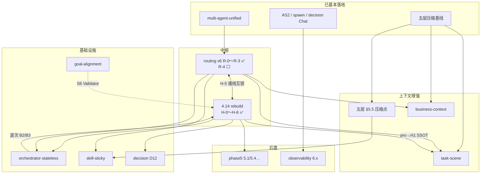

# Superpowers 设计文档索引

> **阅读顺序**：本目录按 **阶段一 → 四** 组织；每阶段一份 **SSOT**（单一事实来源），任务编号 `阶段.序号`（如 `3.4.2`）。

## 四阶段 SSOT（主文档）

| 阶段 | 周期 | SSOT | 状态 |
|:----:|:----:|------|:----:|
| **一** | 8 周 + 1.5/1.6 | [phase1-foundation-design.md](./phase1-foundation-design.md) | ✅ 已完成 |
| **二** | 8 周 + 2.9/收尾 | [phase2-benchmark-design.md](./phase2-benchmark-design.md) | ✅ 已完成 |
| **三** | 8 周 | [phase3-production-hardening-design.md](./phase3-production-hardening-design.md) | ✅ 已完成（v6 +15% 轨 WARN） |
| **四** | 按需 | [phase4-platformization-design.md](./phase4-platformization-design.md) | ⬜ 按需 |

总排期与**未完成检查门 / 阶段四缺口**：[implementation-plan.md](../../implementation-plan.md)

---

## 任务编号约定

```
阶段.任务          例：3.4 = RAG 检索增强（整块）
阶段.任务.子任务    例：3.4.2 = ES 双写入库
阶段.任务（并行）   例：3.13 = 不进检查门的并行项
```

一个阶段做不完时，**只增子编号**，不新建平行 spec。

---

## 已并入各阶段的旧文档（保留作历史参考）

| 旧文件 | 并入 |
|--------|------|
| `2026-06-07-phase1-gap-closure-design.md` | 阶段一 §1.7 |
| `2026-06-11-phase1.5-conversation-mvp-design.md` | 阶段一 §1.5–1.6 |
| `archive/2026-06-17-agent-memory-design.md` | 阶段二 §2.17；**已由** `2026-07-31-unified-context-compression-design.md` **取代** |
| `2026-06-13-processing-timeline-design.md` | 阶段二 §2.18 → [archive/specs/](../../archive/specs/) |
| `2026-06-13-processing-timeline-v2-design.md` | 阶段二 §2.18 → [archive/specs/](../../archive/specs/) |
| `2026-06-18-workflow-orchestration-design.md` | 阶段二 §2.9 |
| `2026-06-20-phase2-closure-design.md` | 阶段二 §2.10–2.16 |
| `2026-06-19-locked-architecture-decisions.md` | 阶段三 §3.9–3.11 |
| `2026-06-19-multi-agent-architecture-design.md` | 阶段三 §3.9–3.10 |
| `2026-06-19-advanced-capabilities-design.md` | 阶段三 §3.4.7、§3.8–3.11；阶段四 §4.5–4.7 |
| `skills-management-ui-design.md` | 阶段三 **§3.12** `/skills` 管理页 UI/API SSOT |
| `2026-06-21-multimodal-ocr-design.md` | 阶段四 §4.2–4.3 |
| `2026-06-24-peer-collab-routing-design.md` | 阶段四 §4.7.3 · 第五顶层模式 `PEER_COLLAB` **✅** |
| `2026-07-07-expert-consultation-design.md` | 阶段四 **§4.7.3 演进 ✅** · Expert Catalog + `$` + Hub 反应式轮次 + Synthesizer + `/experts` |
| `2026-06-24-react-taskboard-design.md` | 阶段四 §4.7.5 · ReAct TaskBoard 软规划 · **D11** |
| `2026-07-18-react-spawn-subagent-design.md` | 阶段四 §4.7.6 · ReAct `spawn_subagent` 隔离子 Agent（含单独取消）· **✅** |
| `2026-07-18-sandbox-tool-cancel-design.md` | 阶段四 §4.5.7 · 沙箱 exec/grep/glob 单工具取消 · **✅** · [sandbox 索引](../../sandbox/README.md) |
| `2026-06-25-phase4-agent-capabilities-boundaries.md` | 阶段四 §4.7 · P0 接入边界（MsgHub / Parallel / TaskBoard） |
| `2026-06-25-workflow-studio-design.md` | 阶段四 **§4.13** · Workflow Studio · **DB 唯一 SSOT**（废弃 Nacos workflow）· Chat `#` · MySQL init 种子 |
| `2026-07-24-workflow-structured-io-design.md` | 阶段四 **§4.13.8** · 结构化 I/O 设计（变量赋值 + 参数提取 + TypedValue）· **WF-3/WF-5 已完成** |
| `2026-07-28-workflow-composite-condition-design.md` | 阶段四 **§4.13.7** · loop + exclusive 条件复合化（AND/OR 多条件）· **✅ 已完成** |
| `2026-06-25-chat-execution-mode-selector-design.md` | Chat 底栏执行**路径**选择器 · `executionPreference` · P0 ✅；workflow catalog **不做**（移交 4.13 `#`） |
| `2026-06-26-pause-resume-consistency-design.md` | 阶段三 **§3.9.5 收尾** · Plan/Workflow 暂停/续跑语义与 UI 一致性 · [plan](../plans/2026-06-26-pause-resume-consistency.md) |
| `2026-07-22-agentscope-2-upgrade-design.md` | **AS Java 2.0 升级** · ✅ P0–P3+P7 完成（native-first）· P4/P5/P6 E5 不迁移 · AgentState **Redis-only / TTL 7d / 不改表** · 原生续跑/TaskList · §1 背景 / §6 E5 决策仍有效；P1–P7 正文被 [redesign](./2026-07-23-agentscope-2-native-first-redesign.md) 取代 |
| `2026-07-17-autocontext-memory-design.md` | **→ 已归档** · 内容整合入 `2026-07-31-unified-context-compression-design.md` §4 Layer 1 |
| `2026-07-22-context-optimization-design.md` | **→ 已归档** · 内容整合入 `2026-07-31-unified-context-compression-design.md` |
| `2026-07-24-dynamic-context-compression-design.md` | **→ 已归档** · 内容整合入 `2026-07-31-unified-context-compression-design.md` §§5-8 |
| `2026-07-31-unified-context-compression-design.md` | **上下文压缩统一 SSOT** · 五层渐进管道（Layer 1 intra-turn → Layer 2 L1 → Layer 3 L2 → Layer 4 L3 → Layer 5 budget）· **基线管道 ✅** · §5.5 / v2–v15 增强（压缩点 / Tier / scene 隔离等）**⬜ 设计稿** |
| `2026-07-09-tool-integration-design.md` | 阶段四 **§4.8 ✅** · SDK + MCP Catalog + `/tools` + 工具集 + HITL · [plan](../plans/2026-07-09-tool-integration.md) |
| `2026-07-20-prompt-ops-routing-catalog-design.md` | 阶段四 **§4.11 实施中** · Prompt 运营中心 + 统一 Rule Engine（DB SSOT，弃 Nacos 规则/提示词）· `/prompts` · [plan](../plans/2026-07-20-prompt-ops-routing-catalog.md) · Live `verify_prompt_catalog_live.py` |
| `2026-07-20-timeline-summary-duration-design.md` | Chat 时间线总览行 · 墙钟总耗时 · 整段展开/折叠（终态只留终稿）· **✅** · [plan](../plans/2026-07-20-timeline-summary-duration.md) |
| `2026-06-27-rag-knowledge-studio-design.md` | 阶段四 **§4.0–4.2** · `/knowledge` 工作台 · [V2 扩展](./2026-07-01-rag-studio-v2-design.md) · [ADR-002](../../architecture/ADR-002-rag-pipeline-in-rag-service.md) |
| `2026-07-01-rag-studio-v2-design.md` | **V2 SSOT**：`(tenant,kb)` 配置版本 · MinIO · 评测/Suggest · 索引 [docs/rag/README.md](../../rag/README.md) |
| `2026-07-02-kb-config-version-lifecycle-design.md` | V3 配置生命周期（draft→评测→active） |
| `2026-07-02-kb-eval-ui-redesign.md` | 评测 Tab UI · Suggest 应用规则 |
| `2026-07-02-kb-eval-simplify-design.md` | → [archive/specs/](../../archive/specs/)（并入 eval-ui-redesign） |
| `2026-06-19-phase3-production-hardening-design.md` | → 已迁移为 `phase3-production-hardening-design.md` |
| `2026-06-19-phase4-platformization-design.md` | → 已迁移为 `phase4-platformization-design.md` |

---

## 活跃增量方案：依赖与落地顺序（2026-08-13）

> 仅覆盖**未归档、仍在评审/实施**的增量稿。归档稿见 `archive/`，不进主链排期。  
> 4.14 SSOT：[planner-executor-rebuild](./2026-08-05-planner-executor-rebuild-design.md)。



| Spec | 角色 | 硬依赖 | 被谁依赖 |
|------|------|--------|----------|
| [unified-routing v6](./2026-07-29-unified-routing-design.md) | 执行模式中枢 | multi-agent（主体 ✅）；**R-0～R-3 ✅** / **R-4 ⬜** | 4.14 H-5（✅）、task-scene、skill-sticky、biz、stateless 分发 |
| [planner-executor-rebuild](./2026-08-05-planner-executor-rebuild-design.md) | 专业模式执行体 | **H-0～H-6 ✅**；H-7 / 阶段 D ⬜；TaskBoard H1 待 `tasks` SSE；完整 4.7.7 Middleware 仍未做（harness 内薄 GoalAlignment ✅） | task-scene（H1）、D12、stateless B2/B3、phase5 长任务 |
| [unified-context-compression](./2026-07-31-unified-context-compression-design.md) | 基线 ✅；§5.5 ⬜ | — | task-scene、skill-sticky、biz 挂载纪律 |
| [task-scene-context](./2026-08-01-task-scene-context-design.md) | task×fast/pro 记忆 | routing + 压缩点；pro 边界要 H1 | — |
| [business-context-authority](./2026-08-13-business-context-authority-design.md) | 企业任务板/Policy | 命名对齐 routing；读路径挂五层 | 与 task-scene **正交**（一期偏 chat） |
| [skill-sticky](./2026-08-12-skill-sticky-process-chain-design.md) | 可发现≠触发；触发保真 + 轻 sticky（v3.1） | routing 轨 A | — |
| [goal-alignment](./2026-07-27-react-goal-alignment-design.md) | 机械门禁 | TaskBoard/AS2（已有） | rebuild S6（可同批） |
| [orchestrator-stateless](./2026-08-03-orchestrator-stateless-design.md) | 物理无状态 | 波次 A 独立；B2/B3 要 harness | 多实例生产 |
| [request-decision D12](./2026-08-12-react-request-decision-planner-d12.md) | Planner decision | 4.14 Planner MAIN | — |
| [phase5](./phase5-operation-openness-design.md) / [observability](./2026-07-27-observability-enhancement-design.md) | 运营/观测 | 部分可前置；5.1 等长任务样本 | — |

**推荐落地顺序**

1. **已完成**：4.14 **H-0～H-4 + 过渡入口** — [kernel plan](../plans/2026-08-13-planner-executor-kernel.md) ✅；**routing v6 R-0～R-3 + H-5** — [unified-routing-v6-h5](../plans/2026-08-13-unified-routing-v6-h5.md) ✅；**H-6 前端** — [planner-h6-frontend](../plans/2026-08-13-planner-h6-frontend.md) ✅（分层时间线 + Composer UX；TaskBoard H1 待 `tasks` SSE）；旁路仍可并行：stateless **波次 A** ∥ 观测 6.2/6.4、phase5 **5.2**
2. **下一波**：H-7 全量 Live → **阶段 D / routing R-4**（删 PlanWorkflow 源码）→ skill-sticky → D12
3. **第三波**：五层 §5.5 压缩点（优先 task）→ task-scene → business-context（可与 task-scene 并行）
4. **刻意后置**：stateless B2/B3/拆进程、phase5 5.1/5.4/5.7、压缩点全面铺 chat

**routing ↔ 4.14**：H-5 接线互锁 **已解开**（`pro`→harness）。**延期**：`intent.classifier` Catalog live 版本 bump；R-4 / 阶段 D；H-7；harness `tasks` SSE（TaskBoard H1）。

**现状提醒（2026-08-13）**：主路径 `fast|pro|workflow`；旧 `PlanWorkflow*` **源码仍在**（主路径已断）。CLAUDE「4.14 🟡」= H-0～H-6 ✅ / H-7+阶段 D ⬜；架构表勿写「PlanWorkflow 已删」直至阶段 D。

**命名提醒（2026-08-13）**：会话形态用 **`kind`**（废 `scene=chat|task`）；LLM 调用点用 **`callSite`/`call_site`**（废 `call_scene`）；业务域保留 **`biz_scene`**；执行模式 **`executionMode`**。详见 [routing v6 命名四轴](./2026-07-29-unified-routing-design.md)。

---

## 实施计划（plans/）

| 阶段 | 计划 |
|------|------|
| 一 | `plans/2026-06-11-phase1.5-conversation-mvp.md`、`plans/2026-06-11-phase1.6-generation-reconnect.md` |
| 二 | `plans/2026-06-18-workflow-orchestration.md`、`plans/2026-06-20-phase2-closure.md` |
| 三 | [phase3-production-hardening.md](../plans/2026-06-19-phase3-production-hardening.md)、[multi-agent-architecture.md](../plans/2026-06-19-multi-agent-architecture.md)、[2026-06-26-pause-resume-consistency.md](../plans/2026-06-26-pause-resume-consistency.md)（**3.9.5 收尾**）、[覆盖度审计](../plans/2026-06-20-phased-implementation-coverage.md) |
| 四 | 按需；**RAG 4.1** 见 [docs/rag/README.md](../../rag/README.md) + **检查门留档** [backlog](../../rag/backlog.md)；**4.0 pipeline** 见 [ADR-002](../../architecture/ADR-002-rag-pipeline-in-rag-service.md) + [2026-06-27-rag-knowledge-studio.md](../plans/2026-06-27-rag-knowledge-studio.md)；**4.7.3 多专家协作 ✅** 见 [expert-consultation-design.md](./2026-07-07-expert-consultation-design.md) + [peer-collab-routing-design.md](./2026-06-24-peer-collab-routing-design.md)；**4.8 工具集成 ✅** 见 [2026-07-09-tool-integration-design.md](./2026-07-09-tool-integration-design.md) + [2026-07-09-tool-integration.md](../plans/2026-07-09-tool-integration.md)；**4.13 Workflow Studio** 见 [workflow-studio-design.md](./2026-06-25-workflow-studio-design.md) + [2026-07-11-workflow-studio.md](../plans/2026-07-11-workflow-studio.md)；**4.11 Prompt 运营** 见 [prompt-ops-routing-catalog-design.md](./2026-07-20-prompt-ops-routing-catalog-design.md) + [2026-07-20-prompt-ops-routing-catalog.md](../plans/2026-07-20-prompt-ops-routing-catalog.md)；**时间线总览** 见 [timeline-summary-duration-design.md](./2026-07-20-timeline-summary-duration-design.md) + [2026-07-20-timeline-summary-duration.md](../plans/2026-07-20-timeline-summary-duration.md) |
