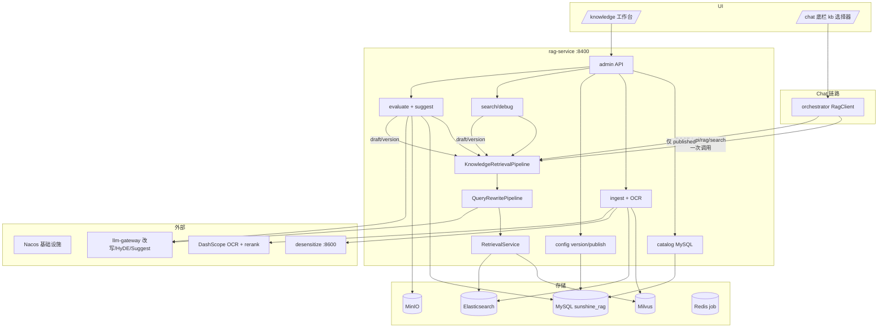

# RAG 知识库工作台设计（SSOT）

> **状态**：🟡 **4.1 核心已落地**（2026-07-03）；详索 [docs/rag/README.md](../../../rag/README.md) · 缺口 [backlog.md](../../../rag/backlog.md)  
> **路由**：`/knowledge` · **后端**：rag-service :8400（**不新增微服务**）· **前端**：直连 Gateway :8000 或 `VITE_RAG_API_BASE`  
> **关联**：[ADR-002-rag-pipeline-in-rag-service.md](../../../architecture/ADR-002-rag-pipeline-in-rag-service.md) · [V2 扩展](./2026-07-01-rag-studio-v2-design.md) · [phase4 §4.1](../phase4-platformization-design.md) · 实施计划 [2026-06-27-rag-knowledge-studio.md](../../plans/2026-06-27-rag-knowledge-studio.md)

---

## 0. 需求决策（Brainstorming 已定稿）

| # | 议题 | 决策 |
|---|------|------|
| 1 | 交付范围 | **做全**：4.1 RAG 平台化 + 4.2 OCR L1，不做 MVP 裁剪 |
| 2 | 服务边界 | **不新增微服务**；管理 API 全部内聚 `rag-service :8400` |
| 3 | 知识库模型 | **多 kb + tenant 默认库**（C） |
| 4 | 参数作用域 | ~~tenant 默认 + kb 覆盖~~ → **V2**：**每 `(tenant, kb)` 独立配置包与版本链**（[V2 设计](./2026-07-01-rag-studio-v2-design.md)） |
| 5 | 元数据存储 | rag-service 内 **MySQL `sunshine_rag`** + Flyway（A） |
| 6 | 参数发布 | **硬门禁**（A）：smoke 评测 Recall@5 ≥ 基线才允许 publish |
| 7 | OCR 入库 | **预览确认 + 置信度分流**（D） |
| 8 | Chat 绑库 | 底栏 **会话级 kb 下拉**（B）；本阶段不做 `#kb` 语法 |
| 9 | 权限 | **暂不 RBAC**（C）；`X-Admin-Token` + Gateway JWT |
| 10 | Nacos 发布 | ~~Nacos Open API 直接 patch（方案 1）~~ → **2026-07-01 修订**：业务参数 **MySQL 版本化**；Nacos 仅基础设施（见 §12） |
| 11 | **检索 pipeline 边界** | **改写 + hybrid + rerank + HyDE + empty-recall 全部内聚 rag-service**；orchestrator 只调干净检索 API（[ADR-002](../../../architecture/ADR-002-rag-pipeline-in-rag-service.md)） |
| 12 | **配置版本** | **bundle + version**；统一「保存草稿 / 发布 / 切换生效版」；**禁止** per-scope 多个发布按钮 |
| 13 | **线上 vs 管理** | **线上**（`/api/rag/search`、Chat）仅读 `published` 生效版；**工作台** debug/评测可用 `draft` 或指定 `versionId` |
| 14 | **工作台上下文** | 四 Tab **严格** `(tenantId, kbId)`；任一变化 **全量重载** + 取消在途请求 |
| 15 | **评测与存储** | 评测脚本/报告 **MySQL 索引 + MinIO 正文**；支持上传 suite；Suggest 基于职责角色 LLM + 配置/kb 上下文 |

---

## 1. 目标与非目标

### 1.1 目标

将 `/knowledge` 从「Markdown 粘贴 + 简单检索」升级为**一站式知识库运营工作台**：

- 多格式文档入库（含 PDF/图片 OCR）
- 多知识库 namespace + 文档版本
- 动态参数（rag 检索/rerank/**改写 prompt** + chunk）**版本化**草稿→评测→发布→切换生效版
- 检索 debug 瀑布 + golden-set 批量评测 + LLM 优化建议
- Badcase 回流（已收敛为评测集条目）
- Chat 底栏 kb 选择器，会话级绑定默认库

> **不做**：策略 A/B 对比（`POST /eval/ab`）、评测周报 Cron

### 1.2 非目标（本 spec）

- 新建 `rag-manager` 或独立微服务
- Chat `#kb` 绑定（对称 4.13 workflow `#`）
- 4.3 L2 版面理解全量（quarantine 队列本 spec 仅 L1 前置）
- 4.4 Vision 对话 L3
- 图搜图 / 视频音频
- 本阶段 RBAC 角色细分（后续迭代）

---

## 2. 架构



| **Pipeline SSOT** | 完整链路 `rag改写→检索→HyDE→empty-recall` 在 `KnowledgeRetrievalPipeline`；Chat/评测/debug **同源** |
| **orchestrator 薄调用** | `RagTool` / `RagNodeHandler` 只调 `RagClient.searchKnowledge()`，**禁止**本地 RAG 改写编排 |
| **配置 SSOT** | 业务参数（search/rerank/chunk/rewrite）存 **MySQL `rag_config_version`**；运行时 `EffectiveConfigResolver` 读 DB；**线上仅 published** |
| **Nacos 范围** | 仅 `server`/`datasource`/`embedding`/`rag.admin.token`/`rag.storage.*`/`rag.eval.suggest.system-prompt` 等基础设施；**不再**承载租户业务参数 |
| **kb 隔离** | 配置按 `(tenant_id, kb_id)` **独立 bundle**；**无**租户默认 merge（V2 SSOT） |
| **工作台上下文** | `KbWorkbenchContext`：`tenantId + kbId` 变更 → 四 Tab 统一 `revision++` 重载 |
| **orchestrator 保留改写** | 仅 `intent` / `planner`（路由与规划，非检索） |
| **禁止** | 前端硬编码 RAG 参数默认值 Map；禁止对模型输出做截断兜底；禁止 per-scope 多个「发布」按钮 |

---

## 2.1 干净检索 API（ADR-002）

**主入口**：`POST /api/rag/search`（演进现有接口）

**Request**：

```json
{
  "query": "年假可以请几天",
  "topK": 3,
  "tenantId": "default",
  "kbId": "policy",
  "strategy": "hybrid+rerank",
  "options": {
    "rewrite": true,
    "includeTrace": true
  }
}
```

| 字段 | 默认 | 说明 |
|------|------|------|
| `options.rewrite` | `true` | `false` 跳过 rag/hyde/empty-recall（admin 对比用） |
| `options.includeTrace` | `false` | Chat/workflow 传 `true`，Timeline 展示检索过程 |

**Response**：

```json
{
  "query": "年假可以请几天",
  "effectiveQuery": "年假 请假 制度 天数",
  "results": [{ "docName": "考勤制度", "content": "...", "score": 0.82 }],
  "trace": {
    "searchCount": 1,
    "stages": [
      { "name": "rewrite", "applied": true, "from": "...", "to": "...", "latencyMs": 95 },
      { "name": "vector", "candidates": [], "latencyMs": 12 },
      { "name": "rerank", "candidates": [], "latencyMs": 88 },
      { "name": "hyde", "applied": false },
      { "name": "empty-recall", "applied": false }
    ]
  }
}
```

**orchestrator 契约**：`RagClient` 解析 `results` + 可选 `trace`；`ProcessingTimelineSession` 从 `trace.stages` 组装 RAG 步骤 detail（替代本地 `QueryRewriteTrace` 记录 RAG 场景）。

**Admin debug**：`POST /api/rag/admin/search/debug` 强制 pipeline + `includeTrace=true`，stages 含 vector/bm25/rrf/rerank 候选瀑布。

---

## 3. 页面结构

```
┌─────────────────────────────────────────────────────────────────────┐
│ 知识库工作台            [租户▼] [知识库▼]                             │
├──────────────────────────────────────────────────────────────────────┤
│ Tab：[文档] [检索调试] [参数] [评测]  （上下文 KbWorkbenchContext）    │
│                                                                      │
│  Tab 内容区（宽布局；租户或知识库变更 → 全 Tab 重载）                  │
└──────────────────────────────────────────────────────────────────────┘
```

| Tab | 组件 | 说明 |
|-----|------|------|
| **文档** | `KbDocList` + `KbDocPanel` | 版本列表、chunk 预览、文本入库 |
| **检索调试** | `KbDebugPanel` | 单 query 瀑布；支持 `configMode=draft` |
| **参数** | `KbConfigPanel` | 全 scope 平铺；**保存草稿 / 发布 / 版本历史**（无 per-scope 发布） |
| **评测** | `KbEvalPanel` | suite 选择、跑分、报告可视化、Suggest、历史、一键应用草稿 |
| **入库** | `KbIngestPanel` | （迭代 6）拖拽上传；子 Tab：进行中 / 待审核 / 已完成 |
| **Badcase** | `KbBadcasePanel` | （迭代 5+）标注 relevant_docs → 导出 custom suite |

**风格**：Codex 中性灰（`--sun-*`）；主按钮 `type="primary"`；代码/prompt 用 inherit / `--sun-font-base`。

**工作台上下文（`KbWorkbenchContext`）**：

- SSOT：`KnowledgeView` 维护 `{ tenantId, kbId, revision }`，`provide` 至四 Tab。
- **租户变**：重置 `kbId` → `loadKbs` → 选默认 kb → `revision++`。
- **知识库变**：清空文档选中 → `revision++`。
- 各 Tab `watch(revision)` + `AbortController` 取消在途请求，**禁止** Tab 内重复租户/kb 选择器。

**禁止**：前端维护检索策略话术 Map；步骤文案与本页无关。

---

## 4. 概念与术语

| 概念 | UI | 存储 |
|------|-----|------|
| **Tenant** | 顶栏租户选择器 | `x-tenant-id` |
| **KnowledgeBase (kb)** | 左栏 kb 列表 + 顶栏下拉 | MySQL `knowledge_base` |
| **默认库** | kb 卡片 Tag「默认」 | `knowledge_base.is_default` |
| **Document** | 文档树节点 | MySQL `document` |
| **Version** | 版本下拉 + Tag 生效/历史 | MySQL `document_version` |
| **Chunk** | 文档详情 chunk 列表 | Milvus + ES |
| **Effective Config** | 参数 Tab + debug/eval `configMode` | 该 kb 的 `rag_config_version`（published / draft） |
| **Config Draft** | 参数 Tab「保存草稿」 | `rag_config_version.status=draft` |
| **Config Version** | 参数 Tab「版本历史」 | `rag_config_version` + `active_published_version_id` |
| **Eval Suite** | 评测 Tab suite 下拉 / 上传 | MySQL `eval_suite` + MinIO 正文 |
| **Eval Record** | 评测 Tab 历史列表 | `eval_job` + `eval_report` + MinIO 报告 |
| **Quarantine** | 入库「待审核」 | `ingest_job.status=quarantine` |
| **Baseline** | 评测报告中的基线 Recall@5 | MySQL `eval_report` 最近 publish 成功报告 |

**Namespace**：`tenantId / kbId / docId`（本阶段不做 dept 级；4.1.1 dept 预留字段可空）。

---

## 5. 数据模型

### 5.1 MySQL（`sunshine_rag`）

```sql
-- 知识库
knowledge_base (
  id, tenant_id, kb_id, display_name, description,
  is_default, status, created_at, updated_at
)

-- 文档
document (
  id, kb_id, doc_id, display_name, source_type,
  created_at, updated_at
)

-- 文档版本
document_version (
  id, document_id, version, status,  -- draft|active|superseded
  parsed_markdown, chunk_count,
  ingest_job_id, published_at, created_at
)

-- kb 参数覆盖 — @deprecated V2 由 per-kb rag_config_bundle 取代
kb_config_override (
  id, tenant_id, kb_id, override_json, updated_at
)

-- 配置包：与 knowledge_base 1:1（每 kb 独立，见 V2 设计）
rag_config_bundle (
  id, tenant_id, kb_id,
  draft_version_id, active_published_version_id,
  created_at, updated_at,
  UNIQUE(tenant_id, kb_id)
)

-- 配置版本：可追溯快照（6 scope 合并为一棵 JSON）
rag_config_version (
  id, bundle_id, version_no,
  status,                    -- draft | published | archived
  payload_json,              -- { search, rerank, chunk, rewrite: { rag, hyde, emptyRecall } }
  change_note, created_by,
  publish_eval_job_id,
  created_at, published_at
)

-- 配置草稿（tenant 级 scope 单行）— @deprecated 由 rag_config_version 取代
config_draft (
  id, tenant_id, scope, payload_json, status,
  created_by, created_at, published_at
)

-- 入库任务
ingest_job (
  id, kb_id, document_id, file_name, mime_type,
  status,  -- parsing|preview|quarantine|embedding|active|failed
  confidence, parsed_markdown, error_msg,
  auto_pass, created_at, updated_at
)

-- 评测
eval_suite (
  id, tenant_id, suite_key, display_name,
  format,                    -- yaml | json
  storage,                   -- mysql_inline | minio
  content_ref,               -- 内联 JSON 或 MinIO object_key
  item_count, schema_version,
  status, created_at
)

eval_job (
  id, tenant_id, kb_id,
  suite_id,                  -- 关联 eval_suite；过渡期 suite 字符串仍可用
  config_version_id,         -- 评测使用的配置版本
  config_mode,               -- draft | published | version
  config_snapshot_json,
  status, report_id,
  report_object_key,         -- MinIO 完整报告
  created_at, finished_at
)

eval_report (
  id, job_id, recall_at_5, mrr, delta_json,
  baseline_recall_at_5, passed_gate,
  summary_json, failed_samples_json, suggestions_json,
  report_object_key, created_at
)

-- Badcase
badcase (
  id, tenant_id, kb_id, query, relevant_doc_ids_json,
  notes, source, created_at
)
```

### 5.2 Milvus / ES schema 演进

在现有 `doc_name / tenant_id / content / embedding` 基础上扩展 metadata（需 migration/rebuild）：

| 字段 | 用途 |
|------|------|
| `kb_id` | 知识库过滤 |
| `doc_id` | 稳定文档标识 |
| `version` | 版本号 |
| `chunk_index` | 分段序号 |
| `status` | `active` \| `superseded` |
| `source_type` | `markdown` \| `docx` \| `pdf` \| `image` \| … |

检索 expr：`tenant_id == "{tid}" && kb_id == "{kbId}" && status == "active"`。

ES `sunshine_rag_chunks` 同步字段；BM25 检索同 filter。

### 5.3 Chunk 参数外置

`MarkdownParser` chunk 大小从 **`EffectiveConfigResolver`** 读取（`published` 或 admin 指定 `configMode`），不再依赖 Nacos `@ConfigurationProperties` 作为运行时 SSOT。

### 5.4 MinIO 对象布局

| 路径前缀 | 内容 |
|----------|------|
| `rag-eval/{tenant}/{suite}/{version}.yaml` | 评测脚本 |
| `rag-eval-reports/{tenant}/{jobId}/report.md` | 评测报告 Markdown |
| `rag-eval-reports/{tenant}/{jobId}/report.json` | 评测报告 JSON |
| `rag-ingest/{tenant}/{kb}/{jobId}/` | OCR 原文件（可选，大文件） |

MySQL 存元数据与指标索引；MinIO 存大对象正文。`docs/rag/golden-set.yaml`、`docs/rag/reports/` **迁入 DB+MinIO 后只作 dev 导出备份**。

---

## 6. API 设计（rag-service）

Base path：`/api/rag/admin/**`（现有 `/api/rag/documents`、`/api/rag/search` 保留兼容）。

鉴权：`X-Admin-Token`（`rag.admin.token`）+ Gateway JWT 透传 `x-tenant-id`。

### 6.1 知识库与文档

| Method | Path | 说明 |
|--------|------|------|
| GET | `/api/rag/admin/kbs` | 列出租户下 kb 列表 |
| POST | `/api/rag/admin/kbs` | 新建 kb |
| PUT | `/api/rag/admin/kbs/{kbId}/default` | 设为 tenant 默认库 |
| GET | `/api/rag/admin/kbs/{kbId}/documents` | 文档列表 |
| GET | `/api/rag/admin/kbs/{kbId}/documents/{docId}` | 文档详情 + 版本 |
| GET | `/api/rag/admin/kbs/{kbId}/documents/{docId}/chunks` | chunk 预览（?version=） |
| DELETE | `/api/rag/admin/kbs/{kbId}/documents/{docId}/versions/{version}` | 失效版本 |

### 6.2 入库

| Method | Path | 说明 |
|--------|------|------|
| POST | `/api/rag/admin/kbs/{kbId}/ingest/text` | 文本/Markdown（兼容现有 body） |
| POST | `/api/rag/admin/kbs/{kbId}/ingest/file` | multipart；类型检测 |
| GET | `/api/rag/admin/ingest-jobs/{jobId}` | 进度与状态 |
| POST | `/api/rag/admin/ingest-jobs/{jobId}/confirm` | 预览确认 → embed |
| POST | `/api/rag/admin/ingest-jobs/{jobId}/reject` | 拒绝 |
| POST | `/api/rag/admin/rebuild` | 现有；全库 rebuild |

**入库状态机**：

```
parsing → preview → [quarantine?] → embedding → active
                  ↘ failed
```

| 场景 | 行为 |
|------|------|
| 单文件默认 | OCR/解析 → Markdown 预览 → 人工 confirm → 脱敏 → embed |
| 批量 + `autoPassHighConfidence=true` | 置信度 ≥ 阈值跳过 preview |
| 低置信度 | `quarantine`；待审核 Tab confirm 后 embed |

OCR：**DashScope**；PDF 优先文本层，失败 OCR（锁定 4.2）。

### 6.3 参数（版本化）

| Method | Path | 说明 |
|--------|------|------|
| GET | `/api/rag/admin/kbs/{kbId}/config/schema` | Catalog + 当前 draft/published 值 |
| GET | `/api/rag/admin/kbs/{kbId}/config/effective` | `?mode=draft\|published\|version&versionId=` |
| PUT | `/api/rag/admin/kbs/{kbId}/config/draft` | **全量**保存草稿（合并 6 scope 为一包） |
| POST | `/api/rag/admin/kbs/{kbId}/config/publish` | smoke 门禁 → 新建 `published` 版本 |
| GET | `/api/rag/admin/kbs/{kbId}/config/versions` | 版本历史 |
| POST | `/api/rag/admin/kbs/{kbId}/config/versions/{id}/activate` | 切换线上生效版（**必须** smoke 门禁，同 publish） |

**过渡期兼容**（T24 完成前保留，T25 后 `@deprecated`）：

| Method | Path | 说明 |
|--------|------|------|
| GET | `/api/rag/admin/config/schema` | 旧 per-scope schema |
| PUT | `/api/rag/admin/config/drafts/{scope}` | 旧 per-scope 草稿 |
| POST | `/api/rag/admin/config/drafts/{scope}/publish` | 旧 per-scope 发布（写 Nacos） |

**payload 结构**（`rag_config_version.payload_json`）：

```json
{
  "search": { "minScore": 0.48, "strategy": "hybrid+rerank", "rrfK": 60, "hybridPoolSize": 20, "defaultTopK": 3 },
  "rerank": { "enabled": true, "minScore": 0.25, "minRelevance": 0.25 },
  "chunk": { "maxSize": 1200 },
  "rewrite": {
    "rag": { "enabled": true, "model": "...", "systemPrompt": "..." },
    "hyde": { "enabled": true, "model": "...", "maxChars": 480, "systemPrompt": "..." },
    "emptyRecall": { "enabled": true, "model": "...", "maxAlternatives": 2, "systemPrompt": "..." }
  }
}
```

**scope 枚举**（逻辑分组，不再 per-scope 发布）：

| 逻辑 scope | 原 Nacos path | 字段 |
|------------|---------------|------|
| `search` | `rag.search.*` | minScore、strategy、rrfK、hybridPoolSize、defaultTopK |
| `rerank` | `rag.rerank.*` | enabled、minScore、minRelevance |
| `chunk` | `rag.chunk.*` | maxSize |
| `rewrite.rag` | `rag.rewrite.rag` | enabled、model、systemPrompt |
| `rewrite.hyde` | `rag.rewrite.rag.hyde` | enabled、model、maxChars、systemPrompt |
| `rewrite.emptyRecall` | `rag.rewrite.empty-recall` | enabled、model、maxAlternatives、systemPrompt |

**仍留 orchestrator**（非检索域）：`agent.rewrite.intent`、`agent.rewrite.planner` → `sunshine-orchestrator.yaml`。

**kb 分包**：每个 `(tenant, kb)` 独立 bundle；新建 kb 从 [`docs/rag/defaults/config-seed.json`](../../rag/defaults/config-seed.json) seed（见 [V2 设计](./2026-07-01-rag-studio-v2-design.md) §4.2）。

### 6.4 发布与运行时（取代 Nacos 业务 patch）

`ConfigVersionService` + `EffectiveConfigResolver`：

1. **保存草稿**：更新 `rag_config_version.status=draft`（或 draft 指针），**不写运行时**
2. **发布**：对**整包** payload 跑 smoke → 通过则 `version_no++`、`status=published`、更新 `active_published_version_id`、旧 published → `archived`
3. **切换生效版**：`activate(versionId)` → **必须** smoke → 通过才更新 `active_published_version_id`
4. **运行时**：`KnowledgeRetrievalPipeline` / `POST /api/rag/search` 默认 `mode=published`；缓存失效经 Redis pub/sub 或 Caffeine TTL

~~`NacosPublishService` 写 `rag.search`/`rag.rewrite` 等业务段~~ — **T11 过渡期实现**；T25 后仅保留 dev 导出可选，不作为线上 SSOT。

**硬门禁 publish 流程**：

```
保存草稿 → POST publish（整包）
  → eval_job (smoke, suite 前 N 条, configMode=draft)
  → Recall@5 ≥ baseline ?
      是 → 新建 published 版本 + 切换 active
      否 → 422 + failedSamples + suggest
```

Admin debug / eval 请求体增加：

```json
{ "configMode": "draft", "configVersionId": null }
```

线上 `/api/rag/search`（orchestrator 调用）**禁止**传 `configMode=draft`。

### 6.5 检索调试

| Method | Path | 说明 |
|--------|------|------|
| POST | `/api/rag/admin/search/debug` | 瀑布检索 |

Request:

```json
{
  "query": "年假可以请几天",
  "kbId": "policy",
  "topK": 5,
  "overrides": { "minScore": 0.45 },
  "includeRewrite": true,
  "configMode": "draft"
}
```

| 字段 | 默认 | 说明 |
|------|------|------|
| `configMode` | `published` | admin 专用：`draft` 用工作草稿；`version` + `configVersionId` 复现历史 |
| `overrides` | — | 临时覆盖单字段（调试），不落库 |

Response stages：`rewrite` | `hyde` | `vector` | `bm25` | `rrf` | `rerank` | `filter` | `empty-recall` | `final`；每 stage 含 `candidates[]`（`docName`, `content`, `score`, `source`）与 `latencyMs`。

与 `POST /api/rag/search` 共用 **`KnowledgeRetrievalPipeline`** 实现；`includeRewrite=false` 时跳过 rewrite/hyde/empty-recall stages。

### 6.6 评测与建议

| Method | Path | 说明 |
|--------|------|------|
| GET | `/api/rag/admin/eval/suites` | 评测脚本列表 |
| POST | `/api/rag/admin/eval/suites` | 上传 YAML/JSON（→ MinIO + `eval_suite`） |
| GET | `/api/rag/admin/eval/suites/{id}` | 预览条目 |
| DELETE | `/api/rag/admin/eval/suites/{id}` | 软删 |
| POST | `/api/rag/admin/eval/run` | 异步评测；body 含 `suiteId`、`kbId`、`configMode`、`versionId?` |
| GET | `/api/rag/admin/eval/jobs` | 历史列表 `?kbId=&limit=` |
| GET | `/api/rag/admin/eval/jobs/{jobId}` | 进度 |
| GET | `/api/rag/admin/eval/reports/{reportId}` | 指标 + MinIO 报告链接/内联 |
| POST | `/api/rag/admin/eval/suggest` | 低分样本 + 配置/kb 上下文 → LLM 结构化建议 |

> ~~`POST /eval/ab`（A/B）~~、~~评测周报 Cron~~ — **不做**，见 [docs/rag/backlog.md](../../../rag/backlog.md)

**指标**：Recall@3/5/10、MRR、rewrite Δ、HyDE Δ、pipeline Δ（与 pipeline 同源）。

**默认 suite**：启动时把 `docs/rag/golden-set.yaml` **导入** `eval_suite`（`suite_key=golden-v5`）；不再读本地文件。

**Suggest 输入上下文**（结构化，prompt 模板在 Nacos `rag.eval.suggest.system-prompt`）：

| 块 | 来源 |
|----|------|
| 当前配置 | draft 或 `config_version.payload` |
| 知识库概要 | doc 数、chunk 数、top 文档名 |
| 评测结果 | `eval_report` 指标 + Top N badcase |
| 输出 | `suggestions[]`（scope/field/proposed/reason）+ 可选 `docActions[]` |

UI：**一键应用参数建议**（仅 eval_failed → draft）；保存 `suggestions_json` 至 `eval_report`。

### 6.7 Badcase

| Method | Path | 说明 |
|--------|------|------|
| POST | `/api/rag/admin/badcases` | 新增 |
| GET | `/api/rag/admin/badcases?kbId=` | 列表 |
| POST | `/api/rag/admin/badcases/export-golden` | 导出 YAML |

---

## 7. Chat 联动（底栏 kb 选择器）

| 项 | 说明 |
|----|------|
| **UI** | Chat 底栏新增「知识库」下拉，与 `executionPreference` 并列 |
| **作用域** | 会话级；切换后后续轮次生效 |
| **默认** | 未选 → tenant `is_default=true` 的 kb |
| **请求** | Chat 请求体新增 `kbId`；BFF/Gateway 透传 orchestrator |
| **orchestrator** | `RagClient.searchKnowledge(query, topK, tenantId, kbId)` **单次调用** rag-service；删除 `KnowledgeRetrievalService` RAG 编排 |
| **Timeline** | 请求 `options.includeTrace=true`；从 response `trace` 写入 RAG 步骤 metadata/detail |
| **参数** | rag-service 按 kbId 合并 effective config（含 strategy / rewrite） |

Workflow/Plan RAG 节点 `params.kbId` 可选；未填继承会话 kbId 或 tenant 默认库。

---

## 8. 任务拆分（对齐 phase4 §4.0–4.2）

| 编号 | 任务 | 模块 |
|------|------|------|
| **4.0.1** | `KnowledgeRetrievalPipeline` + 扩展 `POST /api/rag/search`（trace） | rag-service |
| **4.0.2** | `QueryRewritePipeline`（port orchestrator rag/hyde/empty-recall）+ `rag.rewrite.*` Nacos | rag-service |
| **4.0.3** | orchestrator `RagClient` 切换 + 删除 RAG 编排 + trace 透传 Timeline | orchestrator |
| **4.0.4** | `rag_eval.py` / CI 对齐 pipeline；orchestrator yaml 改写键 `@deprecated` | scripts + nacos |
| **4.1.0** | rag-service + MySQL + Flyway + admin 包结构 | infra |
| **4.1.1** | kb namespace API + Milvus/ES kb_id | catalog |
| **4.1.2** | 文档版本 + superseded 过滤 | catalog |
| **4.1.3** | `scripts/rag_reindex.py` 全量重建 + 进度 API | ops |
| **4.1.4** | EvaluateService + `/eval/run` | eval |
| **4.1.5** | `/search/debug` 瀑布 | debug |
| **4.1.6** | ~~Badcase CRUD~~ → 评测集条目 | eval |
| ~~**4.1.7**~~ | ~~A/B eval~~ | **不做** |
| ~~**4.1.8**~~ | ~~评测周报 Cron~~ | **不做** |
| **4.1.9** | ~~NacosPublishService~~ → `ConfigVersionService` + 硬门禁 | config |
| **4.1.10** | KnowledgeView → 工作台 UI | frontend |
| **4.1.11** | Chat kb 选择器 + orchestrator kbId | frontend + orchestrator |
| **4.1.12** | `KbWorkbenchContext` 四 Tab 统一重载 | frontend |
| **4.1.13** | `rag_config_bundle/version` + Flyway V2 | config |
| **4.1.14** | `EffectiveConfigResolver` DB 运行时；废弃 Nacos 业务 publish | config + pipeline |
| **4.1.15** | `eval_suite` + MinIO + suite 上传 API | eval |
| **4.1.16** | SuggestService + 评测 UI 增强 + 评测记录 | eval + frontend |
| **4.2.1** | multipart ingest + 类型检测 | ingest |
| **4.2.2** | DashScope OCR + PDF 文本层 | ingest |
| **4.2.3** | quarantine + preview confirm + 脱敏 | ingest |
| **4.2.4** | docx 解析 | ingest |
| **4.2.5** | ocr golden-set + rag_eval 扩展 | eval |

**建议实施顺序**：**4.0.1–4.0.4** → 4.1.0 → 4.1.1/4.1.2 → 4.1.5 → 4.1.10 → **4.1.12** → **4.1.13–4.1.14** → 4.1.4/4.1.15–4.1.16 → 4.2.x → 4.1.11

> T10–T12（per-scope draft + Nacos publish）为**过渡期**；以 **T24–T25** 为准收敛。

---

## 9. 检查门

| 检查项 | 标准 |
|--------|------|
| 入库时效 | UI 上传 md 5 分钟内可检索 |
| 版本失效 | v2 active 后 v1 chunk 不可检 |
| debug 瀑布 | 可见 vector/bm25/rrf/rerank 各阶段分数 |
| 发布门禁 | 未过 smoke Recall@5 不可 publish |
| 线上隔离 | `/api/rag/search` 仅 `published`；draft 不可被 orchestrator 使用 |
| 上下文 | 切换租户或 kb 后四 Tab 数据一致、无串库 |
| 配置版本 | 可查看历史版本；**切换生效版须过 smoke** |
| 评测脚本 | 可上传 suite 并对 draft 跑评测 |
| OCR | PDF/图片 preview → confirm 后可检索 |
| Chat 绑库 | 底栏切换 kb 后 RAG 命中对应库文档 |

---

## 10. 测试

| 类型 | 内容 |
|------|------|
| 单元 | `ConfigVersionService`；`EffectiveConfigResolver`；ingest 状态机；`KnowledgeRetrievalPipeline` fallback |
| 集成 | kb 隔离；version superseded；debug `configMode=draft`；pipeline trace 与 orchestrator Timeline 对齐 |
| 脚本 | `rag_eval.py` 改调 `POST /api/rag/admin/eval/run`（CI 同 API）；**不再**读本地 golden-set |
| 前端 | `npx vue-tsc -b`；四 Tab 切换租户/kb 重载手测 |
| Live | golden v5 smoke Recall@5 ≥ 0.98 作为 publish 门槛 |

---

## 11. 相关文档

- [ADR-002-rag-pipeline-in-rag-service.md](../../../architecture/ADR-002-rag-pipeline-in-rag-service.md)
- [phase4-platformization-design.md](../phase4-platformization-design.md) §4.0–4.2
- [2026-06-21-multimodal-ocr-design.md](./2026-06-21-multimodal-ocr-design.md) §L1
- [skills-management-ui-design.md](./skills-management-ui-design.md)
- `docs/nacos/sunshine-rag.yaml`（**仅基础设施**；业务参数 seed 后迁 DB）
- `docs/nacos/sunshine-orchestrator.yaml`
- MinIO bucket `rag-eval` / `rag-eval-reports`（`rag.storage.*` Nacos 配置）
- `scripts/rag_eval.py`（CI 包装，调 admin eval API）
- 配置种子：`docker/mysql/init/16-sunshine-rag-config-seed.sql` + `config-seed.json`

---

## 12. 演进摘要（2026-07-01）

**V2 扩展 SSOT**：[2026-07-01-rag-studio-v2-design.md](./2026-07-01-rag-studio-v2-design.md)（Brainstorming 定稿）

| 诉求 | 方案 |
|------|------|
| 配置版本控制 | 每 kb 独立 `rag_config_bundle/version`；统一草稿/发布/切换生效版（切换亦过 smoke） |
| Tab 与租户/kb | `KbWorkbenchContext`；全 Tab 重载 |
| 评测与优化 | suite（MySQL 种子 + 上传 Python）；Suggest + eval_failed 应用 → draft |
| 存储统一 | MySQL（配置 + 内置评测集）+ MinIO（报告/Python suite）；Nacos 仅基础设施 |

**分期**：T23 → T24–T25 → T26–T27 → T28（见 plan）。
