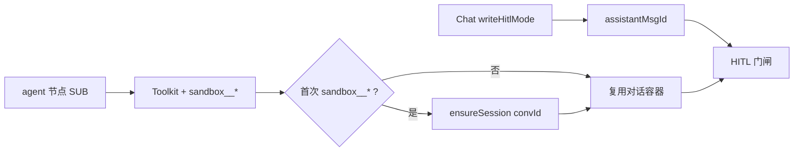

# SUB / Workflow agent 节点默认沙箱（方案 A）

> **阶段**：4.5 沙箱 · **状态**：✅ 已实现（2026-07-28 增补工作区级粒度说明，见 §8）  
> **日期**：2026-07-17  
> **前序**：[conversation-sandbox-permanent-tools](./2026-07-16-conversation-sandbox-permanent-tools-design.md) · 索引 [docs/sandbox/README.md](../../../sandbox/README.md)

---

## 1. 目标与边界

**目标**：Workflow / Plan 的 **agent 子节点（SUB）** 与 MAIN 一样常驻 `sandbox__read/write/edit/glob/grep/exec`；首次调用懒开箱，**复用**同 `conversationId` 的对话级容器；写确认继承本轮 Chat 的 `writeHitlMode`。

**已确认决策**

| 项 | 选择 |
|----|------|
| 注入策略 | SUB **默认**注入六工具（与 MAIN 对齐），不做节点显式开关 |
| 容器 | **复用**对话级 Redis `sandbox:conv:{tenant}:{conversationId}` |
| HITL | **继承**本轮 Chat `writeHitlMode`（via `assistantMsgId`） |
| 实现路径 | 方案 A：Toolkit 注入 + 透传 `conversationId`，不新开独立 sandbox 子系统 |

**非目标**

- Studio / PlanJson 增加 `sandbox` / `enableSandbox` 开关
- SUB 独立容器、独立 TTL / Reaper 键
- `simple-llm` / PLANNER 注入沙箱工具
- 改 PathJail、六工具语义、工作区抽屉协议
- 将 `sandbox__*` 登记进 tool-manager Catalog

---

## 2. 架构与数据流

```text
Chat（已 bindWriteHitlMode(assistantMsgId)）
  → Workflow / Plan agent 节点
       → AgentRunRequest.sub(..., conversationId=streamCtx.conversationId)
       → ReActAgentRuntime.prepareRun → ensure 用同一 conversationId
       → DynamicToolkitFactory.buildForSubAgent：SUB 也 register sandbox__*×6
       → sandbox__* RPC → 复用 Redis sandbox:conv:{tenant}:{convId}
       → HITL：bridge sub-{runId} → assistantMsgId → 本轮 writeHitlMode
```



**不变**：节点 `tools` 白名单仍只约束 Catalog 业务工具；沙箱不进 Catalog、不靠白名单门控。SUB **仍不**注入 `manage_tasks`。

---

## 3. 实现要点

| 组件 | 变更 |
|------|------|
| `DynamicToolkitFactory` | `ToolkitScope.SUB` 与 MAIN 一样 `registerAgentTool(sandbox__*)`；TaskBoard 仍仅 MAIN |
| `AgentRunRequest.sub` | 增加 `conversationId` 参数；缺省 `null` 时行为与现 lifecycle 一致（临时/无跨 run 复用） |
| `AgentNodeRequestAssembler` / handler | 从 `ExecutionStreamContext.conversationId()` 传入 |
| `SandboxSessionLifecycle` | `prepareRun` 同时登记 MAIN **与** SUB（对话级复用）；无分叉 ensure |
| HITL | **不改**；依赖已有 `bindHitlBridge(sub-*, assistantMsgId)` + `bindWriteHitlMode` |
| Nacos | `mode-overlays.react`（及若有 workflow-agent overlay）：文案由「主 ReAct 常驻」改为「MAIN/SUB 常驻」；禁止业务代码硬编码提示词 |

---

## 4. 与方案 B 差异

| 维度 | 方案 B（2026-07-16） | 本文 |
|------|----------------------|------|
| SUB 工具 | 默认**不**注入 | 默认**注入**六工具 |
| 验收 B4 | `simple-llm` / SUB 无六工具 | 仅 `simple-llm`（及 PLANNER）无六工具；SUB 有 |
| 容器 | 对话级（MAIN） | 同键扩展至 SUB |

---

## 5. 验收

| # | 场景 | 期望 |
|---|------|------|
| S1 | 单测 `buildForSubAgent` | Toolkit 含 6×`sandbox__*`，无 `manage_tasks` | ✅ |
| S2 | 单测 `AgentRunRequest.sub` / assembler | `conversationId` 来自 streamCtx | ✅ |
| S3 | 单测：无 `conversationId` 的 SUB | 仍注入工具；开箱走现有无 conv 分支 | ✅ |
| S4 | Live：`#sandbox-agent` 内 `sandbox__write` + 抽屉可见 | ✅ `verify_sandbox_live` G12 |
| S5 | 回归 | MAIN G1/G7/G10 不变；`simple-llm` 仍无六工具 | 单测覆盖 Toolkit |

---

## 6. 文档联动（实现时更新）

- [conversation-sandbox-permanent-tools](./2026-07-16-conversation-sandbox-permanent-tools-design.md)：子 Agent 行、§6 非目标「Workflow 子 Agent 默认沙箱」、B4
- [docs/sandbox/README.md](../../../sandbox/README.md)：缺口「SUB / Workflow 节点沙箱」→ ✅
- 本文件状态 → 已实现（落地后勾选）
- Workflow 标杆种子 `sandbox-agent`（`13-sunshine-workflow-manager.sql`）

---

## 7. 决策记录

| 项 | 决议 |
|----|------|
| 注入 | 默认（选 2），非节点显式开启 |
| 容器 | 对话级复用（选 1） |
| HITL | 继承 Chat `writeHitlMode`（选 1） |
| 路径 | 方案 A |

---

## 8. 增补：工作区级粒度（2026-07-28）

Codex 式智能体工作区（[task-workspace-codex](./2026-07-28-task-workspace-codex-design.md)）引入工作区级容器后，SUB 复用粒度按会话 `kind` 分流：

| 会话 kind | SUB 复用键 | 说明 |
|-----------|-----------|------|
| `chat`（现状） | `conversationId` | 本 spec 原设计，不变 |
| `agent`（工作区会话） | `workspaceId` | 经 `resolveWorkspaceId(conversationId)` 解析；同工作区多会话的 SUB 共享同一完全体容器 |

读写并发约束（读并发/写串行写锁）对工作区内所有 MAIN/SUB 统一生效，见 task-workspace-codex §2.3。
