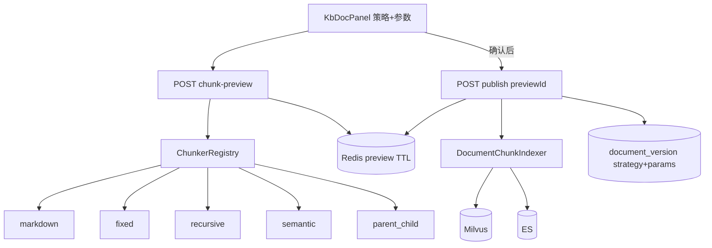

# RAG 文档级多策略分块设计

> **状态**：📝 设计已定稿（Brainstorming 2026-07-21）  
> **范围**：rag-service 入库分块 + `/knowledge` 文档 Tab；**不新增微服务**  
> **关联**：[2026-06-27-rag-knowledge-studio-design.md](./2026-06-27-rag-knowledge-studio-design.md) · [实施计划](../../plans/2026-07-21-rag-chunk-strategies.md) · [docs/rag/README.md](../../../rag/README.md) · [ADR-002](../../../architecture/ADR-002-rag-pipeline-in-rag-service.md)

---

## 0. 需求决策（Brainstorming 已定稿）

| # | 议题 | 决策 |
|---|------|------|
| 1 | 策略作用域 | **按文档**：每个文档可任选策略并重新发布；**去掉**参数配置 Tab 的分段配置 |
| 2 | 策略清单（一轮交付） | `markdown` / `fixed` / `recursive` / `semantic` / `parent_child` **全部一次交付** |
| 3 | 发布门禁 | **必须预览确认**后才能发布（A） |
| 4 | 参数暴露 | 预览面板按策略 **直接调参**（A）；无「仅默认值」模式 |
| 5 | 实现路径 | **Preview-Token 门禁**（方案 1）：publish 消费预览快照，禁止无 previewId 发布 |
| 6 | 默认策略 | 新建文档默认 `markdown`（与现网 MarkdownParser 行为一致） |
| 7 | KB 级 chunk 配置 | **删除** `rag-chunk` / `chunk.maxSize`（schema、seed、UI、Eval Suggest 路径） |

---

## 1. 目标与非目标

### 1.1 目标

- 提升知识库入库质量：同一知识库内不同文档可用不同分块策略
- 发布前可见切块效果，所见即所入（预览快照 = 入库内容）
- 可插拔 `Chunker` 架构，策略与参数落在 `document_version`，可审计可复现
- 父子分块检索时：命中子块 → 回填父块上下文

### 1.2 非目标

- 不做独立「入库 Tab」（仍用文档 Tab 发布流）
- 不做策略 A/B 自动对比评测（人工预览即可）
- 不在预览阶段写入 Milvus/ES
- 不保留 KB 级分段参数作为回退默认（参数仅在文档预览/发布路径）
- 不新增微服务；不改检索 pipeline 的改写/HyDE/rerank 主链路（仅 parent_child 增加回填）

---

## 2. 架构



### 2.1 核心组件

| 组件 | 职责 |
|------|------|
| `Chunker` | 接口：`List<ChunkDraft> chunk(String markdown, ChunkParams params)` |
| `ChunkerRegistry` | 按 `strategy` id 解析实现 |
| `ChunkPreviewService` | 生成预览、写入 Redis、校验并取出供 publish |
| `DocumentCatalogService` | publish 改为消费 preview 快照；不再直接调用 `MarkdownParser` |
| `MarkdownParser` | 收敛为 `markdown` 策略实现（或被其委托） |

### 2.2 明确不做

- KB 参数配置 Tab 的 `rag-chunk` / `maxSize`
- 无 `previewId` 的 publish
- 预览时写向量库
- 发布时按客户端参数「再算一遍」（必须用 preview 缓存的 chunks）

---

## 3. API 与数据模型

### 3.1 预览

`POST /api/rag/admin/kbs/{kbId}/documents/{docId}/chunk-preview`

```json
{
  "version": 3,
  "strategy": "fixed",
  "params": { "maxSize": 800, "overlap": 100 }
}
```

`version` 缺省取当前 draft。响应：

```json
{
  "previewId": "prv_…",
  "strategy": "fixed",
  "params": { "maxSize": 800, "overlap": 100 },
  "contentHash": "sha256:…",
  "chunkCount": 42,
  "chunks": [
    {
      "index": 0,
      "text": "…",
      "charCount": 780,
      "meta": { "level": "child", "parentIndex": 0 }
    }
  ],
  "expiresAt": "…ISO…"
}
```

`meta` 仅 `parent_child`（及未来扩展）需要；其它策略可省略或为空对象。

### 3.2 发布（改）

`POST …/documents/{docId}/publish`

```json
{ "previewId": "prv_…" }
```

校验顺序：

1. preview 存在且未过期  
2. `docId`（及 kb/tenant）匹配  
3. `contentHash` == 当前 draft markdown 的哈希  

通过后：用缓存 `chunks` 调用 `DocumentChunkIndexer`；写 `document_version.chunk_strategy` / `chunk_params_json`；失效该 preview。

无 `previewId` → **400**。

### 3.3 持久化

| 存储 | 变更 |
|------|------|
| MySQL `document_version` | 新增 `chunk_strategy VARCHAR`、`chunk_params_json JSON`（发布时写入） |
| Redis | `rag:chunk-preview:{previewId}`，TTL **30 分钟**；值含 strategy、params、contentHash、chunks、doc 归属 |
| Milvus / ES chunk metadata | 增加 `strategy`；`parent_child` 另加 `chunk_level`（`parent`\|`child`）、`parent_chunk_id` |

SQL SSOT：`docker/mysql/init/14-sunshine-rag-service.sql`（禁止 Flyway）。已有库用同等 ALTER 运维脚本说明，不引入 migration 框架。

### 3.4 删除与迁移

- 去掉 config schema 的 `rag-chunk`；seed / active `payload_json` 不再含 `chunk.maxSize`
- `KbConfigPanel` / `kbConfigFieldHelp` 移除分段项
- Eval Suggest 可调路径去掉 `chunk.maxSize`（若需提示，改为「检查文档分块策略」类文案，不写 KB 级数值）
- `EffectiveConfigResolver.chunkMaxSize()` 及调用点改为从 preview/params 读取，不再从 KB bundle 读分段
- `scripts/rag_ingest_bulk.py`：增加 `--strategy` / 策略参数；内部 **先 preview 再 publish**（无 UI，仍走同一门禁）

---

## 4. 五种策略与参数

| strategy | 行为 | 可调参数（默认） |
|----------|------|------------------|
| `markdown` | 现有结构感知：标题/代码/表格/段落 + breadcrumb | `maxSize`=1200 |
| `fixed` | 定长切分 + overlap；尽量句末对齐 | `maxSize`=800，`overlap`=100 |
| `recursive` | 分隔符链 `\n\n` → `\n` → 句末标点 → 字符，递归压到 maxSize | `maxSize`=1000，`overlap`=80 |
| `semantic` | 先句切 → 相邻句 embedding 相似度 → 低谷切点 → pack 到 maxSize | `maxSize`=1200，`similarityThreshold`=0.55，`minChunkSize`=200 |
| `parent_child` | 父块大窗口；子块小窗口用于检索 | `parentSize`=2000，`childSize`=400，`childOverlap`=50 |

### 4.1 约定

- 改策略或改参 → 必须重新 preview；旧 `previewId` 作废（前端清空确认态）
- `semantic` 预览会调用 embedding；UI 显示进度；失败不写 Redis
- `parent_child`：**子块写入向量检索索引**；父块文本写入 metadata / 旁路字段供召回拼装（父块可不单独作为检索命中目标，或标记 `chunk_level=parent` 且检索过滤只查 child——实现选定一种并在代码注释/单测固定：**默认检索只查 child**）
- 单文档 preview/publish 的 chunk 数硬上限：**2000**；超限 400

---

## 5. 前端 UI

### 5.1 KbDocPanel

- 发布区：策略下拉 + 按策略动态参数表单
- 「预览分块」→ 展示 chunk 列表（index / 字数 / 摘要；父子标注 level）
- 「确认此预览」后解锁「发布生效」；未确认或 preview 过期则禁用发布
- 切换策略或改参 → 清空确认态与 `previewId`
- 已发布文档展示当前 `chunk_strategy`；换策略走同一门禁，发布产生新 active version
- `semantic`：预览按钮 loading +「正在计算语义边界…」

### 5.2 KbConfigPanel

- **移除**「分段参数 / rag-chunk」整块

### 5.3 交互与现有 OCR 流

- PDF/DOCX 仍：parse → quarantine/确认 → draft；**向量入库仍在 publish**，且 publish 现增加 preview 门禁
- 不改变解析状态机；仅在 draft 可发布时增加分块预览步骤

---

## 6. 检索影响

| 策略 | 检索行为 |
|------|----------|
| `markdown` / `fixed` / `recursive` / `semantic` | 与现网一致：chunk 级 hybrid + rerank；无协议变更 |
| `parent_child` | 命中 child → 用 `parent_chunk_id` 取父文本作为返回 context（可同时附带 child 原文供 debug） |

同库允许混用策略；线上检索默认**不按** `strategy` 过滤。

---

## 7. 错误处理

| 条件 | HTTP | 行为 |
|------|------|------|
| 缺少 / 过期 / 错归属 previewId | 400 | 提示重新预览 |
| contentHash 与当前 draft 不一致 | 409 | 强制重新预览 |
| semantic embedding 失败 | 502/500（与现 embedding 错误一致） | 不写 preview 缓存 |
| chunk 数 > 2000 | 400 | 提示增大块大小或拆分文档 |
| 未知 strategy / 非法 params | 400 | 参数校验失败 |

---

## 8. 验收

1. **单测**：五种 Chunker 边界行为；Registry 路由；非法 strategy  
2. **API**：preview → publish 成功；无 previewId / 过期 / hash 变更 → 拒绝；版本表写入 strategy/params  
3. **UI**：无确认不可发布；改参清确认态；Config Tab 无分段项  
4. **Live**：五策略各发布一文档可检索；`parent_child` 命中返回父上下文  
5. **脚本**：`rag_ingest_bulk.py --strategy …` 走 preview→publish  

建议新增/扩展：`scripts/verify_chunk_strategies_live.py`（或并入现有 rag 验收脚本套件）。

---

## 9. 测试要点（补充）

- preview TTL 过期后 publish 失败  
- 预览后修改 draft 正文再 publish → 409  
- 同一文档连续两次不同策略发布：仅最新 version active；旧向量按现有 publish 覆盖/失效语义处理（与现网 re-publish 一致，不另造一套）  
- parent_child 预览列表父/子条数关系符合 `parentSize`/`childSize`  

---

## 10. 风险与约束

- `semantic` 预览成本与延迟：大文档可能较慢；硬上限 2000 chunks 限制爆炸  
- `parent_child` 存储体积更大；检索侧必须实现回填，否则质量反而下降  
- 去掉 KB `chunk.maxSize` 后，历史文档仅在**重新发布**时带上新字段；旧 version 无 strategy 时 UI 显示为「（历史）markdown」或空并提示重新发布  

---

## 11. 实施边界（供 writing-plans）

优先改动面：

- `rag-service/.../parser/`（Chunker 体系）  
- `DocumentCatalogService` / `DocumentChunkIndexer` / 检索回填  
- `14-sunshine-rag-service.sql` + config schema/seed  
- `KbDocPanel` / `KbConfigPanel` / `kbDocuments` API  
- `scripts/rag_ingest_bulk.py` + Live 验收脚本  
