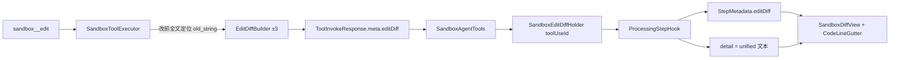

# 沙箱 / 时间线：行号与 Git 风格 contextual diff

> **状态**：✅ 已落地 · [实施计划](../../plans/2026-07-21-sandbox-diff-line-numbers.md)  
> **范围**：沙箱工作区全文预览行号 + 时间线 `sandbox__write` / `sandbox__edit` 展开 Git 风格 diff（旧/新行号、±3 上下文）  
> **关联**：[docs/sandbox/README.md](../../../sandbox/README.md) · [2026-07-16-sandbox-workspace-drawer-design.md](./2026-07-16-sandbox-workspace-drawer-design.md) · 现有 `sunshine-ui/src/api/sandboxEditDiff.ts`

---

## 0. 需求决策（Brainstorming 已定稿）

| # | 议题 | 决策 |
|---|------|------|
| 1 | 上下文量 | **A**：改动上下各 **3** 行；无关大段一行 `···` 折叠 |
| 2 | 行号形态 | **Git 双栏**：旧行号 \| 新行号 \| `+/-`/空 \| 代码（对齐 Cursor/Git 截图语义） |
| 3 | 实现路径 | **方案 1**：后端在 edit 时产出带绝对行号的 contextual hunk；前端只渲染 |
| 4 | 沙箱抽屉 | 全文 **单栏绝对行号**（非 diff） |
| 5 | write 展开 | 整文件按 `add`；旧号空、新号 `1…N`；**不截断**正文 |
| 6 | 旧消息 | **不做兼容**：无 `metadata.editDiff` 的历史 edit 步不按 Git gutter 渲染（可空/纯文本）；不维护 `+/-/ ` 回退解析路径作为产品能力 |

---

## 1. 目标与非目标

### 1.1 目标

- 沙箱抽屉代码预览左侧显示绝对行号
- 时间线 write/edit 展开显示旧/新行号 + `+/-` 标记 + 红/绿底
- edit 展示匹配点上下 3 行上下文；长文件中间折叠
- 行号为**文件绝对行号**（非片段相对 1…n），便于对照右侧工作区

### 1.2 非目标

- 工作区可编辑 / Monaco 编辑器
- 对工具写入正文做截断、摘要或过滤（遵守平台「模型输出不二次加工」；工具 content 全文展示）
- 前端事后拉工作区反推 diff（会话失效不可靠）
- read / exec / grep / glob 行号（本轮不做）
- 首版不做「点击 `···` 展开折叠段」（仅展示折叠标记；可后续加）
- **不做旧消息兼容**（无 structured `editDiff` 的历史会话不保证双行号 / 上下文）

---

## 2. 方案选型

采用 **方案 1：sandbox-service 产出 contextual hunk → StepMetadata → Git gutter UI**。

| 方案 | 结论 |
|------|------|
| 1. 后端 edit 时基于改前全文生成 ±3 hunk + 绝对行号 | **采用** |
| 2. 前端拉 workspace content 反推 | 否：历史/会话失效、HITL 前后状态不稳 |
| 3. 仅片段相对行号 | 否：对不上文件真实行号、无真实上下文 |

---

## 3. 展示形态

### 3.1 沙箱抽屉（`SandboxPreviewPane`）

| 项 | 约定 |
|----|------|
| 行号 | 单栏 `1…N`，等宽、不可选中 |
| 内容 | 保持现有 hljs / 不换行 + 横滚；`.md` 美化模式可不显示行号（仅 raw/code 模式显示） |
| 空文件 | **不显示 gutter**（无行号栏） |

### 3.2 时间线 diff（write / edit）

四列 gutter（参考 Git / Cursor Source Control）：

| 列 | del | add | ctx | fold |
|----|-----|-----|-----|------|
| 旧行号 | 有 | 空 | 有 | 空 |
| 新行号 | 空 | 有 | 有 | 空 |
| 标记 | `-` | `+` | 空 | 空 |
| 代码 | 原文 + 红底 | 原文 + 绿底 | 原文 | `···` |

- 主行既有 `+N -M` 统计（`summarizeDiffCounts`）保持不变
- 复制按钮：复制 **unified 文本**（`+/-/ ` 前缀），不含行号列

---

## 4. 数据流与契约



### 4.1 `editDiff` 行结构（前后端同构）

```json
{
  "editDiff": {
    "path": "/skills/demo/scripts/quicksort.py",
    "contextRadius": 3,
    "lines": [
      { "kind": "ctx", "text": "def partition(...):", "oldLine": 10, "newLine": 10 },
      { "kind": "del", "text": "    x = a", "oldLine": 11, "newLine": null },
      { "kind": "add", "text": "    x = b", "oldLine": null, "newLine": 11 },
      { "kind": "fold", "text": "", "oldLine": null, "newLine": null }
    ]
  }
}
```

| `kind` | 含义 |
|--------|------|
| `ctx` | 未改上下文（计入 ±3） |
| `del` / `add` | 删除 / 新增 |
| `fold` | 省略无关行（渲染 `···`） |

行号：1-based；`null` 表示该侧无行。

### 4.2 sandbox-service

- 在 `edit`：**读全文 → 唯一匹配 → 生成 hunk → 再写盘**
- `EditDiffBuilder`：新建于 **`common/sunshine-common`**（sandbox-service 执行路径与 orchestrator HITL 预览**共用**同一实现，禁止两套算法）
  - 输入：`beforeContent`、`oldString`、`newString`、`contextRadius=3`
  - 输出：`editDiff` 结构（含 path 由调用方填）
  - 算法：定位 `oldString` 起止行；对 old/new 片段做行级 LCS（与现 `HitlParamSupport.formatEditUnifiedDiff` / 前端 `lineUnifiedDiff` 同语义）；变更块上下各取至多 3 行 `ctx`；文件更早/更晚的省略区各插入至多一个 `fold`
- `ToolInvokeResponse.meta` 放入 `editDiff`；**output 仍短/空**（不把全文 diff 灌进 LLM 上下文）
- **不**把 content/old/new 全文写入 audit（维持 sha256 策略）

### 4.3 orchestrator 旁路

现状：`SandboxAgentTools` 只把 `resp.output()` 填进 `ToolResultBlock`，**丢弃 meta**；Hook 对 write/edit 用 `HitlParamSupport.expandBodyFromParams(input)` 填 detail。

新约定：

1. `SandboxEditDiffHolder.put(toolUseId, editDiff)`（invoke 成功且 meta 含 editDiff）
2. `ProcessingStepHook` 完成 edit 步时 `take(toolUseId)`：
   - `StepMetadata.editDiff` = structured（需扩展 `StepMetadata` + Serde）
   - `detail` = 由 lines 格式化的 unified 文本（**仅供复制**；UI **不**靠解析 detail 渲染 gutter）
3. 无 holder（edit 失败未产出 meta）→ 无 `editDiff`；展开不展示假行号 gutter（可空或仅错误/空态）

### 4.4 HITL 待确认（尚未落盘）

- 确认框仍不展示正文
- 展开区：用当前工作区文件内容 + `old_string`/`new_string` 调用**同一** `EditDiffBuilder`（orchestrator 经 `SandboxClient` 读 content），结果写入该步 `metadata.editDiff`
- 读失败或无法唯一匹配 → **不**拼片段相对行号兜底；展开空态 / 提示无法预览（与「不做旧消息兼容」一致：禁止第二套弱渲染）

### 4.5 write

- 不经 EditDiffBuilder；detail 仍为 `content` 全文
- 前端仅对 **write** 步用 `writeContentAsAddLines` 赋 `newLine = 1…N`，`oldLine = null`，`kind = add`
- 不插入 fold

### 4.6 渲染数据源（唯一）

| 步骤 | UI 数据源 |
|------|-----------|
| edit | **仅** `metadata.editDiff` |
| write | detail `content` → 前端标为全 `add` + 新行号 |
| 历史无 `editDiff` 的 edit | **不** Git gutter（不做兼容） |

可删除或降级前端 `parseSandboxEditDiff` 作为产品路径（复制用的 unified 文本无需再 parse 回 lines）。

---

## 5. 前端组件

| 组件 / 模块 | 职责 |
|-------------|------|
| `CodeLineGutter.vue`（新） | 双栏或单栏行号 + 标记；`mode: 'diff' \| 'file'` |
| `SandboxDiffView`（新，或扩 `SandboxToolExpandPanel`） | 渲染 lines；fold 行；hljs 按 path 语言 |
| `SandboxPreviewPane.vue` | 全文按行拆分 + `mode: 'file'` gutter |
| `sandboxEditDiff.ts` | 扩展 `SandboxDiffLine`：`oldLine?` / `newLine?` / `kind` 含 `fold`；从 metadata 映射；write 行号赋值；**移除**旧 unified 文本回退解析产品路径 |
| `useSandboxToolExpand.ts` | edit **只读** `step.metadata.editDiff`；write 走 `writeContentAsAddLines` |

样式：沿用 `--sun-*`、现有 `is-add` / `is-del` 色；gutter `user-select: none`；数字右对齐。

---

## 6. 边界与错误

| 场景 | 行为 |
|------|------|
| `old_string` 含多行且唯一 | 正常单 hunk + 上下 ctx |
| 匹配靠近文件头/尾 | ctx 不足 3 行则有多少算多少 |
| 空行 / 无尾换行 | 与现 `splitLines` 一致（保留末空行语义） |
| edit 失败（未找到/不唯一） | 无 editDiff；时间线按失败文案，无假行号 |
| 超大文件 write | 全文 + 行号，不截断 |
| 折叠 | 仅 UI 标记；首版不可点开 |

---

## 7. 测试与验收

| 层 | 用例 |
|----|------|
| Java 单测 | `EditDiffBuilder`：±3 ctx、行号递增、fold 插入、头尾不足、整段替换 |
| 前端单测 | metadata → lines；write 行号；fold 渲染数据；无 editDiff 时不渲染 gutter |
| 手工 / Live | write 新文件时间线双栏（仅新号）+ 抽屉行号；edit 小改可见上下 3 行 ctx 与旧/新号对齐抽屉 |

可选：扩展 `verify_sandbox_workspace_live` / chat suite 断言 expand detail 含 contextual 行（若易稳定）；非阻塞首版。

---

## 8. 文档索引

落地后更新 [`docs/sandbox/README.md`](../../../sandbox/README.md)：

- 工作区抽屉：代码预览带行号
- edit 展开：Git 双行号 + ±3 上下文（替代「仅 old/new 片段 unified」描述）

---

## 9. 明确不做（复述）

- 前端反推 diff
- 截断 write/edit 正文
- 首版 fold 点击展开
- read/exec 输出行号
- **旧消息 / 无 `editDiff` 的弱渲染兼容**（含仅靠 `+/-/ ` detail 推行号）
