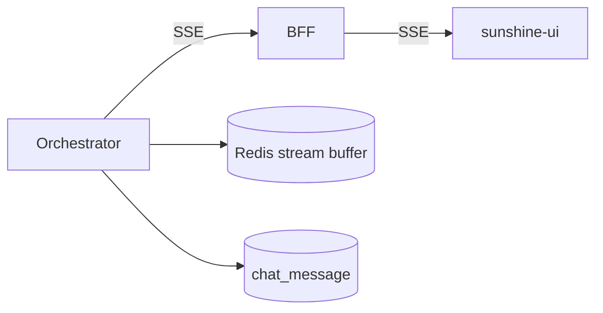
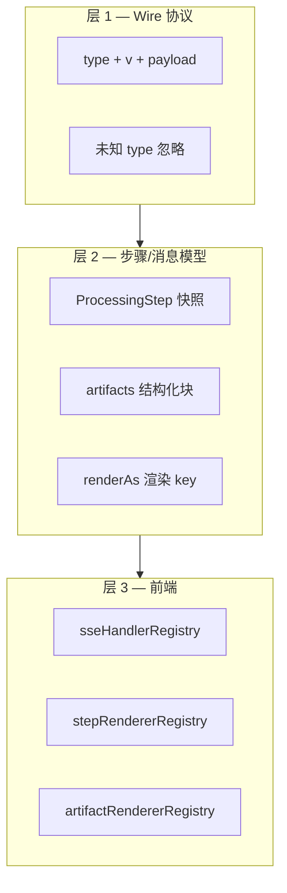
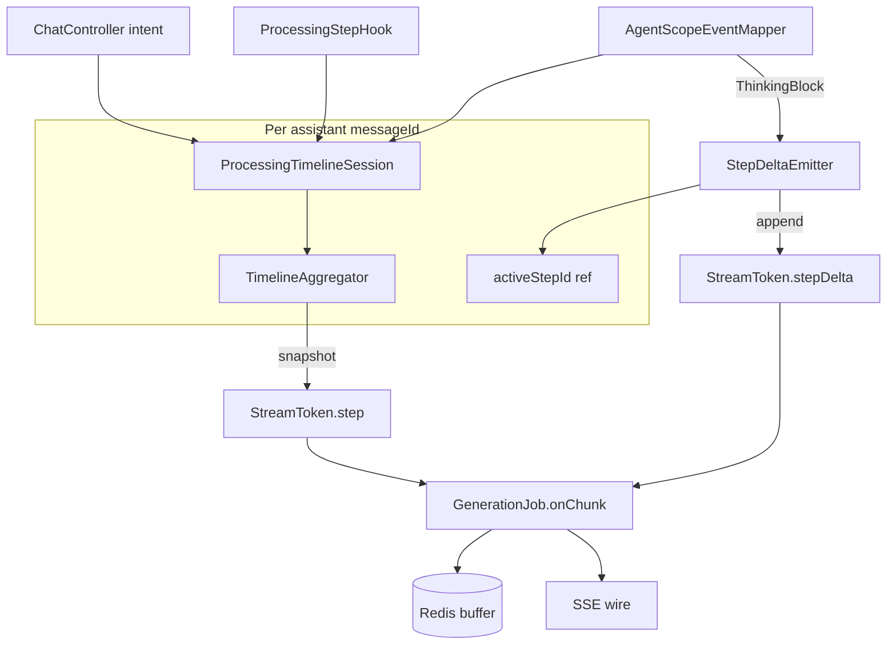

# REQ-OPERATION-TIMELINE — 技术设计（Codex 式操作级时间线）

> **状态**：待审阅  
> **需求**：[`REQ-OPERATION-TIMELINE.md`](./REQ-OPERATION-TIMELINE.md)  
> **前置**：Processing Timeline V2（[`2026-06-13-processing-timeline-v2-design.md`](../../docs/superpowers/specs/2026-06-13-processing-timeline-v2-design.md)）

## 适用规则

- [`CLAUDE.md`](../../CLAUDE.md)：不升级 Spring Boot 3.3+ / AgentScope 2.0；JDK 21
- BFF 透传 SSE，不聚合业务逻辑
- dev-yml 变更须同步 `docs/nacos/`（本需求无新中间件配置）
- 无 `.cursor/rules/`、无 Speckit 激活

---

## 1. 现状与差距

### 1.1 已有能力



| 通道 | SSE type | 前端存储 | 落库 |
|------|----------|----------|------|
| 步骤快照 | `step` | `message.steps[]` | `chat_message.steps` |
| 思考 | `reasoning` | `message.reasoning`（整段） | `chat_message.reasoning` |
| 正文 | `content` | `message.content` | `chat_message.content` |

后端 `ProcessingTimelineSession` + `TimelineAggregator` 已支持 `pending/start/progress/complete` 与耗时；`ProcessingStepHook` 已能 emit `tool-{name}` 步骤。

### 1.2 与 Codex 的差距

| 维度 | 现状 | 目标 |
|------|------|------|
| 思考归属 | 消息级一条 `reasoning` | **步骤级**流式 `reasoning` |
| 中间产物 | `step.detail` 短字符串 | 步骤 `output`（流式/快照）+ `result`（结论） |
| UI | `ProcessingTimeline` + `ReasoningPanel` 分离 | **OperationStack** 统一卡片栈 |
| 执行态 | 圆点 pulse | 卡片级水波纹 + 步骤内打字机 |
| 默认可见性 | 有正文后自动折叠 | running 步骤默认展开思考区 |

---

## 2. 方案对比

### 方案 A：仅扩展 `type:step` 快照（字段加大）

每次 thinking chunk 都 upsert 整步 JSON（含累积 `reasoning` 字段）。

| 优点 | 缺点 |
|------|------|
| 不改 SSE 类型，前端改动小 |  payload 大、Redis 写入频繁 |
| 重连逻辑不变 | 高频快照影响性能 |

### 方案 B：新增 `type:step_delta` + 步骤快照（推荐）

- **快照** `type:step`：lifecycle 变化时推送（与 V2 兼容，增加 `reasoning`/`output`/`result` 累积值）
- **增量** `type:step_delta`：流式 append，`{ stepId, channel, text }`

| 优点 | 缺点 |
|------|------|
| 流式体验好、payload 小 | 需扩展 Generation 缓冲与前端解析 |
| 快照 + delta 重连语义清晰 | 后端需维护 activeStepId |

### 方案 C：完全独立事件族（step_start / step_reasoning / step_end）

| 优点 | 缺点 |
|------|------|
| 语义最像 Codex | 与 V2 重复、迁移成本高 |

**推荐方案 B**：在 V2 上增量演进，旧客户端忽略 `step_delta` 仍可看快照；新 UI 绑定 delta 实现流式思考。

---

## 3. 数据模型

### 3.1 ProcessingStep V3（快照）

在 V2 字段基础上扩展（Java record / TS interface 同步）：

```java
public record ProcessingStep(
    String id,
    String phase,
    String lifecycle,
    StepSummary summary,
    Long startedAt,
    Long endedAt,
    Long durationMs,
    String detail,
    String reasoning,
    String output,
    String result,
    String renderAs,              // NEW：前端组件 key
    List<StepArtifact> artifacts, // NEW：结构化块，可为 null/empty
    Map<String, Object> meta,     // NEW：扩展 bag
    long ts,
    String status,
    String label
) {}
```

```typescript
export interface ProcessingStep {
  // ... V2 字段
  reasoning?: string
  output?: string
  result?: string
  /** 前端渲染组件 key，缺省按 phase / id 推断 */
  renderAs?: string
  /** 结构化块（引用列表、表格等），见 §3.5 */
  artifacts?: StepArtifact[]
  /** 扩展 bag，仅放非展示关键元数据；避免滥用 */
  meta?: Record<string, unknown>
}

export interface StepArtifact {
  id: string
  artifactType: string
  payload: unknown
  ts?: number
}
```

### 3.2 Wire 信封（所有 SSE JSON 事件）

除 legacy 纯文本 chunk 外，结构化事件**统一**携带版本号，便于同 type 内演进：

```json
{
  "type": "step_delta",
  "v": 1,
  "stepId": "agent",
  "channel": "reasoning",
  "text": "需要先检索知识库…"
}
```

| 字段 | 规则 |
|------|------|
| `type` | 必填；未知 type → 客户端**忽略**（forward compatible） |
| `v` | 必填，默认 `1`；同 type 破坏性变更时递增 |
| 其余字段 | 均为**可选扩展**；旧客户端缺失字段时使用降级 UI |

**原则：** 已有 type 只追加 optional 字段，不改语义；不可兼容时升 `v` 或新增 type。

### 3.3 SSE：`type:step_delta`（增量）

```json
{
  "type": "step_delta",
  "v": 1,
  "stepId": "agent",
  "channel": "reasoning",
  "text": "需要先检索知识库…"
}
```

| channel | 含义 | 写入规则 |
|---------|------|----------|
| `reasoning` | 步骤内思考 | append 到 step.reasoning + 可选 mirror 到 message.reasoning |
| `output` | 中间输出 | append 到 step.output |
| `result` | 步骤结论（通常一次性） | 覆盖 step.result |
| *自定义* | 见 §3.5.3 | 需在 `StepDeltaChannelRegistry` 登记；未知 channel 按 `output` append 到 step.meta.channels[channel] |

**约束：**

- 仅当存在 `activeStepId` 且步骤 `lifecycle=running` 时 emit delta（否则丢弃并打 debug 日志）
- `channel=result` 的 `text` 为完整字符串，非 append 片段

### 3.4 SSE：现有类型（保留）

| type | 变更 |
|------|------|
| `step` | 序列化 V3 全字段 |
| `reasoning` | **过渡期保留**；Orchestrator 改为优先 emit `step_delta`；无 activeStep 时 fallback 到 message 级 |
| `content` | 不变；语义上归属 `generate` 步骤，但不重复写入 step.output |

### 3.5 事件可扩展性规范（V3.5 扩展槽）

> **目标：** V3 先落地 Codex 式文本步骤；本节约束后续「按功能自由扩展事件与展示」的协议与实现方式，避免每次需求改核心 `parseSsePayload` / `OperationCard`。

#### 3.5.1 三层扩展模型



| 层 | 职责 | 扩展方式 |
|----|------|----------|
| **Wire** | SSE JSON 类型与版本 | 新增 `type` 或升 `v`；旧客户端 ignore unknown |
| **Model** | 落库与内存状态 | `step` 加 optional 字段；`artifacts[]`；不删旧字段 |
| **UI** | 展示 | 注册 `renderAs` / `artifactType` → Vue 组件 |

#### 3.5.2 能力边界（何者用何机制）

| 需求类型 | 推荐机制 | 示例 |
|----------|----------|------|
| 新流水线阶段 / 新工具 | 动态 `stepId` + Contributor `start/complete` | `tool-call_oa_api` |
| 流式文字（思考/日志） | `step_delta` + 标准或注册 channel | `reasoning`, `log` |
| 结构化一次性结果 | `type:artifact` 或 `step` 快照内 `artifacts[]` | 引用列表、JSON 树 |
| 富 UI（表格、卡片、图表） | `artifactType` + 专用 Vue 组件 | `citation_list`, `tool_result_json` |
| 最终用户回答 | `content`（不变） | Markdown 正文 |
| 需用户确认再继续 | **不在 V3 范围**；未来 `type:user_action` 双向 API | 工具执行前确认 |

**不在 V3/V3.5 内、需单独立项：** 并行步骤树（`parentId`）、多 Agent 会话、二进制附件、WebSocket 反向信令。

#### 3.5.3 SSE：`type:artifact`（V3.5 预留，Phase 3 可选实现）

与 `step_delta` 并列，用于**非流式 append** 的结构化块（可重复 upsert 同 `artifact.id`）：

```json
{
  "type": "artifact",
  "v": 1,
  "stepId": "rag",
  "artifact": {
    "id": "rag-hits-1",
    "artifactType": "citation_list",
    "payload": {
      "items": [
        { "title": "年假制度", "score": 0.92, "snippet": "…" }
      ]
    },
    "ts": 1718200000120
  }
}
```

| 规则 | 说明 |
|------|------|
| 归属 | 必须带 `stepId`；写入 `ProcessingStep.artifacts`（按 `artifact.id` upsert） |
| 落库 | 随 `steps` JSON 持久化；单 artifact payload 建议 ≤ 16KB |
| 重连 | 与 `step` / `step_delta` 相同 seq 管道重放 |
| 未知 `artifactType` | 前端 `DefaultArtifactBlock`（JSON pretty-print 降级） |

**与 `step_delta` 分工：** 文本流用 delta；结构化/document 块用 artifact。避免把 JSON 当字符串 endless append。

#### 3.5.4 后端扩展约定

1. **新步骤种类：** 实现 Contributor（或 Hook），调用 `ProcessingTimelineSession.pending/start/complete`；`stepId` 自由命名，建议 `tool-{name}` / `{phase}-{action}`。
2. **新流式 channel：** 在 `StepDeltaChannelRegistry`（新建，Map 注册）登记 channel → Aggregator 字段映射；未登记 channel 落入 `step.meta.channels[name]` 字符串 append。
3. **新 SSE type：** 在 `StreamToken` + `GenerationFlushScheduler` + `GenerationJob.onChunk` 各加一条分支；**必须**写 seq 进 Redis。
4. **禁止：** 为单一业务改 BFF 聚合逻辑；禁止在 `content` 里夹带控制指令。

```java
// 概念：Contributor 接口（V3.5 可选抽象，与 V2 Session API 并存）
public interface TimelineContributor {
    void contribute(ProcessingTimelineSession session, StreamContext ctx);
}
```

#### 3.5.5 前端扩展约定

1. **解析：** `parseSsePayload` 重构为 **dispatcher**（`Map<type, handler>`）；未知 type → `noop` + dev 计数。
2. **步骤渲染：** `stepRendererRegistry` — key 优先级：`step.renderAs` → `step.phase` → `step.id` 前缀 → `default`（`OperationCard`）。
3. **Artifact 渲染：** `artifactRendererRegistry` — key = `artifactType`。
4. **排序：** 不再硬编码 `STEP_ORDER` 为唯一序；默认按 `startedAt` / `ts`，`STEP_ORDER` 仅作同 timestamp  tie-break。
5. **降级：** 任意注册缺失 → 默认卡片展示 `summary` + `detail` + 文本 `reasoning`/`output`。

```typescript
// sunshine-ui/src/api/sseDispatch.ts（Phase 2 引入）
const sseHandlers: Record<string, SseHandler> = {
  step: handleStep,
  step_delta: handleStepDelta,
  artifact: handleArtifact,  // Phase 3
  content: handleContent,
  reasoning: handleReasoningLegacy,
  // meta types...
}

export function dispatchSseEvent(obj: Record<string, unknown>, ctx: SseContext): void {
  const type = String(obj.type ?? '')
  const handler = sseHandlers[type]
  if (handler) handler(obj, ctx)
  else if (import.meta.env.DEV) console.debug('[sse] ignored unknown type', type)
}
```

```typescript
// sunshine-ui/src/components/operation/renderRegistry.ts
export const stepRendererRegistry: Record<string, Component> = {
  default: OperationCard,
  rag: RagOperationCard,           // Phase 3 示例
  generate: GenerateOperationCard,
}
```

#### 3.5.6 版本与兼容矩阵

| 变更 | 做法 |
|------|------|
| 新 optional 字段 | 直接加，`v` 不变 |
| 改字段语义 | `v` + 1 或新 `type` |
| 新 artifactType / renderAs | 仅新前端注册；旧前端 JSON 降级 |
| 废弃 type | 文档标记 deprecated；至少保留 2 个小版本 |

| 客户端 \ 服务端 | 仅 V2 | V3 + delta | V3.5 + artifact |
|-----------------|-------|------------|-----------------|
| 旧前端 | ✅ | ✅（忽略 delta） | ✅（忽略 artifact） |
| V3 前端 | 降级摘要 | ✅ | ✅（artifact 降级为 JSON） |

#### 3.5.7 标准 artifactType 登记（预留，实现时维护于 docs）

| artifactType | 用途 | 组件 |
|--------------|------|------|
| `citation_list` | RAG 命中列表 | `CitationListArtifact.vue` |
| `tool_result_json` | 工具返回 JSON | `ToolResultArtifact.vue` |
| `code_diff` | 代码变更预览 | 未来 |
| `progress_bar` | 长任务进度 | 未来 |

新增 type 时：**后端 PR 注明 payload schema + 前端 registry 条目 + 本表一行**。

### 3.6 落库

- **无需新 Flyway 列**：`chat_message.steps` MEDIUMTEXT 存 V3 JSON 数组（含 `artifacts`）；`reasoning` 列保留（整段 mirror，供搜索/审计）
- `ProcessingStepMerger.upsert`：合并时 `reasoning`/`output` 取更长字符串；`artifacts` 按 `id` upsert
- 重连缓冲：Redis 按 seq 存原始 SSE data 字符串（已支持），`step_delta` / `artifact` 与 `step` 同等对待

---

## 4. 后端设计

### 4.1 架构



### 4.2 新增/修改类

| 类 | 变更 |
|----|------|
| `StreamToken` | 新增 `KIND_STEP_DELTA`，字段 `(stepId, channel, text)` |
| `StepDeltaEmitter` | 封装 `step_delta` JSON；校验 activeStep |
| `ProcessingTimelineSession` | `activeStepId()` / `setActive(stepId)`；`appendDelta(channel, text)` 更新 Aggregator 内 StepState |
| `TimelineAggregator.StepState` | 增加 `reasoning`/`output`/`result` 字符串累加器 |
| `AgentScopeEventMapper` | REASONING → `step_delta(reasoning)` 而非裸 `StreamToken.reasoning` |
| `GenerationFlushScheduler` | `metaStepDelta(...)` |
| `GenerationJob.onChunk` | 处理 step_delta：append 到 stepsBuffer 对应 step + 写 Redis |
| `ChatController.wrapStream` | step_delta 路径（非 wrapStream 老路径，以 GenerationJob 为准） |
| `ProcessingStepMerger` | 合并 V3 字段 + `artifacts` upsert |
| `ArtifactEmitter` | （V3.5）`StreamToken.artifact` → `metaArtifact` |
| `StepDeltaChannelRegistry` | （V3.5）登记自定义 delta channel 映射 |

### 4.3 Active Step 生命周期

| 时机 | activeStepId |
|------|----------------|
| `session.start("intent", ...)` | `intent` |
| `session.complete("intent", ...)` | 清空或保持至下一步 `start` |
| `session.start("rag", ...)` | `rag` |
| REASONING 事件（agent 未 completed） | 确保 `agent` 已 start，active=`agent` |
| `session.start("generate", ...)` | `generate` |
| `tool-{name}` start | `tool-{name}` |

**规则：** 同一时刻仅一个 active step；`start(B)` 自动将上一 running 步骤 complete（若尚未 complete，由 Session 负责兜底 completeAt）。

### 4.4 各步骤 output/result 映射

| stepId | output 来源 | result 来源 |
|--------|-------------|-------------|
| `intent` | — | `detail`（如「知识库查询」） |
| `rag` | 检索片段摘要（可选，截断 2KB） | `detail`（命中 N 条） |
| `tool-*` | 工具返回 JSON/Text 摘要 | `detail` |
| `agent` | — | `detail` 或「推理完成」 |
| `generate` | — | `summary.after`；正文走 `content` 通道 |

RAG 工具返回时：

```java
session.appendDelta("rag", "output", truncatedHits);
session.complete("rag", hitSummary); // result → detail + summary.after
```

### 4.5 与 AgentScope 思考块

现有逻辑（`ThinkingBlock` → reasoning）改为：

```java
// AgentScopeEventMapper.appendThinkingTokens
for (ThinkingBlock block : ...) {
    out.add(StreamToken.stepDelta(activeStepId, "reasoning", block.getThinking()));
}
```

`REASONING` 事件中 TextBlock 仍不传输（保持现有注释行为）。

### 4.6 重连语义

`GET /api/chat/stream/{generationId}?afterSeq=N`（BFF → Orchestrator）：

1. 重放 Redis 中 `seq > N` 的所有 data（含 `step`、`step_delta`、`artifact`、`content`）
2. 前端对 `step_delta` 做 append；对 `step` / `artifact` 做 upsert
3. 重连完成后 `loadDetail` 以 DB 快照为准做一次 reconcile（取更长 reasoning/output，合并 artifacts）

---

## 5. 前端设计

### 5.1 组件结构

```
ChatView.vue
└── assistant-body
    ├── OperationStack.vue          # 替代 ProcessingTimeline + ReasoningPanel
    │   └── OperationCard.vue × N   # 每步一卡
    │       ├── OperationCardHeader  # 标题、状态图标、耗时、chevron
    │       ├── OperationReasoning   # 流式思考（pre-wrap + 水波纹底）
    │       ├── OperationOutput      # 中间输出（可折叠 code/pre）
    │       └── OperationResult      # 结论行
    └── AnswerMarkdown               # 最终 content（现有 msg-md）
```

### 5.2 OperationCard 状态

| lifecycle | 视觉 |
|-----------|------|
| `pending` | 灰点，仅 before 文案 |
| `running` | 水波纹边框/背景 pulse，`reasoning`/`output` 实时 append |
| `done` | 绿点，显示 durationMs，默认折叠 reasoning（用户可展开） |
| `error` | 红字 + result |

**默认展开规则（与现 ChatView 相反）：**

- `running` 步骤：**始终展开** reasoning/output 区
- 全部 `done` 后：栈整体折叠为摘要条（保留总耗时），单卡可点开
- **不再**使用独立 `ReasoningPanel`（V3 迁移期可 hidden 兼容）

### 5.3 SSE 解析（`sseDispatch.ts` + `chatSessions.ts`）

Phase 2 将 `parseSsePayload` 拆为 **registry dispatch**（见 §3.5.5）。`step_delta` handler 示例：

```typescript
function handleStepDelta(obj: Record<string, unknown>, ctx: SseContext) {
  applyStepDelta(ctx.lastMsg.steps, {
    stepId: String(obj.stepId),
    channel: String(obj.channel),
    text: String(obj.text ?? ''),
  })
  if (obj.channel === 'reasoning') {
    ctx.lastMsg.reasoning = appendChunk(ctx.lastMsg.reasoning ?? '', String(obj.text ?? ''))
  }
}
```

`applyStepDelta`：若 step 不存在则创建 `lifecycle: running` 占位；按 channel append；未知 channel 写入 `meta.channels`。

### 5.4 水波纹动效

- CSS：`@keyframes ripple` + `mask` 或 `box-shadow` 脉冲，仅 `.operation-card.is-running`
- 思考区使用等宽字体 + 半透明背景，与 Codex 风格接近（不引入新依赖）

### 5.5 类型与工具（`processingSteps.ts`）

- `applyStepDelta(steps, delta): ProcessingStep[]`
- `upsertArtifact(steps, artifact): ProcessingStep[]`（V3.5）
- `operationSummary(steps): string` — 折叠条文案
- 保留 `migrateV1Step` / V2 兼容

### 5.6 渲染注册表（`renderRegistry.ts`）

`OperationStack` 渲染单步时：

```typescript
const key = step.renderAs ?? step.phase ?? 'default'
const Comp = stepRendererRegistry[key] ?? stepRendererRegistry.default
```

步骤内 `artifacts` 由 `ArtifactList` 遍历，按 `artifactType` 查 `artifactRendererRegistry`；缺失则 `DefaultArtifactBlock`。

**扩展新功能 checklist：**

1. 后端：Contributor 或 Hook emit `step` / `step_delta` / `artifact`
2. 前端：`sseHandlers` +（如需）`stepRendererRegistry` / `artifactRendererRegistry` 各加一条
3. 文档：§3.5.7 登记表 + payload schema 一行

---

## 6. 外部依赖与集成契约（Integration Contracts）

本需求无新增外部 RPC；边界均为仓库内服务。

| IC | 边界 | 状态 | 说明 |
|----|------|------|------|
| IC-01 | Orchestrator SSE → BFF → Browser | **in-repo-proven** | 现有 `StreamToken` → `GenerationFlushScheduler` → SSE；扩展 `step_delta` |
| IC-02 | AgentScope `Event` / `ThinkingBlock` | **in-repo-proven** | `AgentScopeEventMapper` 已映射 REASONING |
| IC-03 | Redis generation buffer | **in-repo-proven** | `GenerationStreamService.appendChunk(seq, data)` |
| IC-04 | MySQL `chat_message.steps` | **in-repo-proven** | V3 JSON 向后兼容 |

---

## 7. 迁移与兼容

| 场景 | 行为 |
|------|------|
| 旧前端 + 新后端 | 忽略 `step_delta`；仍看 `step` 快照 + message `reasoning` |
| 新前端 + 旧后端 | 无 `step_delta`；卡片仅显示 summary 三态（等同 V2） |
| 历史消息 | steps 无 reasoning 字段；卡片只显示 summary/detail |

**废弃计划（V3.1，非本需求）：** 停止 emit 裸 `type:reasoning`，仅 step_delta。

---

## 8. 实施分期

### Phase 1 — 后端事件（P0）

1. `StreamToken` + `StepDeltaEmitter` + Aggregator V3 字段
2. `ProcessingTimelineSession.setActive` + REASONING 路由到 step_delta
3. `GenerationJob` / `metaStepDelta` / Redis 重放
4. 单测：Aggregator delta append、Job 缓冲、重连顺序

### Phase 2 — 前端 OperationStack（P0）

1. `applyStepDelta` + `OperationStack` / `OperationCard`
2. ChatView 接入，移除 ReasoningPanel + ProcessingTimeline
3. 刷新/重连 hydrate 测试

### Phase 3 — 打磨与 V3.5 扩展槽（P1）

1. RAG output 截断与折叠 UI；可选首条 `artifact:citation_list`
2. `sseDispatch` + `renderRegistry` 骨架落地；未知 type 忽略单测
3. E2E 扩展（含 unknown type 不崩溃）
4. 文档：`docs/superpowers/specs/2026-06-13-processing-timeline-v3-extensibility.md`（从 §3.5 抽出维护 artifact 登记表）

---

## 9. 测试计划

| 用例 | 预期 |
|------|------|
| 知识库问答完整流 | 4 张卡片顺序正确，rag 卡 result=命中 N 条 |
| 简单对话 | intent + generate；generate running 时 content 流式 |
| step_delta 高频 | Redis seq 单调，重连无丢字 |
| 刷新 completed 会话 | steps JSON 含 reasoning，卡片可展开 |
| 中断 generation | 最后 running 卡 lifecycle=error/interrupted |
| V2 旧数据打开 | 不报错，摘要降级展示 |
| 未知 SSE type | 忽略且不中断流；DEV 有 debug 计数 |
| artifact 未知 artifactType | DefaultArtifactBlock 展示 JSON |

---

## 10. 风险与对策

| 风险 | 对策 |
|------|------|
| step_delta 与 step 快照顺序乱序 | 前端 upsert 以 step.ts 为准；delta 仅 append |
| reasoning 体积过大 | output/reasoning 单步上限 32KB，超出截断并写 detail |
| activeStep 错位 | Session start 时强制 complete 上一 running |
| 双写 reasoning（message + step） | 过渡期保留；UI 只读 step |
| 扩展 type 爆炸 | 强制 registry + §3.5.7 登记；Code Review checklist |
| artifacts 体积过大 | 单 artifact ≤16KB，单 step artifacts ≤8 条，超出截断 |

---

## 11. 设计自审

- [x] 无占位符 TBD
- [x] 与 V2 Aggregator / GenerationJob 路径一致
- [x] 范围不含 Gateway/LLM 改动
- [x] 成功标准可测
- [x] IC 均为 in-repo
- [x] §3.5 事件可扩展性规范已纳入（Wire / Model / UI 三层）

---

**请审阅本文档。** 批准后可执行 `writing-plans` 产出 [`REQ-OPERATION-TIMELINE-task.md`](./REQ-OPERATION-TIMELINE-task.md)。
