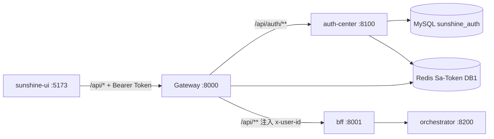

# REQ-PHASE2-AUTH — 技术设计

> **状态**：已批准（2026-06-16）  
> **需求**：[`REQ-PHASE2-AUTH.md`](./REQ-PHASE2-AUTH.md)  
> **对标**：[`docs/tech-solution.md`](../../docs/tech-solution.md) §认证中心、[`docs/implementation-plan.md`](../../docs/implementation-plan.md) 2.1

## 适用规则

- [`CLAUDE.md`](../../CLAUDE.md)：JDK 21、Spring Boot 3.2.9、Sa-Token 1.45.0；不升级 Boot 3.3+ / AgentScope 2.0
- 统一响应 `R<T>` + `BizException` + `GlobalExceptionHandler`（sunshine-common）
- BFF 只做透传；身份经 Gateway 注入 header 向下传递
- dev-yml 变更须同步 [`docs/nacos/`](../../docs/nacos/) 并提醒更新 Nacos 线上配置
- 数据库迁移：Flyway（参照 orchestrator）
- 无 `.cursor/rules/`、无 Speckit 激活

---

## 1. 架构概览与模块划分

### 1.1 总体架构



**核心原则：**

- Gateway 是唯一鉴权入口：校验 JWT → 注入 `x-user-id` / `x-tenant-id: default` → 剥离客户端伪造 header
- BFF / Orchestrator 不验 Token，只读 Gateway 注入的 header
- auth-center 负责用户 CRUD + 登录态 + Token 签发

### 1.2 模块职责

| 模块 | 变更 | 职责 |
|------|------|------|
| auth-center | 新建业务 | `sys_user`、注册 / 登录 / 登出 / me；Sa-Token + Flyway |
| gateway | 变更 | Sa-Token Reactor；白名单；路由 `/api/auth/**`；header 注入 |
| bff | 微调 | 移除 `x-user-id` defaultValue `anonymous` |
| orchestrator | 微调 | 同上 |
| sunshine-ui | 新建 | `/login`、`/register`；authStore；路由守卫；Bearer Token |
| docs/nacos | 新增/更新 | `sunshine-auth.yaml`；`sunshine-gateway.yaml` |

### 1.3 开发环境

| 项 | 变更 |
|----|------|
| Vite proxy | `8001` → `8000`（Gateway） |
| 启动链 | 必须含 Gateway + auth-center |

### 1.4 上线清库

```sql
-- sunshine_chat
TRUNCATE TABLE chat_message;
TRUNCATE TABLE chat_conversation;
```

前端清除 localStorage：`sunshine-user-id`、`sunshine-current-conversation-id`、`sunshine-active-generation` 等。

---

## 2. 数据模型

### 2.1 库表

**库名**：`sunshine_auth`（MySQL `ecs4c16g:3306`，与 `sunshine_chat` 同实例）

**迁移**：`auth-center/src/main/resources/db/migration/V1__sys_user.sql`

```sql
CREATE TABLE sys_user (
    id            VARCHAR(64)  NOT NULL PRIMARY KEY COMMENT 'UUID',
    username      VARCHAR(32)  NOT NULL COMMENT '登录名',
    password_hash VARCHAR(128) NOT NULL COMMENT 'BCrypt',
    nickname      VARCHAR(64)  NULL     COMMENT '展示名',
    status        TINYINT      NOT NULL DEFAULT 1 COMMENT '1=正常 0=禁用',
    created_at    DATETIME(3)  NOT NULL,
    updated_at    DATETIME(3)  NOT NULL,
    UNIQUE KEY uk_username (username)
);
```

| 规则 | 约束 |
|------|------|
| username | 4–32 字符，`[a-zA-Z0-9_]`，唯一 |
| password（入参） | 8–64 字符 |
| id | UUID 字符串，对齐 `chat_conversation.user_id` VARCHAR(64) |

**密码**：`BCryptPasswordEncoder`（`spring-security-crypto`，不引入完整 Security Filter 链）

**技术栈**：JPA + Flyway（对齐 orchestrator 惯例）

---

## 3. API 契约

统一响应 `R<T>`。Gateway 对外前缀不变，auth-center 映射 `/api/auth/**`。

### POST `/api/auth/register`

| | |
|---|---|
| 鉴权 | 白名单 |
| 请求 | `{ "username", "password", "nickname?" }` |
| 成功 | `200` → `{ userId, username, nickname }` |
| 失败 | `409` 用户名已存在；`400` 校验失败 |

注册成功 → 前端跳转 `/login`（不自动登录）。

### POST `/api/auth/login`

| | |
|---|---|
| 鉴权 | 白名单 |
| 请求 | `{ "username", "password" }` |
| 成功 | `200` → `{ token, tokenName: "Authorization", userId, username, nickname }` |
| 失败 | `401` 用户名或密码错误；`403` 账号禁用 |

### POST `/api/auth/logout`

| | |
|---|---|
| 鉴权 | 需 Token |
| 成功 | `200`；Sa-Token 注销，Redis 会话清除 |

### GET `/api/auth/me`

| | |
|---|---|
| 鉴权 | 需 Token |
| 成功 | `200` → `{ userId, username, nickname }` |
| 失败 | `401` |

### Gateway 白名单

| 路径 | 鉴权 |
|------|------|
| `POST /api/auth/register` | 放行 |
| `POST /api/auth/login` | 放行 |
| `POST /api/auth/logout` | 需 Token |
| `GET /api/auth/me` | 需 Token |
| `/api/**` 其余 | 需 Token |
| `/v1/**` | 2.1 暂不鉴权 |

**鉴权失败**：HTTP 401，`{ "code": 401, "msg": "未登录或 Token 已失效" }`

**Header 注入**（鉴权通过后）：

```
x-user-id: {loginId}
x-tenant-id: default
（移除客户端原始 x-user-id / x-tenant-id）
```

### 错误码

| code | 场景 |
|------|------|
| 200 | 成功 |
| 400 | 参数校验 |
| 401 | 未登录 / Token 无效 / 密码错误 |
| 403 | 账号禁用 |
| 409 | 用户名已存在 |

---

## 4. Sa-Token 配置

Nacos `sunshine-auth.yaml`（auth-center + Gateway 共享 JWT secret 与 Redis）：

| 配置项 | 值 |
|--------|-----|
| `token-name` | `Authorization` |
| `token-prefix` | `Bearer` |
| `is-read-header` | `true` |
| `is-read-cookie` | `false` |
| `token-style` | `jwt` |
| `timeout` | `86400`（24h） |
| `active-timeout` | `-1` |
| `is-concurrent` | `true` |
| `is-share` | `false` |
| Redis | `ecs4c16g:6379`，database `1` |

Gateway 依赖：`sa-token-reactor-spring-boot3-starter` + `sa-token-redis-jackson`

---

## 5. 关键流程

### 5.1 注册

UI → Gateway（白名单）→ auth-center → 校验 → BCrypt → INSERT → 200 → 跳转 `/login`

### 5.2 登录 + 对话

UI → login → 存 `sunshine-token` → 请求带 Bearer → Gateway 校验 → 注入 header → BFF → Orchestrator SSE

### 5.3 未登录

无 Token / 过期 → Gateway 401 → 前端清 Token → `/login?redirect=...`

### 5.4 前端路由守卫

| 路由 | 规则 |
|------|------|
| `/login`, `/register` | 已登录 → `/chat` |
| `/chat`, `/knowledge`, `/status` | 未登录 → `/login` |

**authStore**：`token`、`user`、`login()`、`logout()`、`fetchMe()`；App mount 调 `fetchMe()` 恢复会话。

**apiHeaders()**：`Authorization: Bearer ${token}`；删除 `useUserId()` 随机 ID。

---

## 6. 外部依赖与集成契约（Integration Contracts）

| ID | 依赖 | 端点/资源 | 用途 | 验证状态 | verifyPath |
|----|------|-----------|------|----------|------------|
| IC-01 | Sa-Token 1.45.0 | JWT 模式 + `StpUtil.login/logout/checkLogin` | 登录态与 Token 签发 | PARTIAL（pom 已引入，无业务代码） | dep-inspect:L1 `cn.dev33.satoken.stp.StpUtil` |
| IC-02 | Sa-Token Reactor | `sa-token-reactor-spring-boot3-starter` | Gateway 全局鉴权 | UNPROVEN（gateway 未引入） | dep-inspect:L1 + Gateway 集成文档 |
| IC-03 | Redis | `ecs4c16g:6379` DB `1` | Sa-Token 会话 | IN-REPO-PROVEN（llm-gateway 等已用 Redis） | 现有 application-dev 配置 |
| IC-04 | MySQL | `ecs4c16g:3306/sunshine_auth` | sys_user | IN-REPO-PROVEN（orchestrator Flyway 模式） | orchestrator datasource 参照 |
| IC-05 | Nacos | `sunshine-auth.yaml`、`sunshine-gateway.yaml` | 配置与路由 | IN-REPO-PROVEN | docs/nacos/ 现有模式 |
| IC-06 | Gateway 路由 | `lb://sunshine-auth`、`lb://sunshine-bff` | API 入口 | IN-REPO-PROVEN | sunshine-gateway.yaml |

**实施前**：IC-01、IC-02 须 dep-inspect 核实 Sa-Token 1.45.0 JWT + Reactor Gateway 过滤器配置方式。

---

## 7. 安全

| 项 | 措施 |
|----|------|
| 密码 | BCrypt；日志/响应不含明文 |
| Header 伪造 | Gateway 剥离客户端 x-user-id |
| JWT Secret | Nacos 配置，不入 Git |
| Redis | DB index 1 与 LLM cache 隔离 |
| 暴力破解 | 2.1 不做限流 |

---

## 8. 检查门（2.1）

| # | 验收项 |
|---|--------|
| G1 | 注册成功；重复用户名 409 |
| G2 | 登录返回 Token；错误密码 401 |
| G3 | 无 Token 访问 `/api/chat/stream` → 401 |
| G4 | 无效 Token → 401 |
| G5 | 有效 Token 会话 CRUD + userId 隔离 |
| G6 | 登出后 me → 401 |
| G7 | 前端未登录 `/chat` → `/login` |
| G8 | 登录后 SSE 对话正常 |
| G9 | 伪造 x-user-id + 真 Token，会话仍属 Token 用户 |

---

## 9. 涉及文件

| 模块 | 主要路径 |
|------|----------|
| auth-center | `AuthController`, `UserService`, `UserEntity`, `V1__sys_user.sql`, `SaTokenConfig` |
| gateway | `pom.xml`（Reactor starter + LoadBalancer 已有）, 路由 + 过滤器 |
| bff / orchestrator | Controller header 默认值移除 |
| sunshine-ui | `LoginView`, `RegisterView`, `stores/authStore`, `router`, `apiHeaders`, `vite.config.ts` |
| docs/nacos | `sunshine-auth.yaml`, 更新 `sunshine-gateway.yaml` |
| scripts | `start.ps1` 加 auth-center；`phase2-auth-reset.sql` |

---

## 10. 风险

| 风险 | 缓解 |
|------|------|
| Sa-Token Gateway Reactor 集成 | dep-inspect + Gateway 单测 + live 点验 |
| SSE 带 Authorization | 统一 `apiHeaders()` |
| 本地多启 auth-center | 更新 start 脚本 |
| `/v1/**` 无鉴权 | 文档标注，后续 API Key |

---

## 11. 非目标

- 多租户、RBAC、OAuth、Refresh Token、登录限流、LLM Gateway 鉴权
